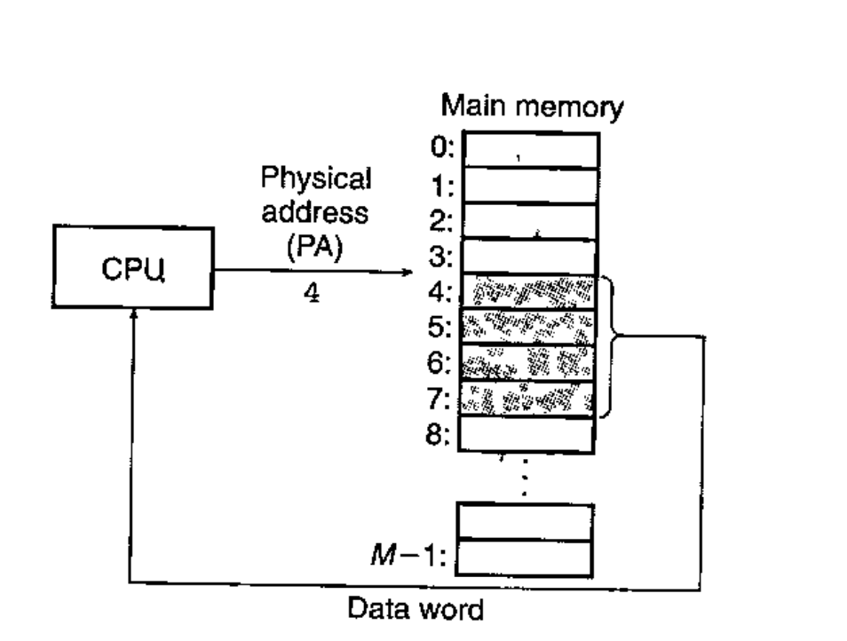
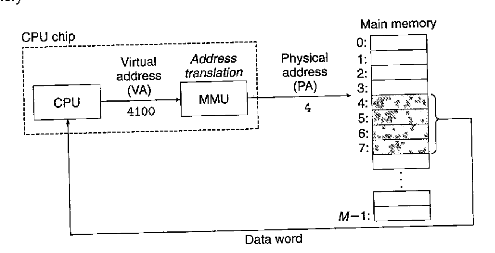
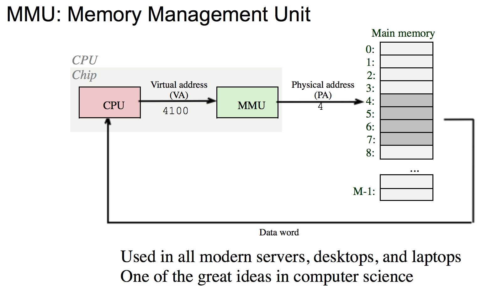
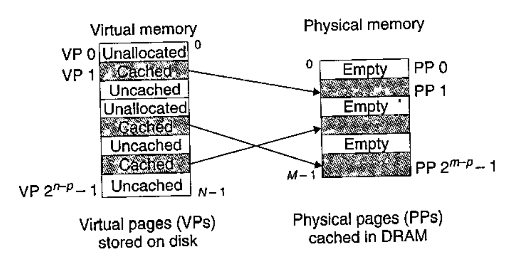
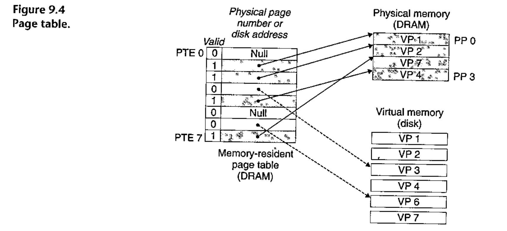
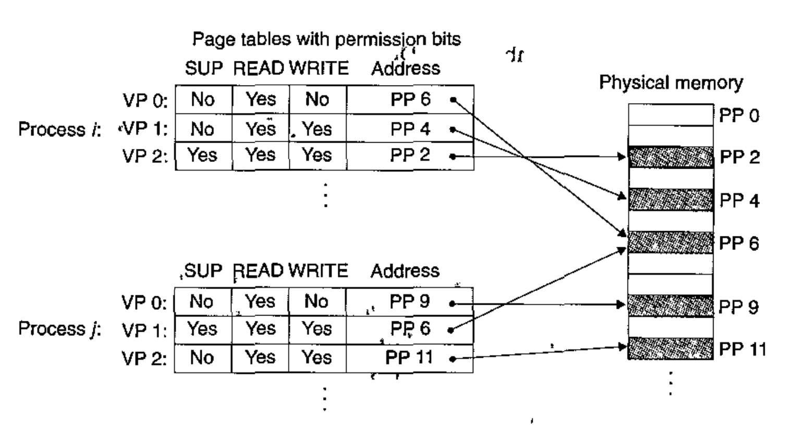
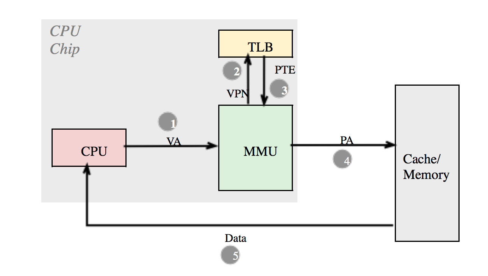
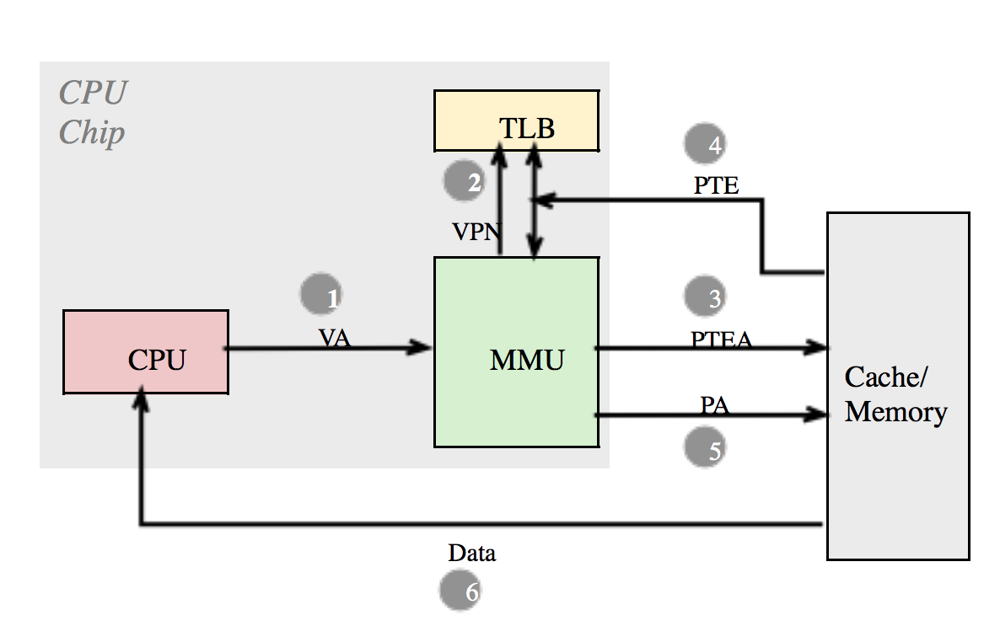
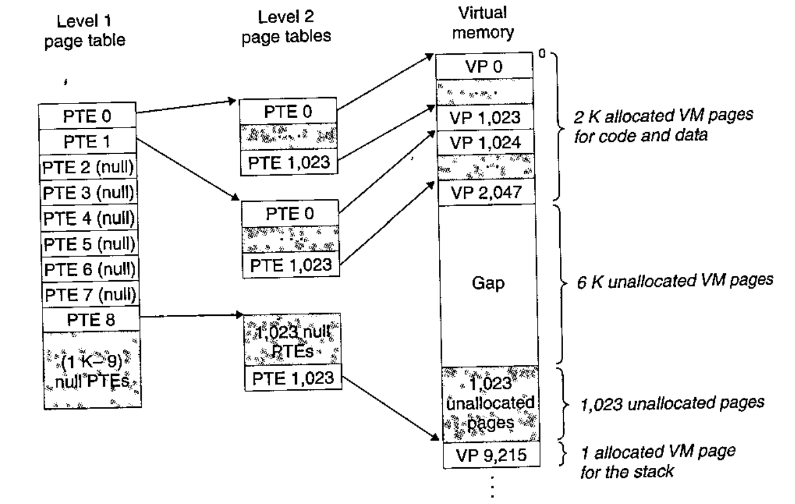

# Lecture 11

> CS:APP, Chapter 9.1 - 9.7

## Virtual Memory

Virtual memory provides three important capabilities:

1. It uses main memory (DRAM) efficiently by treating it as a cache for an address space stored on disk, keeping only the active areas in main memory and transferring data back and forth between disk and memory as needed.
2. It simplifies memory management by providing each process with a uniform address space.
3. It protects the address space of each process from corruption by other processes.

## Physical and Virtual Addressing

Physical address space => associated with RAM.

Virtual address space => associated with each process.

The main memory of a computer system is organized as an array of *M* contiguous byte-size cells.

Each byte has a unique physical address (PA). The first byte has an address of 0, the next byte an adress of 1, and so on.

If the CPU are to access memory with the physical addresses, its called *physical addressing*.

In the early days, computers used physical addressing. However, modern processors use a form of addressing known as *virtual adressing*

## Virtual Addressing

With Virtual Addressing, the CPU accesses main memory by generating a *virtual address (VA)*, **which is converted to the appropriate physical address before being sent to main memory**.

### Memory Management Unit (MMU)

This is a dedicated hardware chip on the CPU that translates virtual addresses on the fly, using a lookup table stored in main memory whose contents are managed by the operating system!

### Address Spaces

An *address space* is an ordered set of nonnegative integer addresses *(0, 1, 2, ...)*.

#### Linear Address Space

If the integers in the address space are consecutive, then we say that it is a *linear address space*.

#### Virtual Address Space

In a system with virtual memory, the CPU generates virtual addresses from an address space of *N = 2n* addresses called the *virtual address space*:

*(0, 1, 2, ..., N - 1)*.

The size of an address space is characterized by the number of bits that are needed to represent the largest address!

For example, a virtual address space with *N = 2n* addresses is called an *n*-bit address space. Modern systems typically support either 32-bit or 64-bit virtual address spaces.

#### Physical Address Space

A system also has a *physical address space* that corresponds to the *M* bytes of physical memory in the system:

*(0, 1, 2, ..., M - 1)*.

### Why address space is important

Because it makes a clean distinction between data objects (bytes) and their attributes (addresses).

### The basic idea of virtual memory

...Is that a data object (bytes) can have multiple independent addresses, each chosen from a different address space.

Each byte of main memory has a virtual address chosen from the virtual address space, and a physical address chosen from the physical address space.

### Virtual pages

Virtual Memory is partitioned into fixed-size blocks called *virtual pages (VPs)*.

Each virtual page is *P = 2p* bytes in size.

At any point in time, the set of virtual pages is partitioned into three disjoint subsets:

- *Unallocated*: Pages that have not yet been allocated or created by the Virtual Memory system. Unallocated blocks do not have any data associated with them and thus do not occupy any space on disk.
- *Cached*: Allocated pages that are currently cached in physical memory.
- *Uncached*: Allocated pages that are not cached in physical memory.

### DRAM Cache Organization

DRAM Cache organization is driven by the fact that the miss penalty is enormous:

- DRAM is about 10x slower than SRAM
- Disk is about 10.000 - 100.000 times slower than DRAM.

Because there is a large cache miss penalty here if we have a DRAM cache miss and have to go to disk, there are some consequences:

- Virtual pages tend to be large - typically somewhere between 4KB and 2MB.
- Any Virtual Page can be placed in any Physical Page

### Physical pages

The same goes for physical memory. It is also partitioned into physical pages (*PPs*), also *P* bytes in size.

Physical pages are also referred to as *page frames*.

### DRAM Cache

Here, the term *DRAM Cache* is used to denote the Virtual Memory system's cache that caches virtual pages in main memory.

### Page Tables

A *page table* maps virtual pages to physical pages!

The Virtual Memory system must have some way to determine if a virtual page is cached somewhere in DRAM. **If so, the system must determine which physical page it is cached in**. Otherwise, if there is a miss, the system must determine where the virtual page is stored on disk, then select a "victim page" in physical memory and copy the virtual page from disk to DRAM.

This is accomplished by a combination of OS software, address translation hardware in the MMU and a data structure stored in physical memory known as a *page table* that maps virtual pages to physical pages.

#### Page table entries (PTEs)

Specifically, a *page table* is an array of *page table entries (PTEs)*. Each page in the virtual address space has a PTE at a fixed offset in the page table.

Each PTE consists of:

- a *valid bit*
- an *n*-bit address

***The *valid* bit indicates whether the virtual page is currently cached in DRAM. If it is set (1), the address field indicates the start of the corresponding physical page in DRAM where the virtual page is cached**!

**If it is *not* set, then the address will instead point to the virtual page inside *Virtual Memory*. If no virtual page has been allocated yet, it will simply point to `null`**.

Anytime the *valid* bit is not set but a virtual page has been allocated, we're having a *page fault* because it isn't cached in DRAM.

### Page Hit

A *page hit* is a reference to a Virtual Memory word that *IS* in physical memory. In other words, we've had a DRAM cache hit.

### Page faults

A *page fault* is the opposite of a *page hit*. It is a reference to a Virtual Memory word that is *NOT* in physical memory. We're having a DRAM cache miss.

In the world of Virtual Memory, a DRAM cache miss is known as a *page fault*. We want it to to be trigger its' exception handler such that a virtual page can be cached in DRAM (physical memory).

When the CPU references a word in a Virtual Page, for example VP3, and it **isn't** cached in DRAM, this is what happens:

1. The address translation hardware (MMU) reads page table entry 3 from memory.
2. It infers from the valid bit that *VP3* is not cached and triggers a page fault exception.
3. The page fault exception invokes a page fault exception handler in the kernel.
4. The kernel selects a *victim page* inside the DRAM cache and replaces whatever there is on it with VP3.

### Allocating Pages

When we call `malloc`, a new virtual page is allocated by creating room on disk and updating a page table entry to point to the newly created page on disk.

## Virtual Memory as a Tool for Memory Management

I just noted how virtual memory provides a mechanism for using the DRAM to cache pages from a typically larger virtual address space.

***Actually*, Operating Systems provide a separate Page Table and a separate virtual address space for each process**!

And, multiple virtual pages can be mapped to the same shared physical page!

This greatly simplifies linking and loading as well as the sharing of code and data and allocating memory to applications.

For example, when a program requests additional heap space by calling `malloc`, the OS allocates an appropriate number *k* of contiguous virtual memory pages and maps them to *k* arbitrary physical pages located anywhere in physical memory. **Because of the way page tables work, there is no need for the OS to locate *k* contiguous pages of physical memory. Instead, the pages can be scattered randomly in physical memory**. This effectively eliminates memory fragmentation!

And, it makes it much easier to think of the address space for each process. At all times it can be thought of as a simple linear array, even though it may be scattered across actual, physical memory.

And, it is easy to link since code, stack and shared libraries **always start at the same address**.

## VM as a Tool for Memory Protection

A user process should not be allowed to modify its read-only code section or read or modify any of the code and data structures in the kernel. It should not be allowed to read or write the private memory of other processes, and it should not be allowed to modify any virtual pages that are shared with other processes, unless all parties explicitly allow it.

The address translation mechanism can be extended in a natural way to provide even finer access control than the virtual address space already gives us to isolate the private memories of different processes.

We can add some additional permission bits to the page table entry.

In the example, the:

- SUP bit indicates whether processes must be running in kernel (supervisor) mode to access the page.
- READ and WRITE bits control read and write access to the page

If an instruction violates any of these permissions, then the CPU triggers a general protection fault. Ultimately a *SIGSEGV* signal will be sent to the offending process (typically as a *segmentation fault*).

## What happens in the hardware when there is a page hit

1. The processor generates a virtual address and sends it to the MMU.
2. The MMU generates the PTE address and requests it from the cache/main memory.
3. The cache/main memory returns the PTE to the MMU.
4. The MMU constructs the physical address and sends it to the cache/main memory.
5. The cache/main memory returns the requested data word to the processor.

## Speeding Up Address Translation with a TLB

Page Table Entries are cached in L1 like any other memory word. As such, page table entries may be evicted by other data references. And, a page table entry hit still requires a small L1 delay.

Each time the CPU generates a virtual address, the MMU must refer to a page table entry in order to translate the virtual address into a physical address.

This may requre an additional fetch from memory - and that costs a lot of cycles.

Many sytstems try to eliminate all costs by including a small hardware cache of page table entries in the MMU called a *translation lookaside buffer (TLB)*.

This is a small, virtually addressed cache **where each line holds a block consisting of a single page table entry**.

It basically maps virtual page numbers to physical page numbers and even contains complete page table entries for a small number of pages.

### TLB Hit

Notice how we retrieved the page table entry containing the physical address directly from the TLB here and saved a memory access.

### TLB Miss

If we miss the cache, we have to store the page table entry in the Translation Lookaside Buffer.

If the TLB has *T = 2t*, then the TLB index (TLBI) consists of the *t* least significant bits of the Virtual Page Number.

Now, the steps from before but with a TLB is:

1. The CPU generates a virtual address.
2. The MMU fetches the appropriate PTE from the TLB
3. The MMU translates the virtual address to a physical address and sends it to the cache/main memory
4. The cache/main memory returns the requested data word to the CPU.

When there is a TLB miss, then the MMU must fetch the page table entry from the L1 cache. Then, after that, it must be stored in the TLB, possibly overwriting an existing entry.

## Multi-Level Page Tables

Page tables can go multiple levels in.

This reduces memory requirements:

If a Page Table Entry in the first table is null, then the corresponding level 2 table doesn't even have to exist!

## Why Virtual Memory works

It may look really inefficient. It works because of locality!

At any point in time, programs tend to access a set of active virtual pages called the *working set*. Programs with good temporal locality will have smaller working sets.

## Thrashing

If the working set size is less than main memory size, we're good. If the sum of all working set sizes is greater than the main memory size, we're having a performance meltdown where pages are swapped in and out continously!

This is called *thrashing*.

## Take-Aways

You must be able to explain:

- Physical and Virtual Memory
- MMU
- Pages
- Page Table
- Translation Lookaside Buffer (TLB)

## Virtual Address

Is a [Virtual Page Number, Offset]

## Physical Address

Is a [Physical Page Number, Offset]