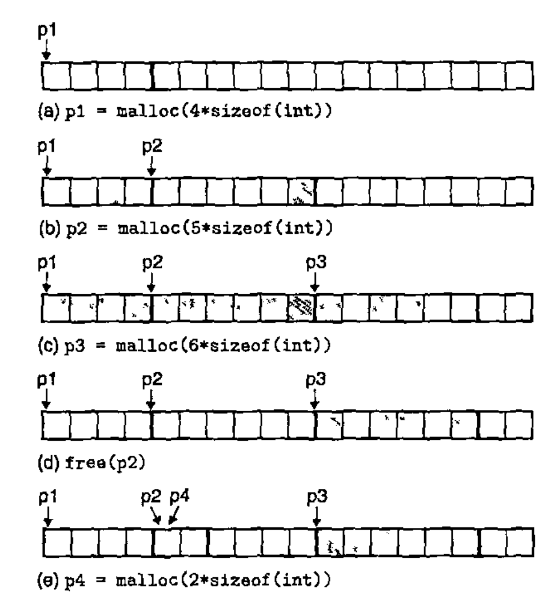

# Lecture 13

> CS:APP, Chapter 9.9, 9.11 - 9.12

## Dynamic Memory Allocation

When we need to acquire additional virtual memory at run time, we use a *dynamic memory allocator*.

This is one that maintains an area of a process's virtual memory known as the *heap*.

An allocator maintains the heap as a collection of various-size *blocks*. Each block is a contiguous chunk of virtual memory that is either *allocated* or *free*.

An allocated block has been explicitly reserved for use by the application. An allocated block remains allocated until it is freed, either explicitly by the application or by the allocator itself.

A free block is available to be allocated. It remains free until it is explicitly allocated by the application.

### Kinds of allocators

There are two basic styles. Both require the application to explicitly allocate blocks.

#### Explicit allocators

These require the application to explicitly free any allocated blocks. In C, `malloc` is part of the standard library.

`malloc` allocates a block and `free` frees a block.

#### Implicit allocators

These require the allocator to detect when an allocated block is no longer being used by the program and then free the block.

**Implicit allocators are also known as *garbage collectors***.

The process of automatically freeing unused allocated blocks is known as *garbage collection*. Many higher-level languages rely on garbage collection.

## The `malloc` and `free` functions

These come with the `malloc` package. This is **an explicit allocator**.

### `malloc`

Programs allocate blocks from the heap by calling the `malloc` function.

It always returns a pointer to a block of memory of **at least `size` bytes** that is suitably aligned for any kind of data object that might be contained in the block.

In 64-bit mode, the address is always a multiple of 16.

It `malloc` encounters a problem, for example that the program requests a block of memory that is larger than the available virtual memory, then it returns NULL and sets `errno`.

#### `calloc`

**`malloc` does NOT initialize the memory it returns. Applications that want initialized dynamic memory can use `calloc`**. This is a thin wrapper around `malloc` which initializes the allocated memory to zero.

If a previously allocated block should be resized, the `realloc` function can be used.

#### `sbrk`

The `sbrk` function grows or shrinks the heap by adding `incr` to the kernel's `brk` (break) pointer. If it isn't successful, it returns *-1*.

#### `free`

Programs free allocated heap blocks by calling the `free` function. The function takes a `ptr` argument (a pointer) which must point **to the beginning of an allocated block** that was obtained from `malloc`, `calloc` or `realloc`.

### `malloc` and `free` in action

Here, each box represents a 4-byte word.
Initially, the heap consists of a single 16-word double-word-aligned free block.

### Why use Dynamic Memory Allocation

Often, we don't know the sizes of certain data structures until the program actually runs.

## Fragmentation

The primary cause of poor heap utilization is fragmentation. This occurs when otherwise unused memory is not available to satisfy allocate requests!

There are two kinds of fragmentation: *internal fragmentation* and *external fragmentation*.

### Internal Fragmentation

This happens when an allocated block is larger than the payload. There is simply too much space. For example, the implementor of the allocator might impose a minimum size on allocated blocks that is greater than some requested payload.

### External Fragmentation

This is when there *is* enough aggregate free memory to satisfy an allocate request, but no single free block is large enough to handle the request.

### Implicit Free Lists

For each block, we need both size and allocation status. If blocks are aligned, some low-order address bits are always 0! Thus, instead of storing an always-0 bit, we can use it as an allocated/free flag.

An allocator needs some data structure that allows it to distinguish block boundaries and to distinguish between allocated and free blocks.

**Most allocators embed this information in the blocks themselves**.

In one approach, a block consists of a one-word *header*, the payload, and possibly some additional *padding*.

The header encodes the block size - including the header and any padding - as well as whether the block is allocated or free.

If we impose a double-word alignment constraint, then the block size is always a multiple of 8 and the 3 low-order bits of the block size are always zero. Thus, we need to store only the 29 high-order bits of the block size, **freeing the remaining 3 bits to encode other information**. In this case we are using the least significant of these bits - the *allocated bit* - to indicate whether the block is allocated or free.

The header is followed by the payload that the application requested when it called `malloc`.

The payload is followed by a chunk of unused padding that can be of any size. This might be part of an allocator's strategy for combating external fragmentation, or it might be needed to satisfy the alignment requirement.

Using this block format (header - payload - padding), we can organize the heap as a sequence of contiguous allocated and free blocks.

**This is called an implicit free list because the free blocks are linked implicitly by the size fields in the headers**. Meaning, the allocator can indirectly traverse the entire set of free blocks by traversing all of the blocks in the heap.

The advantage of an implicit free list is simplicity.

But, a significant disadvantage is that the cost of any operation that requires a search of the free list, such as placing allocated blocks, will be linear in the total number of allocated and free blocks in the heap!

### Placement policies

When an application requests a block of *k* bytes, the allocator searches the free list for a free block that is large enough to hold the requested block. The manner in which the allocator performs this search is determined by the *placement policy*.

Some common policies are:

- First fit
- Next fit
- Best fit

#### First fit

*First fit* searches the free list from the beginning and chooses the **first free block that fits**.

A disadvantage is that it tends to leave "splinters" of small free blocks toward the beginning of the list - this will increase the search time for larger blocks.

#### Next fit

*Next fit* is similar to first fit, but instead of starting each search at the beginning of the list, it starts each search where the previous search left off.

This can run significantly faster than first fit, but it does suffer from worse memory utilization than first fit in some cases.

#### Best Fit

*Best fit* examines *every* free block and chooses the free block with the smallest size that fits.

It has the best memory utilization but of course it requires the most exhaustive search of the heap.

### Splitting Free Blocks

When we've found a free block, we can of course use all of it. That would be simplest. But that causes internal fragmentation! Instead, it would be wise to split the free block to match the size of the payload (while still respecting alignment requirements, etc).

We can simply *split* the free block into two parts. The first part becomes the allocated block, and the remainder becomes a new - free - block.

### Getting Additional Heap Memory

If there is no fit for the requested block, we can either try to merge existing free blocks that are physically adjacent in memory or ask the kernel for additional heap memory by calling the `sbrk` function.

The allocator then transforms the additional memory into one large free block, inserts the block into the free list, and then places the requested block in this new free block.

## Explicit Free Lists

The implicit free list provides us with a simple way to introduce some basic allocator concepts. **But, because block allocation time is linear in the total number of heap blocks, the implicit free list is NOT appropriate for a general-purpose allocator**.

A better approach is to organize the free blocks into some form of explicit data structure.

Instead of maintaining a list of all blocks, we can maintain a list of just the free blocks!

The body of a free block is not needed by the program, so the pointers that implement the data structure can be stored within the bodies of the free blocks.

We can organize the heap as a doubly linked free list by inclding a `predecessor` and `successor` pointer in *each* free block.

**By using a doubly linked list instead of an implicit free list, we can reduce the *first-fit* allocation time from linear in the total number of blocks to linear in the number of *free blocks***.

## Segregated Free Lists

Segregated storage is a technique for reducing allocation time which may take O(n) where *n* is the number of free blocks.

Here, *multiple* free lists are maintained, where each list holds blocks that are roughly the same size.

The general idea is to partition the set of all possible block sizes into equivalence classes called *size classes*.

## Common Memory-Related Bugs in C Programs

### Dereferencing Bad Pointers

If we attempt to dereference a pointer that points into a whole in the virtual address space of a process, the operating system will terminate our program with a segmentation exception. :-(

Also, attempting to write to one of the read-only areas of virtual memory terminates the program with a protection exception.

### Reading Uninitialized Memory

There are some things that are always initialized to zeros by the loader, but this is not true for heap memory. A common error is to assume that heap memory is initialized to zero.

### Allowing Stack Buffer Overflows

A program has a *buffer overflow* if i writes to a target buffer on the stack without examining the size of the input string.