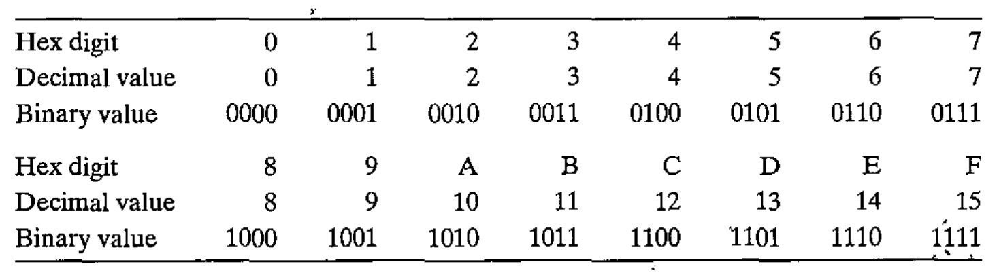

# Lecture 2

> CS:APP, Chapter 2.1

## Binary

Binary values work well when building machines that store and process information. Two-valued signals (0 or 1) can readily be represented, stored and transmitted on practicaly anything.

## Representations of numbers

- *Unsigned* encodings are based on traditional binary notation, representing numbers greater than or equal to 0.
- *Twos-complement* encodings are the most common way to represent *signed* integers, that is, **numbers that may be *either* positive or negative**
- *Floating-point* encodings are a base-2 version of scientific notation for representing real numbers.

So, - unsigned numbers are positive integers. Signed numbers are either positive or negative.

### Overflow

Computer representations use a limited number of bits to encode a number. Some operations can *overflow* when the results are too large to be represented! This can lead to some surprising results.

It is important understand the *ranges of values* that can be represented and the properties of the different arithmetic operations.

This understanding is critical to writing programs that work correctly over the full range of numeric values and that ar eportable across different combinations of machine, OS and compiler.

## Information Storage

Most computers use blocks of 8 bits (*bytes*) as the smallest addressable unit of memory rather than accessing individual bits in memory.

### Virtual Memory

A Machine-level program views memory as a very large array of bytes, referred to as *virtual memory*.

**Every byte of memory is identified by a unique number. This is called its *address***.

**The Set of all possible addresses is known as the *virtual address space***.

This is a conceptual (hence virtual) image. The *actual* implementation uses a combination of DRAM, flash memory, disk storage and OS software to provide the program with what appears to be a monoli
thic byte array.

### Pointers

Pointers are a central feature of C. A pointer is a mechanism for referencing elements of data structures, including arrays.

A pointer has:

- a *value*
- a *type*

The value indicates the *location* of some object.
Its type indicates what *kind* of object (such as int or float) is stored at that location.

A pointer is declared: `T *p` where *T* is the type and *p* is the pointer variable name.

For example:

`char *p` is a declaration of a pointer of type `char`.

### Values of pointers are virtual addresses

The value of a *pointer* in C, whether it points to an integer, struct or some other object, - is the *virtual address* **of the first byte of some block of storage**.

The type information that the C compiler associates with each pointer generates different machine-level code to access the value stored at the location depending on the type of that value.

The actual machine-level program has no information  about data types. To it, anything is simply a block of bytes, and the program itself is a sequence of bytes.

## The range of a single byte

In binary, a single byte ranges from [00000000<sub>2</sub>, 11111111<sub>2</sub>] which is equal to [0<sub>10</sub>, 255<sub>10</sub>] in decimal.

As you can see, it includes 8 bits, all of which can be 0 or 1.

### Hexadecimal notation

Hexadecimal is much more convenient for describing bit patterns. Binary is too verbose, and decimal is tedious to conver to and from.

Instead, we write bit patterns as base-16 or *hexadecimal* numbers.

Hex uses digits 0-9 and characters A-F to represent 16 possible values.

In hex, the value of a single byte can range from [00<sub>16</sub>, FF<sub>16</sub>]

Hex is case-insensitive. We can write upper- or lowercase as we please.

#### Hexadecimal numeric constants

Numeric constants starting with `0x` or `0X` in C (and many other languages) are interpreted as being hexadecimal.

One example of a hexadecimal number could be `0xFA1D37B`.

### Conversion between binary, decimal and hex



#### Converting hex to binary

<table>
	<tr>
		<td>Hexadecimal</td>
		<td>1</td>
		<td>7</td>
		<td>3</td>
		<td>A</td>
		<td>4</td>
		<td>C</td>
	</tr>
	<tr>
		<td>Binary</td>
		<td>0001</td>
		<td>0111</td>
		<td>0011</td>
		<td>1010</td>
		<td>0100</td>
		<td>1100</td>
	</tr>
</table>

Which gives the binary representation *000101110011101001001100*.

#### Converting binary to hex

First, split the binary into groups of 4 bits each.
**If the total number of bits is not a multiple of 4, you should make the *leftmost* group be the one with fewer than 4 bits by padding the number with leading zeros**!

Now you can do:

<table>
	<tr>
		<td>Binary</td>
		<td>11</td>
		<td>1100</td>
		<td>1010</td>
		<td>1101</td>
		<td>1011</td>
		<td>0011</td>
	</tr>
	<tr>
		<td>Hexadecimal</td>
		<td>3</td>
		<td>C</td>
		<td>A</td>
		<td>D</td>
		<td>B</td>
		<td>3</td>
	</tr>
</table>

## Data sizes

### Word size

A *word size* indicates the nominal size of pointer data.

For a machine with a *w*-bit word size, the virtual addresses can range from *0 - 2<sup>w</sup> - 1*, giving the program access to at most *2<sup>w</sup>* bytes.

#### 32-bit

For 32-bit machines, they have a 32-bit word size which limits the virtual address space to *2<sup>32</sup> = 4,294,967,296* or just around 4 gigabytes.

#### 64-bit

For 64-bit machines, the virtual address space is *2<sup>64</sup> = 1.844674407E19*, an insanely large number (just around 16 exabytes).

### Running 32-bit programs on 64-bit machines

Yes, it *is* possible to run programs compiled for use on 32-bit machines on 64-bit machines. But not the other way around.

### Data formats

C supports multiple data formats for both integer and floating point data.

The exact number of bytes for some data types depend on how the program is compiled (32-bit vs 64-bit).

Integers can be:

- *Signed*, able to represent negative, zero and positive values.
- *Unsigned*, only allowing non-negative values.

Even a `char` can be signed (it is by default), since it too can store integer values.

Here is a chart of the typical sizes in bytes of basic C data types:

|     Signed     |          Unsigned          |  32-bit  |  64-bit  |
|----------------|----------------------------|----------|----------|
| `[signed] char`|       `unsigned char`      |    1     |     1    |
|    `short`     |       `unsigned short`     |    2     |     2    |
|     `int`      |         `unsigned`         |    4     |     4    |
|    `long`      |       `unsigned long`      |    4     |     8    |
|   `int32_t`    |         `uint32_t`         |    4     |     4    |
|   `int64_t`    |         `uint64_t`         |    8     |     8    |
|    `char*`     |                            |    4     |     8    |
|    `float`     |                            |    4     |     4    |
|    `double`    |                            |    8     |     8    |

### Standardized sizes

Rather than having to rely on "typical" sizes, the ISO C99 standard introduced a class of data types where the data sizes are fixed reglard of compiler and machine settings!!

Among these are `int32_t` and `int64_t`. This is really great.

### Single precision vs Double Precision

These are two different floating-point formats.

- Single-precision is declared in C as `float`
- Double-precision is declared in C as `double`

These formats use 4 and 8 bytes respectively.

### Portability

Since not all data types are standardized in terms of their sizes, we as developers should make our programs insensitive to the exact sizes of the different data types.

## Addressing and Byte Ordering

A multi-byte object is stored as a contiguous sequence of bytes, with **the address of the object given by the smallest address of the bytes used**.

For example:

If the variable `x` of type `int` has address `0x100` (remember, ints are generally 4 bytes), then the 4 bytes of *x* would be stored in memory locations `0x100`, `0x101`, `0x102` and `0x103`.

### Byte ordering

There are two common conventions.

Some machines choose to store the oject in memory ordered from least significant byte to most. This convention is referred to as *little endian*.

Other machines store from the most to least. This convention is reffered to as *big endian*.

In *Big Endian*:

|  `0x100`  |  `0x101`  |  `0x102`  |  `0x103`  |
|-----------|-----------|-----------|-----------|
|    01     |     23    |     45    |     67    |

In *Little Endian*:

|  `0x100`  |  `0x101`  |  `0x102`  |  `0x103`  |
|-----------|-----------|-----------|-----------|
|    76     |     45    |     23    |     01    |

**Most Intel-compatible machines operate exclusively in little-endian mode**.

Many new microprocessors are *bi-endian*, which means that they can be configured to operate as *either* little- or big-endian machines.

Android and iOS operate only in little-endian mode.

**Remember that in the little-endian format, bytes are in reverse order! This is especially important when you read machine-level instructions for little-endian machines!**

#### Byte Ordering can give problems when networked

When binary data are communicated over a network between different machines, there may arise problems with byte ordering if the data is produced by a little-endian machine to be sent to a big-endian machine or vice-versa.

This can result in words being in reverse order for the receiving program!

Thankfully there are standards to follow to ensure that this doesn't happen.

#### Byte Ordering is especially important when lloking at the byte sequences representing integer data

When looking at machine-level programs, a line such as the following can arise:

`4004d3: 01 05 43 Ob 20 00      add      %eax,Ox200b43(%rip)`

The sequence `01 05 43 0b 20 00` is the byte-level representation of an instruction that adds a word of data to the value stored at an address computed by adding `0x200b43` to the current value of the program counter.

So, if we take the final 4 bytes of the sequence `43 0b 20 00` and reverse them, we have `00 20 0b 43`. Dropping the leading 0, we get `0x200b43` which is the value appearing to the right of the line.

**Having bytes appear in reverse order is a common occurrence when reading machine-level program representations generated for little-endian machines such as this one**.

### The `typedef` declaration in C

The `typedef` declaration provides a way of giving a name to a data type! This helps a lot with readability and ease of refactoring later on if the type needs to change.

For example:

`typedef int *int_pointer`

defines type `int_pointer` to be a pointer to an int.

This example is poor, though, since we could just as easily just have written `int *ip` or something like that rather than `int_pointer ip`.

### Representing Strings

A  string in C is encoded by an array of characters terminated by the null character.

## Boolean Algebra

Here we consider the set *{0, 1}*.

### Boolean algrebraic operations

- *~* corresponds to the logical operation `NOT`, denoted by *¬*.
  - So, *~p* equal 1 when *p* equals 0 and vice versa.
- *&* corresponds to the logical operation `AND`, denoted by *∧*
- *|* corresponds to the logical operation `OR`, denoted by *∨*
- *^* corresponds to the logical operatipn `XOR`, denoted by *⊕*

#### Bit operations on bit vectors

A *bit vector* is a string of zeros and ones of some fixed length *w*.

For example, performing an *AND* on the two bit vectors *0110* and *1100* becomes:

```math
   0110
&  1100
   ----
   0100
```

## Bit-Level Operations in C

C supports bitwise Boolean operations. Its easy too since the symbols are identical to the one for Boolean operations:

- *~* for `NOT`
- *&* for `AND`
- *|* for `OR`
- *^* for `XOR`

For example, if we do: `0x69 & 0x55`, this is equivalent to the following binary/base-2 expression: `01101001 & 01010101` which becomes `01000001` which is `0x41` in hex.

## Logical Operations in C

In C, we have `||`, `&&` and `!` for the `OR`, `AND` and `NOT` operations of logic.

They treat *any* nonzero argument as representing `TRUE` and only the argument `0` as representing `FALSE`.

They return 1 or 0, indicating a result of either `TRUE` or `FALSE` respectively.

## Shift Operations in C

*Shift* operations are ways to shift bits to the left or right.

### Left shift

the `<<` operator shifts to the left. The expression `x << k` shifts *x* *k* bits to the left, dropping off the *k* most significationt bits and filling the right end with *k* zeros.

### Right shift

The `>>` operator shifts to the right.

#### Two forms of right shift

There are:

- *Logical*: A logical right shift fills the left end with *k* zeros.
- *Arithmetic*: An arithmetic right shift fills the left end with *k* repretitions of the most significant bit.

### Compatibility problems with shifts

C doesn't require shifts to be arithemtic or logical - so it may vary between environments. This also means that any code assuming one form or the other will potentially encounter portability problems!

**Almost all compiler/machine combinations use arithmetic right shifts for signed data and logical shifts for unsigned data**!

*OBS: In Java, if you want a logical shift, you must explicitely use the `>>>` operator*.