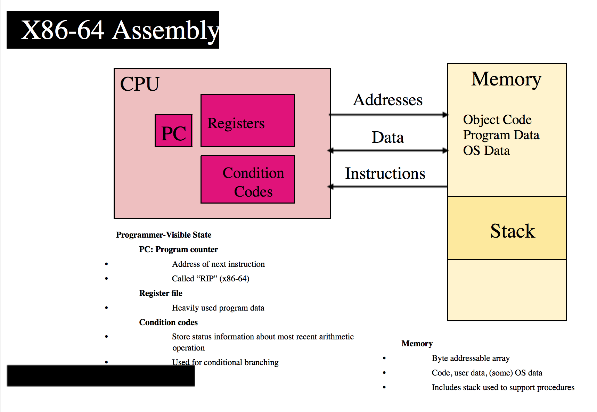
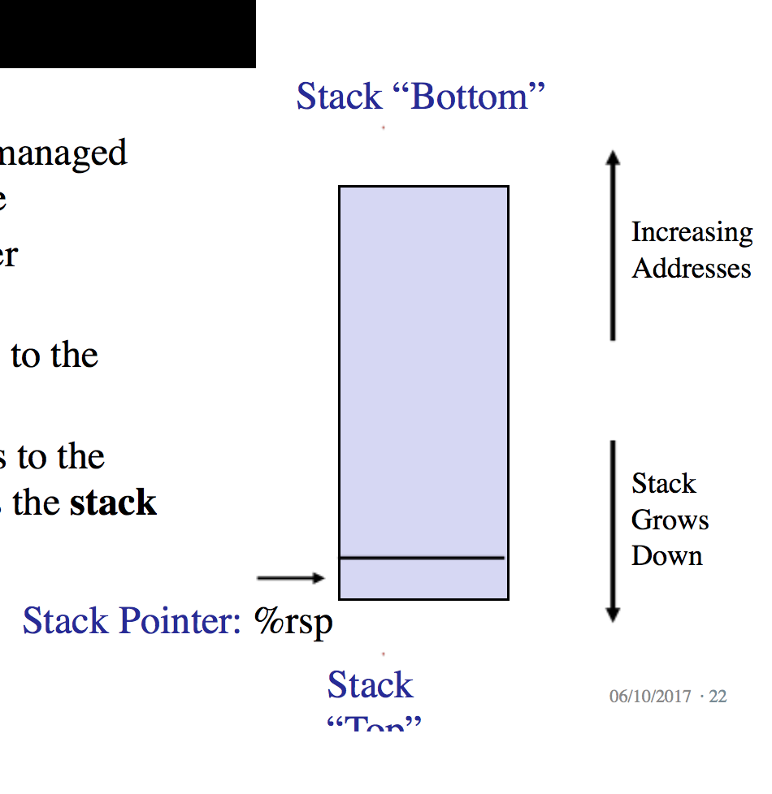

# Lecture 6

> CS:APP, Chapter 3.1 - 3.6



## SoC

System on a chip. Combining processing cores with advanced peripherals and programmable hardware.

## Register file

A file containing heavily used program data. (A cache, a store).

The `%rip` register is the current instruction pointer. **It contains the address of the instruction being executed**.

There are 16 general purpose registers to use in *x86-64*. Beyond that, there are also additional registers for floating point, SIMD, etc.

The general purpose registers are labeled *r0, r1, ..., r15*.

### Original registers

These are the registers *r0 - r7*. Their names:

- *rax*: register *a*
- *rbx*: register *b*
- *rcx*: register *c*
- *rdx*: register *d*
- *rbp*: register base pointer (start of stack)
- *rsp*: register stack pointer (current location in stack, **grow downwards**)
- *rsi*: register source index (source for data copies)
- *rdi*: register destination index (destination for data copies)

## Condition codes

Store status information about most recent arithmetic operation. Especially useful for conditional branching.

## Assembly code

This is a textual representation of the machine code giving the individual instructions in the program.

So we have:

- Machine code
- Assembly code; its' human-readable representation

Assembly code is highly machine specific. Working in a high-level language allows the compiler to generate assembly code that is optimized for the architecture of the current machine.

Of course, you can go even another step up an use a Virtual Machine in which case you won't have to re-compile (e.g. regenerate assembly code) from a specific computer, but I won't get into that now.

## x86

*x86* is the name used for Intel's processor line.

It has a long history, back to starting with single-chip 16-bit microprocessors.

The last chip that had *x86* in the name was *i486* which was released in 1989.

Since then it has been the *Pentium* and *Core* ranges.

### x86-64

This refers to Intel's implementation of a 64-bit extension to *IA32* developed by AMD. This was called *EM64T* and was released with *Pentium 4E*.

### Core i7

First iteration was Nehalem. This incorporated both HyperThreading (HT) and multi-core. The initial version supported HT (two programs executing simultaneously on a single core) on *each* core and up to four cores on each chip. Pretty much a breakthrough.

## Refering to the Intel instruction set

We use *x86* to talk about the Intel architecture in general and *x86-64* to talk about the 64-bit extension to *IA32*.

This instruction set is not specific to Intel as others, including AMD, are fully compatible with the instruction x86 instruction set.

## Program Encodings

We can give `gcc` different command-line options to indicate the level of optimizations to use when generating machine code.

The command-line option `-Og` instructs the compiler to yield machine code that follows the overall structure of the original C code. So if we are to study the generated code, its a good idea to apply this option because the generated code might otherwise be entirely different from the source program.

Obviously, higher levels of optimization are considered better in terms of the resulting program performance.

### What happens when running `gcc`

Actually, an entire equence of programs run.

First, the *C preprocessor* expands the source code to include any files specified wth `#include` commands as well as expand any macros specified with `#define` declarations.

Then, the *compiler* generates assembly code versions of the source file(s).

Then, the *assembler* converts the assembly code into binary *object code* file(s).

Finally, the *linker* merges the object-code file(s) with code implementing library functions such as `printf` and generates the final executable code file.

#### Object code

This is one form of machine code. It contains binary representations of *all* the instructions, **but the addresses of global values are not yet filled in**.

## Machine-Level code

The assembly-code representation is actually very close to machine code. Its main feature is that it is human-readable (it is in a text format) as compared to the binary format of machine code.

What is machine code? Machine code is simply a sequence of bytes encoding a series of instructions. That is all it is. No more, no less. It doesn't care about the source program. It cares about the instructions that these bytes represent.

### Instruction Set Architecture (ISA)

The *ISA* defines the format and behavior of a machine-level program. This defines the processor state, the format of the instructions, and the effect each of these instructions will have on the state.

One example of an ISA is *x86-64*. As you can imagine, an *ISA* is extremely fundamental to a computer.

**Most ISAs describe the behavior of a program as if each instruction is executed in sequence, with one instruction completing before the next begins, but at the hardware level, many instructions may execute concurrently**. Again, even an *ISA* is an abstraction.

### Virtual addresses

This is the memory addresses used by a machine-level program to provide a memory model that appears to be a very large byte array. This too is an abstraction, even at the machine-code level. The actual implementation of the memory system involves a combination of multiple hardware memories.

## Things in Machine code that differs greatly from a source language

The things that stand out the most is that parts of the processor state are visible that normally are hidden from the C programmer:

- The *program counter (PC)* (called `%rip` in x86-64) indicates the address in memory of the next instruction to be executed.
- The integer *register file* contains 16 named location storing 64-bit values. Such registers can hold addresses (like C pointers) or integer data. Some registers are used to keep track of criticla parts of the program state, while others are used to hold temporary data (essentially auxiliary stores) such as the arguments and local variables of a procedure, as well as the value to be returned by a function.
- The *condition code registers* hold status information about the most recently excecuted arithmetic or logical instruction. These are used to implement conditional changes in the control or data flow, such as is required to implement `if` and `while` statements.
- A set of *vector registers* can each hold one or more integer or floating-point values.

As programmers, we're used to seeing how different objects of different data types can be declared and allocated in memory. But in machine code, memory is seen as simply a large byte-addressable array.

"Fancy" things like arrays and structs are represented in machine code as simply contiguous collections of bytes.

### Virtual Memory limitations

In *x86-64*, virtual addresses are represented by 64-bit words. So at all times, only limited subranges of virtual addresses are considered valid.

It is the responsibility of the OS to translate virtual addresses into the physical addresses of values in the *actual* processor memory (which again may be found on either of the caches (L1, L2, ..., Ln) or in main memory).

## Generate assembly code with `gcc`

Easy enough, just invoke it with the `-S` flag. Remember to also set the `-Og` flag to limit optimization so that it looks as close to the original source program as possible.

## Generating assembly code from machine code

We can sort-of do this with things called *disassemblers*.

On Linux, the program `objdump` can do this if it is provided with the `-d` flag.

Such a "disassembly" could look like this:

```assembly
0000000000000000 <multstore>:
Offset   Bytes              Equivalent assembly language
--------------------------------------------------------
     0:  53                 push %rbx
     1:  48 89 d3           mov %rdx,%rbx
     4:  e8 00 00 00 00     callq 9 <multstore+Ox9>
     9:  48 89 03           mov %rax, (%rbx)
     c:  5b                 pop %rbx
     d:  c3                 retq
```

### Notable features of disassembled representations of machine code

- *x86-64* instructions can range in length from 1 to 15 bytes. These are designed such that instructions that uses fewer operands require a smaller number of bytes than ones with more operands.
- The format is designed such that from a given starting position, **there is a unique decoding of the bytes into machine instructions**. For example, *only* the instruction `pushq %rbx` can start with byte value *53*.
- This is also one of the major reasons why a disassembler can determine the assembly code based purely on the byte sequences of the machine-code. It has no need to access the source or assembly-code versions of the program.

### The `nop` instruction

See:

```assembly
1 0000000000400540 <multstore>:
2 400540: 53               pusb %rbx
3 400541: 48 89 d3         mov %rdx,%rbx
4 400544: e8 42 00 00 00   callq 4005Sb <mult2>
5 400549: 48 89 03         mov %rax, (%rbx)
6 40054c: 5b               pop %rbx
7 40054d: c3               retq
8 40054e: 90               nop
9 40054f: 90               nop
```

The `nop` instruction have been inserted to grow the code for the function to 16 bytes which enables a better placement of the next block of code in terms of memory system performance.

## Assembly representation with explanations

For a C program where the variable `x` is in the `%rdi` register, `y` is in the `%rsi` register and `dest` is in the `%rdx` register:

```assembly
1   multstore:
2      pushq   %rbx            Save %rbx
3      movq    %rdx, %rbx      Copy dest to %rbx
4      call    mult2           Call mult2(x, y)
5      movq    %rax, (%rbx)    Store result at *dest
6      popq    %rbx            Restore %rbx
7      ret                     Return
```

## Data formats

In the world of Intel, *word size* doesn't mean the native word size of the platform (typically 64-bit). Rather, a *word* is a 16-bit data type. A *double word* is a 32-bit data type and a *quad word* is a 64-bit data type.

In relation to C, this means that standard `int` values are stored as *dobule words* (32-bit) and Pointers are stored as *quad words* (64-bit).

| C Declaration |  Intel data type  | Assembly-code prefix | Size in bytes |
|---------------|-------------------|----------------------|---------------|
|    `char`     |        Byte       |          `b`         |       1       |
|    `short`    |        Word       |          `w`         |       2       |
|     `int`     |     Double word   |          `l`         |       4       |
|    `long`     |      Quad word    |          `q`         |       8       |
|    `char*`    |      Quad word    |          `q`         |       8       |
|    `float`    |  Single precision |          `s`         |       4       |
|    `double`   |  Double precision |          `l`         |       8       |

## Instructions

There are three classes of instructions

1. Transfer between memory and register
	- Load/store data: register <-> memory
	- Push/pop register <-> stack
2. Arithmetic and comparison functions
3. Transfer control
	- Jumps to/from procedures
	- Conditional branches

## AT&T Syntax

The GNU tools such as gcc and gc use the ATT syntax for assembly. It has the form:

`OPERATOR source, destination`

Here, all register names are prefixed with `%`.

## `mov`

There are two access modes:

- **Direct**: This is immediate values prefixed by `$` (such as `$0x2a`).
- **Register**: This is some data from within a register.

## The Stack

The stack is a region of memory managed with stack discipline (LIFO).

**It grows towards lower addresses**!

**The register `%rbp` points to the bottom of the stack, and the register `%rsp` points to the top of the stack. It is the *stack pointer***.



## Accessing Information

The Central Processing Unit (CPU) in the x86-64 instruction set contains a set of 16 *general-purpose registers* for storing 64-bit values.

These are used to store integer data as well as pointers.

All the names of the registers begin with `%r` (in the ATT assembly format).

### Effective memory address

This assembly operand has the form `Imm`. This is a memory reference (an access to some memory location).

### Data Movement Instructions

One of the most used instructions is the one that copy data from one location to another. This is the `MOV` class in ATT which contains four instructions: `movb`, `movw`, `movl` and `movq`. The differences between these is primarily that they operate on data of different sizes:

- `movb`: 1 byte
- `movw`: 2 bytes
- `movl`: 4 bytes
- `movq`: 8 bytes

|   Instruction   |   Effect   |       Description       |
|-----------------|------------|-------------------------|
|   `movb S, D`   |   `D <- S` |        Move byte        |
|   `movw S, D`   |   `D <- S` |        Move word        |
|   `movl S, D`   |   `D <- S` |     Move double word    |
|   `movq S, D`   |   `D <- S` |      Move quad word     |
|  `movabsq I, R` |   `R <- I` | Move absolute quad word |

The destination may either be a *register* or a *memory address*. Both operands cannot refer to memory locations, however. So, if you want to copy a value from one memory location to another you have to:

1. Load the source value into a register
2. Write this register value to the destination

As an example:

```assembly
1   movl $0x4050, %eax // Copy from specific memory address to register
2   movlw %bp, %sp     // Copy from register to register
```

### Pushing and Popping Stack Data

These are used to push data onto and pop data from the program stack.

We add data to a stack via a *push* operation and remove it via a *pop* operation.

#### Pushing a value onto the stack

Pushing a quad word value (64-bit) onto the stack involves first decrementing the stack pointer by 8 and then writing the value at the new top-of-stack address (such that the last bit is at the very top of the stack). For example:

```assembly
subq $8, %rsp      // Decrement stack pointer
movq %rbp, (%rsp)  // Store %rbp on stack
```

#### Popping a value from the stack

Popping a quad word (64-bit value) involves reading from the top-of-stack location and then incrementing the stack pointer by 8!

```assembly
movq (%rsp), %rax    // Read %rax from stack
addq $8, %rsp        // Increment stack pointer
```

### Arithmetic and Logical Operations

|    Instruction    |     Effect     |       Description        |
|-------------------|----------------|--------------------------|
|    `leaq S, D`    |    `D ← &S`   |  Load effective address  |
|      `INC D`      |   `D ← D + 1` |        Increment         |
|      `DEC D`      |   `D ← D - 1` |        Decrement         |
|      `NEG D`      |    `D ← -D`   |          Negate          |
|      `NOT D`      |    `D ← ¬D`   |        Complement        |
|    `ADD S, D`     |  `D ← D + S`  |           Add            |
|    `SUB S, D`     |  `D ← D - S`  |           Subtract       |
|    `IMUL S, D`    |  `D ← D * S`  |         Multiply         |
|     `XOR S, D`    |  `D ← D ^ S`  |        Exclusive OR      |
|     `OR S, D`     |  `D ← D | S`  |            Or            |
|    `AND S, D`     |  `D ← D & S`  |           And            |
|    `SAL k, D`     | `D ← D << k`  |        Left shift        |
|    `SHL k, D`     | `D ← D << k`  | Left shift (same as SAL) |
|    `SAR k, D`     | `D ← D >> k`  | Arithmetic right shift   |
|    `SHR k, D`     | `D ← D >> k`  | Logical right shift      |

## Control

Some things such as conditionals, loops, and switches require conditional execution where the sequence of operations that get performed depends on the outcomes of tests applied to the data.

The execution order of a set of machine-code instructions can be altered with the *jump* instruction. This indicates that control should pass to some other part of the program, possibly contingent on the result of some test.

The most general way to translate conditional expressions and statements from C into machine code is to use combinations of conditional and unconditional jumps.

### Condition Codes

The CPU maintains a set of single-bit *condition code* registers describing attributes of the most recent arithmetic or logical operation. These can be tested to perform conditional branches.

Here are some of the codes:

- `CF`: **Carry flag**. The most recent operation generated a carry out of the most significant bit. This is used to detect overflow for unsigned operations.
- `ZF`: **Zero flag**. The most recent operation yielded zero.
- `SF`: **Sign flag**. The most recent operation yielded a negative value.
- `OF`: **Overflow flag**. The most recent operation caused a two's-complement overflow, either positive or negative.

## Take-aways

- Stack used to orchestrate control flow between caller and callee

Stack frame contains caller arguments, return address, previous stack base pointer, other callee-save registers, and local variables.

- Contents of stack frame accessed with register (`%rbp`) + offset addressing.