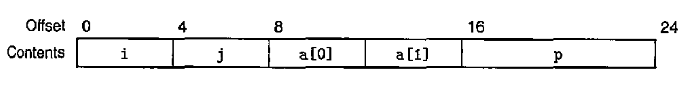
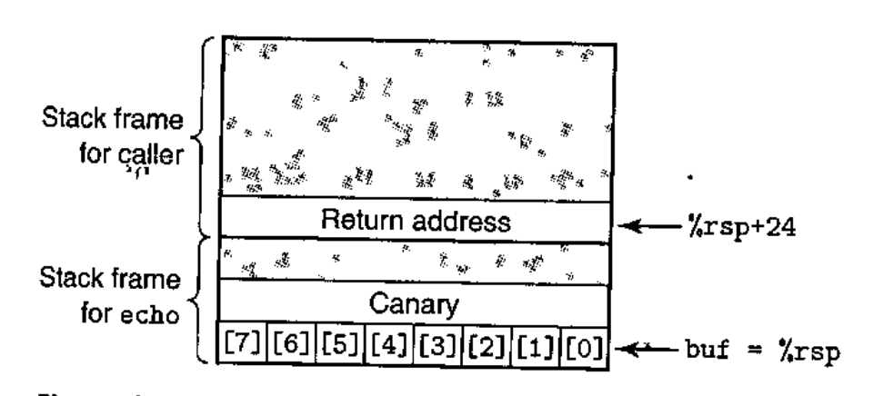

# Lecture 7

> CS:APP, Chapter 3.7 - 3.10

## Procedures

Procedures has many names and variants in many programming languages - functions, methods, subroutines, handlers and so on. They all share a general set of features.

At machine-level, there are many different attributes that must be handled to support this.

If procedure *P* calls procedure *Q*, and *Q* then executes and returns back to *P*, the actions involve one or more of the following mechanisms:

- *Passing control*: The program counter (PC) must be set to the starting *address* of the code for *Q* upon entrty and then set to the instruction in *P* following the call to *Q* upon return.
- *Passing data*: *P* must be able to provide one or more parameters to *Q*, and *Q* must be able to return a value back to *P*.
- *Allocating and deallocating memory*: *Q* may need to allocate space for local variable when it begins and then free that storage before it returns.

### The Run-Time Stack

The stack data structure's last-in, first-out memory management is great for implementing procedures.

Space for data with no specified initial value can be allocated on the stack by simply decrementing the stack pointer by an appropriate amount.

And, space can be deallocated by incrementing the stack pointer!

As an optimization, some procedures doesn't even *require* a stack frame! This can be avoided if the procedure has few arguments (such that all of them can be passed in registers) and it doesn't call any other functions (or itself recursively for that matter).

## Control Transfer

The only thing required for passing control from function *P* to function *Q* is simply setting the program counter (PC) to the starting address of the code for *Q*. But, when the time comes for *Q* to return, the processor must have some knowledge about where to return to so that execution can proceed. The `call` machine-level instruction pushes the retur naddress *A* onto the stack and sets the PC to the beginning of *Q*. While within *Q*, *A* is referred to as the *return address*. The counterpart instruction `ret` pops an address *A* off the stack and sets the PC to *A*.

### Passing data

In addition to passing control to a procedure and then back again when it returns, procedure calls may also involve passing data as arguments. And, returning from a procedure may also involve returning a value.

Most of this data passing (with x86-64) take place via registers.

For functions, arguments are passed in registers like `%rdi`, `%rsi` and others, and return valures are passed in the register `%rax`.

Specifically, when procedure *P* calls procedure *Q*, the code for *P* must first copy the arguments into proper registers. Similarly, when *Q* returns back to *P* the code for *P* can access the returned value in register `%rax`.

## Callee-saved registers

When one procedure, the *caller*, calls another prodecure, the *callee*, we must make sure that the callee does **not** overwrite some register value that the caller planned to use later. So, the registers `%rbx`, `%rbp` and `%r12 - %r15` are classified as *callee-saved* registers. For these it goes that when procedure *P* calls *Q*, *Q* must preserve the values of these registers, ensuring that they have the same values when *Q* returns to *P* as they did when *Q* was called!

It can do this either by either:

- not changing it at all, or
- by pushing the original value on the stack, altering it, and then popping the old value from the stack before returning.

## Caller-saved registers

All other registers than those marked as *callee-saved* are instead classified as *caller-saved*. This means that the *can* be modified by any function.

## Recursive Procedures

Because each procedure has its own private space on the stack (e.g. a stack frame), multiple outstanding calls do not interfere with one another! The LIFO nature of the stack naturally provides the proper policy for allocating local storage when the procedure is called (for instance, by callee-saved registers) as well as deallocating it before returning. So, recursion is absolutely built in. "It just works".

## Arrays

When you declare an array *a* of size *N* (how many elements to make room for) type *T*, you write `T a[N]`. The declaration has two effects:

- It allocates a contiguous region of *L * N* bytes in memory where *L* is the size in bytes of the data type *T*.
- It introduces an identifier *a* that can be used as a pointer **to the beginning of the array**.

The array elements can be accessed using an integer index ranging between 0 and *N - 1*.

In memory, any element *i* will be stored at the address of *a* + *L * i*. The simply design of arrays in C which requires all of the elements to be of the same type means that you can easily do this. Anything will be a scalar distance of size *T* from the address of the array *a*.

## Structs

Consider this struct:

```c
struct rec {
  int i;
  int j;
  int a[2];
  int *p;
};
```

It contains four fields:

- Two 4-byte values of type `int`
- a two-element array of type `int`
- An 8-byte integer pointer

All in all, this gives a total of 24 bytes:



Notice how they are just laid out in memory from left to right. The numbers along the top of the diagram give the byte offsets of the fields from the beginning of the structure.

To access the fields, the compiler generates code that adds the appropriate offset to the address of the structure. So when you do `struct.someField`, this just compiles to the value associated with the address that is found by adding the offset of the field to the address of the beginning of the struct.

## Unions

Unions provide a way to circumvent the type system of C, essentially. They allow a single object to be referenced according to multiple types.

Rather than having the different fields reference different blocks of memory, they all reference the same block!

```c
union Foo {
  char c;
  int i[2];
  double v;
};
```

|  Offset of c  | Offset of i  | Offset of v  |  Size  |
|---------------|--------------|--------------|--------|
|       0       |      0       |       0      |   8    |

Notice how all fields refer to the same memory location (or, the same offset from the memory location of the union).

## Buffer overflow

This is a common source of state corruption. **Typically, some character array is allocated on the stack to hold a string, but the size of the string exceeds the space allocated for the array**.

One major issue here is that the allocated space is exceeded a lot, it is possible that some other information stored on the stack may  be overwritten, such as the value of the return pointer (and possibly other saved state). For example, if the return pointer is overwritten, it will cause the program to jump to a totally unexpected location. This is a major vulnerability.

For example, a program could be fed a string that contains byte encoding of some executable code (called the *exploit code*), plus some extra bytes that overwrite the return addres with a pointer to the exploit code. The effect of executing the `ret` instruction is then to jump to the exploit code. Ouch!

### Avoiding Overflow

Use library routines that limit string lengths!

- `fgets` instead of `gets`
- `strncopy` instead of `strcpy`
- Don't use `scanf` with `%s` conversion specification.
- Use `fgets` to read a string

There are some safeguards built into compilers such as GCC today:

## Stack Randomization

In order to insert exploit code into a system, the attacker needs to inject both the code as well as a pointer to this code as part of the attack string. Generating this pointer requires knowing the stack address where the string will be located.

Historically, these stack addresses for a program were highly predictable!

For all systems running the same combination of a program and OS, the stack locations were fairly stable across many machines.

With *stack randomization*, the idea is simply to make the position of the stack vary from one run of a program to another. Thus, even if many machines are running identical code, they would all be using different stack addresses!

But as with any kind of randomization, a persistent attacker can overcome randomization by brute force, repeatedly attempting attacks with different addresses.

## Stack Corruption Detection (stack canaries)

A second line of defense is to be able to detect when a stack has been corrupted. A *stack protector* is a mechanism built in to GCC which is incorporated in the generated code to detect buffer overruns. The idea is to store a special *canary value* in the stack frame between any local buffer and the rest of the stack state. This canary value, also referred to as a *guard value*, is generated randomly each time the program runs (so there is no easy way for an attacker to determine what it is).

Immediately before restoring the register state and returning from the function, the program checks if the canary has been altered by some operation of this function or one that it has called. If so, the program aborts with an error.



Notice from the picture how the Canary is placed between the array *buf* and the saved state.

The code will then check the canary value to determine whether or not the stack state has been corrupted. It does this by comparing the value stored at the stack location with the canary value. If the two are identical, we're golden.

In recent version og GCC, it is auto-determined whether a function is vulnerable to a stack overflow, and this type of overflow detection is added automatically!

## Limiting Executable Code Regions

A final step is to simply eliminate the ability of an attacker to insert executable code into a system. One way to do so is to limit which memory regions hold executable code!

In practice. only the portion of memory holding the code generated by the compiler needs to be executable. All other portions can be restricted to allow *just* reading and writing.

This doesn't really work for interpreted JIT languages such as Java where code is dynamically generated over time.

## Take-aways

- Alignment is necessary when working with structs since these may contain data of different kinds (so you can't just locate a field by multiplying the address of the struct by the size of *T* a number of times since the types differ). Instead, you must make sure that each offset is a multiple of *K* where *K* is whatever the data type of the given field is.

- Object files are sequences of hex codes that can be mapped to assembly instructions

- Buffer overflows cause vulnerabilities that can be exploited maliciously

- Counter measures include:
  1. Randomzied Stack addresses
  2. Non-executable code on the stack
  3. Stack canaries
