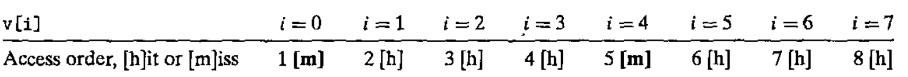

# Lecture 9

> CS:APP, Chapter 6.2, 6.5 - 6.7

## Memory system

A Memory system is a hierarchy of storage devices with different capacities, costs, and access times.

### Memory Hierarchy

CPU registers hold the most frequently used data.

Small, fast *cache memories* nearby the CPU act as staging areas for a subset of the data and instructions stored in the relatively slow main memory.

Main memory stages data stored on large, slow disks, which in turn often serve as staging areas for data stored on the disks or tapes of other machines connected by networks.

This hierarchy works because programs end to access storage at any particular level more frequently than they access the storage at the next lower level.

If a program needs access to data that are stored in a CPU registers, it can be accessed in 0 cycles during the execution of the instruction!

If it is stored in a cache, around 4 to 75 cycles.

If stored in main memory, hundreds of cycles.

If stored in disk, potentially tens of millions of cycles!

## Locality

A fundamental property of compute rprograms is *locality*. Programs with good locality tend to access the same set of data items over and over again, or they tend to access sets of nearby data items!

Programs with good locality tend to access more data items from the upper levels (closer to the CPU) than from the lower (furthest from the CPU, most expensive in terms of CPU cycles).

## Storage Technologies

### Random Access Memory (RAM)

RAM comes in two varieties:

- static
- dynamic

#### Static RAM (SRAM)

SRAM is faster and *significantly* more expensive than *Dynamic RAM*. SRAM is used for cache memories, both on and off the CPU chip.

#### Dynamic RAM (DRAM)

CRAM is used for the main memory plus the frame buffer of a graphics system. Typically, a desktop system will have no more than a few tens of megabytes of SRAM, but hundreds or thousands of megabytes of DRAM.

#### Memory Modules

DRAM chips are packaged in memory modules that plug into expansion slots on the motherboard.

#### Accessing Main Memory

Data flows back and forth between the processor and the DRAM main memory over shared electrical conduits called *buses*.

Each transfer is accomplished with a series of steps called a *bus transaction*:

- A *read transaction* transfers data from the main memory to the CPU.
- A *write transaction* transfers data from the CPU to the main memory.

## Locality (continued)

As written, well-written computer programs tend to exhibit good *locality*, meaning, they tend to reference data items **that are near other recently referenced data items or that were recently referenced themselves**.

This tendency is called *the principle of locality*.

Simply put, programs with good locality run faster than programs with poor locality.

There are two forms:

- *Temporal locality*
- *Spatial locality*

### Temporal Locality

In a program with good temporal locality, a memory location that is referenced once is likely to be referenced again multiple times in the near future!

### Spatial Locality

In a program with good spatial locality, if a memory location is referenced once, then the program is likely to reference a nearby memory location in the near future.

### Locality with arrays

Arrays are laid-out by rows in memory. If we traverse an array from the first element to the last, we're good. For a nested array, if we traverse the columns and for each column we traverse all rows, we're having bad locality! Because, again, the array is laid out in rows in memory. So at all times make sure to traverse the rows and then within them the columns.

### Locality of Instruction Fetches

Since program instructions are stored in memory and must be fetched (read) by the CPU, we can also evaluate the locality of a program with respect to its instruction fetches.

For example, with a `for` loop, we have good temporal locality since the loop body is executed multiple times.

## Writing cache-Friendly code

If we write cache-friendly code, we write code that has good locality.

In practice, here is a basic approach:

1. Make the common case go fast. Focus on the inner loops of the core functions.
2. Minimize the number of cache misses in each inner loop. All other things being equal, such as the total number of loads and stores, loops with better miss rates will run faster.

In terms of hitting or missing a cache, consider traversing an array, *v*. If the cache blocks are 4 words in size and the words are 4 bytes, then:

It will miss the cache once for each first of a new block.

Newer Intel processor architectures detect stride-1 accesses in the code and attempts to prefetch the blocks from memory that it will need soon, essentially eliminating the cache misses for subsequent elements doing stride-1 traversals over small sets of data.

The greater the stride, the greater the amount of cache misses. The greater the amount of cache misses, the smaller read throughput (and that's bad). So basically, always do stride-1 if possible.

## Read Throughput/Read bandwidth

This is the rate that a program reads data from the memory system. If a program reads *n* bytes over a period of *s* seconds, then the read throughput over that period is *n / s*, typically expressed in units of megabytes per second (MB/s).

### Memory Mountaion

Shows read throughput as a function of temporal and spatial locality.

## The short list to remember for locality

- Focus your attention on the inner loops, where the bulk of the computations and memory accesses occur.
- Try to maximize the spatial locality by reading data objects sequentially, with stride 1, e.g. in the order they are stored in memory.
- Try to maximize the temporal locality by using a data object as often as possible once it has been read from memory.