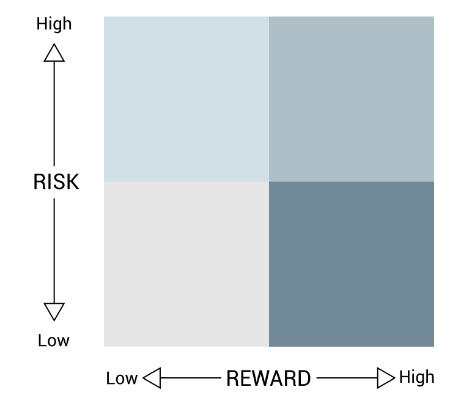
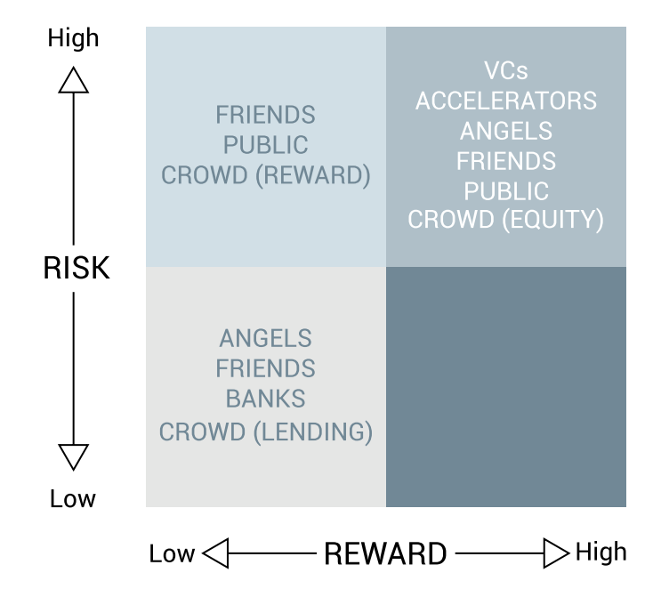
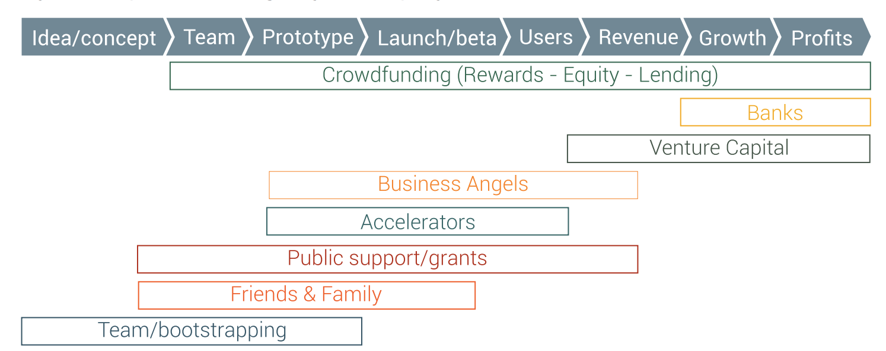
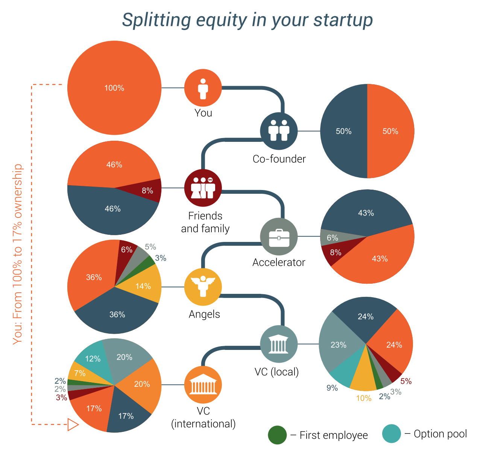

# Economics

> Chapter 1-4 + Chapter 13-14, The Startup Funding Book

## Do you really need external funding

You don't necessarily need external funding. Some companies can launch the product and generate revenue quickly.

Some companies do require external funding, however, especially if you know that it will take you three or four years to develop your idea into a real product. **The question is *when* to ask for funding**.

Other companies need funding for growth. They may be able to fund the startup themselves, but need additional money to drive further growth.

Take-away points: Many companies actually don't need funding.

## Your startup's risk/reward profile

This is what investors and banks really care about. Not your ideas, but the ratio between risk and rewards.

### The Investor Matrix

Risk profiles vary a lot from startup to startup. So does potential rewards.

The Investor Matrix has risk on one axis and reward on another

Naturally, you would ideally like to be in the lower right corner (low risk, high reward).

*Your* risk/reward profile determines what type of investor will invest and when. Some take greater risks than others when high rewards may be in sight. These are the ones looking for the next Google/Facebook/Cure-for-cancer-type company.

### Factors that determine your risk/reward profile

1. Your market
2. Your business model
3. You, the team
4. Your progress/traction.

#### Market

Often, the industry alone greatly influence the risk/reward profile.

Examples of high risk markets:

- Pharmaceuticals/biotech
- Consumer apps/software
- Consumer electronics/hardware
- Most technology-based university inventions

Whereas stuff like physical retail shops and e-commerce websites are typically low-risk markets.

#### Business Model

Again, different kinds of business models greatly influence the risk/reward profile.

Examples of high risk business models are Product-based (making/selling software) in the software market, and Developing own IP/patens, etc in Biotech.

Examples of low risk business models are consulting.

#### Team

This has a huge impact on perceived risk and perceived reward in the mind of the investor.

This is probably the number 1 most important element in the investor's analysis of your business proposal.

For example, if you go in with something that is usually high risk, but you then show a team of people who has been part of past successes within the same industry, this totally changes the perceived reward.

#### Your progress/traction

Most projects are high risk/low reward when you're at the beginning stage with only an idea.

It is as you grow the idea and develop your business model that you may move into another spot in the investor matrix.
There are so much that can go wrong. Assembling the wrong team. Not being able to build a great product. And so on.

But also: "It's the law of attraction. Once you become interesting, everybody wants to dance". So if you manage to get some positive PR and some traction, investors will start showing more interest.

#### Key take-away: You contact investors too early

It is most likely not because of bad ideas that you are turned down. Rather, you contact investors too early while the perceived risk are still too great. And, of course, you may also be reaching out to the wrong type of investor compared to the risk/reward profile of your startup.

## Who invests in what and when (kinds of investors)

I've written how there are different kinds of investors who are interested in different types of risk/reward profiles.

For example, banks would probably never fund something that was high risk.

### Venture Capital Funds

Venture capital funds (VCs) are looking to invest in companies **that can be resold for hundreds of millions within a few years**.

They are looking for _extremely_ high rewards - but are also willing to take high risks.

So don't go looking for VCs if your startup idea can't scale to the hundreds of millions in revenues.

### Startup accelerators

These look for the same things as VCs.

### Business Angels

Not as extreme as VCs, but are also looking for something that can become 'big'. It doesn't have to be worth hundreds of millions. Business angels may not only invest in startups of financial reasons. That's only one of them.

### Banks

These don't provide equity, but instead lend money to companies in return for interest. They don't gain anything amazing if your company becomes massively successful. They are only willing to take very low risks. Don't go chasing banks for your next app idea.

### Crowdfunding

This is a bit different. Here, individuals take a risk on unproven products because they feel some kind of affinity with the company. In exchange, they receive a discount or another non-financial reward.

#### Friends/family

Friends and family don't really invest in your business, - they invest in *you*. Even if your project doesn't make financial sense.

#### Public support

Many startups generate value for society and governments all over the world want to provide financial support to startups. Often startups overlook this very important source of funding.

## When do different types of investors invest

Different kinds of investor come in at different times. Venture capitalists usually come in when it is time to grow revenues and outreach. Angels come in early on when a prototype should be built and funding is needed to do so.

Crowdfunding/Crowdlending can come in at any point.

Similarly, banks will only come in very late in the process - usually to help with growth. Again, as little risk as possible.

Venture Capitalists don't want to invest in the early stages, even though they are willing to take high risks. They come in when there are signs of commercial traction. For example, after the company has launched its first product and generates a lot of users and/or revenue.

**Key take-away: You don't need to raise all your money now**!

You can raise money at different points from different investors.

## Do you really want their money? Now?

Nothing is free. No investor will be giving you the money without anything in return. They want a share of the company.

**It is easy to find entrepreneurs who regret taking in investors too early, but hard to find the opposite**. Why? Because they now know the huge value jumps a startup takes when reaching new milestones. The value of an idea is close to zero, but the value skyrockets as the startup builds a team and prototype, launches a product, gets revenue and starts to grow rapidly.

The less the value of your company, the more expensive equity-wise it will be for you to take in investment.

## Why can't you find an investor?

You probably think your idea is cool, has huge value, and that investors will trip over themselves to give you their money. They won't. **Investors don't invest in ideas**.

And, what most people think is a brilliant business idea is most likely not a brilliant business idea. What they think is just implementation of the idea is NOT just implementation.

Take-away point: Ideas are not worth much. What separates a successful startup from a failure is not the unique idea but the hard work done by the team in the many years following the initial idea.

It's all about:

- Market risk - are there customers for your product?
- Who needs your product, and will they choose it over the alternatives?
- Can it even be made?
- Can it be made at a competitive cost?
- Do the team have the necessary skills?
- Are you better than the competition?

Investors focus a lot on market risk!

What often kills a startup is not the lack of a good product, but a lack of customers!

But MOST importantly: Can YOU really do it? The Team is most important!

They want a team that is so strong they will convert the 'bad' plan A to a successful plan B or C.

## How to contact investors

### Rule number 1 - Don't write a business plan

If you send a long business plan to a professional investor, it will not be read. Because:

- It's too long
- It's full of irrelevant details
- **It is out of date**

This early in the process, the investor is looking to weed out unsuitable opportunities. They get so many that they must be able to evaluate yours in three of four pages.

Also, investors know that the business plan will change a billion times over the next years. Going over details so long in the future is completely irrelevant to investors.

**In fact, A business plan is seen as a negative signal**!
They think: "They're sitting and spending three months in the basement making this perfect plan instead of going out and talking to customers or making the product".

Instead:

- Focus on process. Be agile.
- Include other relevant Material (see later).

#### Business plans for internal use?

The important thing is the process you're going through while planning. The best means to do so *may* be a business plan, but it could be anything else. Planning aligns your team and develops a shared vision. That's the important part.

#### What if the investor asks for a business plan

Some investors may ask for one. If so, you should decode what they're asking for. They sure as hell don't want a hundred-page document. What they want is to understand your business. Maybe your investor slide deck and budget is enough. If they ask for more, ask what they would like to see.

### Rule number 2: Trust is the most important factor

Trust is important, especially given the scary statistics on how many startups fail. Trust in the business opportunity - that the problem is real and that the mark is big enough, etc - and trust in the team - that you have what it takes to deliver on the opportunity.

Proof generates trust. If you're a late stage startup, you already have paying customers, and so you have hard proof on some important hypotheses.

But if you're an early stage startup, it's all about generating trust based on the team and the reliability of the data.

Take-away: In the early stages, you must focus on YOU.

Trust is built over time. Like with anything else. Where there is no personal trust, there is no investment to be had. The chances that you'll get the money on the first day of the first meeting with an investors is tiny.

An investor want to see you perform well over *time*. One good meeting is an indicator. They want to see that repeated.

So, build relationships with investors ahead of time - and over time. Start before you need the money. Create relationships now.

### How do you build relationships with potential investors?

Don't cold-email them! Be introduced through mutual connections. Spend time building relationships with those who can introduce you to the right partners.

**You need introductions**! Someone who can vouch for you (again, Trust building). Some level of trust is usually needing just to set up the meeting.

### Don't waste time contacting the wrong investors

Look at the risk/reward matrix quadrant you're currently in. Look at the industry and market. Look at the stage of your startup. Then reach out to the investors who may want to help you. Don't waste time with all the others.

### Be specific when you reach out to investors

Don't say "Let's grab a cup of coffee". Be specific about the business opportunity as well as exactly why you are reaching out to them.

## Investor Material

### Step 1: First Contact

You take the first step, even if a mutual contact has introduced you to the investor.

Typically phone or email. You want the investor to be so interested in your proposal that they select you as one of the proposals they will spend more time evaluating.

Make sure that the email or phone call:

- Makes it clear **why your case is interesting for THEM**. State that it is something that fits with what they invest in, that it is at the right stage for them, and that the industry risk/reward position is similar to what they're looking for. You need to research the investor before reaching out.

- Gives strong cues to your own personal creditability. What you've done in the past, your education, who you have worked for, other startups you have been involved with. Name-drop as you please to enhance your creditability.

- Tells them **what you want to do next**: Ask for permission to send them more information or request a meeting with them.

#### Non-disclosure agreements

Don't ask investors to sign non-disclosure agreements at first contact. They may be willing further down the road, but not on the "first date". You can make them interested by presenting non-confidential data to them.

### Step 2: The Executive Summary

Now that you have the attention of the investor, you need to send them **an executive summary**. This should be a **one-pager describing your company and the opportunity it represents for the investor**.

The goal is to **get a meeting**.
It can either be send along with the intro email, or it may be send in the follow-up if/when the investor responds.

### Step 3: The Pitch deck

This is a set of 10-15 slides that explain your business in more detail. The investor won't make a decision after that pitch. You won't get the money right away. But hopefully it will take you further.

**The average investor spends 3:44 minutes reading your slide deck, so get to the point fast**!

Here's what should be in it:

- Company purpose
- Problem
- Solution
- Why now
- Market size
- Product
- Team
- Business Model
- Competition
- Financials
- How much you're asking for and what you will be giving in return
- Preferably also your special skills. Do you have something the others don't have? If can avoid it, don't focus on patents.
- Summary (with highlights of why to invest. Leave it as the last slide of the presentation)

In regards to financials - don't present long-term financial forecasts that are very precise down to several digits. No one will take them serious. VCs have developed very sophisticated bullshit filters after having heard thousands of pitches from startups ;-).

**DON'T FORGET THE NUMBERS!**