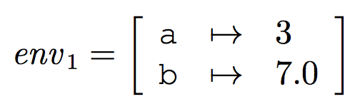

# Introduction to Functional Programming and F#
> HR, Chapter 1

## Interactive mode
### Terminating statements
Use two consecutive semicolons to terminate a statement:
```fsharp
2*3 + 4;;
```

### Return values
The "answer" from the prompt contains the value and the type of the expression:
```fsharp
val it : int = 10
```

### `val` keyword
`val` indicates that a value has been computed.

### The `it` identifier
The special identifier `it` is a identifying name for a computed value.

### `let` keyword
If you want to, you can give a name to a value by entering a *declaration*:
```fsharp
let price = 125;;
```

So, a variable declaration.

But you can combine variables with computed values:
```fsharp
let price = 125;;
	val price : int = 125
price * 20;;
	val it : int = 2500

it / price = 20;;
	val it : bool = true
```

### The `=` character
Notice how `=` in the input part of an expression is used for comparisons (expressions of type `bool`) whereas the equality sign in other places binds an identifier to a value.

### Functions
Consider the following:
```fsharp
let circleArea r = System.Math.PI * r * r;;
	val circleArea : r:float -> float
```

This is a *function declaration*.
The name is *circleArea*, and it takes a single argument, *r* of type `float` and returns a `float`.

The `->` symbol indicates a function type. That is, something that takes an argument and returns a value.

**A function in F# has *one* argument and *one* value!** But, later on I describe *Pairs* which is a special kind of tuples and can be used as input/output values.

### Calling a function
Easy enough:
```fsharp
circleArea 1.0;;
	val it : float = 3.14blablabla
```
or
```fsharp
circleArea (2.0);;
	val it : float = 12.56blablabla
```

The brackets are optional.

### Comments
#### Multi-line comments
Written:
```fsharp
(* This is a comment *)
let helloWorld = 2;;
```

So, `(*` denotes the start of a comment while `*)` denotes the end of a comment.

#### One-line comments
Written:
```fsharp
// This is a one-line comment
```
Or, like we know from C#, with `///` to support the tool *XMLDocs* which can produce program documentation from such a comment.

### Anonymous functions (lambda expressions) with `->`
You don't have to assign names to functions.
Instead you can evaluate *function expressions*:
```fsharp
fun r -> System.Math.PI * r * r;;
	val it : r:int -> int = <fun:clo@33>
```

In a function expression, the *value is a function*.

Also notice how we can refer to this new function with the `it` identifier.

### Function expressions with patterns
Kind of like a switch statement. You can express a function in terms of its values depending on the given input. For instance, consider a function that returns the amount of days for each month:
```fsharp
function
| 1 -> 31
| 2 -> 28
| 6 -> 30
| 9 -> 30
| 11 -> 30
| _ -> 31;;
```

Means that given 1, it returns 31, given 2 it returns 28 and so on. The `_` character is a wildcard (like `default` in switch statements) that says that *for all other input values, return 31*.

They are called patterns since applying the function to a value, *v*, will make the system find the clause containing the first pattern that matches *v* and return the value of the corresponding expression.

#### IMPORTANT
**The *order* of the *clauses* is significant!**
For example, if you use a wildcard identifier such as `_` as the first pattern, it will match that one and never consider the remaining ones.

### Combining `or`s in function expressions with patterns
```fsharp
function
| 2        -> 28
| 4|6|9|11 -> 30
| _        -> 31
```
Intuitively, this is a neater grouping of related patterns. The part in the middle is called an *or-pattern*.

### Naming functions with patterns
Sure thing:
```fsharp
let daysOfMonth = function
| 2        -> 28
| 4|6|9|11 -> 30
| _        -> 31
```

### Recursion (with the `rec` keyword)
Make sure to add the `rec` keyword to your functions.
For example, here is a factorial function, *fact*:
```fsharp
let rec fact = function
	| 0 -> 1
	| n -> n * fact(n - 1);;
```

The `rec` keyword allows the identifier being declared (*fact* here) to occur in the defining expression.

Notice the two clauses. The first one simply says that if given 0, return 1 (the base case), otherwise return *n * fact(n-1)*.

`n` above is an identifier for the whatever other input value than 0 that is given.

### Pairs
If *a<sub>1</sub>* and *a<sub>2</sub>* are values of types *T<sub>1</sub>* and *T<sub>2</sub>*, then *(a<sub>1</sub>, a<sub>2</sub>)* is a value of type *T<sub>1</sub> * T<sub>2</sub>*.

For example:
```fsharp
let a = (2.0, 3);;
	val a : float * int = (2.0, 3)
```

You can then extract the values like this:
```fsharp
let (x, y) = a;;
```
`x` is then `2.0` and `y` is then `3`.

### Using pairs on functions
Sure thing. Let's write a function that raises a number to a power:
```fsharp
let rec power = function
| (x, 0) -> 1.0
| (x, n) -> x * power(x, n-1);;
```

If you then invoke it with `power (4.0, 2)`, it will return the result of raising 4.0 to the power of 2 (which is 16).

### Type inferring
F# will try to infer a type for each value, expression and declaration entered.

If a type cannot be inferred, the system will reject the input with an error message.

### Bindings and environments
The *execution* of a declaration causes the identifier, *x*, to be bound th the value of the expression, *e* (no shit, Sherlock).

This binding is denoted *x ↦ e* (*x* is bound to the value of *e*).

**A collection of bindings is called an *environment*.**

This is denoted by, for example:


### Free-standing programs
A *free-standing* program contains a *main* function of type `string[] -> int` (so like C, the main method returns an int. And like Java or C#, the main function takes an array of strings), preceded by the *entry point attribute*:
```fsharp
...
[<EntryPoint>]
let main(param: string[]) =
...
```

`string[]` is an array type, and the argument `param` consists of *k* strings: `param.[0], param.[1], ..., param.[k - 1]`.

### A Hello world example program
```fsharp
let main(param: string[]) =
	printf "Hello World!" param.[0]
	0;;
```

### `printf`
The `printf` function outputs stuff to the console.
