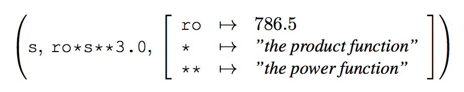

# Operators, expressions, polymorphism and higher-order functions
> HR, Chapter 2
>
> HR, Section 3.1 - 3.7

### Predicate functions
Truth-valued functions (functions that return a boolean) is called a *predicate*.

### The `<>` operator
Is a `not` comparison operator for algebraic expressions.
For example, `2 <> 3` is true - 2 is not 3.

### The `not` operator
Can negate expressions. It cannot be used between comparisons of values.

For example, `not (2 <> 3)` is `false` - 2 is not 3, so that is `true`, but the expression is negated by the `not` operator.

### The `unit` type.
Written: `()`. It is used as a "dummy" result of a computation consisting solely of side-effects.

### The `char` type
A char is a single character and is written with single quotes, for example: `'a'`.

### The `string` type
A `string` is a *sequence* of characters (chars) and is written with double quotes, for example: `"a string"`.

### Verbatim strings
Strings with `@` in front of them denotes strings without any conversion of escape sequences. For example, `@"\n"` doesn't translate to "newline", instead it holds the value `\n` literally.

## String functions
### `String.length`
Returns the amount of characters in a string.

### String concatenation
Concatenate two strings with the `+` function:
```fsharp
let text = "abcd";;
text + text;
```

### Retrieving chars on specific index positions of strings
You can do: `"abc".[0]` to retrieve the `char` at index 0 (`'a'` in this case).

### Concatenating `string`s and `char`s with the `string` function
You can do: `"abc" + string 'd'` to concatenate a `string` with a `char`. Here, `string` is a function.

### Converting other stuff to `string` with the `string` function
You can do: `string -4` to convert an `int` to the `string` *"-4"*.

You can do `string true` to convert a `bool` to the `string` *"True"*.

## If-then-else expressions
Has the form: *if `exp1` then `exp2` else `exp3`*, where `exp1` is a boolean expression and `exp2` and `exp3` are expressions **of the same type**.

## Overloaded functions and operators
A name or a symbol for a function or operator is *overloaded* if it has different meanings when applied to arguments or operands of different types.

For example, the plus operator `+` denotes addition for integers but concatenation for strings.

### Specifying the type of an argument
If you don't want to rely on the type inferring system, you can wrap an argument in parentheses: `let square (x:float) = x * x;;`.

### Specifying the type of the result of a function
You can also specify the return type of a function: `let square x : float = x * x;;`. Notice the importance of the lack of parentheses, - if we had them, the compiler would think that we were talking about the type of the argument rather than the function itself.

## Higher order functions
The concept that functions are first-class citizens. Arguments can functions and return values can be functions.

Its' just that a function can return a function which you can then invoke with another value and so on.

### Preferred way of declaring Higher order functions
This is the syntax:
```fsharp
let sum a b = a + b;;
```
It returns:
```fsharp
val sum : a:int -> b:int -> int
```
This allows you to invoke the function with `sum 2 3` which is pretty neat.

## Closures
A *closure* is a triple: *(x, exp, env)* where *x* is an argument identifier, *exp* is the expression to evaluate to get a function value while *env* is an environment.

Here's an example of a closure:


The point is that, like in many other languages, when you return a function from another function, that function will still have access to the scope/environment it had before. It is bound to a scope.

## Infix functions
To declare an infix function, you must use one of the special characters: `! % & * + - . / < = > ? @ ^ | ~`.

You do it by wrapping the "name" of the function in parentheses:
```fsharp
let (%%) a b = a + b;;
```
Which you could then call like:
```fsharp
a %% b;;
```

### Equality checks on functions
You can't! You cannot do `func1 = func2`. It only works on basic types and strings.

## Pattern matching in higher order functions
Sure:
```fsharp
let rec dupn s n : string = match n with
                            | 0|1 -> s
                            | _ -> s + (dupn s (n-1));
```

## Function application operators `|>` and `<|`
These are like pipes in unix.

### `|>`
The operator `|>` means "send the value as argument to the function on the right".

### `<|`
The operator `<|` means "send the value as argument to the function on the left".

In other words:
```
arg |> fct means fct arg
fct <| arg means fct arg
```

Sometimes, its easier (or looks better) to write the argument to the left of a function.

## Tuples, records and tagged values
An ordered collection of *n* values *(v<sub>1</sub>, v<sub>2</sub>, ..., v<sub>n</sub>)* where *n > 1* is called an *n-tuple*.

For example, `(10, true)` is an *n-tuple*.

**Expressions like `(true)` is not a tuple, but rather an expression enclosed in brackets**.

There is no such things as a 1-tuple.

And, as stated earlier, `()` is not a 0-tuple either, but rather a `unit`.

### Pairs
Tuples with 2 elements (2-tuples) are also called a *pair*.

### Triples
Tuples with 3 elements are called *triples*.

### Quadruple
Tuples with 4 elements are called *quadruples*.

### Ordering
Tuples are ordered lexicographically. This means that:
```fsharp
(1, "a") < (1, "ab")
```
...is `true` while:
```fsharp
(2, "a") < (1, "ab")
```
...is `false`.

## Tuple patterns
A tuple pattern represents a graph. The pattern `(x, n)` is a tuple pattern.

Patterns can be used on the left-hand side in a `let` declaration which binds the identifiers in the pattern to the values obtained by the pattern matching:
```fsharp
let (x, n) = (3, 2);;
```

Then, `x : int = 3` and `n : int = 2`.

### Constants in tuple patterns (incomplete patterns)
This:
```fsharp
let (x, 0) = (3, 0);;
```
matches all pairs where the second element is 0. So, it is a constraint on the *value* of the second element of a matching tuple. It then binds `x` to the first element of the given tuple, *3*.

For example, this wouldn't fly:
```fsharp
let (x, 0) = (3, 1)
```
Since the second element in the given tuple, *1* is not *0*.

Such tuple patterns are called *incomplete* in the sense that it just matches pairs where the second component is, in this example, 0. So, we get a warning :-(.

### Wildcards in tuple patterns
Sure thing:
```fsharp
let (_, x, _, y) = (1, true, 2, false)
```

Binds `x : bool = true` and `z : bool = false` and skips the 1st and 3rd element. Neat!

## Polymorphism
Has to do with functions that applies to different kinds of types.

Polymorphic identifiers are denoted with an apostrophe in front of them: `'a`.

So, for example, a function that swaps pairs:
```fsharp
let swap (x,y) = (y,x);;
```
Is Polymorphic as it doesn't care about the actual types of the pairs. So, it has the type: `val swap : 'a * 'b -> 'b * 'a`.

## Records
A *record* is a generalized tuple where each component is identified by a *label* instead of the position in the tuple. Also, each component is separated by a ";":
```fsharp
type Person = {age: int; birthday : int * int; name : string; sex : string};;
```

### The `type` keyword
The `type` keyword indicates that this is a *type declaration*. The braces `{` and `}` indicate **a record type**.

They are very much like interfaces that can be implemented using object literals in Javascript. For example, to declare a value of type `Person`, you simply do:

```fsharp
let john = {name = "John"; age = 29; sex = "M"; birthday = (2,11)};;
```

The type inferring system will then know that this is of type `Person` since it contains the required fields.

### Accessing the fields of a record
You do that with dot-notation:
```fsharp
john.birthday
	val it : int * int = (2, 11)
```

### Equality of Records
Two records are equal if all they have the same labels and all the values associated with them are equal.

So, in other words, its like a deep equality check. There is not the concept of referential equality.

### Ordering of records
Records are lexicographically ordered, so like tuples you can do `Record1 < Record2`.

## Record patterns
You can decompose records. So, if `sue` is of type `Person`:
```fsharp
let {name = x} = sue;;
```
Then this will extract the `name` label from `sue` and bind it to the attribute `x`: `val x : string = "Sue"`.

### Using Records in function declarations
Consider:
```fsharp
let age {age = a; name = _; sex=_; birthday=_} = a;;
```

This is a function that takes a person and returns the age of that person. See how it binds the age to the variable `a` and simply just returns it. So, you could do `age sue` and get her age back. Notice also how the wildcard `_` symbols is used to note that we do not care about the rest of the labels.

## Error handling
### Naming an exception (`exception` keyword)
You can use an *exception declaration* to *name* an exception:
```fsharp
exception OmgadLol;;
```

### Raising an exception (`raise` keyword)
Use the `raise` keyword to *raise* an exception:
```fsharp
if lol then raise OmgadLol else rofl
```
That will then *raise* the `OmgadLol` exception if `lol` is `true`.

### The `failwith` exception function
There is a built-in exception function named `failwith`. You can simply invoke that one with a string describing the reason for the failure:

```fsharp
if lol then failwith "U failed ohmagadlol" else rofl
```

## Locally declared identifiers
Is just functional programming's name for variables:
```fsharp
let solve (a, b, c) =
	let d = b * b - 4.0 * a * c
	if (d < 0.0) then lol
	else rofl
```
