# E-R Modeling
> [RG] 2, 3.5, 3.8.

## Entity-Relationship (ER) models
These allow us to describe the data involved in a real-word enterprise in terms of objects and their relationships.

**It is widely used to develop an initial database design.**

## Database design and ER diagrams

The database design process can be divided into six steps:

1. **Requirements analysis**

The first step is to understand what data is to be stored in the database, what applications must be built on top of it, and what operations are most frequent and subject to performance requirements.

So, we must find out what the users want from the database.

2. **Conceptual Database Design**

Here, we use the information gathered in the requirements analysis to develop a high-level description of the data to be stored in the database, along with the constraints known to hold over this data.

This is often carried out using the ER model.

The ER-model is one of several high-level/semantic data models used in database design.

The goal is to create a simple description of the data that closely matches how users and developers think of the data.

3. **Logical Database Design**

Here we choose the DBMS to implement our database design, and convert the conceptual database design into a database schema in the data model of the chosen DBMS.

**The result is a conceptual schema, sometimes called the logical schema, in the relational data model**.

4. **Schema Refinement**

Here we analyze the collection of relations in our relational database schema to identify potential problems, and to refine it.

Schema refinement can be guided by some elegant and powerful theory.

5. **Physical Database Design**

Here we consider typical expected workloads that our database must support and further refine the database design to ensure that it meets desired performance criteria.

It may involve building indexes on some tables and clustering some tables. Or, it may involve a substantial redesign of parts.

6. **Application and Security design**

Here we address aspects that go beyond the database itself.

We identify the users, groups, departments, etc. and processes involved in the application.

We must describe the parts of the database that must be accessible for each user, and equally important which parts that must *not* be accessible - and how we ensure that these rules are enforced.

# ER diagrams - TL;DR; version


However, please use this:
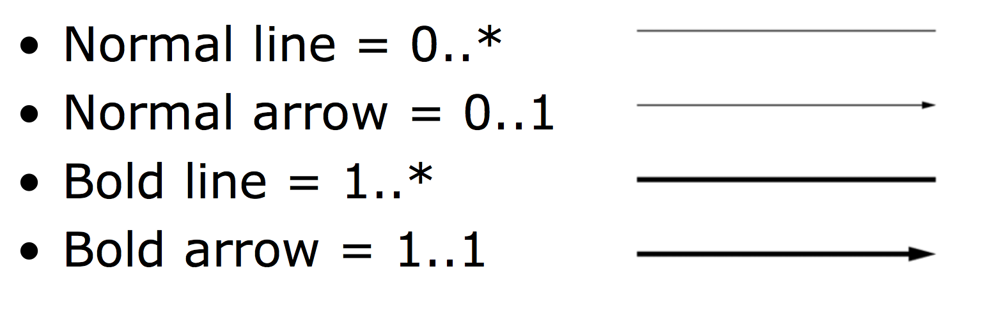

**Only use the ER-notation presented in the book**

### Entities
Entities, which are represented by rectangles, are objects or concepts about which you want to store information.
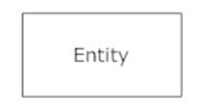

### Weak Entities
A weak entity is an entity that must defined by a foreign key relationship with another entity as it cannot be uniquely identified by its own attributes alone.


### Relationship
Relationships, which are represented by diamond shapes, show how two entities share information in the database.
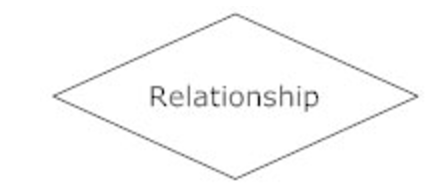

### Attributes
Attributes, which are represented by ovals, represent the things that entities are made of. For instance, a person has an age, a name and a social security number. These are all attributes. An attribute with is name <u>underlined</u> is the unique, distinguishing characteristic of the entity (primary key).
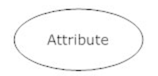

# Note
The following are notes based on the book. But, it goes to great length to explain ER diagrams as complicated as possible.

## Entities, Attributes and Entity Sets

### Entity
An entity is an object **in the real world** that is distinguishable from other objects.

### Entity Set
A collection of similar entities are called an entity set.

For instance, the collection of employees in a department.

These need not be disjoint! For instance, John can be a employee in multiple departments.

#### Attribute
An entity is described using a set of attributes.

**All entities in a given entity set have the same attributes**. This is what is meant by *similar* (so, as I see it, similar entities can be parts of the same base "class" or derived "classes").

### Domain (types)
For each attribute associated with an entity set, we identify a *domain* of possible values. It is basically just a type with some constraint(s).

A domain could be the set of 20-character strings.

Or, it could be the range from 1-10 as integers.

### Key
For each entity set, we choose a *key*.

A key is a minimal set of attributes whose values uniquely identify an entity in the set (so, typically a primary key).

**A primary key can be denoted by an <u>underlining</u> of the attribute.**

## Relationships and Relationship Sets
We may wish to collect a set of similar relationships into a *relationship set*.

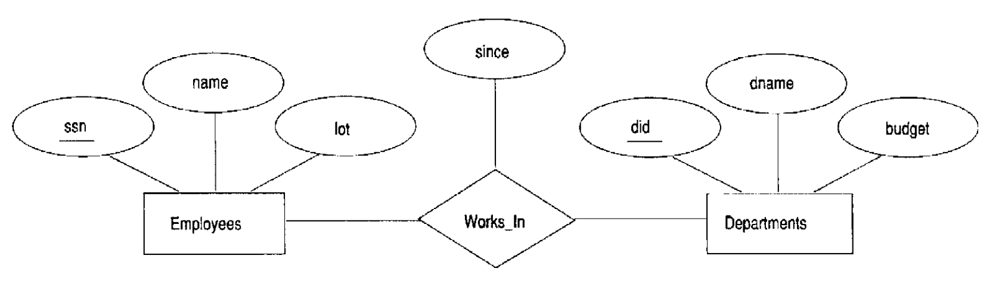

A *Relationship set* is a triangle (seen in the image above as `Works_In`).

These are like *association classes* in UML class diagrams. The `Works_In` triangle in the middle binds Employees and Departments together.

Each relationship set must be uniquely identified by the combination of the primary keys of the two entity sets it binds together.

### Descriptive attributes
Attributes that a relationship set holds is called *descriptive attributes*. In the image above, `since` is a descriptive attribute.

### An instance of a relationship
An instance of a relationship set is a set of relationships (*say whaaaat*).

An instance can be thought of as a 'snapshot' of the relationship set at *some* instant in time.

## Additional features of the ER model

### Key Constraints

#### one-to-many
The following ER diagram states that a departments *belongs to* to a manager. Managers can manage many departments, but departments can only have one manager:

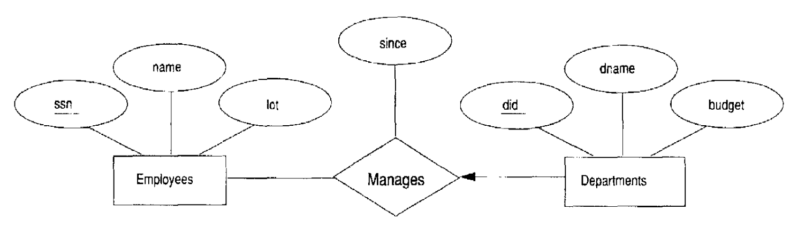

**So, by using a unidirectional arrow (a directed edge), We can state that something belongs to another thing (e.g. declare one-to-many relationships).**

#### one-to-one
Now, if we also draw an arrow from Employees to Manages, we would state that not only is Departments controlled by one Manager, but also that Employees can only control one department.

**SO, if have a relationship set with arrows pointing toward it from both sides of the relationship, we have a one-to-one.**

## Total relationships
If there is *at least 1* of both on either side (for instance, that a department has at least one employee and that a employee has at least 1 department), the relationship is **total**.

## Thick lines
**If the participation of an entity set in a relationship set is total, the two are connected by a thick line.**

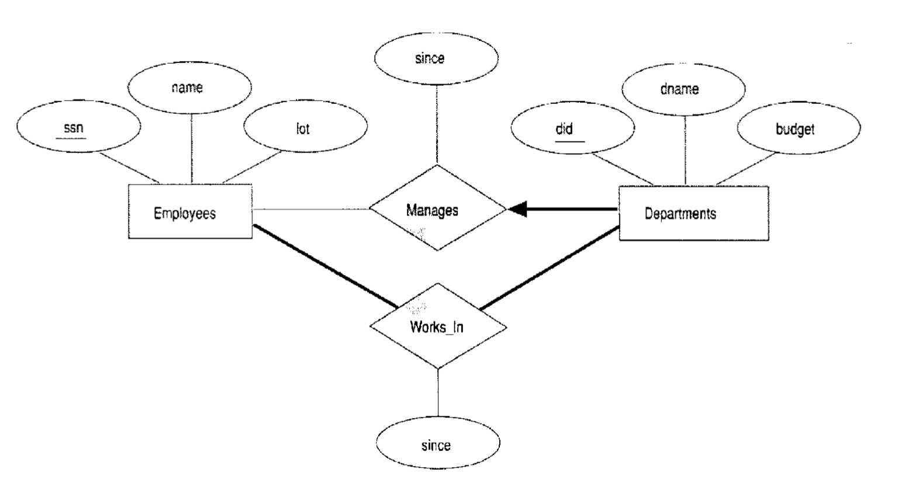

## Weak Entities
**Weak entities are ones which can only be uniquely identified by considering some of its attributes in conjunction with the primary key of another entity, which is called the *identifying owner*.**

So, in other words, their "primary key" is a composition the owner's primary key and one or more of its own attributes.

## Class hierarchies
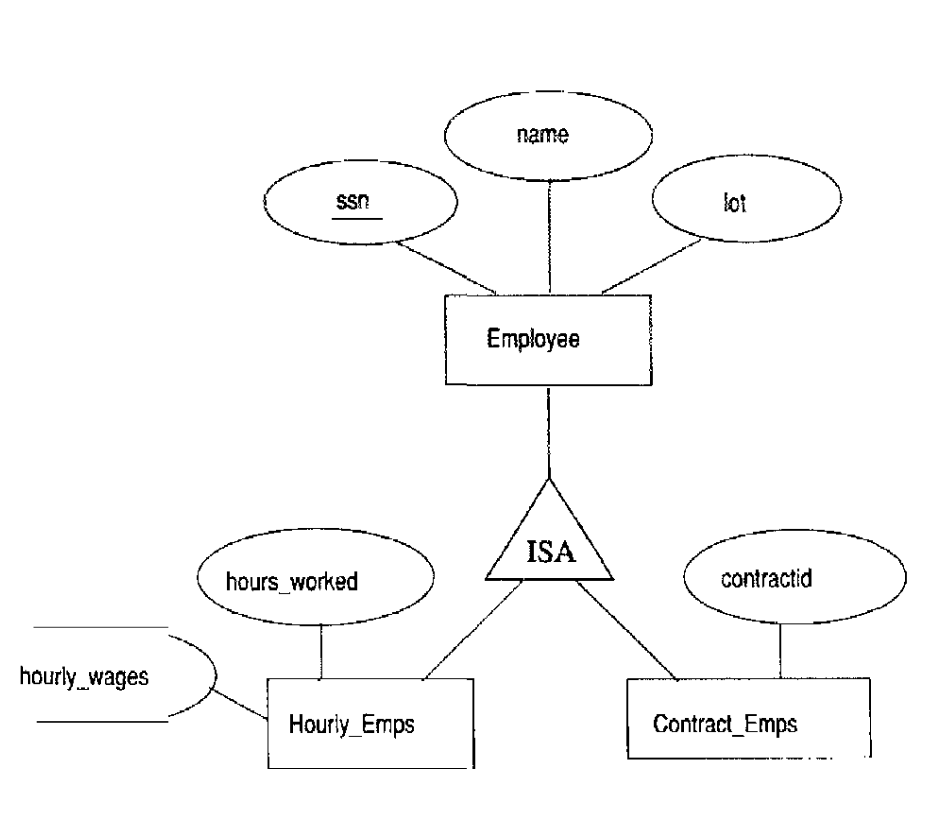

To model inheritance (*is-a relationships*), use a triangle like in the picture above.

## Aggregation
Aggregation allows us to indicate that a relationship set participates in *another* relationship set.

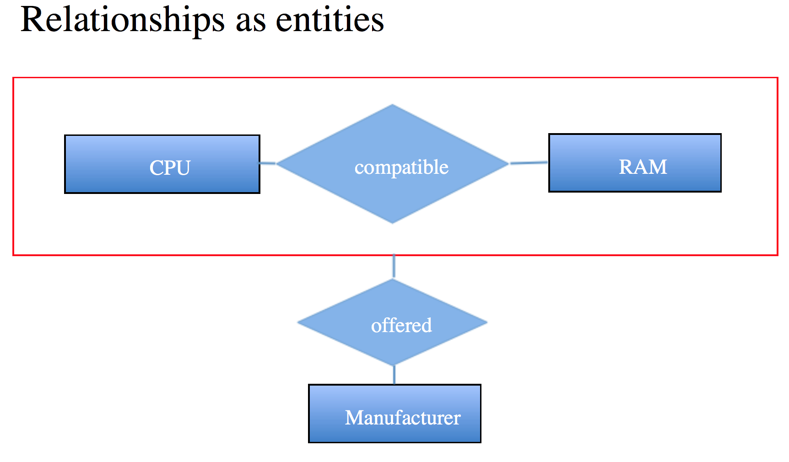

Here, we can see that the `offered` relationship has a relationship with the `compatible` relationship.

## Cardinality
Apparently, all that useless nonsense about thick lines for one-to-/many-to relationships above can be expressed much easier and more clearly with he **Information Engineering Style**:


However, please use this:


**Only use the ER-notation presented in the book**

Cardinality examples (with multipliers, don't use them):
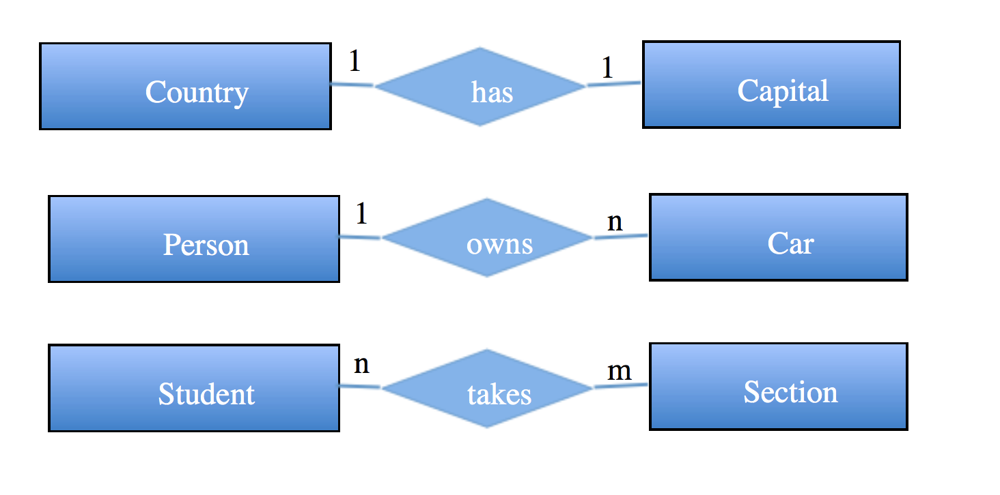

Cardinality examples - translated to the ugly lines that you must use:

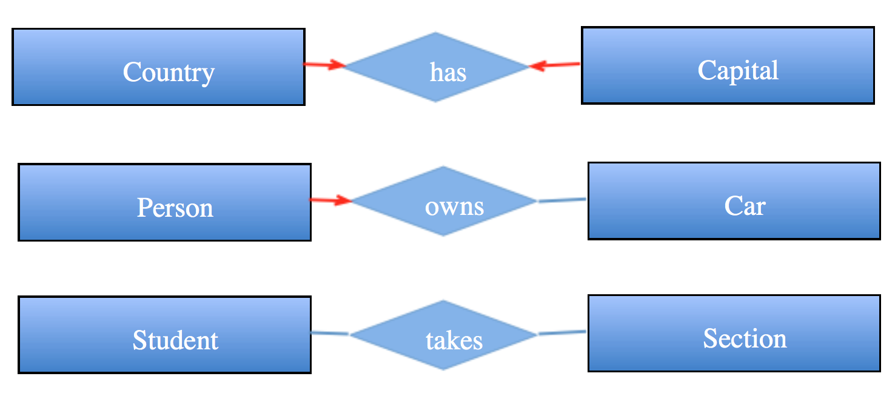

## Self relationships
An entity can have a relationship to itself:
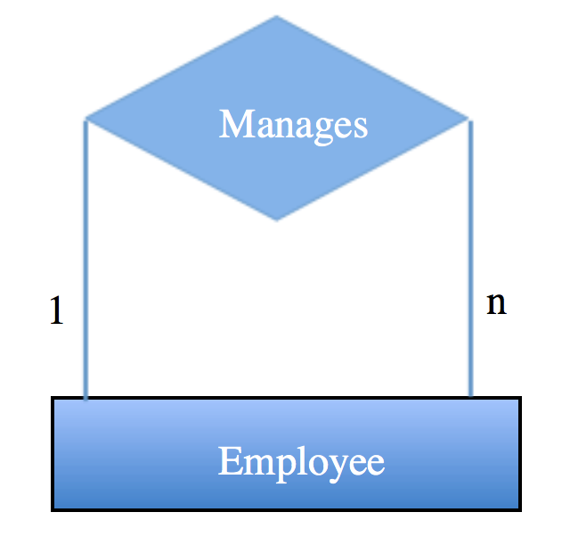

## 3-way and *k* way relationships

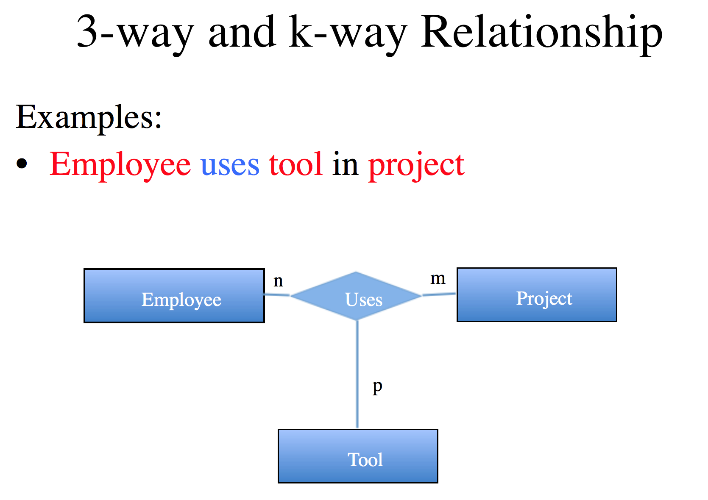

### Notes-to-self

1. If a primary key in an entity is composed by more than one attribute, all attributes that are part of the primary key must be underlined with a **dashed** line instead.

2. If a primary key in an entity is composed by a foreign key, the arrow towards the relation should be thick *and*, the entity itself must be **weak** (so have an additional rectangle around it), and the relationship should be an identifying relationship (so it too must have a rectangle around it).

So, this:

```sql
CREATE TABLE Country (
	id INT PRIMARY KEY,
	name VARCHAR(50)
);

CREATE TABLE Location (
	locId INT,
	countryId INT NOT NULL REFERENCES Country(id),
	name VARCHAR(50),
	population INT,
	PRIMARY KEY (locId,countryId)
);
```
becomes this:

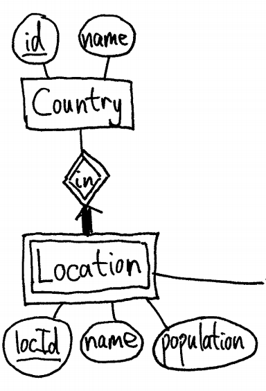

3. Whenever some entity has a primary key that is a combination of its own attributes and one or more foreign keys or it simply doesn't *have* any primary key, **it is a weak entity!**. So, draw a rectangle around it.
