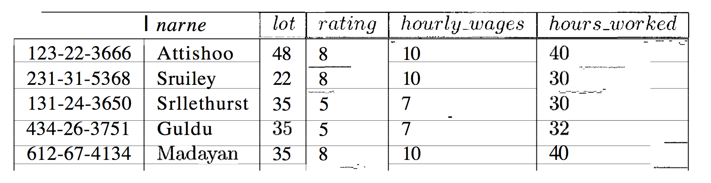
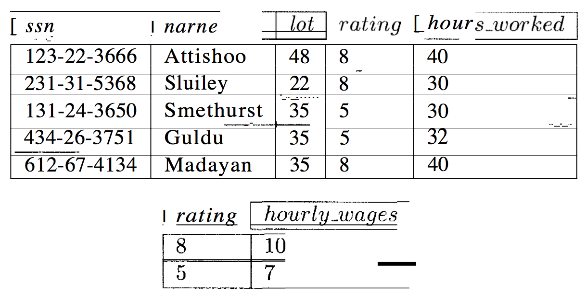
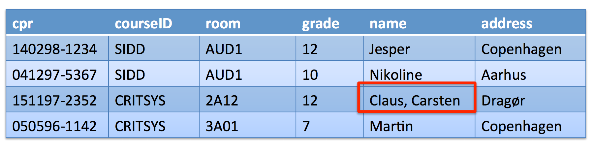
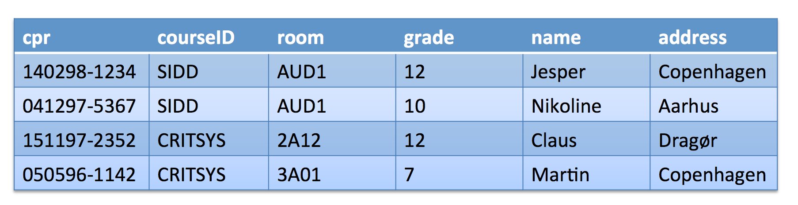

# Normalization
> [RG] 19.1, 19.2, 19.4, 19.5, 19.6, 19.7, 19.9

## Redundancy
Redundancy is evil.

Something that often causes redundancy are functional dependencies.

## Functional dependencies
If one attribute (value) is determined by another, there is a *functional dependency*.

So, lets say we have two attributes, A and B, and there is a functional dependency between them.

**For a given A, there is only one permissible value for B.**

**So, if the same value appears in two columns of A, then the same value must appear twice in B as well; This is redundant**.

## Anomalies with redundancy and functional requirements

Some issues with functional requirements and redundant information:

- **Update Anomalies**: We could update B without making a similar change in A.

- **Insertion Anomalies**: We cannot insert a tuple if we don't know A, even if we might know B.

- **Deletion Anomalies**: If we delete all tuples with a given value of A, we lose association between that and B.

**Generally, redundancy arises when a relational schema forces an association between attributes that is not natural**.

We can use functional dependencies to identify such situations and suggest refinements to the schema.

Examples of functional dependencies are:
- CPR -> name
- CPR -> address

But, the reverse is not (generally) true:
- name -> CPR is false,
- name -> address is also false

**We can address such problems by replacing a relation with a collection of smaller relations**.

This is called decompositions:

## Decompositions
As stated, a decomposition of a relation schema *R* consists of replacing the relation schema by two relation schemas that each contain a subset of the attributes of *R* and together include all attributes in *R*.

For example:

Here, there is a functional dependency between `rating` and `hourly_wages`. Notice how for each value of `rating`, the `hourly_wages` value is the same.

We can then do decomposition and arrive at this:

## Normal forms

We can use normal forms as a characterization of a schema decomposition in terms of the properties it satisfies.

If a relation has one of the *normal forms*, we know that certain kinds of problems **cannot** arise.

We can use the normal form to decide if we should decompose a relational schema further.

There are some variations:
- First normal form (1NF)
- Second normal form (2NF)
- Third normal form (3NF)
- Boyce-Codd normal form (BCNF).

**These have increasingly restrictive requirements**:
Each relation in BCNF is also in 3NF, every relation in 3NF is also in 2NF, and every relation in 2NF is also in 1NF.

### First normal form (1NF)
**A relation is in *first normal form* is every field contains only atomic values - that is, no lists or sets.**

This, for example, is **not** in 1NF:

### Boyce-Codd normal form (BCNF)
Guarantees no redundancies and no lossless-joins - but not dependency preservation.

## Properties of decompositions
As stated, before we do decomposition, we should ensure that it doesn't introduce new problems.

TL;DR; We should check whether a decomposition allows us to recover the original relation, and whether it allows us to check integrity constraints efficiently.

## Lossless-joins

The *lossless-join* enables us to recover any instance of the decomposed relation from corresponding instances of smaller relations.

We should be able to reconstruct the original relation by joining the parts together.

## Dependency-preservation
The *dependency-preservation* property enables us to enforce any constraint on the original relation by simply enforcing the same constraints on each of the smaller relations.

So, we do not need to perform joins on the smaller relations to check whether a constraint on the original relation is violated.

The slides propose another, simpler explanation:
**Ensure that the original functional dependencies cannot span multiple tables**.

## Performance penalties of decomposition

Yes, they to be felt. If we want to do queries over the original relation, we have to join the decomposed relations.

So don't do that if such queries are common.

## Armstrong's Axioms
These are:
- Reflexivity: *if X ⊇ Y* then *X → Y*:

	-	If *X* is a superset of *Y*, then there is a functional dependency between X and Y.

	- For example, if *X* is the combination of columns *cpr* and *courseId* and *Y* is *cpr*, then there is a functional dependency between X and Y.

- Augmentation: *if X → Y* then *XZ → YZ* for all *Z*.

	-	If *X* implies *Y*, then *XZ* also implies *YZ* for all values of *Z*.

	- For example, if *cpr → name* then *cpr grade → name grade*.

- Transitivity: *if X → Y* and *Y → Z* then *X → Z*.

	- If *X* implies *Y* and *Y* implies *Z*, then *X* implies *Z*.

	- For example, if *cpr → address* and *address → country* then *cpr → country*.

## Other rules:

- Union: If *X → Y* and *X → Z* then *X → YZ*.

- Decomposition (the other way around): If *X → YZ* then *X → Y* and *X → Z*.

- Pseudo-transitivity: If *X → Y* and *YW → Z* then *XW → Z*.

	- Hard to wrap your head around at first, but if *X* implies *Y*, and *Y* in combination with some other attribute *W* implies *Z*, then *X* combined with the same attribute *W* will also imply *Z*.

## Closures
Given a set of functional dependencies *F*, the closure *F+* is defined as the set of all **implied functional dependencies**.

For example,

Here we can see, that for each *cpr*, there is a provided functional dependency between *cpr* and any combination of *name* and *address*. So, this is a **provided** functional dependency.

Also, we can see that a functional dependency between the combination of *cpr* and *courseId* and each *grade*. Again, this is a **provided** functional dependency.

But to determine the closure, we need to focus on the **implied** functional dependencies, which we can use the rules listed above to determine.

So, by Reflexivity we can tell that all combinations of *cpr* and *name* implies *cpr*, since *cpr* and *name* is a superset of *cpr*.

And, with decomposition, since we can already tell that *cpr* implies the combination of *name* and *address*, we can also use decomposition to define the implied functional dependencies that *cpr* implies *name* and *cpr* implies *address*.

And, by augmentation, since we already determined that *cpr* implies *name*, we can also say that *cpr* and *grade* implies *name* and *grade*.

And so it goes.

### Attribute closure
For a given attribute *X*, the attribute closure *X+* is the set of all attributes such that *X -> A* can be inferred using Armstrong's axioms.

### Canonical cover
The Canonical cover is the "lightweight" version.

It states that the canonical cover is defined as **the minimal set of functional dependencies**.

Do this:

1. Input a set of functional dependencies.

2. For each functional dependency in the set, drop extraneous attributes and redundant functional dependencies **until the remaining functional dependencies have a single attribute on the left.**

## Main insight
It appeared on at least 3 slides:
**Split relations along functional dependencies.**
