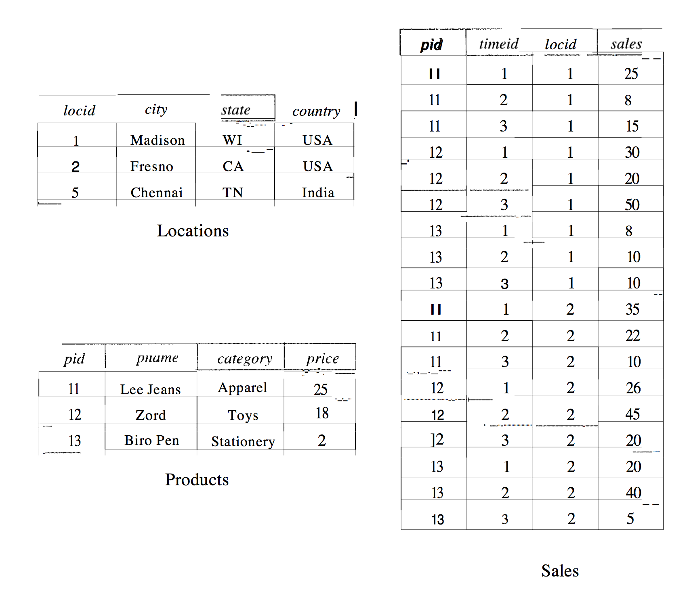
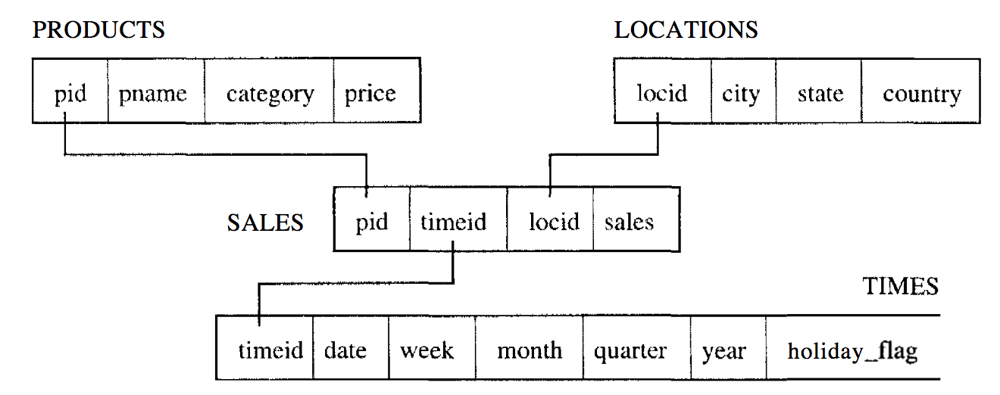

# OLAP and Data Mining
> [RG 25
>
> [[WOS04](http://www.vldb.org/conf/2004/RS1P2.PDF), sec. 1+2]

## Motivation for decision support and data warehousing
Recently, organizations have increasingly emphasized applications in which current and historical data is comprehensively analyzed and explored, identifying useful trends and creating summaries of the data, in order to support high-level decision making. Such applications are referred to as *decision support*.

**The use of views has gained rapidly in popularity because of their utility in applications involving complex data analysis**.


Because, while queries on views can be answered by evaluating the view definition when the query is submitted, precomputing the view definition can make queries run much faster.

### Data warehousing
Data *warehousing* is where organizations consolidate information **from several databases** into a *data warehouse* by copying tables from many sources into one location or materializing a view defined over tables from several sources.

This, again, is a strong motivation for views.

### Online Transactional Processing (OLTP)
- Short transactions
- Simple queries
- Touch small portions of the data

### Decision support
Think of how a `WHERE` clause usually contains lots of `AND`s and `OR`s and `JOIN`s lots of stuff together.

Such stuff is very expensive to do in many RDBMSs.

Also, we can't do stuff such as Standard-deviation in RDMBSs and must embed those queries in a host language program that can use the data to compute whatever that is needed.

This is an example of how we've put an increase emphasis on powerful analysis tools, and that the SQL standard doesn't support this.

Also, often users need to pose several related queries one after the other. There is no mechanism for expressing a family of queries, so users have to write them one after the other.

**Applications dominated by such queries are called *online analytic processing* (OLAP)**.

The data comes from traditional OLTP sources, placed in a data warehouse to be used for OLAP analysis.

## OLAP: Multidimensional data model
- Long transactions
- Complex queries
- Touch large portions of the data

They support a querying style in which the data is best thought of as a multidimensional array and are influenced by end-user tools, such as spreadsheets, in addition to database query languages.

That's also how I see it - like excel spreadsheets.

In the multidimensional data model, the focus is on a collection of numeric measures (for example Sales data).

### Dimensions
Each measure depends on a set of dimensions. So, we could have the dimensions *Product*, *Location* and *Time*.

Given a *Product*, *Location* and *Time*, we have at least one associated sales value.

And so, if we identify a Product by a unique id *pId* and similarly identify a Location by a *locId* and a Time by a *timeId*, we can think of Sales information as being arranged in a three-dimensional array *Sales*.

...And that's just an example with three dimensions. You can go ahead and generalize to more than 3 dimensions.

#### Attributes
Each dimension can have a set of associated attributes. An id is just one of them. You can image that a *Location* table also has a "country" and a "city", for example.

### MOLAP systems
MOLAP (Multidimensional OLAP) systems take the thing with the multidimensional array literally and actually store data in a multidimensional array (persistently).

### Fact table
The data can also be represented as a relation instead. This relation, which relates the dimensions to the measure of interest, is called the *fact table*.

Here's an example. The table to the right is the *fact table*.


### ROLAP systems
Relational OLAP (ROLAP) systems store all information, including fact tables, as relations.

### Star Schema
A *star schema* has the fact table in the middle, surrounded by the other tables:



Very common for OLAP database design.

**The bulk of data is typically in the *fact table*, which has no redundancy. It is usually in BCNF**.

### Aggregation in multidimensional queries

The following queries are typical:
- Find the total sales
- Find total sales for each city
- Find total sales for each state
...etc

That is stuff that OLAP is great for

### Window queries
The following queries is either difficult or impossible to write in SQL without something called *window queries*:

1. Find total sales by month

	-	 Can be solved with GROUP BY

2. Find total sales by month for each city

	-	Can be solved with GROUP BY

3. Find the percentage change in the total monthly sales for each product

	-	Can be done, but is hard

4. Find the top five products ranked by total sales

	-	Can be done, but is hard

5. Find the trailing *n* day moving average of sales (For each day, we must compute the average daily sales over the preceding *n* days).

	-	Impossible if *n* is to be a parameter of the query.

6. Rank all products by total sales over the past year, and, for each product, print the difference in total sales relative to the product ranked behind it.

	-	Impossible.

The `WINDOW` clause allows us to apply a rich collection of aggregate functions to the "window of a row", and extend the row with the results.

## Pre-aggregation
The process of, as described before, precomputing certain aggregates that can be used to answer queries quickly (and use them as **Materialized views**).

### Materialized views vs Views
A views is similar to a macro or alias for a query.
That means that it will execute whenever you want to retrieve the data.

*Materialized* views, on the other hand, physically stores the query result. *And* it can be updated automatically. *And* it can be indexed!

To create a materialized view:
```sql
CREATE MATERIALIZED VIEW Something
AS SELECT a, b, SUM(c) AS c
FROM Foo
NATURAL JOIN Bar
NATURAL JOIN Baz
GROUP BY a, c
```

This is very beneficial for OLAP queries.

## Algorithms
We need to think about data differently.
We need to do pre-aggregation/Materialized views, like written earlier.
And also, highly specialized bitmap indexes.

## Bitmap indexing
Is great because the indexes are relatively small compared with commonly used indexes such as B-trees.

And bit operations are fast! But generally haven't been the way to go for high cardinality.

The report from Kesheng Wu, Ekow Otoo and Arie Shoshani basically says that by using compression, Bitmap Indexing can be efficient for any cardinality.

But not by using any kind of compression. Typical text compression algorithms are generally much slower than the same operations on the uncompressed bitmaps.

Specifically, it states that the Byte-aligned Bitmap Code (BBC) and the Word-Aligned Hybrid Code (WAH) are the two flavors that does the job.

# Data Mining
Data-mining is the science of discovering structure and making predictions in datasets.

- **Unsupervised learning**: Structure
	-	Given observations X1, X2, ... Xn, learn group structure based on similarity.

- **Supervised learning**: Predictions
	-	Given observations and classifications (X1, Y1), (X2, Y2), ..., (Xn, Yn), learn a model to predict Y from X.
