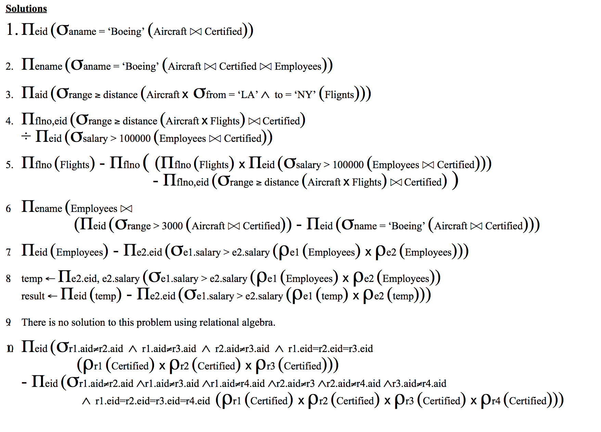

# Relational Algebra
> [RG] 4, 5, 3.6, 3.7

## Symbols
<table>
	<tr>
		<td><strong>Symbol</strong></td>
		<td><strong>Meaning</strong></td>
	</tr>
	<tr>
		<td>σ</td>
		<td>Selection</td>
	</tr>
	<tr>
		<td>π</td>
		<td>Projection</td>
	</tr>
	<tr>
		<td>ρ</td>
		<td>Renaming</td>
	</tr>
	<tr>
		<td>∪</td>
		<td>Union</td>
	</tr>
	<tr>
		<td>∩</td>
		<td>Intersection</td>
	</tr>
	<tr>
		<td>—</td>
		<td>Difference</td>
	</tr>
	<tr>
		<td>×</td>
		<td>Cartesian Product/Cross-product</td>
	</tr>
	<tr>
		<td>⋈</td>
		<td>(Natural) Join</td>
	</tr>
	<tr>
		<td>⋈<sub>Θ</sub></td>
		<td>Theta join</td>
	</tr>
	<tr>
		<td>∧</td>
		<td>Logical AND</td>
	</tr>
	<tr>
		<td>∨</td>
		<td>Logical OR</td>
	</tr>
	<tr>
		<td>¬</td>
		<td>Logical NOT</td>
	</tr>
</table>

The inputs and outputs of a query are **relations**.

A query is evaluated using *instances* of each input relation and it produces an instance of the output relation.

## Relational Algebra
One of two formal query languages associated with the relational model.

Queries in algebra are composed using a collection of operators.

**A fundamental property is that every operator in the algebra accepts one or two relation instances as arguments and returns a relation instance as the result**.

## Selection and Projection
To *select* rows from a relation is denoted with *σ*.

To *project* rows from a relation is denoted with *π*.

### Selection
For instance, say we have an instance of a relation called *R*.

We can then *select* all tuples/rows where some attribute value is greater than something:

*σ<sub>rating > 8</sup>(R)*.

The *σ* obviously means "select". The *rating > 8* part specifies the selection criterion to be applied while retrieving tuples.

We call this criterion the *selection condition*.

#### Selection condition
It is a boolean combination (so you can use the logical connectives ∧, ∨, ¬ as well as the comparison operators so long as they evaluate to a boolean value).

### Projection
With this one, we can then decide which columns to actually extract from a relation.

Example, if a relation *R* has the following conceptual schema:
*R(name: string, age: integer, rating: integer)*,

we could return only the rating and age columns:

*π<sub>age, rating</sub>(R)*

### Note: Relations are sets of tuples!
**This means that if you project only a single column and it has duplicate values, only a single tuple will appear per value. So, the results are distinct!**

### Combining selection and Projection
Sure, go ahead:

*π<sub>name, rating</sub>(σ<sub>rating > 8</sub>(R))*

This one *selects* all tuples where *rating > 8* and projects only the *name* and *rating* columns from it.

## Set Operations
Operations on sets are Union (∪), Intersection (∩), set-difference (—) and cross-product (×).

### Union-compatible
Means the following:

- They must have the same number of fields

- The corresponding fields, taken in order from left to right, must have the same *domains* (types).

### Union
Denoted: *∪*.

*"How many columns can we get if we combine stuff?"*

Given two relations, *R1* and *R2*, *R1 ∪ R2* returns a relation containing all tuples that occur in *either* *R1* or *R2*.

Obviously you could also use Union with just specific columns to project whatever you want, just make sure that they have the same names (otherwise rename them first with the rename operator.):

*π<sub>name></sub>(R1) ∪ π<sub>name></sub>(R2)*

**The two relations must be <em>union-compatible</em>**:

### Intersection
Denoted: *∩*.

*"What do they have in common?"*

Given two relations, *R1* and *R2*, *R1 ∩ R2* returns a relation containing all tuples that occur in **both** *R1* and *R2*.

*R1* and *R2* must be union-compatible.

### set-difference
Denoted: *-*.

*"What are the difference between them?"*

Given two relations, *R1* and *R2*, *R1 - R2* returns a relation containing all the tuples that occur in *R1* **but not in** *R2*.

They must be union-compatible.

### Cross-product/Cartesian product
Denoted: *×*.

*"Give me all the fields of two relations in sequential order"*

Given two relations, *R1* and *R2*, *R1 × R2* returns a relation whose schema contains **all** the fields of *R1* followed by all the fields of *R2*.

So it just puts stuff together without joining fields together or stuff like that.

**This also means that it is possible for *R1* and *R2* to contain one or more fields having the same name. Then we have a *naming conflict* and must therefore be referred to with the name of the relation as the qualifier**.

### (Natural) join
Denoted: *⋈*.

Computes the cross-product but then **enforces equality for columns with the same name**.

So, if we perform a natural join on *R1* and *R2*, and both have a *"something"* column, **it will only combine the tuples where the values are the same**.

So, for example, say we have the following 3 relations:

*Students(studentId, name)

Courses(courseId, description, activeYears)

Enrollments(studentId, courseId, grade)*

If we want to select all *Students* who got a grade greater than 8, we could do:

*σ<sub>grade > 8</sub>(Students ⋈ Enrollments)*

And if we wanted to select all *Students* who got a grade greater than 8 in a course that has been active for 10 or more years, we could do:

*σ<sub>grade > 8 ∧ activeYears >= 10</sub>(Students ⋈ (Enrollments ⋈ Courses))*

Easy as that!

### Theta join
Denoted: *⋈<sub>Θ</sub>*.

**Theta join is the equivalent of the `JOIN` operation in most RDBMs**.

Take two relations *R1* and *R2* and combine all tuples **but only keep the combinations that pass a given theta condition**.

This:
*R1 ⋈<sub>Θ</sub> R2*

Is equivalent to this:

*σ<sub>Θ</sub>(R1 × R2)* where *Θ*, the theta condition, is whatever *select condition* you apply.

So, this also shows that theta joins doesn't add anything to relational algebra you couldn't solve without it. But is definitely prettier.

### Renaming
Denoted *ρ*.

We can rename a relation with *ρ<sub>[new-relation-name]([...attributes])</sub>*

So, for example, if *R1* has an attribute *name*, we can rename it to *C*:

*ρ<sub>C(name)</sub>*

And we can then refer to it with *C.name* or just *name* if no other relations exist in the scope with a *name* column (but then why would you rename it in the first place).

**It is highly usable in self-joins**

### Self-joins
Sometimes we need to compare tuples in a relation with other tuples in the same relation. We can use self-joins for that.

## Relational Algebra example questions with solutions #1

### Schema
*Flights(flno, from, to, distance, departs)
Aircraft(aid, aname, range)
Certified(eid, aid)
Employees(eid, ename, salary)*

### Questions
1. Find eid’s of pilots who are certified on some Boeing.

*PROJECT eid(SELECT aname="Boeing"(Aircraft NATURAL JOIN Certified))*

2. Find names of pilots who are certified on some Boeing.

*PROJECT ename(SELECT aname="Boeing"(Aircraft NATURAL JOIN (Certified NATURAL JOIN Employees)))*

3. Find aid’s of aircraft that can fly non-stop from LA to NY. Assume you don’t already know the distance.

*PROJECT aid(
	SELECT range >= distance(
		Aircraft X (PROJECT distance(
			SELECT from="la" AND to="NY"(Flights)
		))
	)
)*

4. Find flno of flights that can be piloted by every pilot whose salary is over $100,000.

5. Solve problem 4 without using the division operator.

6. Find names of pilots who can operate planes with a range greater than 3,000 miles, but are not certified on any Boeing.

7. Find eid of employee(s) with the highest salary.

8. Find eid of employee(s) with the second highest salary.

9. Find eid of employee(s) certified on the most aircraft.

10. Find eid’s of employees certified on exactly three aircraft.

#### Solutions


## Relational Algebra example questions with solutions #2

### Schema
*professor(profname, deptname)
department(deptname, building)
committee(profname,commname)*

### Questions
1. Find all the professors who are in any one of the committees that Professor Smith is in.

2. Find all the professors who are in at least all those committees that Professor Smith is in.

3. Find all the professors who are in exactly (i.e., no more and no less) all those committees that Professor Smith is in.

4. Find all the professors who have offices in at least all those buildings that Professor Smith has offices in.

### Solutions


## Relational Algebra example questions with solutions #3

## Example questions and answers #2

For each of the following SQL statements, give an equivalent relational algebra expression, if possible.

1.
```sql
SELECT DISTINCT B.age, B.rank
FROM employee A, employee B
WHERE A.enum > B.enum
```
Answer:

*π<sub>B.age, B.rank</sub>(σ<sub>A.enum > B.enum</sub>(ρ<sub>A</sub>(employee) × ρ<sub>B</sub>(employee)))*

2.
```sql
SELECT max(salary)
FROM employee
WHERE rank = manager
```

Answer:

*π<sub>salary</sub>(σ<sub>rank=manager</sub>(employee)) - π<sub>employee.salary</sub>(σ<sub>employee.salary < E.salary</sub>(σ<sub>rank=manager</sub>(employee) × σ<sub>rank=manager</sub>(E(employee))))*

3.
```sql
SELECT deptnum, max(salary)
FROM employee
WHERE rank = manager
GROUP BY deptnum
```

Answer:
NOT POSSIBLE

4.
```sql
SELECT DISTINCT enum
FROM employee
WHERE NOT EXISTS
     (SELECT *
      FROM projects
      WHERE NOT EXISTS
                (SELECT *
                 FROM works
                 WHERE employee.enum = works.enum AND works.pnum = projects.pnum))
```

Answer:
*π<sub>employee.enum, works.pnum</sub>(σ<sub>employee.enum = works.enum</sub>(employee × works)) / π<sub>pnum</sub>(projects)*
