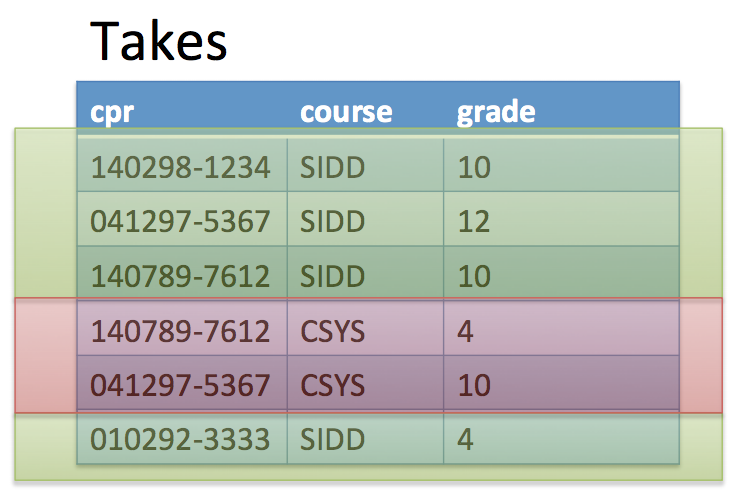
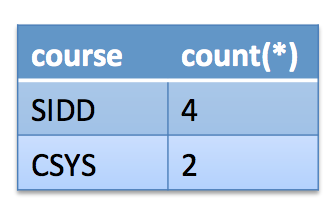

## SQL
> [RG 5]

The most widely used relational query language. It is Turing complete.


- Major standard is SQL-1999.
- Introduced *Object-Relational* concepts.

## SELECT operations
Used for getting stuff from the DB.

SQL selection with `SELECT` follows the form:
```sql
SELECT A1, A2, ... An
FROM R1, R2, ... RM
WHERE P
```

Converting this to relational algebra, the `SELECT` is a projection. It could be expressed with relational algebra with:

π<sub>A1, A2, ... An</sub>

The total would be:

π<sub>A1, A2, ... An</sub>(σ<sub>P</sub> (R1 X R2 ... X Rm))

For instance, to find all the CPR-numbers of students named Claus, you'd write:
```sql
SELECT cpr
FROM Student
WHERE name = "Claus"
```

And in relational algebra:
π<sub>cpr</sub>(σ<sub>name="*Claus*"</sub>(`Student`))

The `AND` keyword in sql is used as such:
```sql
SELECT cpr
FROM Student
WHERE name = "Claus" AND address = "Copenhagen"
```

And in relational algebra:
π<sub>cpr</sub>(σ<sub>name="Claus" ∧ address="Copenhagen"</sub>(`Student`))

### The `like` string operator.
A neat way to find out if a value starts with a specific character, you can do stuff like:
```sql
SELECT cpr
FROM Student
WHERE address like "D%"
```

That gives the CPR-numbers for all students whose address starts with a *D*.

### Selecting from multiple tables

No problem. For instance, given the tables `Student` and `Takes`:
```sql
SELECT name
FROM Student, Takes,
WHERE Student.cpr = Takes.cpr
```

Note that the field name is prepended by the table identifier if the field also exists in the other table.

### Renaming during query.
The `AS` keyword declares the names of field values during a query. For instance,
```sql
SELECT S.name
FROM Student as S, Takes as T
WHERE S.cpr = T.cpr
```

### Combining selections with `UNION`, `INTERSECT` and `EXCEPT` keywords.

You can do *Union* selections with the `UNION` keyword. E.g.:

```sql
(SELECT foo
FROM Bar
WHERE baz)

UNION

(SELECT baz
FROM Foo
WHERE Bar)
```

You can do *Intersection* and *Minus* with the `INTERSECT` and `EXCEPT` keywords simply by replacing `UNION` with with the respective keyword.

### Ordering selections
The `ORDER BY` keyword is used for ordering the selection. The `asc` and `desc` keywords are used for declaring if the ordering is ascending or descending.

 For instance,
```sql
SELECT *
FROM Student
ORDER BY name asc
```

Returns all students in ascending order by name.

You can order multiple times for one selection based on different fields.

For instance,
```sql
SELECT *
FROM Student
ORDER BY name, cpr desc
```

Will first order all students by name and then by CPR-number in reverse (So, if two students' name is *Allan*, The one with the CPR-number with the max value will come out on top).

The `asc` keyword is optional. It is `asc` by default.

### `>`, `<`, `>=`, `<=`, `=`, `in` and `all` operators
Used in `WHERE` statements.
For instance:
```sql
SELECT age
FROM Person
WHERE age > 10
```

`in` and `all` are mostly relevant for nested subqueries (see below).

Selects the persons older than 10 years of age and projects the 'age' column.

### Aggregation
Takes things and aggregates them into one result.

We have the following built-in aggregation functions (keywords):
- **`avg()`**			- For calculating the average value.
- **`count()`**		- Counts the values. (it is the same as `sum()`)
- **`min()`**			- Computes the minimum value.
- **`max()`**			- Computes the maximum value.

### `GROUP BY` keyword

Groups the aggregation by the given field name.

### `HAVING` keyword

A `WHERE` clause, except the `HAVING` clause kicks in *before* the aggregation. Also called a **Group condition**. Works on groups as a filter.
E.g.:

```sql
SELECT cpr, avg(grade)
FROM Takes
GROUP BY cpr
HAVING avg(grade) > 10
```

### `NOT` keyword
The `NOT` keyword negates the `WHERE` clause.
E.g.
```sql
SELECT grade
FROM Student
WHERE NOT grade < 12
```

The above example will select the students with grades equal to or greater than 12.

### Aggregation Examples

Examples of questions (and their solutions) that is easy to solve with aggregation:

- How to compute the average grade for SIDD?

```sql
SELECT avg(grade)
FROM Takes
WHERE course="SIDD"
```

The `avg` keyword is an aggregation function applied to each selected grade which reduces to a single value. (A single row).

- How to compute how many students are taking SIDD?

```sql
SELECT course, count(*)
FROM Takes
GROUP BY course
```

The `count` keyword is an aggregation function applied to each selected row for calculating the sum. The above example counts the amount of entries for each course. So, if the course value of *SIDD* occurs in 4 rows in the table, the value would be 4.



Becomes



### Nested subqueries

Queries with multiple `SELECT` statements.

Example:

- Find the names for the CPRs that are contained in the set of CPRs of students who take the course *SIDD*.

This is how you'd do it:
```sql
SELECT name
FROM Student
WHERE cpr in (
	SELECT cpr
	FROM Takes
	WHERE course = "SIDD"
);
```

You could have solved this in other ways.

The `all` keyword is used in `WHERE` statements, e.g.:
```sql
SELECT name
FROM Student
WHERE cpr >= all (
	SELECT cpr
	FROM Takes
);
```

### Nesting operators

- `A < all (R)`		- *A is less than every tuple in R*
- `A <> all (R)`	- *A is not in R*
- `A > some (R)`	-	*A is greater than a tuple in R*
- `A = some (R)`	-	*A is in R*
- `Exist (R)`			-	*Checks if R is inhabited*
	-	E.q.
	```sql
	SELECT course
	FROM class
	WHERE NOT Exists (
		SELECT *
		FROM Takes
		WHERE Takes.course = Class.course
	);
	```
