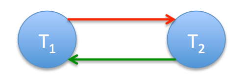
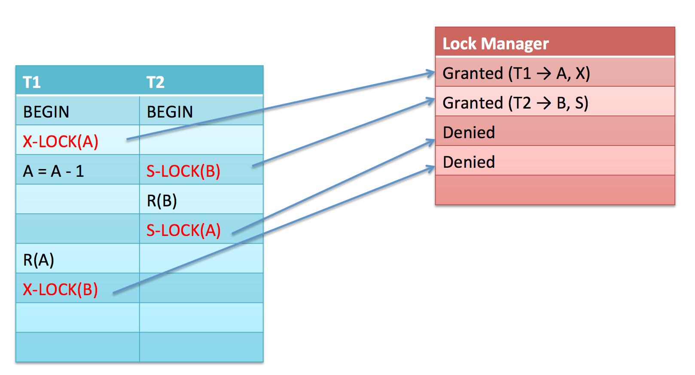
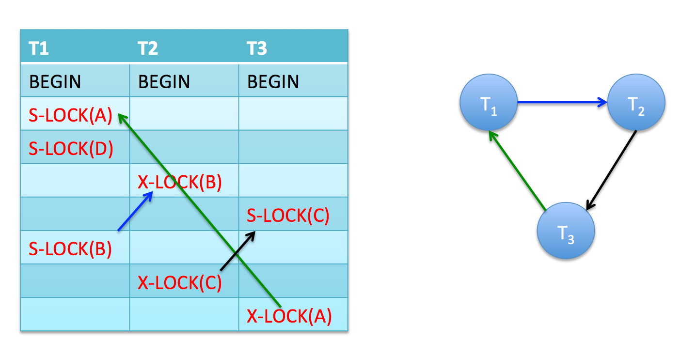
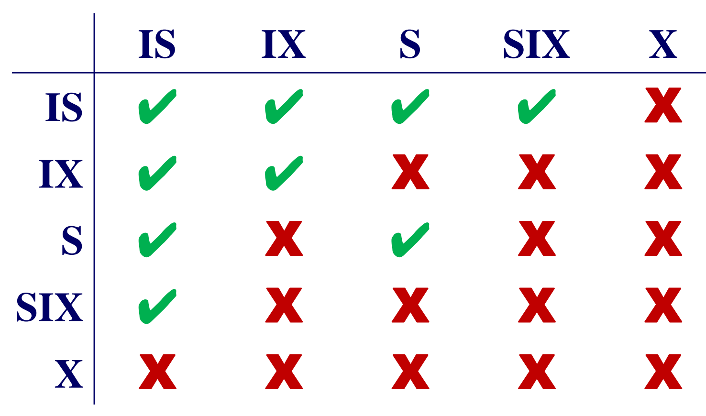
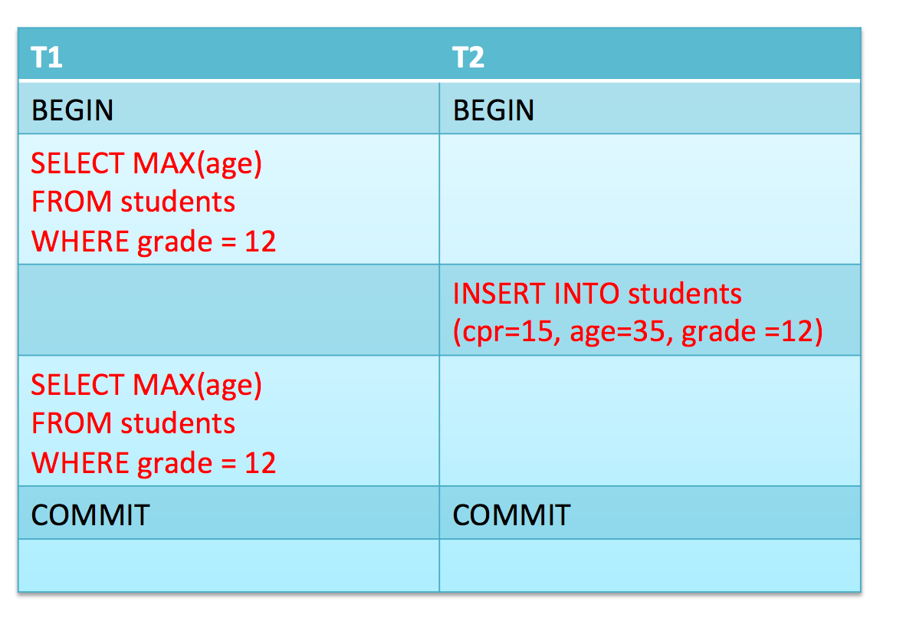

# Transactions (and concurrency)
> [RG] 6.1, 6.2, 6.3, 6.5, 16

Most of this stuff you already know from [Transactions in MODIS](../MODIS/transactions_and_concurrency_control.md), so there will be significant parts left out.

## Transaction commands
We have:

1. BEGIN (start the transaction)

2. COMMIT (make state persistent)

3. ABORT (roll state  back to the beginning)

## Notation for Reads and Writes
If the resource is called *A*:

- Read: *R(A)*
- Write: *W(A)*

## How a DBMS system achieves Atomicity
Through logging.

## Consistency in DBMS

There are two concepts:
- **Data consistency**: That the data in the DBMS is accurate in modeling the real world and follows integrity constraints.

- **Transaction Consistency**: That if the database is consistent before the transaction starts, it will be also be consistent after the transaction.

We have *levels* of consistency, which basically has to do with whether or not the writes are lazy or eager:

- **Strong Consistency**: Here, we are guaranteed to see all writes immediately, but transactions will be slower

- **Weak Consistency**: Here, writes will take time to become visible but transactions will be faster

## Isolation in DBMS

There are two strategies:

- **Pessimistic Isolation Strategy**: Like we know from locks or enforcing strictly sequential transactions, the mentality is: *"Don't let problems arise in the first place"*.

- **Optimistic Isolation Strategy**: Like we know from Optimistic Concurrency Control, the mentality is: *"Since conflicts are rare, deal with them as they arise"*.

## Correctness
### Schedule
A Schedule is a set of concurrent transactions and how they are carried out (e.g. their interleaving).

### Serial Schedule
Is a schedule that does not interleave the actions of different transactions.

### Equivalent Schedule
The effect of executing the schedule *S1* is identical to the effect of executing the schedule *S2*.

So, this has to do with multiple schedules.

### Serializability
A schedule is serializable if and only if it is equivalent to a serial schedule.

### Conflicts
Again, I hopefully remember them from the [MODIS notes](../MODIS/transactions_and_concurrency_control.md), but they are:

- **Read-Write** conflicts (R-W)
- **Write-Read** conflicts (W-R)
- **WRite-Write** conflicts (W-W)

#### Write-Read conflicts
The reads are known as *dirty reads* since you read the value of a resource that has been altered by a transaction that has not yet committed. And what if that one aborts?

#### Read-Write conflicts
Causes "Unrepeatable reads" which is highly confusing. So, if you read from a resource A, and then another concurrent transaction writes to A, and you *again* read from A, you get another value. That's pretty inconsistent.

#### Write-Write conflicts
Who gets to decide which value to use?

### Conflict equivalent schedules
Two schedules are conflict equivalent if: - They contain the same respective actions.
- Every pair of conflicting actions is ordered the same way.

### Conflict serializable schedules
A schedule is conflict serializable if it is conflict equivalent to some serial schedule.

## Locks
Locks fixes this stuff with a pessimistic isolation strategy.

You know most of this stuff, but the terminology is a bit different:

### Shared Locks
These are called S-Locks (remember that). These are read locks and are shared between transactions (which is also the reason why multiple transactions can read from the value concurrently without conflicts).

But, if some transaction wishes to write to the resource, the lock must be upgraded to an *exclusive lock*.

### Exclusive Locks
These are called X-locks (remember that)

They are write-locks which means that no other resource can read from or write to it while the lock is put on a resource.

### Concurrency Control with Locks
Just using locks doesn't make all these terrible concurrency issues go away. For example, one Transaction may write to a resource, then release a lock, and then another transaction writes to the same resource, then unlocks it, and then the first transaction reads the value. That would be a dirty read, *and* if an unrepeatable read if the other transaction were to update the value again. All in all it simply didn't solve the problem. And both of them can still abort their work.

SO, we need to do 2PL or Strict 2PL.

### 2PL
All transactions have a growing and shrinking phase and cannot acquire new locks once it has released a lock.

In the growing phase, a transaction requests locks.

In the shrinking phase, the transaction "does its thing". It may not and cannot acquire new locks.

BUT, dirty reads can still happen.
We need Strict 2PL:

### Strict 2PL
A Transaction may first release locks when it either aborts or commits.

By dong this, we eliminate the possibility of cascading aborts and all sorts of good stuff.

But, it does limit concurrency even more than with 2PL.

### Deadlocks in 2PL/Strict 2PL
Deadlocks can happen, whether you use one or the other.

## Durability with Write-Ahead logs
Instead of talking to the Buffer Manager and storing results on disk in a way so it can be rolled back (which is slow, all I/O is bad), we can use a Write-Ahead log.

A Write-Ahead log changes *before* the database is updated.

And then, if a transaction finishes, it writes a commit to the log.

If the transaction fails, it undos uncommitted transactions and redos committed transactions to bring back the previous state of the database.

## Dependency graphs
A graph where *nodes* are the **names of transactions** and the *edges* are the operations/actions that **appears before but *conflicts* with another operation/action** on another transaction.

**A schedule is conflict serializable if and only if its dependency graph is acyclic!**

Here's a dependency graph with a cycle in it:

### View Serializability
Two schedules *S1* and *S2* are view-equivalent if and only if:

- If *t1* reads initial value of *A* in *S1*, then *T1* also reads initial value of A in *S2*.

- If *T1* reads value of A written by *T2* in *S1*, then *T1* also reads value of A written by *T2* in *S2*

- If *T1* reads final value of A in *S1*, then *T1* also reads final value of A in *S2*.

View serializability is difficult to enforce, but allows more schedules than conflict serializability.

In practice, conflict serializability is used.

## Deadlocks
Pretty easy to run into:

We can deal with such stuff in two ways:
- Deadlock *prevention*
- Deadlock *detection*.

### Deadlock detection

We usually use timeouts to solve problems with deadlocks.

We can also, very helpfully, define a *waits-for* graph.

### Corrective measures
IF there is a cycle:
Then choose a cycle and kill it with fire.

### Deadlock prevention

This one simply states that when a transaction asks for a lock that is held by another transaction, then either of the two must be killed with fire.

This means that we don't need to maintain a waits-for graph or any other deadlock detection.

## Lock Granularity
If we want to lock more than one resource, it will usually be more performance-friendly to lock the highest common level between the two, instead of locking all the concrete relations.

For example, if you want to write to 7 relations of a *Week* table, corresponding to the days of the week (Monday, Tuesday, Wednesday, ...), you might as well just lock the whole *Week* table instead.

We use *Intention locks* and granularity locking for that.

### Intention locks

- IS: Intention to read
- IX: Intention to write
- SIX: Will read, intention to write

The protocol states that to get a *S* or *IS* lock, the transaction must hold **at least an *IS* lock on the parent node**.

And, to get a *X*, *IX* or *SIX* lock on a node, the transaction must hold **at least an *IX* lock on the parent node**.

## The Phantom Problem
This problem can arise when you hold locks on a set of records while doing some operation, for instance finding the max age of some students, and you don't want external interference. But then, meanwhile, an insertion happens.

We locked only the existing records, and not new ones:

So to fix that, we can use:

### Predicate locking
Here we lock all records that **satisfy a logical predicate**.

So, it automatically locks new records also, if they satisfy the logical predicate.

But that has insane overhead!

Another specialized version of predicate locking is to use:

### Index locking
We assume that there is an index on the column that is part of the logical predicate.

Here we lock the index *page* that contains all tuples that satisfies the logical predicate.

So, it does the same thing, but more efficiently.
