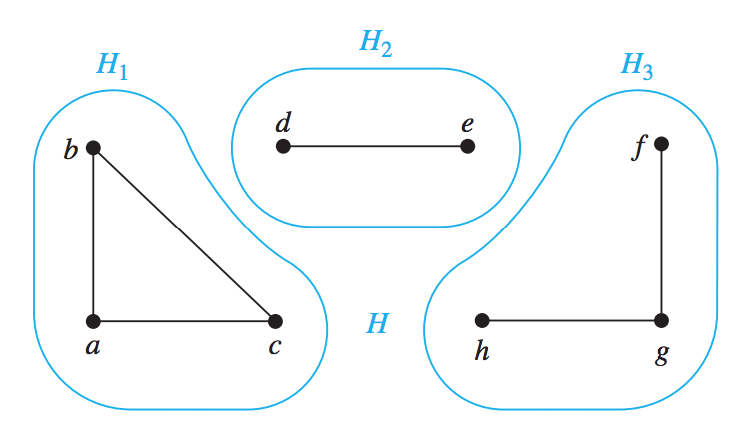

# Lecture 10

> Discrete Mathematics and Its Applications, Chapter 10.1 (Until Graph Models), 10.2 (Until Some Special Simple Graphs but including New Graphs from Old), 10.4 (Until Paths and Isomorphisms), 11.1 (Until Trees as Models), 11.3 (Until Infix, Prefix and Postfix notation)

## Graphs

Graphs are discrete structures consisting of vertices and edges that connect these vertices.

Formally, a graph *G = (V,E)* consists of *V*, a nonempty set of *vertices* (or *nodes*), and *E*, a set of *edges*. Each edge has either one or two vertices associated with it, called its endpoints. An edge is said to *connect* its endpoints.

### Infinite graphs

An *infinite graph* is one wehre the set of vertices *V* or the set of edges *E* may be infinite.

### Finite graphs

A *finite graph* is one where there is a finite vertex set and a finite edge set.

### Simple graphs

A Simple graph is one in which each edge connects two different vertices and **where no two edges connect the same pair of vertices**.

### Multigraphs

A Multigraph is one in which multiple edges connect the same vertices.

When there are *m* different edges associated to the same unordered pair of vertices *{u, v}*, we also say that *{u, v}* is an edge of multiplicity *m*.

### Loops

Edges that connect a vertex to itself are called *loops*.
We may have more than one loop at a vertex!

### Pseudographs

Graphs that may include loops and possibly multiple edges connecting the same pair of vertices or a vertex to itself, are sometimes called *pseudographs*.

### Undirected graphs

Undirected graphs are ones where the edges have no direction.

### Directed graphs

Directed graphs are ones where the edges have a direction. For example, in some graphs, the links may operate in only one direction.

Formally:

A *directed graph* (digraph) *(V, E)* consists of a nonempty set of vertices *V* and a set of *directed edges* (or arcs) *E*. Each directed edge is associated with an ordered pair of vertices. The directed edge associated with the ordered pair *(u, v)* is said to *start* at *u* and *end* at *v*.

### Simple directed graph

A *simple* directed graph is a directed graph in which no two edges connect the same pair of vertices.

### Edges

We call the pair *(u,v)* an edge if there is an edge associated to it in the graph.

### Directed Multigraphs

A *directed multigraph* is a multigraph where the edges have directions.

### Mixed graphs

Mixed graphs are ones where some edges have directions and some haven't.

## Graph Terminology

### Adjacent

Two vertices *u* and *v* in an undirected graph *G* are called *adjacent* in *G* if *u* and *v* are endpoints of an edge *e* of *G*.

Such an edge *e* is called *incident* with the vertices *u* ad *v* and *e* is said to *connect* *u* and *v*.

### Neighborhood

The set of all neighbors (adjacents) of a vertex *v* of *G = (V, E)*, denoted by *N(v)*, is called the *neighborhood of v*. If *A* is a subset of *V*, we denote by *N(A)* the set of all vertices in *G* that are adjacent to at least one vertex in *A*.

### Degree

The *degree of a vertex in an undirected graph* is the number of edges incident with it, except that a loop at a vertex contributes twice to the degree of that vertex. The degree of the vertex *v* is denoted by *deg(v)*.

### Isolated vertex

A vertex of degree zero is called **isolated**. It is not adjacent to any vertex.

### Pendant vertex

A vertex of degree 1 is called *pendant*. A pendant vertex is only adjacent to one other vertex.

### The Handshaking Theorem

Let *G = (V, E)* be an undirected graph with *mm* edges.

Then:

*2m = Σv ∈ Vdeg(v)*

In words, to get two times the amount of edges in a graph, we sum up the degrees of all vectors in the graph.

We can use it to solve:

*How many edges are there in a graph with 10 vertices each of degree six?*

Solution:

Using the handshaking theorem, The sum of all degrees is 6 * 10 = 60. Now, that's *2m*. Let's divide it by 2 to get *m = 60 / 2 = 30*.

## Subgraphs

A subgraph is a part of another graph.

Formally, a subgraph of graph *G = (V, E)* is a graph *H = (W, F)* where *W ⊆ V* and *F ⊆ E*. A subgraph *H* of *G* is a *proper subgraph* of *G* if *H != G*.

## Connectivity

### Paths

A *path* is a sequence of edges that begins at a vertex of a graph and travels from vertex to vertex along edges of the graph. As the path travels along its edges, it visits the vertices along this path, that is, the endpoints of these edges.

### Connectedness in Undirected Graps

### Connected

An undirected graph is called *connected* if there is a path between every pair of distinct vertices of the graph.

### Disconnected

A *disconnected* graph is a graph that is not *connected* (duh).

### Connected Components

A *connected component* of a graph *G* is a maximal connected *subgraph* of *G*.

## Trees

A connected graph that contains no simple circuits is called a tree.

This also means that a tree cannot contain multiple edges or loops. Thus, **any tree must be a simple graph - and it must be connected**.

### Forests

A Forest is a disconnected graph with no simple circuits and where each of its connected components is a tree.

### Rooted Trees

In many trees, a particular vertex of a tree is designated as the *root*.

As soon as we have a root, we can assign a direction to each edge as follows. Because there is a unique path from the root to each vertex of the graph, we direct each edge away from the root.

All together, this produces a directed graph called a *rooted tree*.

### Leafs

A vertex of a rooted tree is called a *leaf* if it has no children.

### Internal vertices

Vertices that *have* children are called *internal vertices*. The root, for example, is an internal vertex. Though I might add, each of those is in fact roots within their own subtree.

### Ordered Rooted Trees

This is a rooted tree where the children of each internal vertex are oredered (duh).

We usually call these *binary trees*. If an internal vertex has two children, the first child is called the *left child* and the second child is called the *right child*.

## Tree Traversal

### Preorder Traversal

Let *T* be an ordered rooted tree with root *r*. If *T* consists only of *r*, then *r* is the preorder traversal of *T*. Otherwise, suppose that *T1, T2, ..., Tn* are the subtrees at *r* from left to right in *T*. The *preorder traversal* begins by visiting *r*. It continues by traversing *T1* in preorder, then *T2* in preorder, and so on, until *Tn* is traversed in preorder.

### Inorder Traversal

Let *T* be an ordered rooted tree with root *r*. If *T* consists only of *r*, then *r* is the *inorder traversal* of *T*. Otherwise, suppose that *T1, T2, ..., Tn* are the subtrees at *r* from left to right. The *inorder traversal* begins by traversing *T1* in inorder, *then* visiting *r*. It continues by traversing *T2* in inorder,
then *T3* in inorder, ..., and finally *Tn* in inorder.

### Postorder Traversal

Let *T* be an ordered rooted tree with root *r*. If *T* consists only of *r*, then *r* is the postorder traversal of *T*. Otherwise, suppose that *T1, T2, ..., Tn* are the subtrees at *r* from left to right in *T*. The *postorder traversal* begins by traversing *T1* in postorder, then *T2* in postorder, ..., then *Tn* in postorder, and ends by visiting *r*.