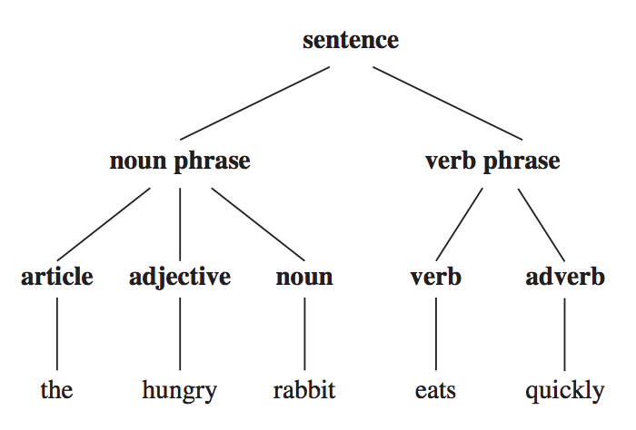
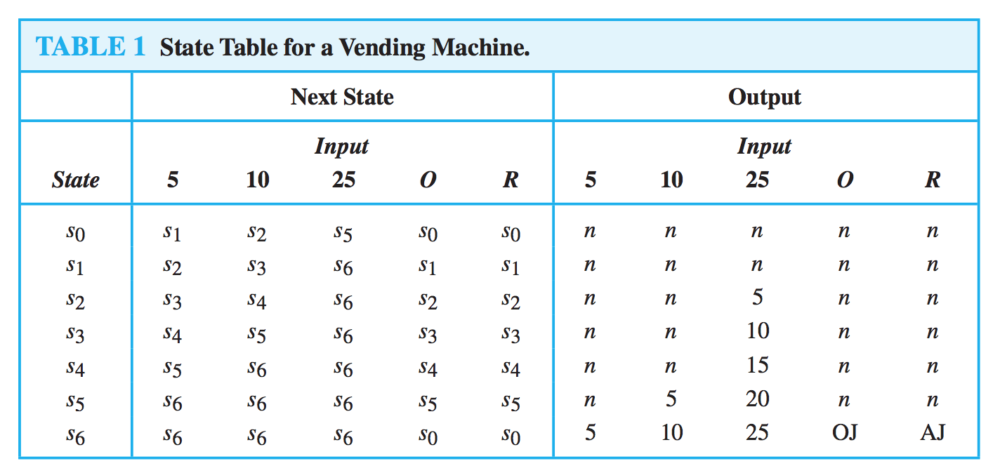
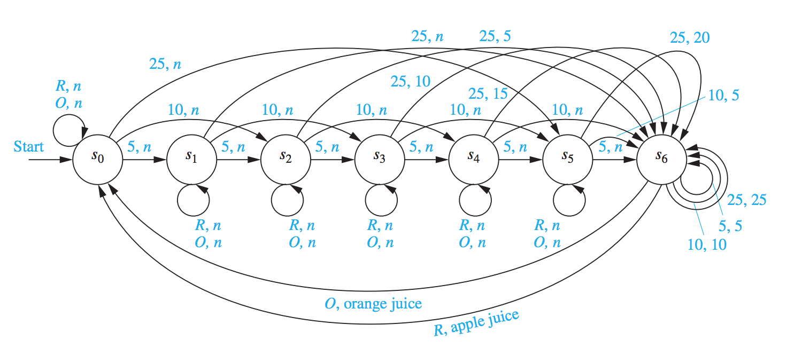
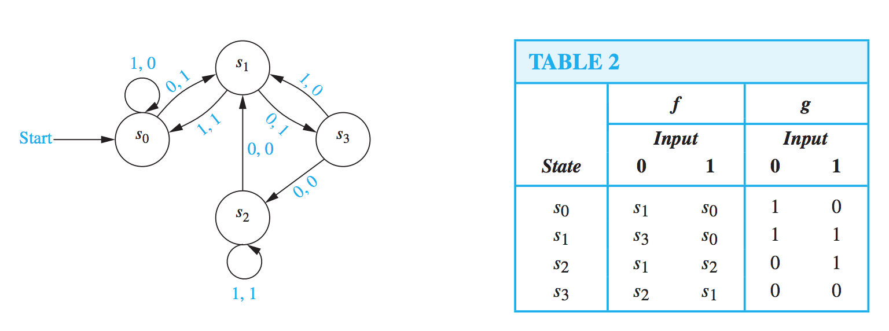
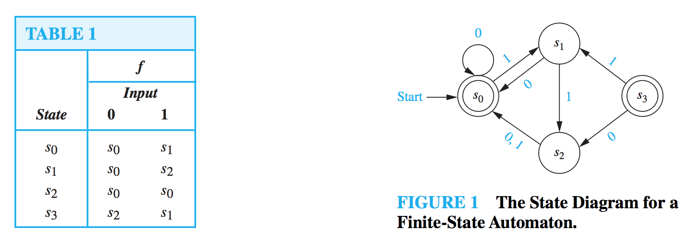
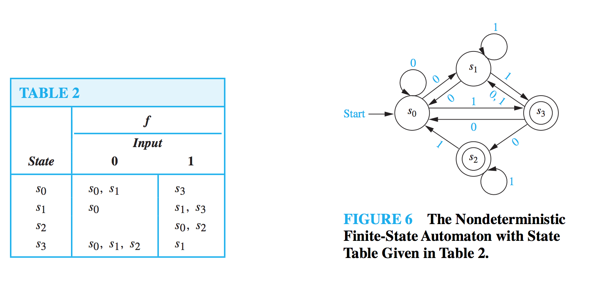

# Lecture 11

> Discrete Mathematics and Its Applications, Chapter 13.1, 13.2, 13.3

## Languages and Grammars

A subset of english is used in this chapter:

English :=
	| Sentence    -> NounPhase, VerbPhrase
	| NounPhrase  -> (Article, Noun) | (Article, Adjective, Noun)
	| VerbPhrase  -> Verb | Verb, Adverb
	| Article     -> "a"|"the"
	| Adjective   -> "large"|"hungry"
	| Noun        -> "rabbit"|"mathematician"
	| Verb        -> "eats"|"hops"
	| Adverb      -> "quickly"|"wildly"

### Forming valid sentences from these rules

From these rules, we can form valid sentences using a series of replacements until no more rules can be used:

**sentence**
**noun phrase  verb phrase**
**article  adjective  noun  verb phrase**
**article adjective noun  verb  adverb**
*the*  **adjective  noun  verb adverb**
*the  large*  **noun verb adverb**
*the  large  rabbit* **verb adverb**
*the  large  rabbit  hops*  **adverb**
*the  large  rabbit  hops  quickly*

Note to self: This is *derivation* from an AST.

## Phrase-Structure Grammars

A *phrase-structure grammar G = (V, T, S, P)* consists of a vocabulary *V*, a subset *T* of *V* consisting of terminal symbols, a start symbol *S* from *V* and a finite set of productions *P*.

The set *V - T* is denoted by *N* and is the set of *nonterminal symbols*.

Every production in *P* must contain at least one nonterminal on its left side.

### Alphabet / Vocabulary

A *vocabulary* (or *alphabet*) *V* is a finite, nonempty set of elements called *symbols*. A *word* over *V* is a string of finite length of elements of *V*.

The *empty string (λ)* is the string containing no symbols. The set of all words over *V* is denoted by *V∗*. A *language over V* is a subset of *V∗*.

### Terminals

Some of the elements of the vocabulary/alphabet cannot be replaced by other symbols. **These are called *terminals***.

The set of terminals is usually denoted by *T*

### Nonterminals

This is the other members of the vocabulary, which can be replaced by other symbols. For example, *sentence*, *noun*, *adjective*, etc are all nonterminals (e.g. abstract syntax classes).

The set of nonterminals is usually denoted by *N*.

### Start symbol

This is a special member of the vocabulary called the *start symbol*. It is denoted by *S*. This is the element of the vocabulary **that we always begin with**.

In the example given above, the start symbol was *sentence* (in a program, this would usually something like *Main* or *Program* or *SourceFile*).

### Productions

The rules that specify when we can replace a string from *V∗*, the set of all strings of elements in the vocabulary, with another string, are called the *productions* of the grammar.

The notation: *z0 → z1* means the production that specifies that *z0* can be replaced by *1* within a string.

In the examples in the top, we can see the nonterminals on the left-hand side and their productions on the right-hand side.

### Phase-structure Grammar example

Let *G = (V, T, S, P)* where *V = {a, b, A, B, S}, T = {a, b}*, *S* is the start symbol and *P = {S → ABa, A → BB, B → ab, AB → b}*.

*G* is an example of a phrase-structure grammar.

### Language generated by Grammar

The *language generated by G* (or the *language of G*) is denoted: *L(G)*. This is the set of all strings of terminals that are derivable from the starting state *S*.

In other words: *L(G) = {w ∈ T ∗ | w is derivable from S}*

For example:

*Let G be the grammar with vocabulary V = {S, A, a, b}, set of terminals T = {a, b}, starting symbol S, and productions P = {S → aA, S → b, A → aa}. What is L(G), the language of this grammar?*

Solution:

P :=
	| S -> aA,
	| S -> b,
	| A -> aa

*L(G) = {b, aaa}*.

Another example:

*Let G be the grammar with vocabulary V = {S, 0, 1}, set of terminals T = {0, 1}, starting symbol S, and productions P = {S → 11S,S → 0}. What is L(G), the language of this grammar?*

Solution:

P :=
	| S -> 11S,
	| S -> 0

*L(G) = {0, 110, 11110, 1111110, ...}*.

## Types of Phrase-Structure Grammars

There are different *types* of grammars depending on the allowed types of productions.

- **Type 0**: There are no restrictions on its productions.
- **Type 1**: Productions can have the form *w1 → w2* where *w1 = lAr* and *w2 = lwr* where *A* is a nonterminal symbol, *l* and *r* are strings of zero or more terminal or nonterminal symbols, and *w* is a nonempty string of terminal or nonterminal symbols.
- **Type 2**: This can have productions only of the form *w1 → w2* where *w1* is a single symbol that is not a terminal symbol.
- **Type 3**: This can have productions only of the form *w1 → w2* with *w1 = A* and either *w2 = aB* or *w2 = a* where *A* and *B* are nonterminal symbols and *a* is a terminal symbol, or with *w1 = S* and *w2 = the empty string*.

### Context-free grammars

**Type 2 grammars are called context-free grammars**. This is because a nonterminal symbol that is the left side of a production can be replaced in a string whenever it occurs, no matter what else is in the string.

### Context-free language

A language generated by a Type 2 grammar is called a *context-free language*.

Context-free grammars are used to define the syntax of almost all programming languages.

### Regular grammars

Type 3 grammars are also called *regular grammars*.

Regular grammars are used to search text for certain patters and in lexical analysis, which is the process of transforming an input stream into a stream of tokens for use by a parser.

### Regular language

A language generated by a Type 3/regular grammar is a regular language (which we know and love from Regular Expressions).

## Derivation Trees

A derivation in the language generated by a context-free grammar can be represented graphically using an ordered rooted tree, called a *derivation tree* or a *parse tree*.

In this tree:

- The root represents the starting symbol.
- The internal vertices represent the nonterminal symbols that arise in the derivation
- The leaves of the tree represent the terminal symbols that arise.

## Backus-Naur-Form (BNF)

This is an alternative to *context-free-grammar* (type-2).

Here, the productions have **a single nonterminal symbol as their left-hand side**.

Instead of listing all the productions separately, we can combine all those with the same nonterminal symbol into one statement.

And, instead of using the *→*,  we use *::=*. We enclose all nonterminal symbols in brackets, *〈〉*, and we list all the right-hand sides of productions in the same statement, separating them by bars:

*〈A〉::= 〈A〉a | a | 〈A〉〈B〉*.

Sometimes, I've seen the two styles combined:

*A → Aa|a|AB*.

## Finite-State Machines with Output

A *finite-state machine M = (S, I, O, f, g, s0)* consists of a finite set *S* of *states*, a finite *input alphabet I*, a finite *output alphabet O*, a *transition function f* that assigns to each state and input pair a new state, an *output function g* that assigns to each state and input pair an output, and an *initial state s0*.

### Visualizing a finite-state machine in a table

We can display all state changes and output of this machine in a table. To do this we need to specify for each combination of state and input the next state and the output obtained.

### Visualizing a finite-state machine in a directed graph

We can also use a directed graph with labeled edges to show it, where each state is represented by a circle, edges represent transitions, and edges are labeled with the input and the output for that transition.

Here is a Finite State machine and its' associated table:

So, if you stand in *s0* and receive *0* as input, you go to *s1* with an output value of *1* (the pair *0, 1* as seen in the diagram).

### Set of Strings

Suppose that *A* and *B* are subsets of *V∗*, where *V* is a vocabulary. The *concatenation* of *A* and *B*, denoted *AB*, is the set of all strings of the form *xy*, where *x* is a string in *A* and *y* is a string in *B*.

For example:

Let *A = {0, 11}* and *B = {1, 10, 110}*. Find *AB*.

Solution:

The set *AB* contains every concatenation of a string in *A* and a string in *B*. Hence, *AB = {01, 010, 0110, 111, 1110, 11110}*.

## Finite-State Automata (Finite-State machines with no output)

These differ from finite-state machines in that they **do not produce output**. *But*, they do have a set of final/accepting states.

Final/accepting states is given in the declaration for the finite-state automaton.

Formally,

A *finite-state automaton M = (S, I, f, s0, F)* consists of a finite set *S* of *states*, a finite *input alphabet I*, a *transition function f* that assigns a next state to every pair of state and input, a *start state s0* and a subset *F* of *S* consisting of *final* (or *accepting states*).

## Language Recognition by Finite-State Machines

A string *x* is said to be *recognized* or *accepted* by the machine *M = (S, I, f, s0, F)* if it takes the initial state *s0* to a final state. That is, *f(s0, x)* is a state in *F*.

The *language recognized* or *accepted* by the machine *M*, denoted *L(M)*, is the set of all strings that are recognized by *M*. Two finite-state automata are called *equivalent* if they recognize the same language.

## Nondeterministic Finite-State Automata

A Nondeterministic Finite-State Automaton (NFA) is one where there isn't always a unique next state given by the transition function. Rather, there may be several possible next states for each pair of input value and state.

