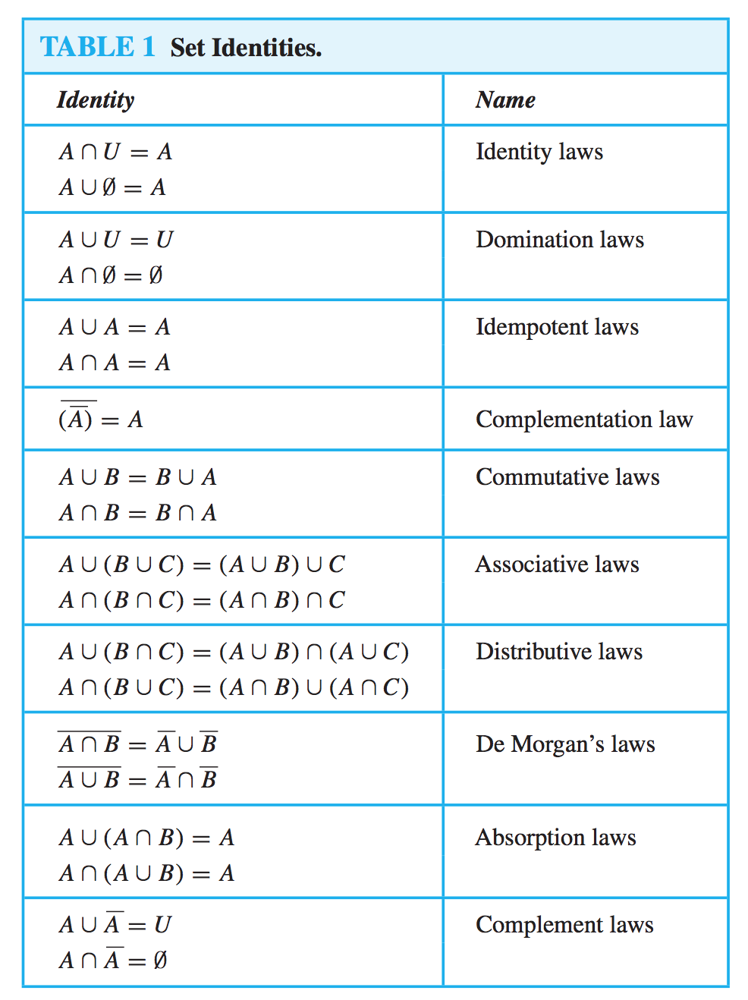
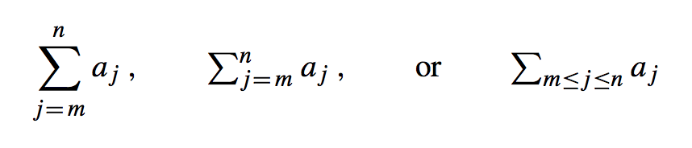
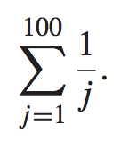
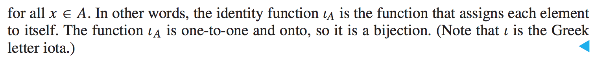

# Lecture 3

> Discrete Mathematics and Its Applications, Chapter 2.1, 2.2, 2.3, 2.4, 2.5

## Sets

The Set is a fundamental discrete structure on which all other discrete structures are built!

A *set* is an unordered collection of objects, called *elements* or *members* of the set. A *set* is said to *contain* its elements.

**We write *a ∈ A* to denote that *a* is an element of the set *A*.**

**The notation a ∈ A denotes that *a* is not an element of the set *A*.**

A Set is denoted using uppercase letters! Lowercase are used to denote elements of sets.

### Notation

#### The Roster Method

With the Roster Method, we declare set within curly braces (*{}*).

For example, the set *V* could be denoted:

*V = {a, e, i, o, u}*.

#### Describing a set without listing all of its members

We can use:

*...*

When we don't want to write up all elements when the pattern is obvious like here:

*{1, 2, 3, ..., 99}*.

#### The Set Builder notation

Here we also use curly braces, but instead of listing all of the elements, we give them a name and a property they have. For example:

*O = {x | x is an odd positive integer less than 10}*.

Another example:

*O = {x ∈ Z<sup>+</sup> | x is odd and x < 10}*.

##### When is it used

We often use this notation to describe sets where it is impossible to list all the elements of it.

### Standard Sets

There are some "built-in" sets in the world of mathematics:

|        Name        |                                 Description                                 |
|--------------------|-----------------------------------------------------------------------------|
|        **N**       |             *{0, 1, 2, 3, ...}* the set of **natural numbers**              |
|        **Z**       |             *{..., -2, -1, 0, 1, 2, ...}* the set of **integers**           |
|  **Z<sup>+</sup>** |              *{1, 2, 3, ...}* the set of **positive integers**              |
|        **Q**       |  *{p/q | p ∈ **Z**, q ∈ **Z**, and q != 0}* the set of **rational numbers** |
|        **R**       |                          The set of **real numbers**                        |
|  **R<sup>+</sup>** |                      The set of **positive real numbers**                   |
|        **C**       |                        The set of **complex numbers**                       |

### Intervals

|             Interval             |                   Description                   |
|----------------------------------|-------------------------------------------------|
|   *[a, b] = {x | a <= x <= b}*   |      Called the *closed interval*. Inclusive    |
|   *[a, b) = {x | a <= x < b}*    |    *a* inclusive up to, but not including *b*   |
|   *(a, b] = {x | a < x <= b}*    |    from *a* (exclusive) up to and including *b* |
|   *(a, b) = {x | a < x < b}*     |      Called the *open interval*. Exclusive      |

### Datatypes as sets

Every data type is built upon the concept of a set.

A `boolean` is itself the set *boolean = {0, 1}* (or *boolean = {true, false}*).

### Equality of Sets

In Discrete Math, two sets are equal if and only if **they have the same elements**.

This also means that the *order* of the elements doesn't matter.

For example, the sets *{1, 3, 5}* and *{3, 5, 1}* are equal because they have the same elements.

It doesn't matter, either, if a set includes the same element more than once. For example, the sets *{1, 3, 3, 3, 5}* and *{1, 3, 5}* are equal.

### The empty set

There is a special set without elements called *the empty set*.

Denoted: *∅* or just *{ }*.

### The Singleton set

The *singleton set* is just a set with one element. For example, *{1}* is a singleton set.

### The Universal Set

The Universal Sat, *U*, contains all obejcts under consideration. This is represented by a rectangle.

### Venn Diagrams

Venn Diagrams can be used to represent sets graphically.

### Subsets

Often, elements of one set are also elements of a second set.

The set *A* is a *subset* of *B* if and only if **every element of *A* is also an element *B***.

Each set is also a subset of itself. So, *A ⊆ A* holds.

#### Subset Notation

*A ⊆ B* indicates that *A* is a subset of *B*.

Mathematically, *A ⊆ B* if and only if *∀x(x ∈ A → x ∈ B)* is true.

#### How to show that *A* is not a subset of *B*

Easy. Just find one element *x ∈ A* with *¬(x ∈ B)*.

### Showing that two sets are equal

Just show that *A ⊆ B* and *B ⊆ A*.

### The size of a Set (Cardinality)

If there are *n* distinct elements in a set *S* where *n* is a nonnegative integer, we say that *S* is a *finite set* and that *n* is the *cardinality* of *S*.

We denote cardinality (size): *|S|* where *S* is the name of the set.

So, if a set includes multiple identical elements, the cardinality (size) will still be equal to the amount of distinct/unique elements within it.

For example, the set of odd positive integers less than 10, let's call it *A*, has *|A| = 5*.

The empty set has no elements, so |∅| = 0.

### Infinite Sets

An example of an inifnite set is the set of all positive integers.

Taking the cardinality of infinite sets is a challenging topic which the book doesn't cover yet in this chapter.

### Power Sets

Given a set *S*, the *power set* of *S* is the set of all subsets of the set *S*. It is denoted: *P(S)*.

If a set has *n* elements, then its power set has *2<sup>n</sup>* elements!

Example:

*P({0, 1, 2}) = {∅,{0},{1},{2},{0, 1},{0, 2},{1, 2},{0, 1, 2}*.

As you can see, it is all possible subsets. This includes the set itself as well as the empty set!

#### Power Set of the empty set

The power set of the empty set has exactly one subset; itself:

*P(∅) = {∅}*.

## Ordered *n*-tuples

Sets are unordered, so if we care about the *order* of elements in a collection, we can use **ordered *n*-tuples**.

An ordered *n*-tuple is denoted: *(a<sub>1</sub>, a<sub>2</sub>, ..., a<sub>n</sub>)*. It is the ordered collection that has *a<sub>1</sub>* as its first element and *a<sub>n</sub>* as its *n*th element.

### Equality of ordered *n*-tuples

Two ordered *n*-tuples are equal iff each corresponding pair of their elements is equal.

So, *(a<sub>1</sub>, a<sub>2</sub>, ..., a<sub>n</sub>)* = *(b<sub>1</sub>, b<sub>2</sub>, ..., b<sub>n</sub>)* iff *a<sub>i</sub> = b<sub>i</sub>* for *i = 1, 2, ..., n*.

### Ordered pairs

Ordered pairs are ordered 2-tuples. For example, (a, b).

## Cartesian Product

The *Cartesian product* of two sets *A* and *B* is denoted *A × B* and **is the set of all ordered pairs (a, b) where *a ∈ A* and *b ∈ B***.

*A × B = {(a, b)|a ∈ A ∧ b ∈ B}*.

For example, the Cartesian product of *A = {1, 2}* and *B = {a, b, c}* is:

*A × B = {(1, a), (1, b), (1, c), (2, a), (2, b), (2, c)}*.

So you basically just match each element of set *A* with each element of set *B* as ordered pairs.

*A × B* is not equal to *B × A*!

### Taking the Cartesian Product of a set itself

Sure. *A × A* is denoted *A<sup>2</sup>* and **A × A × A** is denoted *A<sup>3</sup>* and so on.

## Using Set Notation with Quantifiers

Yes, no problem:

*∀x∈S(P(x))* (for all elements *x* contained in the set *S*, it goes that *P(x)*).

## Truth Sets and Quantifiers

Given a predicate *P* and a domain *D*, The *truth set* of *P* is the set of elements *x* in *D* for which *P(x)* is true.

This is denoted: *TruthSet = {x ∈ D | P (x)}*.

So, its basically the set of all elements for which the predicate "returns true".

## Set Operations

Sets can be combined in a multitude of ways.

### Union

The *union* of the sets *A* and *B* is denoted *A ∪ B* and is the set that contains those elements **that are in either *A* or in *B* or both**.

Mathematically:

*A ∪ B = {x | x ∈ A ∨ x ∈ B}*.

For example:

*{1, 3, 5} ∪ {1, 2, 3} = {1, 2, 3, 5}*.

### Intersection

The *intersection* of the sets *A* and *B* is denoted by *A ∩ B* and is **the set containing those elements that are in both *A* and *B***.

We ask: What does these have in common?

Mathematically:

*A ∩ B = {x | x ∈ A ∧ x ∈ B}*.

For example:

*{1, 3, 5} ∩ {1, 2, 3} = {1, 3}*.

If we want to find the students who major in both mathematics and computer science at a university, we just intersect the two sets and the resulting set will be of those majoring in both.

### Disjoint Sets

Disjoint sets are those where their intersection is the empty set. In other words, they have nothing in common.

For example:

*{1,2} ∩ {3, 4} = ∅*.

Here we say that the two sets, *{1, 2}* and *{3, 4}* are disjoint.

### Difference

The *difference* between two sets *A* and *B* is denoted *A - B* is the set **containing those elements that are in *A* but not in *B***.

This can also be expressed with *A\B*, though not as common.

Mathematically:

*A - B = {x | x ∈ A ∧ ¬(x ∈ B)}*.

### Complement

Given two sets *A* and *B*, the *complement* of a set *A* is denoted by an *A* with a line above it and is equal to *B - A*.

For example, if we take the compliment of *A* with respect to the universal set *U*, we get everyting in the universal set except for whatever is in *A*.

## Set Identities

These can be pretty helpful when we think about the equivalence and equalities between sets.



## Functions/Mappings/Transformations

In discrete math, a *function f* from *A* to *B* is an assignment of exactly one element of *B* to each element *A*.

We write *f(a) = b* if *b* is the unique element of *B* assigned by the function *f* to the element *a* of *A*.

If *f* is a function from *A* to *B*, we write:
*f : A → B*.

### Specifying a function

Often, we give a formula such as *f(x) = x + 1*.

Othertimes, we define it in terms of a relation from *A* to *B*: *f : A → B*.

### Domain and codomain of functions

If *f* is a function from *A* to *B*, we say that *A* is the *domain* of *f* and *B* is the *codomain* of *f*.

### Range of functions

The *range* of a function is a subset of the codomain - the actual mapped values that will occur within the domain. For example, if the domain is *{A, B, C}* and the codomain is *{1, 2, 3, 4}* and *A* is mapped to *1*, *B* is mapped to *2* and *C* is mapped to *3*, the range is the set *{1, 2, 3}*.

### Image and preimage of functions

If *f(a) = b*, *b* is the *image* of *a* and *a* is the *preimage* of *b*.

### Equality of functions

Two functions are equal when they have the same domain, have the same codomain, and map each element of their common domain to the same element in their common codomain!

### Function examples

#### Example 1

Say we have a function, *G*, that assigns a grade to a student in a class.

*let Students = {Adams, Chou, Goodfriend, Rodriguez, Stevens}*.
*let Grades = {A, B, C, D, F}*

The domain of *G* is the set *Students*.
The codomain of *G* is the set *Grades*.

The *range* of *G* is the set *{A, B, C, F}* because that is the grades that will be given for the input set (*Students*).

#### Example 2

If we have a relation *R = {(Abdul, 22), (Brenda, 24), (Carla, 21), (Desire, 22), (Eddie, 24), (Felicia, 22)}*, then as functions it would be:

*f(Abdul) = 22, f(Brenda) = 24, f(Carla) = 21, f(Desire) 22, f(Eddie) = 24, f(Felicia) = 22*.

Here, *f(x)* is the age of *x*, where *x* is a student.

Here, the codomain would probably be the set *{20, 21, 22, ..., 90}* or something like that. The range, then, is *{21, 22, 24}*.

### Domain and codomain in programming languages

In the statement:

```java
int floor (float real) {}
```

The *domain* will be the set of all real numbers (floats), and its codomain is the set of integers (because floor takes the floor of the given floating point number).

### Real-valued vs integer-valued functions

If a function's codomain is the set of real numbers, it is called *real-valued*.

If its codomain is the set of integers, it is called *integer-valued*.

## One-to-One and Onto functions

### One-to-One

Some functions never assign the same value to two different domain elements. These functions are said to be **one-to-one**.

A function *f* is one-to-one if and only if *f(a) != f(b)* whenever *a != b*.

### Onto

Functions where the *range* and the *codomain* are equal are called *onto* functions. So, here, every returnable value from the codomain will be returned.

### Bijective

If a function is *one-to-one* AND *onto*, it is a *bijection* (or, it is *bijective*).

### Inverse Functions

If we have a bijective function - one that is both one-to-one and onto - we know that every element of B is the image of a *unique* element of A. Therefore, we can define an *inverse function* of *f* from *B* to *A* that reverses the correspondence.

This is the functino that assigns to an element *b* belonging to *B* the unique element *a* in *A* such that *f(a) = b*.

**The inverse function of *f* is denoted by *f<sup>-1</sup>***.

We can only define an inverse function if a function is *one-to-one*!

Thus, a one-to-one correspondence is called *invertible* because we can define an inverse of this function. Otherwise, it is called *not invertible*.

So, if we have a function *f* with domain *{a, b, c}* and codomain *{1, 2, 3}* that has the following results:

*f(a) = 2, f(b) = 3, f(c) = 1*,

it is one-to-one (and onto) and invertible.

The results of its inverse would be:

*f<sup>-1</sup>(1) = c, f<sup>-1</sup>(3) = b, f<sup>-1</sup>(2) = a*.

### Composite functions

If *g* is a function from the set *A* to the set *B* and *f* is a function from the set *B* to the set *C*, the composition of the functions *f* and *g*, denoted by *f ◦ g* is defined by:

*(f ◦ g)(a) = f(g(a))*.

So, *f ◦ g* is the function that assigns to the element *a* of *A* the element received by first applying the function *g* to *a* to obtain *g(a)* and then we apply the function *f* to the result *g(a)*.

It is just wrapping function calls and passing their return values the outer function.

The left-side of ◦ is the outer function, the right-side the inner.

### Floor and Ceiling functions

#### Floor

*floor* assigns to the real number *x* the largest integer that is less than or equal to *x*. This is denoted by *⌊x⌋*

#### Ceiling

*ceiling* assigns to the real number *x* the smallest integer that is greater than or equal to *x*. This is denoted by *⌈x⌉*.

### Partial Functions

In abstract mathematics, we often want to discuss functions that are defined only for a subset of the real numbers.

A *partial function f* from a set *A* to a set *B* is an assignment to each element *a* in a subset of *A* called the *domain of definition of *f*, of a unique element *b* in *B*.

We say that *f* is *undefined* for elements in *A* that are not in the domain of definition of *f*.

So, its a function that only takes a subset of possible domain values and is undefined for the remainder.

If the domain definition of *f* equals *A*, we say that *f* is a *total function*.

The subset is given, typically in a where statement surrounding the function.

## Sequences and Summations

A sequence is a discrete structure **used to represent an ordered list**!

This is an example of a sequence with five terms: *1, 2, 3, 5, 8*.

There are also **infinite sequences** such as: *1, 2, 3, 4, ...*.

Formally, a *sequence* is a function from a subset of the set of integers, to a set *S*. We use the notation *a<sub>n</sub>* to denote the image of the integer *n*.

To describe a sequence, we use the notation *{a<sub>n</sub>}*

And yes, this conflicts with the notation for a set!

Example:

If we have the (infinite) sequence *{a<sub>n</sub>}* where *a<sub>n</sub> = 1 / n*, then the terms, beginning from *a<sub>1</sub>* is: *1/1, 1/2, 1/3, 1/4, ...*.

### Geometric Progressions

A *geometric progression* is a sequence of the form *a, ar, ar <sup>2</sup>, ..., ar<sup>n</sup>, ...* where the initial term *a* and the common ratio *r* are real numbers.

### Arithmetic Progressions

An *arithmetic progression* is a sequence of the form

*a, a + d, a +2d, ..., a + nd, ...* where the inital term *a* and the common difference *d* are real numbers.

### Strings are finite sequences

Sequences of the form *a<sub>1</sub>, a<sub>2</sub>, ..., a<sub>n</sub>* are often used in computer science as *strings*. The length of a string is the number of terms (chars) in the string. The empty string is the string that has no terms and is of length zero.

### Recurrence Relations

A *recurrence relation* for the sequence *{a<sub>n</sub>}* is an equation that expresses *a<sub>n</sub>* in terms of one or more of the previous terms of the sequence, namely *a<sub>0</sub>, a<sub>1</sub>, ..., a<sub>n - 1</sub>* for all integers *n* with *n >= n<sub>0</sub>* where *n<sub>0</sub>* is a nonnegative integer.

For example:

Let *{a<sub>n</sub>}* be a sequence that satisfies the recurrence relation *a<sub>n</sub> = a<sub>n - 1</sub> + 3* for *n = 1, 2, 3, ...*. *a<sub>0</sub> = 2*.

Now, *a<sub>1</sub> = a<sub>0</sub> + 3 = 5* and *a<sub>2</sub> = a<sub>1</sub> + 3 = 8* and *a<sub>3</sub> = a<sub>2</sub> + 3 = 11*.

### The Fibonacci sequence

The *Fibonacci sequence* is a recurrence relation.

The Fibonacci sequence *f<sub>0</sub>, f<sub>1</sub>, f<sub>2</sub>, ...* is defined by the initial conditions *f<sub>0</sub> = 0, f<sub>1</sub> = 1* and the recurrence relation *f<sub>n</sub> = f<sub>n-1</sub> + f<sub>n-2</sub>* for *n = 2, 3, 4, ...*.

## Summations

The *summation* notation allows us to add together the terms of a sequence.

Notation:



This reads: the sum from *j = m* to *j = n* of *a<sub>j</sub>* and represents: *a<sub>m</sub> + a<sub>m + 1</sub> + ... + a<sub>n</sub>*

*j*, in this context, is called the *index of summation*. It is essentially a cursor. We could have used any letter for it, but chose *j*.

It's all about "looping through" the sequence with the index of summation/cursor doing something for each step.

For example:

To express the sum of the first 100 terms of the sequence *{<sub>j</sub>}*, where *a<sub>j</sub> = 1/j* for *j = 1, 2, 3, ...*, we do the following:

We know that the lower limit for the index is 1 and the upper limit is 1. The limits are always inclusive, by the way. So we write:



Another Example:

In:


We have the lower limit as 1 and the upper limit as 5.
The value is: *1<sup>2</sup> + 2<sup>2</sup> + 3<sup>2</sup> + 4<sup>2</sup> + 5<sup>2</sup> = 55*

## Cardinality of (Infinite) Sets

We've already covered cardinality of finite sets.

If there is a one-to-one function from *A* to *B*, the cardinality **is less than or the same as the cardinality of *B*** and we write *|A| <= |B|*.

### Countable Sets

There are two kinds of infinite sets relevant to this section:

- Those with the same cardinality as the set of natural numbers
- those with a different cardinality

**A set that is either finite or has the same cardinality as the set of positive integers is called *countable***.

All other sets are called *uncountable*.

### Denoting the cardinality of a countable infinite Set

For the infinite set *S* we write *|S| = ℵ<sub>0</sub>*.