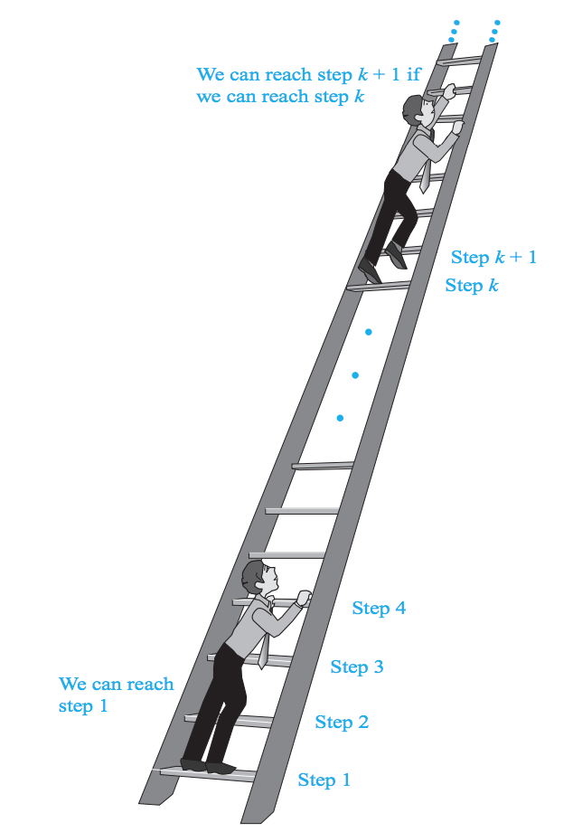

# Lecture 5

> Discrete Mathematics and Its Applications, Chapter 2.6, 5.1, 5.2, 5.3, 5.4, 8.1, 8.2

## Matrices

A *matrix* is a rectangular array of numbers.
A matrix with *m* rows and *n* columns is called a *m x n* matrix.

For example:

*[1  1 ]*
*|0  2 |*
*[1  3]*

is a *3 x 2* matrix.

The *i*th row of a matrix *A* is the *1 x n* matrix *[ai1, ai2, ..., ain]*.

The *(i, j)*th element (or *entry*) of a matrix ***A*** is the element *aij* which is the number in the *ith* row and on the *j*th column of A.

### Notation

A matrix is denoted by a bold uppercase letter such as ***A***.

### Matrix Arithmetic

#### Sum of two matrices

The *sum* of two matrices is denoted ***A** + **B***.
To calculate it, we have that *aij + bij* for each element.

In other words, we have that ***A** + **B** = [aij + bij]*.

In English, we get the sum by adding elements together in the corresponding positions.

So:

*[  1  0 -1  ]     [  3  4  -1  ]     [  4  4  -2  ]*
*|  2  2 -3  ]  +  |  1 -3   0  |  =  |  3 -1  -3  |*
*[  3  4  0  ]     [ -1  1   2  ]     [  2  5   2  ]*

#### Product of two matrices

We can only take the product of two matrices when **the number of columns in the first matrix equals the number of rows of the second matrix**.

**We get the product by multiplying each row of the first matrix with each column of the second matrix**.

We write it: ***AB***.

Specifically, for each element in the rows of matrix A, we multiply by the elements in the columns of matrix B and add them together.

So if we have:

[  2  -3  ]            [  10  -8  ]         [  (2 * 10 + -3 * 12)  (2 * -8 + -3 * -2)  ]
|         |     x      |          |    =    |                                          |
[  7   5  ]            [  12  -2  ]         [  (7 * 10 + 5 * 12)   (7 * -8 + 5 * -2)   ]

Becomes:

   [  -16  -10  ]
=  |            |
	 [  130  -66  ]

Here, we start with the first row *(2, -3)* of the first matrix. We multiply 2 with the first element of the first *column* of the second matrix which has *(10, 12)* and then we multiply *-3* by the second column of the second matrix. We add these two together. This will be the first element of the new summed matrix. And so on.

**Importantly, ***AB*** != **BA***. In other words, matrix multiplication is not *commutative*. It may not even be possible to go both ways.

#### The Identity Matrix

The *identity matrix* is the *n x n* matrix:

                     [  1  0  ...  0  ]
                     |  0  1  ...  0  |
**I**n  = |  .  .       .  |
										 [  0  0  ...  1  ]

What's cool about it is that you can **multiply an appropriately sized matrix by the identitity matrix without changing it!**

This is neat, because if you always apply the identity matrix to something, you can *always* multiply a matrix by another to "chain" matrices together.

#### Transposing a matrix

To *transpose* a matrix ***A***, we flip the rows and columns of it.
It is denoted ***A**t*.

The transpose of the matrix:

[  1  2  3  ]
[  4  5  6  ]

is the matrix

[  1  4  ]
[  2  5  ]
[  3  6  ]

Its pretty much just "rotating" the matrix 90 degrees and then flipping the elements in each row!

#### Symmetric matrices

These are ones where **A** = **At**.

This matrix:

[  1  1  0  ]
|  1  0  1  |
[  0  1  0  ]

Is symmetric. If you transpose it, it will be identical.

#### Zero-one Matrices

A zero-one matrix is one where each entry is either 0 or 1.

##### Joining zero-one matrices

Easy enough. If we have two *m x n* zero-one matrices, ***A*** and ***B***, the *join* is the zero-one matrix with *(i, j)th entry aij ∨ bij*.

In words, its just performing OR's on each element:

So:

A = [1  0  1]           B = [0  1  0]
    [0  1  0]               [1  1  0]

Let's join them:

A ∨ B =  [1 ∨ 0    0 ∨ 1    1 ∨ 0]    =  [1  1  1]
         [0 ∨ 1    1 ∨ 1    0 ∨ 0]       [1  1  0]

##### Meeting zero-one matrices

The *meet* is like join, but with *AND*:

A ∧ B =  [1 ∧ 0    0 ∧ 1    1 ∧ 0]    =  [0  0  0]
         [0 ∧ 1    1 ∧ 1    0 ∧ 0]       [0  1  0]

### Boolean product of two matrices

It is exactly like taking the product, but where we would add the elements, we *OR* them (*∨*), and where we would multiply, we *AND* them (*∧*).

It is denoted *A ⊙ B*.

## Induction and Recursion

### Induction

Induction is based on the principle, that if a statement holds for, lets say, a positive integer 1, then it must also hold for the next larger integer.

It is based on the rules of inference that tells us that if
*P(1)* and *∀k(P(k) → P(k + 1))* are true for the domain of positive integers, then *∀nP(n)* is true.

**In general, induction can be used to prove statements that assert that *P(n)* is true for all positive integers *n* where *P(n)* is a propositional function**.

#### The infinite ladder example

If we are to climb an infinite ladder, and we want to know whether we can reach every step on the ladder, how do we do that?

With induction, we can prove that we can if we know two things:

1. We can reach the first rung of the ladder.
2. If we can reach a particular rung of the ladder, then we can reach the next rung.

We can apply this rule recursively. Mathematically, it shows that *P(n)* is true for every positive integer *n*, where *P(n)* is the statement that we can reach the *n*th rung of the ladder.

### Steps of an Induction proof

It has two parts:

- A *basis step*: Here we show that *P(1)* is true.
- An *inductive step*: Here we show that for all positive integers *k*, if *P(k)* is true, then *P(k + 1)* is true.

#### The Inductive Hypothesis

This is the assumption that *P(k)* is true.

#### The inductive step

When we have shown that for example *P(1)* is true, now we must show that *P(k) → P(k + 1)* for every positive integer *k*.

Todo that, **we need to show that *p(k + 1) cannot be false when P(k) is true**.

**This can be accomplished by assuming that P(k) is true and showing that *under this hypothesis* P(k + 1) must also be true**.

#### 1st Example of induction

What you do in the inductive step is first stating your assumption that *P(k)* is true for an arbitrary nonnegative integer *k*.

Now, to carry out the inductive step, you basically take whatever proposition you have and add *k + 1* inside it on both sides and solving the equation.

For example:

By mathematical induction, show that:

*1 + 2 + 22 + ... + 2n = 2n + 1 - 1*.

Solution:

Let *P(n)* be the proposition that *1 + 2 + 22 + ... + 2n = 2n + 1 - 1* for the integer *n*.

**Basis step**: *P(0)* is true because *20 = 1 = 20 + 1 - 1*. This completes the basis step.

**Inductive step**: First, we **assume* that *P(k)* is true for an arbitrary nonnegative integer *k*.

To do with, we replace *n* with *k*:

*1 + 2 + 22 + ... + 2k = 2k + 1 - 1*.

Now, with this assumption, we must show that when we assume *P(k)* is true, then *P(k + 1)* is also true.

This is what we must show:

*1 + 2 + 22 + ... + 2k + 2k + 1 = 2(k + 1) + 1 - 1 = 2k + 2 - 1*.

Now, we can just reduce:

*1 + 2 + 22 + ... + 2k + 2k + 1 = 2(k + 1) + 1 - 1 = 2k + 2 - 1*

*= (2k + 1 - 1) + 2k + 1*
*= 2 * 2k + 1 -1*
*= 2k + 2 - 1*

This concludes the inductive step.

#### 2nd Example of induction

We must prove that

*n < 2n*

for all positive integers *n*.

Solution:

First, let *P(n)* be the proposition that *n < 2n*.

**Basis step**: *P(1)* is true, because *1 < 21 = 2*.

**Inductive step**:

We assume that *P(k)* is true for any positive integer *n*:

*k < 2k*.

And now, we show that if *P(K)* is true, then *P(k + 1)* is also true:

*k + 1 < 2k + 1*

Then we solve that equality.

### Guidelines for Proofs by Mathematical Induction

1. Express the statement that is to be proved in the form *for all n >= b, P(n)* for a fixed integer *b*.
2. Write out the words: "Basis Step", then show that *P(b)* is true, taking care that the correct value of *b* is used.
3. Write out the words "Inductive Step"
4. State, and clearly identify, the inductive hypothesis in the form "assume that *P(k)* is true for an arbitrary fixed integer *k >= b*".
5. State what needs to be proved under the assumption that the inductive hypothesis is true. That is, write what *P(k + 1)* says.
6. Prove the statement *P(k+1)* making use of the assumption *P(k)*. Be sure that your proof is valid for all integers *k* with *k >= b*, taking care that the proof works for small values of *k*, including *k = b*.
7. Clearly identify the conclusion of the inductive step, such as by saying "this completes the inductive step".
8. After completing the steps, state the conclusion, namely that by mathematical induction, *P(n)* is true for all integers *n* with *n >= b*.

## Strong Induction and Well-Ordering

Strong induction is another kind of mathematical induction.
It is often useful where mathematical induction cannot easily prove something.

**Because we can use all *k* statements (*P(1), P(2), ..., P(k)*) to prove *P(k + 1)* rather than just the statement *P(k)*, strong induction is a more flexible proof technique**.

**The basis step is the same as a proof of the same result with mathematical induction**.

But then, the inductive step is different!

### Inductive step in Strong Induction

Here, the step shows that if *P(j)* is true for all positive integers not exceeding *k*, then *P(k+1)* is true.

#### Inductive Hypothesis in Strong Induction

This will be to assume that *P(j) is true for j = 1, 2, ..., k*.

### Steps in Strong Induction

To prove that *P(n)* is true for all integers *n*, where *P(n)* is a propositional function, we complete two steps:

**Basis step**: We verify that the proposition *P(1)* is true.
**Inductive step**: We show that the conditional statement *[P(1) ∧ P(2) ∧ ··· ∧ P(k)] → P (k + 1) i* is true for all positive integers *k*.

### Strong Induction in the ladder example

Strong induction tells us that we can reach all rungs if

1. We can reach the first rung, and
2. For every integer *k*, if we can reach all the first *k* rungs, then we can reach the *(k + 1)*st rung.

### Proofs using the Well-Ordering property

The well-ordering property states that every nonempty set of nonnegative integers has a least element.

This is the property that makes mathematical induction and strong induction valid.

We can actually use the well-ordering property directly to prove stuff.

## Recursive Definitions and Structural Induction

Sometimes we define an object in terms of itself. This process is called *recursion*.

### Recursively defined functions

These have two steps:

- **Basis Step**: Specify the value of the function at zero
- **Recursive Step**: Give a rule for finding its value at an integer from its values at smaller integers.

For example:

*f(0) = 3*
*f(n + 1) = 2f(n) + 3*

Here, *f(0) = 3* is the basis step, and *f(n + 1) = 2f(n) + 3* is the recursive step.

Notice how the function signature in the recursive step says *n + 1*. This means that if we invoke the function with *1* as argument, when *2f(n)* appears later on, it invokes itself recursively with *0* as value.

## Rooted trees

A *rooted tree* consists of a set of vertices containing a distinguished vertex called the *root*, and edges **connection** these vertices.

Such a tree can be recursively defined by these steps:

**Basis step**: A single vertex *r* is a rooted tree.
**Recursive step**: Suppose that *T1, T2, ..., Tn* are disjoint rooted trees with roots *r1, r2, ..., r2n* respectively. Then the graph formed by starting with a root *r*, which is not in any of the rooted trees, and adding an edge from *r* to each of the vertices is also a rooted tree.

## Binary Trees

In the recursive definition of a binary tree, two binary trees are combined to form a new tree with one of these trees designated the left subtree and the other the right subtree.

## Structural Induction

Structural induction is somewhat more convenient when working with recursive sets.
It has two parts:

**Basis Step**: Show that the result holds for all elements specified in the basis step of the recursive definition to be in the set.

**Recursive step**: Show that if the statement is true for each of the elements used to construct new elements in the recursive step of the definition, the result holds for these new elements.

## Recursive definition of a sequence

A recursive definition of a sequence specifies one or more initial terms and a rule for determining subsequent terms from those that precede them.

This rule for determining subsequent terms from those that precede them is called a **recurrence relation**.

The generated sequence is called a *solution* to the recurrence relation.

## Linear Homogeneous recurrence relations

A *linear homogeneous recurrence relation of degree k with constant coefficients* is a reccurrence relation of the form:

*an = c1an - 1 + c2an - 2 + ... + ckan - k*, where *c1, c2, ..., ck* are real numbers, and *ck != 0*.

- It is *linear* because the right-hand side is a sum of previous terms of the sequence, each multiplied by a function of *n*.
- It is *homogenous* because no terms occur that are not multiples of the *aj*s.
- All coefficients of the terms of the sequence are all constants, rather than functions that depend on *n*.
- The *degree* is *k* because *an* is expressed in terms of theg previous *k* terms of the sequence.

### Solving Linear Recurrence Relations

The approach is to look for solutions of the form *an = rn* where *r* is a constant.