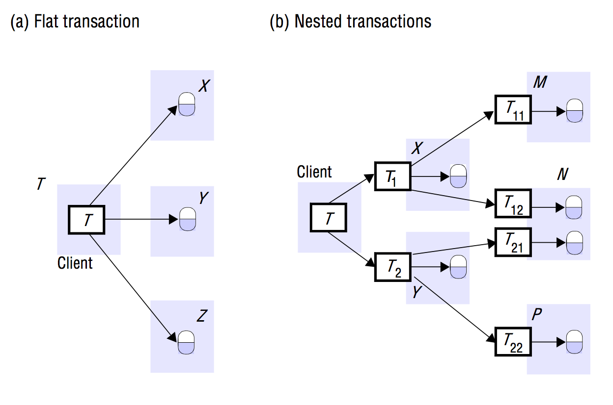
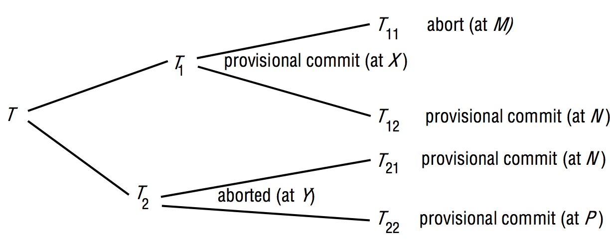
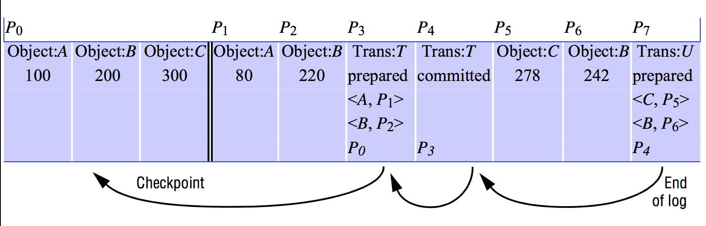

# Distributed Transactions
> Coulouris 17, excluding 17.3.2.

A distributed is a flat or nested transaction that accesses objects managed by multiple servers.

When a distributed transaction comes to an end, either all of the servers involved commit the transaction *or* all of them abort the transaction.

To do so, one of the servers take on a *coordinator* role, which involves ensuring the same outcome at all of the servers.

## Flat and nested distributed transactions
A Transaction becomes distributed if it invokes operations in several different servers.

### Flat transaction
In a *Flat* transaction, a client makes requests to **more than one server**.
It then completes each of its requests before going on to the next one. So it accesses server objects sequentially.

### Nested transaction
Here, the top-level transaction can open subtransactions. Those can then open further subtransactions down to any depth of nesting.
The advantage here is that subtransactions at the same level can run concurrently, effectively reaching parallel operation.



### Coordinator
Servers that execute requests as part of a distributed transaction needs to able to communicate with one another to coordinate their actions when the transaction commits.

A client sends a `openTransaction` request to a *Coordinator* in any server. It then carries out the `openTransaction` action and returns the GUID (Transaction Identifier, also called a TID) to the client. It must be unique within the distributed system, hence the name.

One way to do this is for the TID to contain two parts: The ID (for instance, the IP address) of the server that created it and a number that is unique to the server.

The Coordinator has the responsibility of finally committing or aborting the transaction.

### Participants
All of the servers involved in a distributed transaction is called *Participants*. They are responsible for keeping track of all the recoverable objects on their own server and that are involved in the Transaction. They communicate with the *Coordinator* in carrying out the commit protocol.

The *Coordinator* holds a list of references to *Participants* while each participant holds a reference to the *Coordinator*.

### Implementing Distributed Coordinators.
Imagine the following *DistributedCoordinator* interface:
```java
/**
 * Starts a new transaction and delivers a GUID. Will be used
 * in the other transaction-related methods.
 */
public TransactionID openTransaction();
/**
 * Ends a transaction. Returns a boolean indicating whether
 * or not the changes has been committed or aborted.
 */
public boolean closeTransaction(TransactionID trans);
/**
 * Aborts the given transaction.
 */
public void abortTransaction(TransactionID trans);

/**
 * Informs a coordinator that a new participant has joined the Transaction.
 */
public void join(TransactionID trans, Participant participant);
```

## Atomic commit protocols
Remember, Transactions has the property that when they come to an end, either *all* or *none* of their operations are carried out.

### One-phase atomic Commit Protocol
In distributed transactions, the *Coordinator* should communicate the commit or abort request to all of the participants in the transaction and keep on doing it until all of them have acknowledged that they have carried it out.

This is called a *One-phase atomic Commit Protocol*.

**It is inadequate!**
- It doesn't allow a server to make a decision to abort a transaction if the client has asked it to commit. That might be necessary:
	-	In case of a Deadlock.
	- If Optimistic Concurrency control is used on a given server, it may need to abort a transaction.
- The *Coordinator* may not know if a server has crashed and has been replaced during the progress of a distributed transaction.

### Two-phase Commit Protocol
Is designed to allow *any* participant to abort its part of a transaction. If one part of a transaction is aborted, the *whole* transaction **must** be aborted.

#### First phase
In the first phase, each participant *votes* for the transaction to be committed or aborted. Once a participant has voted to commit a transaction, it is not allowed to abort it.
So, before it votes to commit, it must ensure that it will eventually be able to carry out its part of the commit protocol, even if it fails and is replaced in the meantime.
When it is ready, we say that it is in a *prepared* state.

To make sure of this, each participant saves in permanent storage all of the objects it has altered in the transaction together with its status (prepared).

**If *any* Participant votes to abort, the transaction must be aborted**.

**If *all* Participants votes to commit, the transaction will be committed**.


#### Second phase
In the second phase, every participant carries out the joint decision.

#### Problems
The problem is to ensure that all participants vote and that they actually reach the same decision.

So, consensus cannot be reached in a distributed system, if *any* server fails.

#### Operations for Two-Phase commit protocol:
```java
class Participant {
	/**
	 * Call from Coordinator to participant to ask whether it
	 * can commit a transaction. Participant replies with its
	 * vote.
	 */
	public boolean canCommit(TransactionID trans);

	/**
	 * Call from Coordinator to Participant to tell Participant to commit its part of a Transaction.
	 */
	public void doCommit(TransactionID trans);

	/**
	 * Call from Coordinator to Participant to tell Participant to abort its part of a Transaction.
	 */
	public void doAbort(TransactionID trans);
}

class TwoPhaseCoordinator extends DistributedCoordinator {

	/**
	 * Call from Participant to Coordinator to confirm that it has committed the Transaction.
	 */
	public void haveCommitted(TransactionID trans, Participant participant);

	/**
	 * Call from Participant to Coordinator to ask for the decision on a Transaction when it has voted Yes but has still had no reply after some delay. Used to recover from server crash or delayed messages.
	 */
	public boolean getDecision(TransactionID);
}
```

#### Step-by-step instructions
*Phase 1 (voting phase)*:

	1. The `Coordinator` sends a `canCommit()` request to each of the `Participant`s in the `Transaction`.
	2. When a `Participant` receives a `canCommit` request, it determines whether or not it can do so. If it can, it saves in permanent storage whatever objects it has changed. It then sets it state to *prepared* and replies with the boolean value `true`. If it can't, it simply responds with `false` and aborts immediately.

*Phase 2 (completion according to outcome of vote)*
	3. The `Coordinator` collects votes (including its own).
		1. If there are no failures and *all* votes are `true`, the `Coordinator` decides to commit the `Transaction` and sends a `doCommit` request to each of the `Participant`s.
		2. Otherwise, the `Coordinator` decides to abort the `Transaction` and sends `doAbort` requests to all `Participant`s that voted `true`.
	4. Participants that voted `true` are waiting for a `doCommit` and `doAbort` request from the `Coordinator`. When a `Participant` receives one of these messages it acts accordingly and, in the case of commit, makes a `makeCommitted` call as confirmation to the `Coordinator`.

#### Timeout actions
To ensure that all *Participants* will eventually commit or about, you need to take care of the fact that it is easy to end up in a situation where a *Participant* waits for a reply from a *Coordinator* or the other way around. It is important to introduce timeouts and then either commit or abort.

#### Performance
If all goes well (nothing fails), a Transaction with *N* Participants can be completed with *N* `canCommit` messages and replies, followed by *N* `doCommit` messages. So, the cost in messages is proportional to *3N*, and the cost in time is three rounds of messages.

Considerable delays can happen when the *Coordinator* has failed and cannot reply to requests from *Participants*.

*Three-Phase commit protocols* has been designed to alleviate such delays, but they require more messages and has more rounds required for the normal failure-free case.

#### Two-Phase commit protocol for nested transactions

Each subtransaction starts after its parent and finishes before it.

When a subtransaction completes, it makes an independent decision either to *provisionally* commit or to abort.

A provisional commit is *not* the same as being prepared to commit. Nothing is backed up in permanent storage. So, if the server crashes, its replacement will not be able to commit.

When all subtransactions have completed, the provisionally committed ones participate in a Two-Phase commit protocol. Here, the *servers* which have provisionally committed subtransactions express their intention to commit and those with an aborted ancestor will abort.

**Being *prepared* to commit guarantees that a subtransaction will be able to commit.**

**A *provisional* commit only means that it has finished correctly and will *probably* agree to commit when it is subsequently asked to**

A client starts a set of nested transactions by opening a top-level transaction with an `openTransaction` operation which like always returns a unique transaction identifier for the top-level transaction. The client then starts a subtransaction by invoking the `openSubTransaction` operation, whose arguments specifies its parent transaction. The new one joins the parent transaction and a transaction identifier for the subtransaction is returned.

**The identifier for a subtransaction must be an extension of its parents Transaction Identifier (TID) in such a way that the TID of the parent can be determined from its own TID.**



**A parent transaction, including a top-level transaction can commit, even if one of its child subtransactions has aborted.**

### Hierarchic Two-Phase commit protocol
Here, it becomes a Multi-Level nested protocol.
The *Coordinator* of the top-level transaction communicates with the Coordinators of the subtransactions for which it is the immediate parent.

It sends `canCommit?` messages to each of them. They then pass the messages on to the coordinators of *their* child transactions. And so it goes on down the tree:

Each Participant collects the replies from its descendants before replying to its parent.

Here is the extension to the `DistributedCoordinator` interface, implemented as a java class:

```java
class HiearchicalDistributedCoordinator extends DistributedCoordinator {

	/**
	 * Call from Coordinator to Coordinator of child subtransaction to ask whether it can commit a subTransaction (subTrans). The first argument, trans, is the TID of the top-level transaction. Participant replies with its vote (true|false).
	 */
	public boolean canCommit (TransactionID trans, TransactionID subTrans);
}
```

### Comparison
The *hierarchic* protocol has the advantage that at each stage, the Participant only need to look for subtransactions of its immediate parent whereas the flat protocol needs to have the abort list in order to eliminate transactions whose parents have aborted.

## Concurrency control in distributed transactions
Each server is responsible for applying concurrency control to its own objects.
It is the members of a collection of servers of distributed transactions who are responsible for ensuring that they are performed in a serially equivalent manner.

This implies, that if Transaction *T* is before Transaction *U* in their conflicting access to objects at one of the servers, then they must be in that order at all of the servers whose objects are accessed in a conflicting manner by both *T* and *U*.

### Locking
Locks on an object are held locally (in the same server).
It is the local `LockManager` that decides whether to grant a lock or make the requesting transaction wait. It cannot release any locks until it knows that the transaction has been committed or aborted at all the servers involved in the transaction (apparently its' like Strict 2PL).

That also means that objects remain locked an unavailable for other Transactions during the atomic commit protocol, although an aborted transaction releases its locks after phase 1 of the protocol.

Due to the fact that servers may set locks independently of one another, it is possible that different servers has different orderings on transactions.

## Timestamp ordering Concurrency control
In a single server transaction, the `Coordinator` issues a unique timestamp to each Transaction when it starts.

In distributed transactions we require that each coordinator issue globally unique timestamps. A globally unique transaction timestamp is issued to the client by the first coordinator accessed by a transaction. The transaction timestamp is passed to the coordinator at each server whose objects perform an operation in the Transaction.

To achieve the same ordering at all servers, the coordinators must agree as to the ordering of their timestamps.

A `Timestamp` in Concurrency control consists of a `<local timestamp, server-id` pair.

Resolution of conflicts works like described in Section 16.6 of the book. If a transaction must be aborted, the `Coordinator` will be informed and it will abort the transaction at all the participants.

## Optimistic Concurrency control in distributed transactions
In Optimistic Concurrency control, each transaction is validated before it is allowed to commit.

In distributed Optimistic Transactions, each server applies a parallel validation protocol. This is an extension of either Backward or Forward validation to allow multiple transactions to be in the validation phase at the same time.
Here, **the *Write*-set of the transaction being validated must be checked for overlaps with the *Write*-set of earlier overlapping transactions.**

Here, transactions will not suffer from commit-deadlocks, *but* if servers perform independent validations, it *is* possible that different servers may serialize the same set of transactions in different orders. Servers of distributed transactions **must** prevent this from happening.

One way to solve it is by carrying out global validation after local validation has completed on each server. The global validation simply checks that the combination of orderings at the individual servers is serializable (that the transaction being validated is not involved in a cycle).

Another way is that all servers use the same globally unique transaction number at the start of the validation.

## Distributed deadlocks.
Just like you can construct *wait-for* graphs on a single server, you can construct a distributed *wait-for* graph that can detect cycles in distributed transactions.

Here, we can have a cycle in the global *wait-for* graph that is not in any single one, hence the *distributed deadlock* name.

Communication between servers are obviously required to build the graph.

A simple way to do so is by using centralized deadlock detection in which one server takes on the role of global deadlock detector. From time to time, each server sends the latest copy of *its* local wait-for graph to the global deadlock detector which then combines that with its own information to construct a global wait-for graph.

The deadlock detector makes a decision on how to resolve the deadlock and tells the servers which transaction to abort.

Centralized deadlock detection suffers from the same problems as other centralized systems. That is, poor availability, lack of fault tolerance and no ability to scale.

### Phantom deadlock
A deadlock that is detected but is not actually a deadlock.
In distributed systems, information about wait-for relationships must be transmitted from one server to another. In the time it takes for the information to arrive and for a global wait-for graph to be constructed, any cycle that might be detected may actually have been resolved in the meantime without the deadlock detector knowing it.

Phantom deadlocks cannot occur if one is using two-phase locks. The reason being that transactions cannot release objects and obtain more objects before the transaction has finished.

### Edge chasing (or *Path pushing*)
Another way to approach distributed deadlock detection.
Here, the global *wait-for* graph is not constructed, but each involved server has knowledge about some of its edges.

The servers attempt to find cycles by forwarding messages called *probes*, which follow the edges of the graph throughout the system.

A **probe message** consists of transaction wait-for relationships representing a path in the global wait-for graph.

The edge-chasing algorithms have three steps:
1. *Initiation*:
	-	When a server notes that a Transaction *T* starts waiting for another transaction *U*, where *U* is waiting to access an object at another server, it initiates detection by sending a probe containing the edge `<T -> U>` to the server of the object at which transaction *U* is blocked.
	- If *U* is sharing a lock, probes are sent to all of the holders of the lock.
	- Sometimes further transactions may start sharing the lock later on, in which case probes can be sent to them too.
2. *Detection*:
	-	Consists of receiving probes and deciding whether a deadlock has occurred and whether to forward the probes.
	- For example, when a server of an object receives a probe `<T -> U` (indicating that *T* is waiting for transaction *U* that holds a local object), it checks to see whether *U* is also waiting. If it is, the transaction it waits for is added to the probe, and if the new transaction is waiting for another object elsewhere, the probe is forwarded.
	- In this way, paths through the global *wait-for* graph are built one edge at a time.
	- Before forwarding a probe, the server checks to see whether the transaction it has just added has caused a probe to contain a cycle. If this is the case, a deadlock has been detected.
3. *Resolution*:
	-	When a cycle is detected, a transaction in the cycle is aborted to break the deadlock.

This algorithm will find any deadlock that occurs provided that waiting transactions do not abort and there are no failures such as lost messages or servers crashing.

## Transaction recovery
To make sure that a server can recover from a crash/server failure and actually store changed objects in permanent storage, a server can use a *Recover manager* which can:
- Save objects in permanent storage for committed transactions.
- Restore the server's objects after a crash.
- Reorganize the recovery file to improve the performance of recovery.
- Reclaim storage space.

Corruption during  crash can lead to failures a recovery file, though. So how do make sure that we can recover from any failure, even corruption of data? We need another copy of the recovery file (redundancy). This depends on how much of a priority data integrity is in a specific project I'd say :-).

### Intentions list
Contains a list of references to transactions and the values of all the objects that are altered by that transaction.

- When a transaction is committed, the *Intentions* list is used to identify the objects it affected. The new value is the written to the server's recovery file.
- When a transaction aborts, the server uses the *Intentions* list to delete all the tentative version of objects made by that transaction.

At the point when a *Participant* says it is prepared to commit a Transaction, its `RecoveryManager` must have saved both its intentions list for that Transaction *and* the objects in that Intentions list in its recovery file so that it will be able to carry out the commitments later, even if it crashes in the meantime.

### Types of entries in a recovery file:
<table>
	<tr>
		<td><strong>Type of entry</strong></td>
		<td><strong>Description of contents</strong></td>
	</tr>
	<tr>
		<td>Object</td>
		<td>A value of an object</td>
	</tr>
	<tr>
		<td>Transaction status</td>
		<td>TID, Transaction status ("prepared"|"committed"|"aborted") and other status values used for the Two-phase commit protocol.</td>
	</tr>
	<tr>
		<td>Intentions list</td>
		<td>TID and a sequence of intentions, each of which consists of <code><objectID, P<sub>1</sub></code> where P<sub>1</sub> is the position in the recovery file of the value of the object.</td>
	</tr>
</table>

## Logging
In the logging technique, a recovery file represents a log containing the history of all the transactions performed by a server.

The history consists of values of objects, transaction status entries and transaction intention lists.

The order of entries in the log reflects the order in which transactions have prepared, committed and aborted **at that server**.

It is basically a snapshot of the values of all objects in the server followed by a history of transactions postdating the snapshot.



### Recovery after failure
When a server is replaced after a crash, it first sets default initial values for its objects and then hands over to its recovery manager. That one is responsible for restoring the server's objects so that they include all the effects of the committed transactions performed in the correct order and none of the effects of incomplete or aborted transactions.
