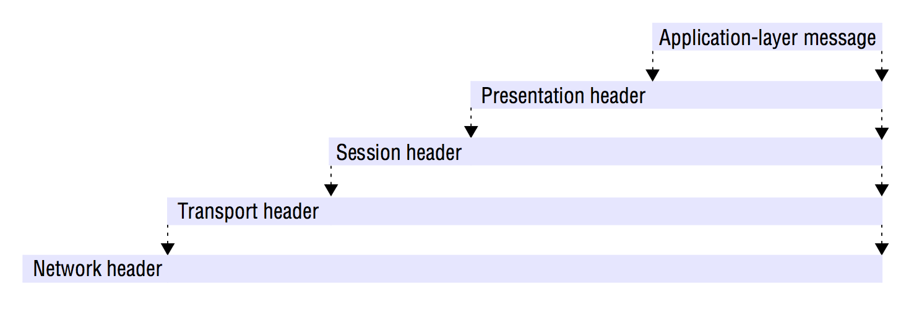
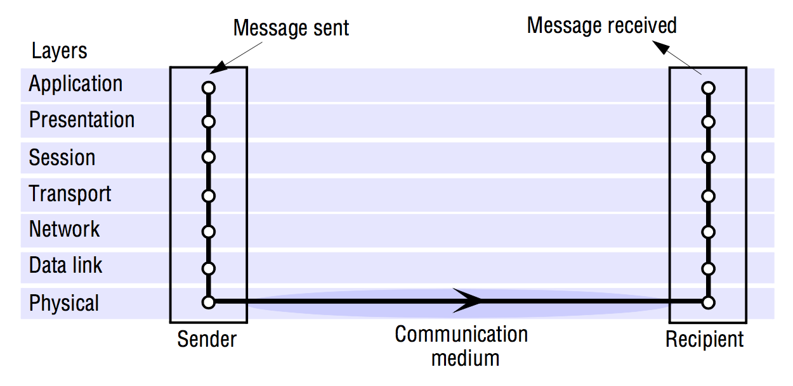
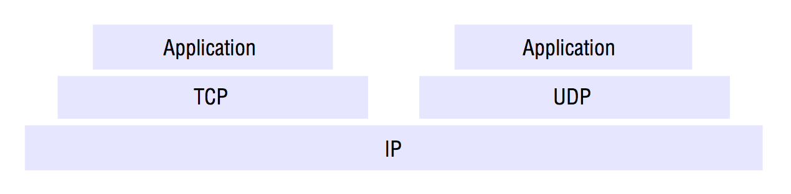
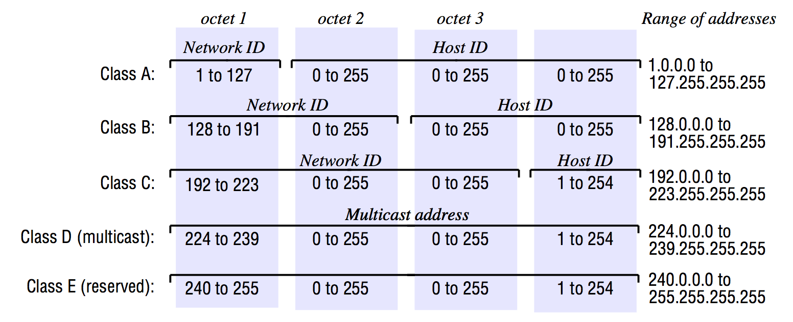
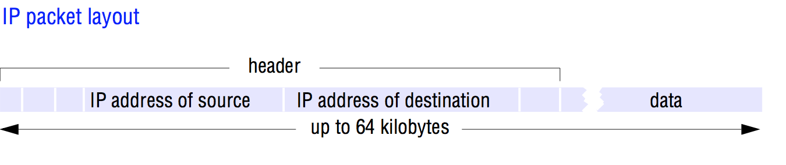
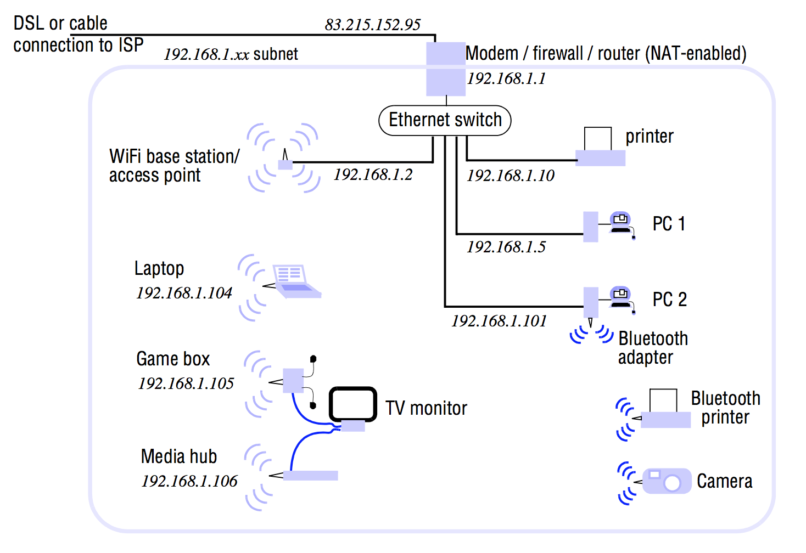
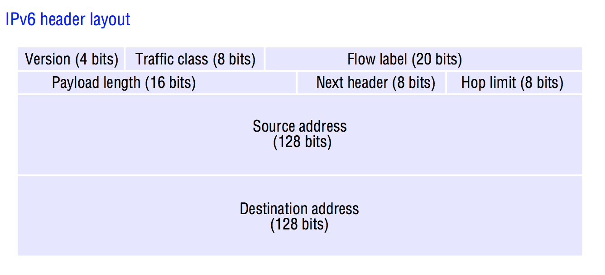
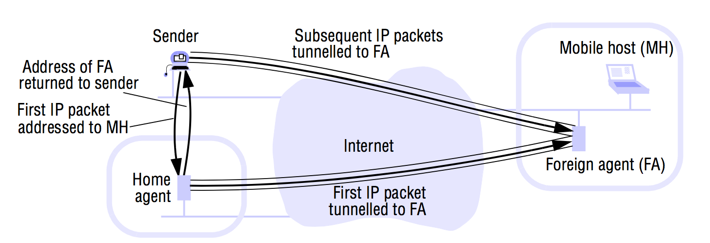

# Networking (TCP/IP)
>  Coulouris 3.1-3.4, 4.1-4.3, 4.5, 7.4

### Principles
The principles on which computer networks are based include protocol layering, packet switching, routing and data streaming.

Computers and other devices that use the network for communication purposes are referred to as *hosts*. The term *node* is used to refer to any computer or switching device attached to a network.

A *subnet* is a unit of routing (delivering data from one part of the network to another). It is a collection of nodes that can all be reached on the same physical network.

The internet's infrastructure includes an architecture and hardware and software components that effectively integrate diverse subnets into a single data communication service.

### Network issues in distributed systems
#### Performance
Issues regarding how fast individual messages can be transferred between two interconnected computers.

-	*Latency* is the delay that occurs after a send operation is executed and before data **starts** to arrive at the destination device. **It can be measured as the time required to transfer an empty message.** (only considering network latency).
- *Data transfer rate* is the speed at which data can be transferred between two computers in the network once transmission has begun, usually quoted in bits per second.

**The time required for a network to transfer a message containing *length* bits between two devices is:**
`Message transmission time = latency + length / data transfer rate`

Obviously, this is only true as long as the *length* of the message doesn't exceed the maximum determined by the underlying network technology. In that case, longer messages must be segmented and transmission time will take longer (due to the added latency overhead).

### What determines latency & data transfer rate (+ perceived perf)
- Data transfer rate of a network is determined primarily by its physical characteristics.
- Latency is determined primarily by software overheads, routing delays and a load-dependent statistical element arising from conflicting demands for access to transmission channels.

The perceived transfer rate of a network is greatly influenced by latency. The reason being that most of the things we do over the network usually consists of a lot of small message passing back and forth. The packet size doesn't affect latency. Latency is therefore of greater significance than transfer rate in determining average performance.

### Total system bandwidth
The *total system bandwidth* of a network is a measure of throughput. That is the total volume of traffic that can be transferred across the network in a given time.

In some LAN-technologies such as Ethernet, the full transmission capacity of the network is used for *every* transmission. In these cases, **the system bandwidth is the same as the data transfer rate**.

But, in most WANs (Wide Area Networks), messages can be transferred on several different channels simultaneously. Here, the total system bandwidth bears no direct relationship to the transfer rate. For instance, the performance of networks greatly deteriorates in conditions of overload (when there are too many messages in the network at the same time).

The precise effect of overload on the latency, data transfer rate and total system bandwidth of a network depends strongly on the network technology.

## Types of networks
This table seems pretty outdated, but I've made a few changes to it.
<table>
	<tr>
		<td>Name</td>
		<td>Wireless</td>
		<td>Example</td>
		<td>Range</td>
		<td>Bandwidth</td>
		<td>Latency</td>
	</tr>
	<tr>
		<td>LAN</td>
		<td>No</td>
		<td>Ethernet</td>
		<td>1-2 kms</td>
		<td>High</td>
		<td>Low</td>
	</tr>
	<tr>
		<td>WAN</td>
		<td>No</td>
		<td>IP Routing</td>
		<td>worldwide</td>
		<td>-</td>
		<td>-</td>
	</tr>
	<tr>
		<td>MAN</td>
		<td>No</td>
		<td>ATM</td>
		<td>2-50 kms</td>
		<td>-</td>
		<td>Low</td>
	</tr>
	<tr>
		<td>WPAN</td>
		<td>Yes</td>
		<td>Bluetooth (IEEE 802.15.1)</td>
		<td>10-30m</td>
		<td>Low</td>
		<td>Low</td>
	</tr>
	<tr>
		<td>WLAN</td>
		<td>Yes</td>
		<td>WiFi (IEEE 802.11)</td>
		<td>0.15 - 1.5 km</td>
		<td>-</td>
		<td>Low</td>
	</tr>
	<tr>
		<td>WiMAX</td>
		<td>Yes</td>
		<td>WiFi (IEEE 806.16)</td>
		<td>5 - 50 km</td>
		<td>-</td>
		<td>Low</td>
	</tr>
	<tr>
		<td>WWAN</td>
		<td>Yes</td>
		<td>3G</td>
		<td>1 - 5 km</td>
		<td>-</td>
		<td>High</td>
	</tr>
</table>

### Personal Area Networks (PANs)
A subcategory of local networks in which the various digital devices carried by a user are connected by a low-cost, low-energy network.

They are not of much significance because few users wish to be encumbered by a network of wires on their person. Instead, Wireless Personal Area Networks (WPANs) are of increasing importance due to the number of personal devices such as smartphones, tablets, smartwatches, etc. carried by many people.

### Local Area Networks (LANs)
LANs carry messages at relatively high speeds between computers connected by a single communication medium (for instance twisted copper wire, coaxial cable or optical fibre). A *segment* is a section of cable that serves a department or a floor of a building and may have many computers attached.

No routing of messages is required within a segment since the medium provides **direct connections between all of the computers connected to it.**

Larger local networks, such as those that serve a campus or an office building, are composed of many *segments* interconnected by switches or hubs.

In LANs, total system bandwidth is high and latency is low, except when message traffic is very high.

Ethernet has emerged as the dominant technology for wired LANs. However, Ethernet lacks the latency and bandwidth guarantees needed by many multimedia applications. ATM networks were developed to fill this gap, but their cost has inhibited their adoption in LAN applications.

Instead, High-speed Ethernets have been deployed in a switched mode that overcomes these drawbacks to a significant degree, although not as effectively as ATM.

### Wide area Networks (WANs)
WANs carry messages at lower speeds between nodes that are often in different organizations and may be separated by large distances (e.g. different cities, countries or continents). They communicate through a set of routers (communication circuits linking a set of dedicated computers).

### Metropolitan Area Networks (MANs)
Is based on high-bandwidth copper and fibre optic cabling. Allows for transmission of video, voice and other data over distances up to 50 kilometers.

DSL (Digital Subscriber Line) and cable modem connections are examples of MANs. DSL typically uses ATM switches located in telephone exchanges to route digital data onto twisted pairs of copper wire (using high-frequency signaling on the existing wiring used for telephone connections.)

### Wireless Local Area Networks (WLANs)
WLANs are designed for use in place of wired LANs to provide connectivity for mobile devices (or simply to remove the need for a wired infrastructure).

### Wireless Metropolitan Area Networks (WMANs)
An example of such a network is the IEEE 802.16 WiMAX standard. It aims to provide an alternative to wired connections to home and office buildings and to supersede 802.11 WiFi networks in some applications.

### Wireless Wide Area Networks (WWANs)
Most mobile phone networks are based on digital wireless network technologies such as the GSM (Global System for Mobile communication) standard. The underlying technology is referred to as UMTS (Universal Mobile Telecommunications System).

### Internetworks
A communication subsystem in which several networks are linked together to provide common data communication facilities that overlay the technologies and protocols of the individual component networks and the methods used for their interconnection. In Internetworks,
a variety of local and wide area network technologies can be integrated to provide the networking capacity needed by each group of users. It can be thought of as a *virtual network* constructed by overlaying an internetwork layer on a communication medium that consists of the underlying networks, routers and gateways.

The Internet is an example of an Internetwork, and the TCP/IP protocols are an example of this integration layer.

### Network errors
Reliability of the underlying data transmission is really high in all cabled networks, but not necessarily so in wireless networks where packets are frequently lost due to external inference.

However, packets may be lost in *all* types of network due to processing delays and buffer overflow at switches and at the destination node (which is by far the most common cause of packet loss).

## Network principles
The basis for all computer networks is a packet-switching technique. This enables data packets addressed to different destinations to share a single communications link, unlike the circuit-switching technology that underlies conventional telephony.

Packets are queued in a buffer and transmitted when the link is available.

**Communication is asynchronous**: Messages arrive at their destination after a delay that varies depending upon the time that packets take to travel through the network.

### Packet transmission
*Messages* to be transmitted is data items of arbitrary length. **Before a message is transmitted, it is subdivided into *packets*.**

A packet is a sequence of binary data (an array of bits or bytes) of restricted length, together with addressing information sufficient to identify the source and destination computers. These packets are used:
- So that each computer in the network can allocate sufficient buffer storage to hold the largest possible incoming packet.
- To avoid the undue delays that would occur in waiting for communication channels to become free if long messages were transmitted without subdivision.

### Switching schemes
Switching systems are required to transmit information between nodes. Four popular kinds are:

- **Broadcast**: Broadcasting is a transmission technique **that involves no switching**. Everything is transmitted to every node, and it is up to receivers to notice transmissions addressed to them. **Ethernet, a LAN technology, are based on broadcasting**. So is Wireless networking to some extend, but in the absence of fixed circuits, the broadcasts are arranged to reach nodes grouped in cells.

- **Circuit switching**: Old-school analog telephone networks work like this: A caller dials a number, the pair of wires from the phone to the local exchange is then connected by an automatic switch at the exchange to the pair of wires connected to the recipients phone.

This is also called **The plain old telephone system (POTS)**. That's typically a *circuit-switching network*.

- **Packet switching**: A *store-and-forward* network is one where instead of making and breaking connections to build circuits, the packets are just forwarded from their source to their destination. There is a computer at each switching node. Each packet arriving at a node is first stored in memory at the node and then processed by a program that transmits it on an outgoing circuit which transfers the packet to another node that is closer to its ultimate destination.

This is just like the postal system works, except this concept has found a digital implementation in the way of packet switching.

- **Frame relay**: In a *store-and-forward* network as described in *Packet switching*, switching packets through each network node takes some time (usually a maximum of a few milliseconds). However, since the internet is build on *store-and-forward*, packets may need to travel hundreds of kilometers. It is not unusual for this to take upwards of 200 milliseconds.
The *Frame relay* switching method overcome the delay problems by switching small packets on the fly. The actual switching nodes (which are usually special-purpose parallel digital processors) route frames based on the examination of their first few bits. Frames as a whole are not stored at nodes but pass through them at short streams of bits.

ATM networks are a prime example: high-speed ATM networks can transmit packets across networks consisting of many nodes in a few tens of microseconds. Impressive!

### Protocols
A protocol is a well-known set of rules and formats to be used for communication between processes in order to perform a given task.

The definition of a protocol has two important parts to it:
- A specification of the sequence of messages that must be exchanged.
- A specification of the format of the data in the messages.

For example, a *transport protocol* transmits messages of any length from a sending process to a receiving process. To send a message, a process issues a call to a transport protocol module, passing it a message in the specified format. It is then the transport software that does the hard work of subdividing the message into packets, formatting it and transmitting it to the destination via the *network protocol*, another even lower-level protocol.

The receiving end then performs inverse transformations to regenerate the message before passing it to a receiving process.

### Protocol layers
**Network software is arranged in a hierarchy of layers.** Each layer presents an interface to the layers above it that extends the properties of the underlying communication system.

A layer is represented by a module in every computer connected to the network.
Each module appears to communicate directly with a module at the same level in another computer in the network, but in reality, data is not transmitted directly between the protocol modules at each level. Instead, each layer of network software communicates by local procedure calls with the layers above and below it.

Each layer provides a service to the layer above it and extends the service provided by the layer below it.

#### Physical layer
The communication medium, be it copper, fibre optic cables, satellite communication, radio transmission, etc and by analogue signaling circuits that place signals on the communication medium at the sending node and sense them at the receiving node.

At receiving nodes, data items are received and passed upwards through the hierarchy of software modules, being transformed at each stage until they are in a form that can be passed to the intended recipient process.

#### Protocol suites
A complete set of protocol layers is referred to as a *protocol suite* or a *protocol stack*.

#### OSI protocol
The Open Systems Interconnection (OSI) reference model for protocol stacks/suites is a foundation for a developing protocol standards that will meet the requirements of open systems. It defines seven layers:

<table>
	<caption>OSI protocol summary</caption>
	<tr>
		<td><strong>Layer</strong></td>
		<td><strong>Description</strong></td>
		<td><strong>Examples</strong></td>
	</tr>
	<tr>
		<td>Application</td>
		<td>Protocols at this level are designed to meet the communication requirements of specific applications, often defining the interface to a service.</td>
		<td>HTTP, FTP, SMTP, CORBA, IIOP</td>
	</tr>
	<tr>
		<td>Presentation</td>
		<td>Protocols at this level transmit data in a network representation that is independent of the representations used in individual computers, which may differ. Encryption is also performed in this layer, if required.</td>
		<td>TLS security, CORBA data representation</td>
	</tr>
	<tr>
		<td>Session</td>
		<td>At this level, reliability and adaption measures are performed, such as detection of failures and automatic recovery</td>
		<td>SIP</td>
	</tr>
	<tr>
		<td>Transport</td>
		<td>This is the lowest level at which messages (rather than packets) are handled. Messages are addressed to communication ports attached to processes. Protocols in this layer may be connection-oriented or connectionless.</td>
		<td>TCP, UDP</td>
	</tr>
	<tr>
		<td>Network</td>
		<td>Transfers data packets between computers in a specific network. In a WAN or an Internetwork, this involves the generation of a route passing through routers. In a single LAN, no routing is required.</td>
		<td>IP, ATM virtual circuits.</td>
	</tr>
	<tr>
		<td>Data link</td>
		<td>Responsible for transmission of packets between nodes that are directly connected by a physical link. In a WAN, transmission is between pairs of routers or between routers and hosts. In a LAN, it is between any pair of hosts.</td>
		<td>Ethernet MAC, ATM cell transfer, PPP</td>
	</tr>
	<tr>
		<td>Physical</td>
		<td>The circuits and hardware that drive the network. It transmits sequences of binary data by analogue signaling, using amplitude or frequency modulation of electrical signals (or cable circuits), light signals (on fibre optic circuits) or other electromagnetic signals (on radio and microwave circuits)</td>
		<td>ISDN</td>
	</tr>
</table>

#### Performance cost of protocol layering
The transmission of an application-level message via a protocol stack with *N* layers typically involves *N* transfers of control to the relevant layer of software in the protocol suite and taking *N* copies of the data as a part of the encapsulation mechanism. All of these overheads result in data transfer rates between application processes that are much lower than the available network bandwidth.

#### Packet assembly
It is usually the transport layer that divides and reassembles packages from and back into messages.

The network-layer protocol packets consist of a *header* and a *data field*. The data field is usually variable in length. The maximum length is called the *maximum transfer unit (MTU)*. If the length of a message exceeds the MTU of the underlying network layer, it must be fragmented into chunks of the appropriate size, with sequence numbers for use on reassembly, and transmitted in multiple packets.

**An example of a MTU is for Ethernet where it is 1500 bytes.**

#### Ports
The transport layer's task is to provide a network-independent message transport service between pairs of network ports. Ports are software-defined destination points at a host computer. They are attached to processes, enabling data transmission to be addressed to a specific process at a destination node.

#### Addressing
The transport layer is responsible for delivering messages to destinations with *transport addresses* that are composed of the *network address* of a host computer and a *port number*.

- A Network address is a numeric identifier that uniquely identifies a host computer and enables it to be located by nodes that are responsible for routing data to it. In the internet, every host computer is assigned an IP number which identifies it and the subnet to which it is connected as well as enabling data to be routed to it from any other node.

- Services such as HTTP and FTP have been allocated *contact port numbers* which are registered with a central authority.

- Port numbers below 1023 are defined as *well-known ports* whose use is restricted to privileged processes in most operating systems.

#### Packet delivery
Two approaches:

##### *Datagram packet delivery*

Delivery of each packet is a 'one-shot' process: No setup is required. Once the packet is delivered, the network retains no information about it. In a datagram network, a sequence of packets transmitted by a single host to a single destination may follow different routes.

Every datagram packet contains the full network address of the source and destination hosts.

The Internet's network layer (IP), Ethernet and most wired and wireless LAN technologies are based on datagram delivery.

##### *Virtual circuit packet delivery*

Some network-level services implement packet transmission in a manner analogous to a telephone network.

A virtual circuit is set up before packets can pass from A to B. At each node along the route, a table entry is made, indicating which link should be used for the next stage of the route.

**Each network-layer packet contains only a virtual circuit number in place of the source and destination addresses. The addresses are not needed, because packets are routed at intermediate nodes by reference to the virtual circuit number. When a packet reaches its destination, the source can be determined from the virtual circuit number.**

### Routing
Is a function that is required in all networks except those LANs such as Ethernets that provide **direct connections between all pairs of attached hosts**.

#### Adaptive routing
In large networks, *adaptive* routing is employed: The best route for communication between two points in the network is re-evaluated periodically, taking into account the current traffic in the network and any faults such as broken connections or routers.

#### Routing algorithm

Unless the source and destination hosts are on the same LAN, the packet has to be transmitted in a series of hops, passing through router nodes.

It is the responsibility of a *routing algorithm* implemented by a program in the network layer at each node to determine the best routes for the transmission of packets to their destinations.

Such an algorithm must:
1. Make decisions that determine the route taken by each packet as it travels through the network. In packet-switched network layers such as IP, it is determined separately for each packet.
2. It must dynamically update its knowledge of the network based on traffic monitoring and the detection of configuration changes or failures.

These decisions are made on a hop-by-hop basis.

#### A simple routing algorithm: Distance vector algorithm

Routing in networks is an instance of the problem of path finding in graphs. The **shortest path algorithm provides the basis for the distance vector method**.

- Routing tables is held at each of the routers for the network.
- Each row provides:
	-	A *link* field that specifies the outgoing link for packets addressed to the destination.
	- A *cost* field which is a calculation of the vector distance (the number of hops to the given destination)
	- The destination node.
- A single entry exists for each possible destination.
- When a packet arrives at a router, the destination address is extracted and looked up in the local routing table.
- How routing tables are maintained:
	-	Because each routing table specifies only a single hop for each route, the construction or repair of the routing information can proceed in a distributed fashion.
	- A router exchanges information about the network with its neighboring nodes by sending a summary of its routing table using a *Router information protocol (RIP)*.
	- RIP actions are:
		- *Periodically and whenever the local routing table changes*, send the table to all accessible neighbors.
		- *When a table is received from a neighboring router*, if the received table shows a route to a new destination or a better route to an existing destination, update the local table with the new route. If the table was received on link *n*, replace the cost in the local table with the new cost.

### Congestion control
When the load at any particular link or node approaches its capacity, queues will build up at hosts trying to send packets and at intermediate nodes holding packets whose onward transmission is blocked by other traffic. If the queues keep on growing, they will eventually reach the limit of available buffer space.

At this point, the node has no other option but to drop further incoming packets.

**Instead of allowing packets to travel through the network until they reach over-congested nodes where they will have to be dropped, it would be better to hold them at earlier nodes until the congestion is reduced**.

This will result in increased delays for packets but will not significantly degrade the total throughput of the network.

*Congestion control* is the a name given to techniques for achieving this.

Congestion control is achieved by informing nodes along a route that congestion has occurred and that their rate of packet transmission should therefore be reduced.

**All datagram-based network layers such as IP and Ethernets rely on end-to-end control of the traffic. That is, the sending node must reduce the rate at which it transmits packets based *only* on information that it receives from the receiver.**

Something called *choke packets* can be supplied to the sending node by explicit transmission, requesting a reduction in transmission rate.

### Internetworking
To build an integrated network (an internetwork), we must integrate many subnets, each of which is based on one of the network technologies.
We need:

1. A unified internetwork addressing scheme that enables packets to be addressed to any host connected to any subnet.

2. A protocol defining the format of internetwork packets and giving rules according to which they are handled.

3. Interconnecting components that route packets to their destinations in terms of internetwork addresses, transmitting the packets using subnets with a variety of network technologies.

Lets see how to internet achieves this:

- (1) (a unified addressing scheme) is provided by IP addresses.
- (2) (A protocol defining the format of packets and their handling) is the IP protocol.
- (3) (how to route packets) is performed by *internet routers*.

#### Ethernet hubs
Ethernet hubs are simply means of connecting together several segments of Ethernet cable, all of which forms a single Ethernet at the network protocol level.

#### Ethernet switches
Connects several Ethernets, routing the incoming packets only to the Ethernet to which the destination host is connected.

#### Routers
As stated, routing is required in all networks except for Ethernets and Wireless networks in which all hosts are connected by a single transmission medium. Routers are responsible for forwarding the Internetwork packets that arrive on any connection to the correct outgoing connection. They maintain routing tables for that purpose.

#### Bridges
Bridges link networks of different types. Some bridges link several networks, and these are referred to as bridge/routers because they also perform routing functions.

#### Hubs
Simply a convenient way of connecting hosts and extending segments of Ethernet and other Broadcast LAN technologies. They have a number of sockets to each of which a host computer can be connected.

#### Switches
Perform a similar function to routers, but for LAN's (typically Ethernet) only. They interconnect several separate Ethernets, routing the incoming packets to the appropriate outgoing network.

#### Advantages of switches over hubs.
Switches separate the incoming traffic and transmit it only on the relevant outgoing network, reducing congestion on the other networks to which they are connected.

#### Tunneling
A pair of nodes connected to separate networks **of the same type** can communicate through another type of network by constructing a protocol 'tunnel'. It is a software layer that transmits packets through an alien network environment.

Tunneling is used to support the migration of the internet to the IPv6 protocol. Where necessary, IPv6 packets are encapsulated in IPv4 and transported over the intervening IPv4 networks in that manner.

## Internet Protocols
Two important things:
- **TCP**: Transmission Control Protocol
- **IP**: Internet Protocol

Usually mentioned together: TCP/IP as a single protocol suite.

Examples of application services and application-level protocols based on TCP/IP are the Web (HTTP), email (SMTP, POP), file transfer (FTP) and Telnet (telnet).

**TCP is a transport protocol.**. It can either be used to support applications directly, or additional protocols can be layered on it to provide additional features.

HTTP is usually transported by the *direct* use of TCP, but when end-to-end security is required, the Transport Layer Security (TLS) protocol is layered on top of TCP to produce secure channels and HTTP messages are transmitted via the secure channels.

### Transport protocols on the internet
There are two:
- TCP (Transport Control Protocol)
- UDP (User Datagram Protocol)

#### TCP
TCP is a reliable connection-oriented protocol.

#### UDP
UDP is a datagram protocol that does not guarantee reliable transmission.

### IP addressing
The scheme used for assigning host addresses to networks and the computers connected to them had to satisfy the following requirements:
- It must be *universal* - any host must be able to send packets to any other host in the Internet.
- It must be efficient in its use of the address space. It is impossible to predict the ultimate size of the Internet and the number of network and host addresses likely to be required. The address space must be carefully partitioned to ensure that addresses will not run out.

When the TCP/UP protocols were being developed, provision for approximately 4 billion addressable hosts was considered adequate.

However, the rate of growth of the Internet has far outstripped all predictions. Also, the address space has been allocated and used much less efficiently than expected.

**An IP-address is a 32-bit numeric identifier containing a network identifier, which uniquely identifies on of the subnetworks in the Internet, and a host identifier, which uniquely identifies the host's connection to that network.**

These Internet addresses, containing a network identifier and a host identifier, are usually written as a sequence of four numbers separated by dots. Each decimal number represents one of the four bytes (or *octets*) of the IP address.

#### Classes of Internet address
There are four allocated classes: A, B, C and D and a reserved one: E.

- Class A addresses, with a capacity of 224 hosts on each subnet are reserved for very large networks like national wide area networks.
- Class B addresses are allocated to organizations that operate networks likely to contain more than 255 computers.
- Class C addresses are allocated to all other network operators.
- Class D is reserved for Internet multicast communication, which is implemented in only some Internet routers.
- Class E contains a range of unallocated addresses which are reserved for future requirements.

#### Special IP addresses
Internet addresses with host identifiers 0 and all 1s (binary) are used for special purposes.

- Addresses with the host identifier set to 0 are used to refer to 'this host'.
- A host identifier that is all 1s is used to address a broadcast message to *all* of the hosts connected to the network specified in the network identifier part of the address.

#### Computers connected to several networks
Host addresses include a network identifier. Thus, any computer that is connected to more than one network must have separate addresses on each. Thus, whenever a computer is moved to a different network, the Internet address much change.

#### Running out of IP addresses
It was beginning to become evident that we were likely to run out of IP addresses around 1996. Problem was, no-one really knew how many IP addresses they needed and was simply allocated way too many.

We did three things:
- Began development of a new protocol and addressing scheme, IPv6.
- Radically modified the way in which IP addresses were allocated. The new allocation and routing scheme was called **classless interdomain routing (CIDR)**.
- Enabled unregistered computers to access the Internet indirectly through routers that implement a *Network Address Translation (NAT)* scheme.

## The IP protocol
The IP protocol transmits datagrams from one host to another, if necessary via intermediate routers.

IP provides a delivery service that is described as offering *unreliable* or *best-effort* delivery semantics, because there is no guarantee of delivery.

Packets can be lost, duplicated, delayed or delivered out of order.

**The only checksum in IP is a header checksum which ensures that any corruptions in the addressing and packet management data will be detected.**

There is no data checksum, leaving the higher-level protocols (TCP and UDP) to provide their own checksums.

The IP layer puts IP datagrams into network packets suitable for transmission in the underlying network.

When an IP datagram is longer than the MTU, it is broken into smaller packets at the source and reassembled at its final destination.

### Address resolution (Address Resolution Protocol (ARP))
It is the address resolution module that converts Internet addresses to network addresses for a specific underlying network.

For example, if the underlying network is an Ethernet, the address resolution module converts 32-bit Internet addresses to 48-bit Ethernet addresses.

Some hosts are connected directly to Internet packet switches. IP packets can be routed to them without address translation.

For Ethernets and some other LANs, net network address of each computer is hard-wired into its network interface hardware and bears no direct relation to its Internet address. Translation then depends upon knowledge of the correspondence between IP addresses and addresses for the hosts on the local network and is done using **an address resolution protocol (ARP)**.

### IP spoofing
IP addresses include a source address - the IP-address of the sending computer. This, together with a port address encapsulated in the data field (for UDP and TCP packets) is often used by servers to generate a return address.

**Unfortunately, it is not possible to guarantee that the source address given is in fact the address of the sender.**

A malicious sender can easily substitute an address that is different from its own. That is called IP spoofing.

### IP routing
Each router in the Internet implements IP-layer software to provide a routing algorithm.

- The first routing protocol of the Internet was RIP-1, based on the distance-vector algorithm.
- Then came RIP-2, which could handle classless interdomain routing, better multicast routing and authentication of RIP packets to prevent attacks.
- As the scale of the Internet has expanded, there has been a move towards link-state class of algorithms and the algorithm called *open shortest path first* which is based on a path-finding algorithm based on Dijkstra and has been shown to converge more rapidly than the RIP algorithm.

### Default routes
- Addresses 194.0.0.0 to 195.255.255.255 are in Europe.
- Addresses 198.0.0.0 to 199.255.255.255 are in North America.
- Addresses 200.0.0.0 to 201.255.255.255 are in Central and South America
- Addresses 202.0.0.0 to 203.255.255.255 are in Asia and the Pacific.

Note that once, IP addresses were allocated largely without regard to topology or geography, so there will be IP addresses that doesn't fit into the mentioned geographical regions.

### Routing on a local subnet
Packets addressed to hosts on the same network as the sender are transmitted to the destination host **in a single hop**.

### Classless interdomain routing (CIDR)
CIDR allocates a batch of contiguous Class C addresses to a subnet requiring more than 255 addresses. It also makes it possible to subdivide a Class B address space for allocation to multiple subnets.

### Unregistered addresses and Network Address Translation (NAT)
Not all devices connected to the internet need to be assigned a globally unique IP address. Computers that are attached to a local network and access the internet through a NAT-enabled router can rely upon the router to redirect incoming UDP and TCP packets for them.

Here, the network has been allocated a single registered IP address, for instance 83.215.152.95 by its ISP.

All of the internet-enabled devices on the network have been assigned unregistered IP address on the 192.168.1.x Class C subnet. Most of the internal computers and devices are allocated individual IP addresses dynamically by a Dynamic Host Configuration Protocol (DHCP) service running on the router.

The convention is to use one of three blocks addresses that IANA has reserved for private internets:
- 10.x.x.x
- 172.16.x.x
- 192.168.x.x

NAT addressing works as follows:

- When a computer on the internal network sends a UDP or TCP packet to a computer outside it, the router receives the packet and saves the source IP address and port number to an available slot in its address translation table.

- The router replaces the source address in the packet with the router's IP address and the source port with a virtual port number that indexes the table slot containing the sending computer's address information.

- The packet with the modified source address and port number is then forwarded towards its destination by the router. The address translation table now holds a mapping from virtual port numbers to real internal IP addresses and port numbers for all packets sent recently by computers on the internal network.

- When the router receives a UDP or TCP packet from an external computer it uses the destination port number in the packet to access a slot in the address translation table. It replaces the destination address and destination port in the received packet with those stored in the slot and forwards the modified packet to the internal computer identified by the destination address.

#### NAT routers as servers
NAT routers can be configured to forward all incoming requests on a given port to one particular internal computer that will then act as a server. The computer must retain the same internal IP address and this is achieved by allocation their addresses manually.

While NAT was introduced as a temporary solution, it has enabled the expansion of internet use to proceed far further than was originally anticipated. It does have some limitations, for instance the one just explained. IPv6 is the solution. It enables full Internet participation for all computers and portable devices.

### IPv6

The advantages of IPv6 are:

- *Address space*: **IPv6 addresses are 128 bits (16 bytes) long.**. This allows for an astronomical amount of IP-addresses.

- *Routing speed*: The complexity of the IPv6 header and also the processing required at each node are reduced. No checksum is applied to the packet content and no fragmentation can occur once a packet has begun its journey. The loss of the checksum is acceptable because errors can be detected at higher levels. The thing about no fragmentation can be achieved by supporting a mechanism for determining the smallest MTU before a packet is transmitted.

- *Real-time and other special services*: Specific packets can be handled more rapidly or with higher reliability than others due to the new *traffic class* and *flow label* fields in the IPv6 headers. Traffic class values 0 through 8 are for transmissions that can be slowed without disastrous effects on the application. Other values are reserved for packets hat must be delivered promptly or else dropped. Flow labels enable resources to be reserved in order to meet the timing requirements of specific real-time data streams such as live audio and video transmissions.

- *Future evolution*: The *next header* field makes it possible to do future evolution. If non-zero, it defines the type of an extension header that is included in the packet. These header types can provide additional data such as information for routers, route definition, fragment handling, authentication, encryption and destination handling.

- *Multicast and anycast*: IPv6 not only supports Multicast like IPv6, but also something called *anycast*. This service delivers a packet to *at least one* of the hosts that subscribes to the relevant address.

- *Security*: Internet applications that require authenticated or private data transmission currently relies on the use of cryptographic techniques in the application-layer. If, however, security is implemented at the IP level, then it can be applied without the need for security-aware implementations of application programs. For instance, it could be implemented in a firewall without incurring the cost of encryption for internal communication. This is done in IPv6 through the *authentication* and *encrypted security payload* extension header types.

#### Migration from IPv4
All major operating systems such as Windows, Mac OS and Linux already include implementations of UDP and TCP sockets over IPv6. It takes a long time, though, since the basic protocol of the internet is IP and that every host and the software of every router must support IPv6 for it to work without tunneling.

## MobileIP
DHCP enables a newly connected device to dynamically acquire an IP address in the local subnet and discover the addresses of local resources such as a DNS server from a local DHCP server. This also makes it possible for laptops or smartphones to travel from one network to another - from ethernet to tethered internet via GSM.

However, if a mobile computer or other device is to remain accessible to clients and resource-sharing applications when it moves between local networks and wireless networks, it must retain a single IP-number, but IP routing is subnet-based.

MobileIP is a solution. IP communication continues normally when a mobile host computer moves between subnets at different locations. It is based upon the permanent allocation of a normal IP address to each mobile host on a subnet in its 'home' domain.

- When the mobile host is connected at its home base, packets are routed to it in the normal way.
- When it is connected to the Internet elsewhere, two agent processes take responsibility for rerouting.
	-	The agents are a *home agent (HA)* and a *foreign agent (FA)*.

#### Home agent (HA)
Is responsible for holding up-to-date knowledge of the mobile host's current location (The IP address by which it can be reached).

When a mobile host leaves its home site, it informs the HA, and the NA notes the mobile host's absence.

During the absence, **it will behave as a proxy**. While doing so, the HA responds to ARP requests concerning the mobile host's IP address, giving its own local network address as the network address of the mobile host.

#### Foreign agent (FA)
When a mobile host arrives at a new site, it informs the FA at that site. The FA allocates a new, temporary IP address on the local subnet to it. The FA then contacts the HA, giving it the mobile host's home IP address and the temporary IP that has been allocated to it.

## TCP and UDP
TCP and UDP provide the communication capabilities of the Internet in a form that is useful for application programs.

TCP and UDP together is a faithful reflection at the application programming level of the communication facilities that IPv4 has to offer. IPv6 is a different story: While it will continue to support TCP and UDP, it may be useful to introduce additional types of transport service to exploit them, once the deployment of IPv6 is sufficiently wide to justify their development.

### Use of ports
Whereas IP supports communication between pairs of computers (identified by their IP addresses), TCP and UDP as transport protocols must provide *process-to-process* communication. **It is accomplished by the use of ports.**

*Port numbers* are used for addressing messages to processes within a particular computer and are valid *only* within that computer.

Once an IP packet has been delivered to the destination host, the TCP- or UDP-layer software dispatches it to a process via a specific port at that host.

### UDP features
**UDP is almost a transport-level replica of IP**.
A UDP datagram is encapsulated inside an IP packet.

It has:
- A short header that includes the source and destination port numbers (the corresponding host addresses are present in the IP header).
- A *length* field.
- A checksum.

**UDP offers no guarantee of delivery**.
UDP adds no additional reliability on top of IP except the checksum, which by the way is optional.

All this amounts to the point that UDP provides a means of transmitting messages of up to 64 kilobytes of size (the max packet size permitted by IP) between pairs of processes or from one process to several in the case of multicast, with minimal additional costs or transmission delays above those due to IP transmission.

That's great, but it does however restrict the usage of UDP to services that do not require reliable delivery of messages.

### TCP features
TCP is a much more sophisticated transport service. **It provides reliable delivery of arbitrarily long sequences of bytes via stream-based programming abstraction.**

TCP is connection-oriented. Meaning, before any data is transferred, the sending and receiving processes must cooperate in the establishment of a bidirectional communication channel. TCP, also implemented over IP, includes additional mechanisms to meet the reliability guarantees:

- *Sequencing*: A TCP sending process divides the stream into a sequence of data segments and transmits them as IP packets.
	-	A sequence number is attached to each TCP segment. It gives the byte number within the stream for the first byte of the segment.
	- The receiver uses the sequence numbers to order the received segments before placing them in the input stream at the receiving process.

- *Flow control*: The sender takes care not to overwhelm the receiver or the intervening nodes.
	- Whenever a receiver successfully receives a segment, it records its sequence number.
	-	From time to time, the receiver sends an acknowledgement to the sender, giving the sequence number of the highest-numbered segment in its input stream together with a *window size*.
	- The *window size* field in the acknowledgement segment specifies the quantity of data that the sender is permitted to send before the next acknowledgement.

- *Retransmission*: The sender records the sequence numbers of the segments that it sends. When it receives an acknowledgement it notes that the segments were successfully received and it may delete from from its outgoing buffers. If any segment is **not** acknowledged within a specific timeout, the sender retransmits it.

- *Buffering*: The incoming buffer at the receiver is used to balance the flow between the sender and the receiver. If the receiving process issues *receive* operations more slowly than the sender issues *send* operations, the quantity of data in the buffer will obviously grow. Ultimately, the buffer may overflow, and when that happens, incoming segments are simply dropped without recording their arrival. Their arrival is therefore not acknowledged and the sender is obliged to retransmit them.

- *Checksum*: Each segment carries a checksum covering the header and the data in the segment. If a received segment does not match its checksum, the segment is dropped.

## Domain names
The internet supports a scheme for the use of symbolic names for hosts and networks (google.com, etc). The named entities are organized into a naming hierarchy. The named entities are called *domains* and the symbolic names are called *domain names*.

The naming hierarchy is entirely independent of the physical layout of the networks that constitute the Internet.

Domain names are convenient for human users, but must be translated to IP addresses before they can be used as communication identifiers. This is the responsibility of a Domain Name System (DNS) service.

Applications pass requests to the DNS to convert the domain names that users specify into Internet addresses.

The DNS is implemented as a server process that can be run on host computers anywhere in the Internet. **There are at least two DNS servers in each domain, and often more**.

## Firewalls
In an intranet with many computers and a wide range of software it is inevitable that some parts of the system will have weaknesses that expose it to security attacks.

The purpose of a firewall is to monitor and control all communication into and out of an intranet. It is implemented by a set of processes that act as a gateway to an intranet, applying a security policy determined by the organization.
Such a security policy may include any or all of the following:

- *Service control*: To determine which services on internal hosts are accessible for external access and to reject all other incoming service requests. Outgoing service requests and the responses to them may also be controlled. These filtering actions can be based on the contents of IP packets and the TCP and UDP requests that they contain. As an example, an incoming HTTP request may be rejected if it is not directed to an official web server host.

- *Behavior control*: To prevent illegitimate behavior that infringes the organizations policies. May require interpretation of messages at a higher level. For example, filtering of email 'spam' attacks may require examination of the sender's email address in message headers or, more controversially, the message contents.

- *User control*: The organization may allow some users access to a resource while disallowing others users access to the same resource.

Such a policy has to be expressed in terms of the filtering operations that are performed by filtering processes operating at several different levels:

- *IP packet filtering*: Examining individual IP packets. May make decisions based on the destination and source addresses or based on the *service type* field and interpret the contents based on the type such as the port number to which they are addressed.

- *TCP gateway*: Checks all TCP connection requests and segment transmissions.

- *Application-level gateway*: Acts as a *proxy* for an application process. For example, to allow certain internal users to make certain connections to certain external hosts.

### Virtual private networks (VPNs)
Extend the firewall protection boundary beyond the local intranet by the use of cryptographically protected secure channels at the IP level.

They may be used for individual external users or to implement secure connections between intranets located at different sites using public internet links.

For example, a member of staff may need to connect to the organization's intranet via an Internet service provider. Once connected, they should have the same capabilities as a user inside the firewall.
