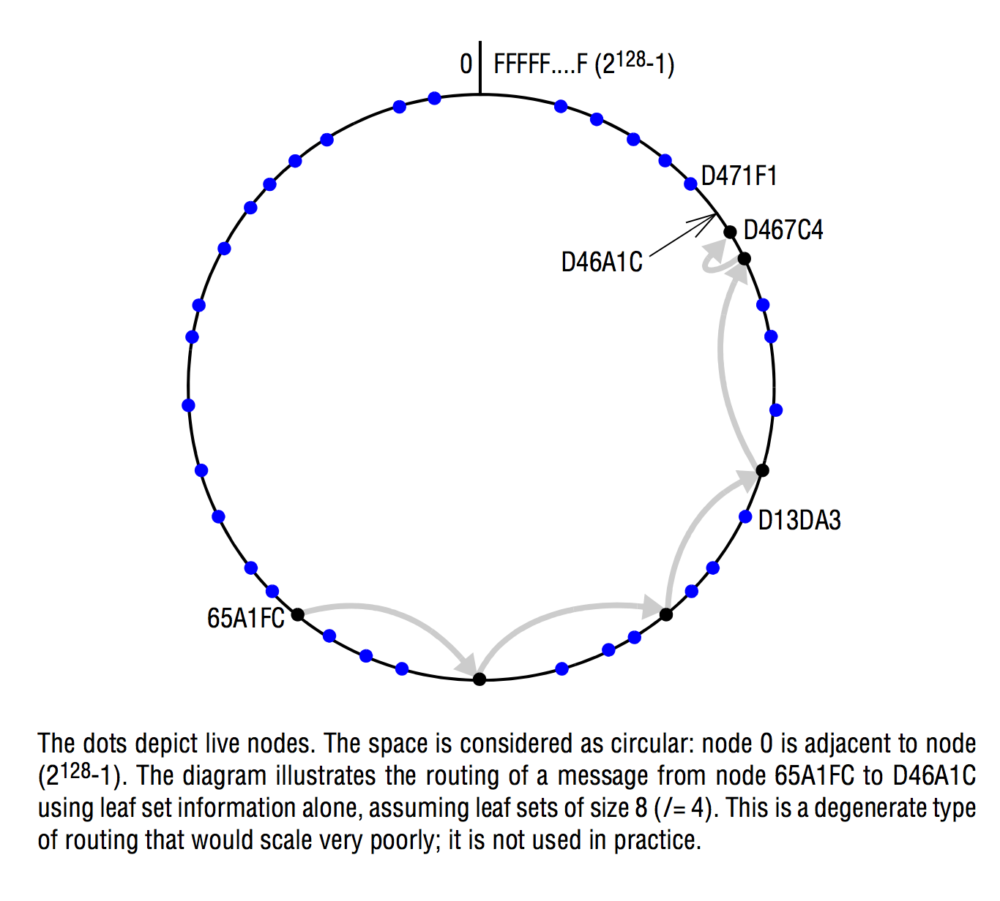
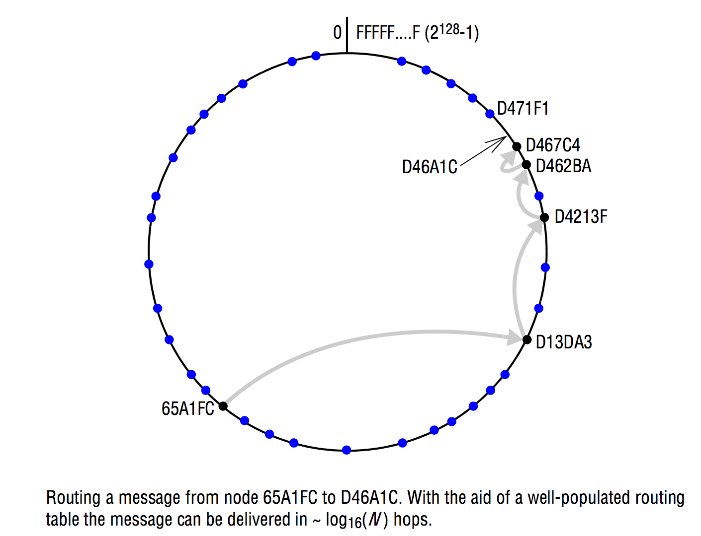
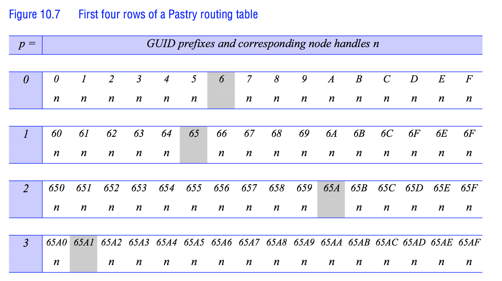
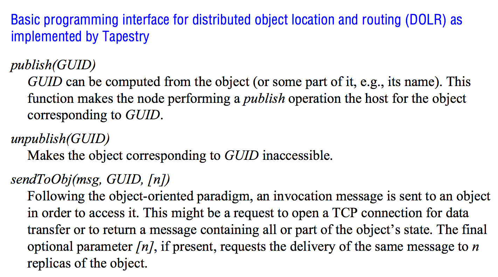

## Peer-to-Peer systems

> Chapter 10, Coulouris

### Distinctions between IP and overlay routing for peer-to-peer applications
<table>
	<tr>
		<td></td>
		<td><strong>IP</strong></td>
		<td><strong>Application-level routing overlay</strong></td>
	</tr>
	<tr>
		<td><em>Scale</em></td>
		<td>IPv4 is limited to 2<sup>32</sup> addressable nodes. The IPv6 namespace is much generous (2<sup>128</sup>), but addresses in both versions are hierarchically structured and much of the space is preallocated according to administrative requirements.</td>
		<td>Peer-to-peer systems can address more objects. The GUID namespace is very large and flat, allowing it to be much more fully occupied.</td>
	</tr>
	<tr>
		<td><em>Load balancing</em></td>
		<td>Loads on routers are determined by network topology and associated traffic patterns.</td>
		<td>Object locations can be randomized and hence traffic patterns are divorced from the network topology.</td>
	</tr>
	<tr>
		<td><em>Network dynamics (addition/deletion of objects/nodes)</em></td>
		<td>IP routing tables are updated asynchronously on a best-effort basis with time constants on the order of 1 hour.</td>
		<td>Routing tables an be updated synchronously or asynchronously with factions-of-a-second delays.</td>
	</tr>
	<tr>
		<td><em>Fault tolerance</em></td>
		<td>Redundancy is designed into the IP network by its managers, ensuring tolerance of a single router or network connection failure. <em>n</em>-fold replication is costly.</td>
		<td>Routes and object references can be replicated <em>n</em>-fold, ensuring tolerance of <em>n</em> failures of nodes or connections.</td>
	</tr>
	<tr>
		<td><em>Target identification</em></td>
		<td>Each IP address maps to exactly one target node.</td>
		<td>Messages can be routed to the nearest replica of a target object.</td>
	</tr>
	<tr>
		<td><em>Security and anonymity</em></td>
		<td>Addressing is only secure when all nodes are trusted. Anonymity for the owners of addresses is not achievable.</td>
		<td>Security can be achieved even in environments with limited trust. A limited degree of anonymity can be provided.</td>
	</tr>
</table>

## Design
Peer-to-peer systems are designed to place resources on a set of computers that are widely distributed throughout the Internet and to route messages to them on behalf of clients.

They provide guarantees of delivery for requests in a bounded number of network hops.

### Security
Resources are identified by globally unique identifiers (GUIDs), usually derived as a secure hash from some or all of the resources state.

This makes the resource self-certifying.
This protects resources against being tampered with by untrusted nodes on which it may be stored. It does require the resources to be static (because if they changed, so would the hash-value).

## Hybrid P2P-systems (Napster)
Napster used a replicated unified index of all available files, giving the network addresses of their hosts. So it wasn't completely decentralized (which has been solved by the use of Distributed Hash Tables in other implementations).

## Requirements

- It must enable clients to locate and communicate with any individual resources made available to the service, even though the resources are widely distributed among the hosts.

- *Global scalability*: It must be designed to support applications that access millions of objects on tens of thousands or hundreds of thousands of hosts.

- *Load balancing*: It must balance the distribution of workload among the nodes. This is achieved by random placement of resources as well as replicas of heavily used resources.

- *Optimization for local interactions between neighboring peers*: The 'network distance' between nodes that interact has a substantial impact on the latency of individual interactions. **Resources should be placed close to the nodes that access them the most.**

- *Accommodating to highly dynamic host availability*: Most peer-to-peer systems are constructed from host computers that are free to join or leave the system at any time. When hosts join, they must be integrated into the system and the load must be redistributed to exploit their resources. When they leave the system, the system must detect their departure and redistribute their load and resources.

- *Security of data in an environment with heterogeneous trust*: In global-scale systems with participating hosts of diverse ownership, trust must be built up by the use of authentication and encryption to ensure the integrity and privacy of information.

- *Anonymity, deniability and resistance to censorship*: Hosts that hold data should be able to plausibly deny responsibility for holding or supplying it. Also, the anonymity for the holders and recipients of data is a legitimate concern in many situations demanding resistance to censorship.

#### Replication
A high degree of replication of resources as well as detailed knowledge of the locations of nodes and objects in a portion of the namespace is required to ensure dependability of the server in the face of the volatile availability of hosts.

## Routing overlays
We can't rely simply on the IP protocol for routing in P2P-systems. We need some application-level routing overlay for taking the responsibility of locating nodes and objects.

The objects of interest may be placed at and subsequently relocated to any node in the network.

We call it an *overlay* since it implements a routing mechanism in the application layer that is quite separate from any other routing mechanisms deployed at the network level such as IP routing.

**The routing overlay ensures that any node can access any object by routing each request through a sequence of nodes, exploiting knowledge at each of them to locate the destination object**.

**The GUIDs used to identify nodes and objects are known as opaque identifiers, since they reveal nothing about the locations of the objects to which they refer.**

### Routing tasks

- *Routing of requests to objects*: A client wishing to invoke an operation on an object submits a request including the object's GUID to the routing overlay, which then routes the request to a node at which a replica of the object resides.

- *Insertion of objects*: A node wishing to make a new object available to a peer-to-peer service computes a GUID for the object and announces it to the routing overlay, which then ensures that the object is reachable by all the other clients.

- *Deletion of objects*: When clients request the removal of objects from the service, the routing overlay must make them unavailable.

- *Node addition and removal*: Nodes may join and leave the service. When a node joins, the routing overlay arranges for it to assume some of the responsibilities of other nodes. When a node leaves, its responsibilities are distributed amongst the other nodes.

### GUIDs/Distributed Hash Tables
An objects GUID is computed from all or part of the state of the object using a function that delivers a value that is practically unique.

A hash function such as SHA-1, 2 or 3 is used to generate the GUID from the object's value.

**We use these identifiers to determine the placement of objects and to retrieve them. Therefore, overlay routing systems are described as *distributed hash tables*.**

### Distributed Hash Tables
```
/**
 * Stores data in replicas at all nodes responsible for the object identified by GUID.
 */
put(GUID, data);

/**
 * Deletes all references to GUID and the associated data.
 */
remove(GUID);

/**
 * Retrieves the data associated with GUID from one of the nodes responsible for it.
 */
value = get(GUID);
```

The `put` operation is used to submit a data item to be stored together with its GUID.

It is then the Distributed Hash Table that picks a location for it, stores it as well as some replicas.

To retrieve some data, the `get` operation is provided.

#### Retrieving GUIDs
GUIDs are not human-readable, so client applications must obtain the GUIDs for resources of interest through some form of indexing service using human-readable names or search requests.

Ideally, these indexes are also stored in a peer-to-peer manner to overcome the weaknesses of centralized indexes evidenced by Napster, but in some cases, they can be indexed on web pages (like BitTorrent). In BitTorrent, a web index search leads to a *stub file* containing details of the sired resource, including its GUID and URL of a *tracker* - a host that holds an up-to-date list of network addresses for providers willing to supply the file.

#### Placement
The data item with a GUID, *x*, is stored at the node whose GUID is **numerically closest to *x*, and at the *r* hosts whose GUIDs are next-closest to it numerically, where *r* is a replication factor chosen to ensure a very high probability of availability.**.

### Distributed Object Location and Routing (DOLR)
**Is an alternative to Distributed Hash Tables**.

```
/**
 * This function makes the node performing a publish operation the host for the object corresponding to GUID.
 */
publish(GUID);

/**
 * Makes the object corresponding to GUID inaccessible.
 */
unpublish(GUID);

/**
 * Following the object-oriented paradigm, an invocation message is sent to an object in order to access it. This might be a request to open a TCP connection for data transfer or to return a message containing all or part of the object's state. If the optional parameter n is present, requests the delivery of the same message to n replicas of the object.
 */
sendToObj(msg, GUID, (optional) n)
```

- Objects can be stored anywhere.
- DOLR is responsible for maintaining a mapping between object identifiers (GUIDs) and the addresses of the nodes at which replicas of the objects are located.

Objects may be replicated and stored with the same GUID at different hosts, and the routing overlay routes requests to the nearest available replica.

#### Placement
Locations for the replicas of data objects are decided outside the routing layer, and the DOLR layer is notified of the host address of each replica using a `publish` operation.

### Prefix routing
Both Pastry, which uses Distributed Hash Tables, and Tapestry, which uses Distributed Object Object Location and Routing, uses a routing mechanism known as *prefix routing* to determine routes for the delivery of messages based on the values of the GUIDs to which they are addressed.

Prefix routing narrows the search for the next node along the route by applying a binary mask that selects an increasing number of hexadecimal digits from the destination GUID after each hop.

## Pastry
A routing overlay where all nodes and objects that can be accessed are assigned 128-bit GUIDs.

- For nodes, these are computed by applying a secure hash function such as SHA-1, SHA-2 or SHA-3 to the public key with which each node is provided.

- For resources/objects, the GUID is computed by applying a secure hash function to the object's name or to part of the object's stored state.

### Performance
In a network with *N* participating nodes, Pastry will correctly route a message addressed to any GUID in *O(log N)* steps.

### Routing
Typically uses UDP to transfer the message to a Pastry node that is 'closer' to its destination.

Closeness is an entirely artificial space - the space of GUIDs.

**The actual transport of messages across the Internet between two Pastry nodes may require a substantial number of IP hops!**

To minimize this, Pastry uses a locality metric based on network distance in the underlying network to select appropriate neighbors when setting up the routing tables used at each node.

When new nodes join the overlay, they obtain the data needed to construct a routing table and other required state from existing members in *O(log N)* messages where *N* is the number of hosts participating in the overlay.

#### Routing algorithm (simple version, no Distributed Hash Table)



Note that node 0 is adjacent to node 2<sup>128</sup> - 1.

Works correctly - but does not route efficiently (doesn't route in *O(log N)* messages).

1. Each active node stores a *leaf set* - a vector *L* of size *2l* containing the GUIDs and IP addresses of the nodes whose GUIDs are numerically closest on either side of its own (*l* above and *l* below).

	-	 Leaf sets are maintained by Pastry as nodes join and leave.

2. Any node *A* that receives a message *M* with destination address *D* routes the message by comparing *D* with its own GUID *A* and with each of the GUIDs in its leaf set and forwards *M* to the node amongst them that is numerically closest to *D*.

3.  If a node *A* has the destination address *D* in its leaf-set, it `delivers` the message to it.

This shows that for each step, the message gets closer to the destination *D* before finally arriving at it.

##### Performance
Requires *~N/2l* hops to deliver a message in a network with *N* nodes.

#### Routing algorithm (Actual Pastry version, with Distributed Hash Table)



Each Pastry node maintains a tree-structured routing table giving GUIDs and IP addresses for a set of nodes spread throughout the entire range of 2<sup>128</sup> possible GUID values, with increased density of coverage for GUIDs numerically close to its own.



- GUIDs are viewed as hexadecimal values and the table classifies GUIDs based on their hexadecimal prefixes.

- The table has as many rows as there are hexadecimal digits in a GUID, so for Pastry, there are 128/4 = 32 rows.

- Any row *n* contains 15 entries - one for each possible value of the nth hexadecimal digit, excluding the value in the local node's GUID.

- Each entry in the table points to one of the potentially many nodes whose GUIDs have the relevant prefix.

The routing process at any node *A* uses the information in its routing table *R* and leaf set *L* to handle each request from an application and each incoming message from another node according to the following algorithm:

1. If the destination is within the leaf set or is the current node:
	- Deliver the message to the element of the leaf set that is the destination or to the current node *A*.

2. Else
	-	Use the routing table to dispatch *M* to a node with a closer GUID:
		- Find *p*, the length of the longest common prefix of *D* and *A*, and *i*, the (p + 1)<sup>th</sup> hexadecimal digit of *D*.
		- If (*R[p, i] != null*) (there is an entry in the routing table) Route *M* to a node with a longer common prefix.
		- Else forward *M* to any node in *L* or *R* with a common prefix of length *p* but a GUID that is numerically closer.

We can be sure that the algorithm will succeed in eventually delivering *M* because the same actions is performed as in the simple version, except this one makes reduces the number of hops required for routing.

This algorithm reaches *O(log N)*.

### Joining a Pastry system
New nodes use a joining protocol in order to acquire their routing table and leaf set contents and notify other nodes of changes they must make to their tables.

1. First, the new node computes a suitable GUID from the hash function.

2. Then it makes contact with a nearby Pastry node. Nearby in this case refers to network distance (and not nearby as in numerical distance to the GUID).

	-	In order to find the nearest neighbor, Pastry includes a 'nearest neighbor' algorithm to find a nearby node by recursively measuring the round-trip delay for a probe message sent periodically to each member of the leaf set of the nearest currently known Pastry node.

3. The nearby node dispatches the *join* message via Pastry in the normal way, routing the *join* message to the existing node whose GUID is numerically closest to the new node's GUID.

	-	If the new node's GUID is *X* and the nearby node it contacts has GUID *A*, *X* sends a special *join* request message to *A*, giving *X* as its destination. *A* dispatches the *join* message via Pastry in the normal way.

4. All the nodes through which the *join* message is routed on its way to *Z* add additional steps to the normal Pastry routing algorithm which result in the transmission of the contents of the relevant parts of their routing tables and leaf sets to the new node.

5. The new node examines them and constructs its own routing table and leaf set from them, requesting some additional information from other nodes if necessary.

### Building a routing table
Lets call the node *X*. It has just entered a Pastry ring.

1. The first row of the table depends on the value of the node's GUID. To minimize routing distances, the table should be constructed to route messages via neighboring nodes whenever possible.
	-	If *A* is a neighbor of *X*, the first row of <em>A</em>'s table is a good initial choice for the first row of <em>X</em>'s table.

2. *B* shares the same first hexadecimal digit with *X* and should be used for the second row.

3. And so it goes, with *C* suitable for the third row and so on.

**The initial routing table contents should be borrowed from the node with the GUID numerically closest to the new node. It can then be further refined from there.**

### Fault tolerance of Pastry
For Pastry to work, all entries in routing tables *and* leaf sets must refer to live, correctly functioning nodes.

Thus, all nodes send regular heartbeat messages to indicate that they still work to their neighboring nodes.

Information about failed nodes detected via heartbeat messages may not be detected in time to eliminate routing errors.

**To overcome these problems, clients that depend upon reliable message delivery are expected to employ an *at-least-once* delivery mechanism and repeat their requests several times in the absence of a response.**

There are stuff like acknowledgement messages that has been added in newer versions of Pastry.

## Tapestry
Tapestry is similar to Pastry, but conceals the distributed hash table behind a DOLR interface.

The main difference is that the nodes that hold resources `publish` them to make them known to Tapestry and then remains responsible for storing them.

Replicated resources are published with the same GUID by each node that holds a replica which results in multiple entries in the Tapestry routing structure.

**This gives Tapestry additional flexibility: Replicas can be placed close to frequent users of resources in order to reduce latency and minimize network load or to ensure tolerance of network and host failures**.

Tapestry uses 160-bit identifiers for both objects and the nodes that perform routing actions.

Identifiers are either *NodeIds* which refers to computers that perform routing operations, or GUIDs, which refer to the objects/resources.

**Hosts holding replicas of a resource periodically invoke `publish` to ensure that newly arrived hosts become aware of the existence of it**.

On each invocation of `publish`, the message is routed from the invoker towards the node that is closest to the original resource.

When nodes hold multiple mappings between resources and hosts for the same GUID, they are sorted by the network distance to the IP address.

Tapestry has similar performance to Pastry.

### Structured vs Unstructured P2P
<table>
	<tr>
		<td></td>
		<td><strong>Structured Peer-To-Peer</strong></td>
		<td><strong>Unstructured Peer-To-Peer</strong></td>
	</tr>
	<tr>
		<td><em>Advantages</em></td>
		<td>Guaranteed to locate objects if they exist and can offer time and complexity bounds on this operation. Relatively low message overhead.</td>
		<td>Self-organizing and naturally resilient to node failure.</td>
	</tr>
	<tr>
		<td><em>Disadvantages</em></td>
		<td>Need to maintain often complex overlay structures, which can be difficult and costly to achieve, especially in highly dynamic environments.</td>
		<td>Probabilistic and hence cannot offer absolute guarantees on locating objects. Prone to excessive message overhead which can affect scalability.</td>
	</tr>
</table>

Pastry and Tapestry are structured peer-to-peer systems where there is an overall global policy governing the topology of the network, the placement of objects and the routing or search functions used to locate objects in the network.

Because of the cost of maintaining the underlying structures, unstructured approaches have also been developed.

### Unstructured peer-to-peer systems
Here, there is no overall control over the topology or the placement of objects within the network.

When a new joins the network, it will establish contact with a a set of neighbors knowing that the neighbors will also be connected to further neighbors and so on.

This forms a network that is fundamentally decentralized and self-organizing and is resilient to node failure.

#### Locating objects
To locate a given object, it is necessary to carry out a search of the resultant network topology.

This cannot offer any guarantees of being able to find the object, and performance will be unpredictable.

Also, it can generate excessive message traffic to locate objects.

**Unstructured P2P-systems are actually the predominant approach on the Internet. BitTorrent is an example of an unstructured approach.**

Searching strategies include:

- *Expanded ring search*: The initiating node carries out a series of searches with increasing values in the time-to-live field, recognizing that a significant number of the requests will be met locally.

- *Random walks*: The initiating node sets off a number of *walkers* who follow their own random pathways through the interconnected graph offered by the unstructured overlay.

- *Gossiping*: A node sends a request to a given neighbor with a certain probability, and hence requests propagate through the network in a manner similar to a virus through a population. The probability can either be fixed for a given network or calculated dynamically based on previous experience and/or the current context.

Similar strategies can be employed for *replicating* resources at different nodes so that searching for resources will require less message passing.


# Old notes:
A scalable decentralized alternative to the client/server architecture where all nodes in the network acts both as client and server.

### Traits
- It scales linearly - for each time a new client (a peer) enters the network, so does a new server (the peer itself). Thus, the system is practically infinitely scalable.
- Decentralized - Modern P2P-systems use decentralized distributed hash tables for locating (addressing) which nodes holds which resources. The system requires no maintenance and does not rely on any single node.
- Dynamism/Churn - Nodes can enter or leave the system at any point. The system will then adapt.

### Unstructured P2P-systems
In Unstructured P2P-systems, nodes are connected to each other randomly. If a node wants to get a resource, it has no way of knowing where to look for it. It must search throughout the system for a peer that holds the resource. Most nodes will hold the most popular resources. It will then become difficult and sometimes impossible to retrieve the resource.

However, since most nodes will hold the most popular content, unstructured p2p-systems are highly robust under high rates of churn in general and under most circumstances.

### Structured P2P-systems
Here, the responsibilities of each peer are defined and structured. A distributed hash table (DHT) is used to assign ownership of specific files to specific peers. This makes it easy to retrieve a specific resource efficiently and easily, if it is rare.
In order to keep the system structured and route traffic efficiently, nodes must maintain lists of neighbors that satisfies specific conditions.

This is made possible by giving each node and resource a Global Unique Identifier (GUID) and allowing them to address each other using those.

But how do do we do so in a way that scales? If all nodes always needs to know how to address every node and resource directly, they must hold a full local copy of the DHT. That would have the two performance/consumption issues:
- The size would be linear to N (for every new node, a the size of each individual node's replica of the hash table would need to grow by one).
- When peers enters or leaves the system, a total of N messages must be passed around so that all local replicas of the hash table would be updated.

All in all that would make the system very inefficient.

### Hybrid P2P overlays
Hybrid P2P overlays are not unstructured, but they aren't fully structured either. They may have centralized index servers and they may have a hierarchy of peers and so-called *superpeers*.

**Fundamentally, they don't avoid scalability problems**.

### Key-Based Routing API
We want an API like for the system routing:
```javascript
route(G, m)    // Route message message m to G.
forward(G, m)  // Callback when forwarding m.
deliver(G, m)  // Callback when delivering m.
join(P)        // add node P to the overlay
```

This is how the P2P-system would act using a key-based routing API to route a message `m` to a peer holding a resource `G`:

#### `route(G, m)`:
when peer `P` wants to send a message `m` to a peer holding resource `G`, it invokes this method.

#### `forward(G, m)`:
Just before message `m` received at peer `P` is forwarded towards resource `G`, the P2P overlay invokes this method repeatedly on each intermediate peer in the routing path.

#### `deliver(G, m)`:
The overlay invokes this method at the peer that holds the resource `G`.

#### The task at hand
For instance, say a peer P1 wants to find resource G. A so-called *resourcegroup* (set of peers that has the resource) is also called G (same GUID as the resource has). P1 simply needs to locate a neighbor who has the resource.

There are various ways to accomplish this. As always, we want to archive at least `O(lg(N))`.

### Solutions in unstructured P2P overlays

#### Solution - Random walk
One way is simply "walking" the tree/graph at random. P1 would send a message `m=<<SEARCH(G)>>` to one of its neighbors. If the neighbor has G, it responds with it (returns it) to P1. Otherwise, it sends `m` on to some neighbor who hasn't yet seen `m`. If all neighbors have seen `m`, the original message `m` is simply returned to P1.

**But this is not scalable!**

Clearly, the worst case complexity of this would be `O(N)`. That would be the case if we had to traverse *all* nodes before finding the node that has the resource.

#### Solution - Flooding
P1 would a message `m=<<Search(G)>>` to *all* of its neighbors. If any one of them has G, it responds directly to P, otherwise it sends `m` on to *all* of its neighbors unless it has already done it.

**But this is not scalable!**
Clearly, the worst case complexity of this would be `O(N)`. That would be the case if we had to traverse *all* nodes before finding the node that has the resource. Also, we might likely end up traversing the same nodes more than once.

**This is fundamental to unstructured P2P overlays**

### Solutions in structured P2P overlays
To accomplish better asymptotic complexity, we can use a global scheme specifying which peer `P` is responsible for which resource `G`.

This works by using Distributed Hash Tables (DHT), mapping a key (GUID) to a value (resource).

Those 128-bit GUIDS are computed using a secure hashing function such as SHA-1. For files, this could be computed to the filename, for instance. For nodes, it could be to the public key with which the node is provided.
The 128-bit size makes it extremely unlikely that clashes occur between the generated GUIDs.

Hashing should be **consistent**. Key lookups should return the same resource, no matter at which peer the lookup starts.

It must also **guarantee** to find a resource if it exists in the system.

One way of structuring nodes in a GUID space is using a **Pastry** system.

### Pastry
A pastry structure is a ring of GUIDs each of which uniquely identifies a node.

A Pastry GUID is a number in the range [0, 2<sup>128</sup>[

A peer P(i)'s neighbors are the 2 peers closest to it: P(i - I) and P(i + I).

P(i) also knows about the `l` closest peers above and below it. This would be the Leaf set `{P(i - l), ..., P(i), ..., P(i + l)}`

P(i) is responsible for all resources G that are closest to P(i).

#### Simple routing
Simple routing works. It routes messages correctly, but inefficiently. It doesn't use a routing table.

1) Each node holds a *leaf set* (a vector `L` of size `2l`). This set contains the GUIDs and IP-addresses of the nodes **whose GUIDS are numerically closest on either side of its own (`l` above and `l` below)**.

Be aware that Pastry is circular. Thus, the lower neighbor of the peer with GUID 0 is the peer with GUID 2<sup>128</sup> - 1.

Pastry is responsible for maintaining these leaf sets as nodes come and go.

It works like this:
1) A node `P` receives a message `m` with destination address `D`.
2) It compares D with its own GUID `P` as well as the GUIDS of all the nodes in its' leaf set and forwards `m` to the one that is numerically closest to `D`.

From this we know that for each step, `m` will get closer and closer to `D`.


It is still very inefficient, though. We need to use a routing table to reach `O(log(N))`.

#### Prefix routing (routing using routing tables)
In this way of routing, each node maintains a tree-structured routing table containing GUIDs and IP addresses for a set of nodes spread **throughout the entire range of 2<sup>128</sup> possible GUID values, with increased density of coverage for GUIDs numerically close to its own.**

Here's how a routing table is structured for a node:

- GUIDs are viewed as hexadecimal values and the table classifies GUIDs based on their hexadecimal prefixes.
- The table has as many rows as there are hexadecimal digits in a GUID.
- Any row `n` contains 16 entries: an entry for each possible value of the nth hexadecimal digit, excluding the value in the local node's GUID.


The algorithm in pseudo-code per node on an incoming message `m` is then:

- If the destination `D` is within the leaf set `L` or is the current node `P`:
	-	 Forward message `M` to the element `L`<sub>`i`</sub> of the leaf set `L` with the GUID closest to `D` or the current node `P`.
- **else** use the routing table to despatch the message `m` to a node with a closer GUID:
	- Find `p`, the length of the longest common prefix of the destination node `D` and the current node `P`, and `i`, the `(p+1)`th hexadecimal digit of `D`.
	- Let R = `Routing table(P)`. Let `R[p, i]` be the element at column i, row p.
	- If `R[p, i] != null`, forward the message `m` to `R[p, i]`. This is the same as saying that we should route the message `m` to a node with a longer common prefix.
- **else** there is no entry in the routing table. Forward the message `m` to any node in the current node `P`'s Leaf set or routing table with a common prefix of length `p` but a GUID that is numerically closer to the destination node `D`.

### Joining a Pastry system.
When a new node joins a Pastry system, it:
1 - Computes a suitable GUID (typically by applying the SHA-1 hashing function to its public key).

2 - Makes contact with a nearby pastry node. *Nearby* refers to network distance, i.e. few network hops, latency.

3 - The new node, `A` sends a `join()` request to the nearby node `B`, giving itself, `A` as the destination. `B` dispatches the `join` message via Pastry in the normal way.

4 - Pastry then routes the `join` message to the existing node whose GUID is numerically closest to `A`. Lets call that node `C`.

5 - `B`, `C` and all other nodes through which the `join` message was routed on its way to `C` transmits whatever relevant parts they have in their routing tables and leaf sets to the new node `A` which then constructs its own routing table and leaf set from them, requesting additional information if necessary.

6 - `A` now transmits its own contents to all the nodes in its routing table and leaf set so that *they* can adjust their own tables and incorporate the new node.

All of this requires `O(log(n))` messages. Great!

### Nearest neighbor algorithm in Pastry

That a node is nearest to another node doesn't necessarily mean that it is close in a physical sense. Its just that there is no other node that is nearer.

Pastry includes a *nearest neighbor* algorithm which recursively measures the round-trip delay for a probe message periodically sent to each member of the leaf set of the nearest currently known pastry node.

**Pastry chooses the closest "candidate" in the routing table in terms of IP distance.**
- **First hop has long GUID but short IP distance.**
- **Following hops has exponentially longer IP-distance, as candidate sets get exponentially smaller.**
- **Last hop is the longest in IP distance.**

### Leaving a Pastry system
When a node leaves, it doesn't send a *'goodbye'* message. However, each peer always send regular *heartbeat* messages to its higher neighbor. If a peer detects its lower neighbor `P` has left, it tells its leaf set. Each peer then checks connectivity to `P` and updates their leaf set accordingly.

Routing tables entries are also checked at intervals and replaced if they have left.

### Tapestry
Tapestry is similar to Pasty in many ways. It too implements a distributed hash table and routes messages to nodes based on GUIDs associated with resources using prefix routing. However, Tapestry's API conceals the DHT from applications behind a so-called *Distributed Object Location and Routing (DOLR)* interface


The point is that nodes that hold resources use the `publish(GUID)` primitive to make them known to Tapestry, and the holders of resources remain responsible for storing them. Replicated resources are published with the same GUID by each node that holds a replica. This allows Tapestry to place replicas close to frequent users in terms of network distance in order to reduce latency and minimize network load or to ensure tolerance of network and host failures.

In Tapestry, **160-bit** identifiers are used to refer both to objects and to the nodes that perform routing actions. Here, identifiers are *NodeIds* if they refer to computers that perform actions and *GUIDS* if they refer to objects.

## Structured vs unstructured P2P systems.
<table>
	<caption>Advantages and disadvantages of using structured and unstructured peer-to-peer systems</caption>
	<tr>
		<td></td>
		<td><strong>Structured P2P</strong></td>
		<td><strong>Unstructured P2P</strong></td>
	</tr>
	<tr>
		<td><em>Advantages</em></td>
		<td>Guaranteed to locate objects (assuming they exist) and can offer time and complexity bounds on this operation; relatively low message overhead.</td>
		<td>Self-organizing and naturally resilient to node failure.</td>
	</tr>
	<tr>
	<td><em>Disadvantages</em></td>
	<td>Need to maintain often complex overlay structures, which can be difficult and costly to achieve, especially in highly dynamic environments.</td>
	<td>Probabilistic and hence cannot offer absolute guarantees on locating objects; prone to excessive messaging overhead which can affect scalability.</td>
	</tr>
</table>

There is no doubt that the *maintenance* argument is worth considering when it comes to disadvantages of structured P2P-systems, especially in environments where nodes come and go very frequently.
