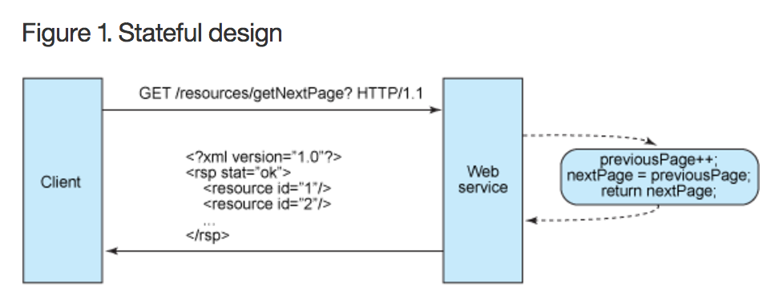
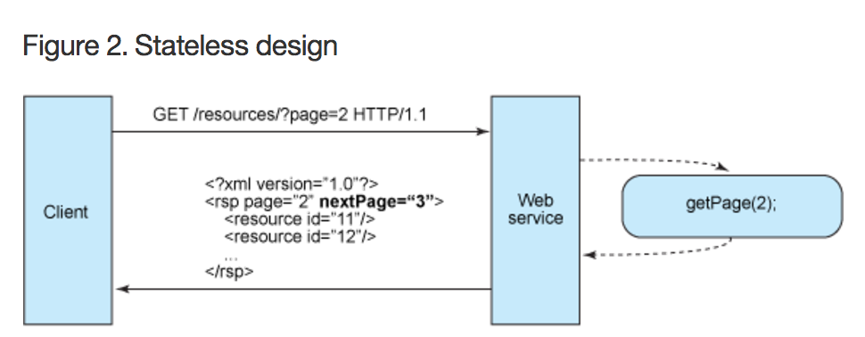
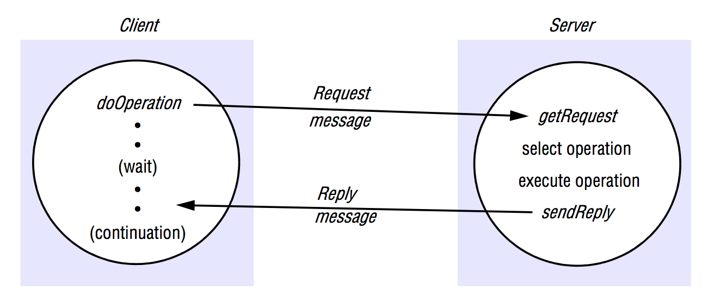

# Remote Invocation, Indirect Communication & Web Services (REST)
> Coulouris CDK 5.1-5.3, 6.1, 6.3-6.4, 7.4, (9.1-9.4). (Ranges are inclusive, parts of 9 only cursory).

## Quick thoughts about Representational State Transfer (REST)
REST defines a set of architectural principles by which you can design Web services that focus on a system's resources.

REST has emerged in the last few years and has become the predominant Web service design model, far surpassing if not displacing SOAP- and WSDL-based interface design.

Reason: It is considerably simpler (and pretty too!)

### Design principles
- Use HTTP methods directly.
- Be stateless
- Expose directory structure-like URIs
- Transfer XML, JSON or both.

### Nouns vs Verbs
**USE NOUNS!**

Stuff like `addXXXXX` or `getXXXX` is redundant since the request method already dictates whatever action you are trying to do, whether its GET, PUT, POST or DELETE.

So please just put */somethings* in your URI.

### Use HTTP methods directly
For instance, HTTP GET is defined as a data-*producing* method that's intended to be used by a client application to retrieve a resource, to fetch data from a Web server, or to execute a query with the expectation that the web server will look for and respond with a set of matching resources.

Developers should use HTTP methods explicitly and in a way that is consistent with the protocol definition.

#### Mapping to CRUD
It is this one-to-one mapping between POST, GET, PUT, DELETE as HTTP methods and the CREATE, READ, UPDATE, DELETE methods in CRUD operations that makes it so intuitive.

- To create a resource on the server, use POST.
- To retrieve a resource, use GET
- To change the state of a resource (to update it), use PUT
- To remove or delete a resource, use DELETE.

#### GET
GET is an operation that should be free of side effects (a property known as idempotence). It is for data retrieval **only**.

That also means that `GET /adduser?name=Robert` is horrible API design from a semantical standpoint but also because it invites web crawlers and search engines to crawl or index it.

On top of that, RESTful API's should be resource-oriented at preserve directory structure-like URIs. So, if the entity is called *user*, the endpoint shouldn't be called *adduser*. Instead, call the base endpoint *users* (yes, in plural, please always do that).

#### PUT
PUT is for updates. You can be tempted to do `PUT /users/1234?name=New Name`, but you should really put that inside the request body as XML/JSON instead since some update operations require a lot of fields to be updated on the entity.

Or, and this depends a lot on whether or not you are working in a strongly typed language server-side, you could simply pass in a serialized representation of the new entity in the request body (meaning, all the fields of the new user). Please do remember that this means a bigger payload that has to be transmitted from client to server.

It is quite intuitive since the user you are trying to update are already given in the URI, (preserving `PUT /users/1234` and then moving the new contents down inside the request body).

### Be stateless
Web Service clients should send complete, independent requests. That is, the requests must include all data needed to be fulfilled so that the components in the intermediary servers may forward, route and load-balance without any state being held locally in-between requests.

A complete, independent request doesn't require the server, while processing the request, to retrieve any kind of application context or state.

The request should include within the HTTP headers and the body of the request all of the parameters, context and data needed by the server-side component to generate a response.

To better understand this, here's an example of stateful design instead. Look how complex it gets:



The server must then know something about the context and history of previous requests.

Basically, asking for the *"next"* of something implies there are some knowledge at the server about whatever came before. Also known as state.

To achieve what the example above are trying to do, the stateless way would be to submit in the request the pagination (or offset) in terms of which resources to get.
For instance, `GET /resources?offset=3` returning the third resource and up.

Another example illustration of a stateless design solution to the one before is this:



### Conditional GET
Is one where the *If-Modified-Since* HTTP header is set from the client on a GET request for a resource it already has in a local cache (the value of which is read from the *Last-Modified* date value on the cached one).
- If the server-side copy of the file has been modified since, it returns the resource and HTTP status code 200.
- If it hasn't, it responds with a simple HTTP status code 304 (Not Modified) and omits the actual resource.

### Expose directory structure-like URIs
It is primarily the URIs that determines how intuitive the REST Web service is going to be and whether the service is going to be used in ways that the designers can anticipate.

The URIs should be so intuitive that they are actually easy to guess.

**Think of an URI as a kind of self-documenting interface that requires little, if any, explanation or reference for a developer to understand what it points to and to derive related resources**.

A nice way to achieve this is by defining directory structure-like URIs. These are hierarchical, rooted at a single path and branching from it are subpaths that expose the service's main areas.

An example of a nice, hierarchical URI would be:
`https://api.myservice.com/users/{userId}/hobbies`.

### Other guidelines for URIs
Well, RESTful design guidelines are almost as divisive for web developers as religion unfortunately can be for some, but those I've read that I've agreed with (:-D) are:

- Keep everything lowercase.
- Substitute spaces with underscores.
- Generally only use query strings for optional stuff (like projection/filtering) and keep the rest inside the request body.
- Keep the URIs static as much as possible. Use versioning directly from the URI or at least make sure that the links stay the same, even though the actual implementation of the service changes.

### Transfer XML, JSON or both
- And please use JSON by default!

But, if you're really cool, make use of the built-in HTTP ACCEPT header that clients can assign values to (like "JSON", "XML" or "XHTML") and serve the data in whatever format that is requested.

This is called *content negotiation* which lets clients choose which data format is right for *them*.

#### camelCase your JSON!
Please format your field names in camelCase so they follow JavaScript naming conventions when you parse them into Javascript objects with `JSON.parse()`. For instance, given this JSON string:
```json
{
	"created_at": 123456,
	"followed_by": 38
}
```

```javascript
const obj = JSON.parse(responseBody);
obj.created_at; // :-(
obj.followed_by; // :-(
```

Instead, do:
```json
{
	"createdAt": 123456,
	"followedBy": 38
}
```

```javascript
const obj = JSON.parse(responseBody);
obj.createdAt; // :-D
obj.followedBy; // :-D
```

## The foundations of Remote Method Invocation (RMI)
- *Request-Reply protocols* represent a pattern on top of message passing and support the two-way exchange of messages as encountered in client-server computing. This provides the relatively low-level support for requesting the execution of a remote operation and thus also provide direct support for RPC and RMI.

- RPC (*Remote Procedure Call*) then came which allowed client programs to transparently call procedures in server programs running in separate processes and generally in different computers from the client.

- But then in the 90s, the Object-based programming model was extended to allow objects **in different processes** to communicate with one another by means of *remote method invocation (RMI)*. *RMI* is an extension of local method invocation that allows an object living in one process to invoke the methods of an object living in another process.

## Request-reply protocols
This form of communication is designed to support the roles and message exchanges of typical client-server interactions.

In the normal case, this kind of communication is synchronous because the client process blocks until the reply arrives from the server.

It can also be reliable because the reply from the server is effectively an acknowledgement to the client.

Asynchronous request-reply communication is an alternative that may be useful in situations where clients can afford to retrieve replies later.

Imagine web development where some requests can be *blocking* because they wait for the server to reply before moving on the next ones. Non-critical requests shouldn't be blocking and thus should be asynchronous.

### The request-reply protocol



It matches requests to replies. It may or may not be designed to provide certain delivery guarantees.
- If UDP datagrams are used, the delivery guarantees must be provided by the request-reply protocol.
- If TCP is used, well, it is already reliable, meaning that the eventual delivery of the message is guaranteed.

### Message identifiers
any scheme that involves the management of messages to provide additional properties such as reliable message delivery or request-reply communication requires that each message have a unique message identifier by which it may be referenced. Such an identifier consists of two parts:

1. A *requestId*, which is taken from an increasing sequence of integers by the sending process.

2. An identifier for the sender process, for example, its port and Internet address.

When the value of the `requestId` reaches the maximum value for an unsigned integer (for example 2<sup>32</sup> - 1), it is reset to zero.

### Failure model of the request-reply protocol
If the primitives (`doOperation`, `getRequest`, `sendReply`) are implemented over UDP datagrams, then they suffer from the same communication failures which are:

- They suffer from omission failures.
- Messages are not guaranteed to be delivered in sender order.

But also, we do assume that processes can have crash failures. These fall into the failure model of the request-reply protocol too.

### Timeouts
Usually, if the sending process has performed a `doOperation` ( a `send(m)` operation), it begins a timer and waits for a reply before a assigned timeout value. If it doesn't get any before the timeout, it *may* be because the reply got lost - and not be cause the actual operation wasn't carried out in the first place. So, it should resubmit the request repeatedly until it either gets a reply or is reasonably sure that the delay is due to lack of response from the server rather than to lost messages.

### Discarding duplicate request methods
It may be that a request is resubmitted several times from the client (for instance, due to timeouts as just described), even though the requested operation has been carried out already.

This is where the request identifiers comes in handy. The server can see from the identifier, that the message is a duplicate and then discard it.

### Lost reply messages
Following the description from before, if the server has already sent the reply when it receives a duplicate request, it will need to execute the operation *again* to obtain the result, unless it has stored the result of the original execution (which is obviously much preferable, unless the operation is *Idempotent* in which case there is no risk associated with repeating it).

### Idempotent operation
An *Idempotent operation* is one that can be performed repeatedly with the same effect as if it had been performed exactly once.

### History
In the case from before where it would be preferable to store the result of the original execution instead of executing a duplicate request (for example, if the operation isn't Idempotent), a *history* may be used.

A *history* refers to a structure that contains a record of `reply` messages that have been transmitted. An entry in a history contains a request identifier, a message and an identifier of the client to which it was sent.

Its only purpose is to allow the server to retransmit reply messages when client processes request them.

#### Potential disadvantages
It does cost memory (e.g. space). It is now unreasonable to think of a server receiving thousands or even millions of requests and thus holding equally many `reply` objects in their history. If the server can tell when the messages will no longer be needed for transmission, it can "clean up" the history to avoid such problems.

One simple way to do that would be to internet each request from the same client as an acknowledgement of its previous reply (even though it may not be so). Therefore the history need contain only the last reply message sent to each client.

But, it would still grow over time given the fact that when a client process terminates, it does not acknowledge the last reply it has received. Thus, messages in the history will stay there and slowly grow over time unless they are automatically discarded after a limited period of time.

### Styles of request/exchange protocols
Here's 3:
- The *request (R)* protocol.
- The *request-reply (RR)* protocol.
- The *request-reply-acknowledge reply (RRA)* protocol.

<table>
	<caption>Request exchange protocols</caption>
	<tr>
		<td><strong>Protocol</strong></td>
		<td><strong>Client</strong></td>
		<td><strong>Server</strong></td>
		<td><strong>Client</strong></td>
	</tr>
	<tr>
		<td>R</td>
		<td>Request</td>
		<td></td>
		<td></td>
	</tr>
	<tr>
		<td>RR</td>
		<td>Request</td>
		<td>Reply</td>
		<td></td>
	</tr>
	<tr>
		<td>RRA</td>
		<td>Request</td>
		<td>Reply</td>
		<td>Acknowledge reply</td>
	</tr>
</table>

The *R* protocol is convenient when you just want to pass a message and doesn't care about an acknowledgement of its reception from the receiver. Naturally it is based on UDP datagrams.

The *RR* protocol is useful for most client-server exchanges. Here, special acknowledgement messages are not required (they would be redundant!) because a server's reply message is regarded as an acknowledgement of the client's request message. Similarly, a subsequent call from a client may be regarded as an acknowledgement of a server's reply message.

But then we have the *RRA* protocol which is based on the exchange of 3 messages:

The additional *Acknowledge reply* message contains the *requestId* from the reply message being acknowledged. This will enable the server to discard entries from its history. The arrival of a *requestId* in an acknowledgement message will be interpreted as acknowledging the receipt of all reply messages with lower *requestIds*, so the loss of an acknowledgement message is harmless.

### Implementing the request-reply protocol with TCP streams
One major advantage is that TCP streams allows arguments and results of *any* size to be transmitted, in contrast to UDP which transfer single datagrams of a maximum size of usually 8 kilobytes.

Also, it makes sure that the request and reply messages are delivered reliably, so we don't need to worry about dealing with retransmission of messages and filtering of duplicates with histories in the request-reply protocol here.

This is the reason why the TCP protocol is chosen as the foundation for request-reply protocols: It greatly simplifies their implementation.

Obviously, if the application does not require all of the facilities offered by TCP, a more efficient, specially tailored protocol can be implemented over UDP.

### HTTP is an example of a request-reply protocol
Yup. It is a protocol that specifies the messages involved in a request-reply exchange, the methods, arguments and results, and the rules for representing them in the messages. It supports a fixed set of methods (GET, PUT, POST, etc.).

The HTTP protocol also allows for content negotiation and password-style authentication:

- *Content negotiation*: Client's requests can include information as to what data representations they can accept (Mime-types), enabling the server to choose the representation that is the most appropriate for the user.

- *Authentication*: Credentials and challenges are used to support password-style authentication. On the first attempt to access a password-protected area, the server reply contains a challenge applicable to the resource. When a client receives a challenge it gets the user to type a name and password and submits the associated credentials with subsequent requests. Cute.

#### Closing HTTP connections
In HTTP1.0, the connection is closed after **each** request-reply exchange. That's pretty expensive since loading a webpage obviously usually requires multiple requests to the same server.

So, HTTP1.1 came which uses so-called *persistent connections*. These definitely help. They remain open over a series of request-reply exchanges between client and server.

Such a connection can be closed by the client or server at any time by sending an indication to the other participant. Servers will close a persistent connection when it has been idle for a period of time.

### HTTP methods
I already covered a bit of this in the REST-part of these notes, but this is more closely related to the HTTP protocol and the formal definitions therein.

**Be warned: This is the original HTTP methods and their uses. Today, we are so used to working with RESTful principles that some of the following may seem counter-intuitive**

#### GET
Requests the resource whose URL is given as its argument.
If the URL refers to data, then the web server replies by returning the data identified by that URL.

If the URL refers to a program, then the web server runs the program and returns its output to the client.

Arguments may be added to the URL. For example, GET can be used to send the contents of a form to a program as an argument.

In REST, GET maps to the CRUD-operation *READ*.

##### Conditional GET
It can be made conditional on the date a resource was last modified (so if a local cached version of the resource exists and isn't modified, the server should return the resource again - instead the client will simply use the one it has already).

#### HEAD
Identical to GET, except it doesn't return any data. It does however return all the information *about* the data, such as the time of last modification, its type or its size. So the meta-information which is found in the header.

#### POST
Specifies the URL of a resource (for example a program) that can deal with the data supplied in the body of the request.
It is designed to deal with:
- Providing a block of data to a data-handling process, for example, submitting a web form to buy something from a web site.
- Posting a a collection of resources (adding a new one).
- Extending a database with an append operation

In REST, *POST* maps to the CRUD-operation *CREATE*.

#### PUT
Requests that the data supplied in the request is stored *with* the given URL as its, either as a modification of an existing resource or as a new resource.

Today, in REST, *PUT* maps to the CRUD-operation *UPDATE*. People would get mad if you used *PUT* for adding a new resource, as the definition otherwise suggests.

#### DELETE
The server deletes the resource identified by the given URL. Servers may not always allow this operation, in which case the reply indicates failure.

Again, today, in REST, *DELETE* maps to the CRUD-operation *DELETE*. The server should *always* reply, even if the resource wasn't deleted, counter to what the original definition states.

#### OPTIONS
The server supplies the client with a list of methods it allows to be applied to the given URL and its special requirements.

As far as I know, there really isn't anyone that takes this method into account in their API design.

#### TRACE
The server sends back the request message. Simply for diagnostic purposes.

### Message contents
A *Request* message specifies the name of a method (such as "GET"), the URL of a resource (such as "https://domain.com/assets/static-resource.png"), the protocol version ("such as HTTP/1.1"), some headers and an optional message body (if the request method supports it; GET doesn't).

A simple HTTP request could be:

```http
GET /index.html HTTP/1.1
Host: www.example.com
```
