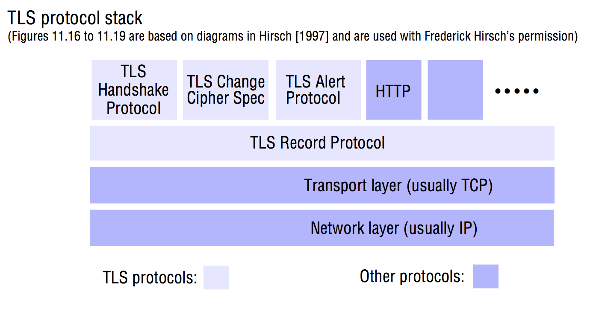
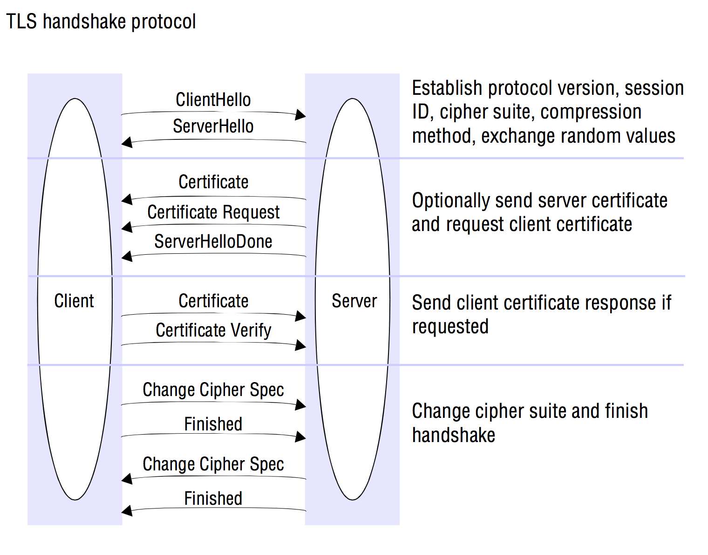

# Security
> Coulouris 11, except 11.3.1-11.3.3 (inclusive).

The need for security mechanisms in distributed systems arises from the desire to share resources. Resources that are not shared can generally be protected by isolating them from external access.

A good starting point for identification of security requirements is:
- Processes encapsulate resources and allow clients to access them through interfaces.
	-	Users or other processes are authorized to operate on resources.
	- Resources must be protected against unauthorized access.
- Processes interact through a network that is shared by many users.
	-	Enemies can access the network. They can copy or attempt to read any message transmitted through the network and they can inject arbitrary messages, addressed to any destination and purporting to come from any source, into the network.

### The role of cryptography
Digital cryptography provides the basis for most computer security mechanisms.

Cryptography is the art of encoding information in a format that only the intended recipients can decode.

Cryptography can also be employed to provide proof of the authenticity of information, analogous to the use of signatures in conventional transactions.

### Familiar names for *participants* in security protocols
<table>
	<tr>
		<td>Name</td>
		<td>Role</t>
	</tr>
	<tr>
		<td>Alice</td>
		<td>First participant</t>
	</tr>
	<tr>
		<td>Bob</td>
		<td>Second participant</t>
	</tr>
	<tr>
		<td>Carol</td>
		<td>Participant in three- and four-party protocols.</t>
	</tr>
	<tr>
		<td>Dave</td>
		<td>Participant in four-party protocols</t>
	</tr>
	<tr>
		<td>Eve</td>
		<td>Eavesdropper</t>
	</tr>
	<tr>
		<td>Mallory</td>
		<td>Malicious attacker</t>
	</tr>
	<tr>
		<td>Sara</td>
		<td>A server</t>
	</tr>
</table>

### Threats and attacks
Security threats fall into 3 broad classes:
- *Leakage*: Refers to the acquisition of information by unauthorized recipients.
- *Tampering*: Refers to the unauthorized alteration of information.
- *Vandalism*: Refers to interference with the proper operation of a system without gain to the perpetrator.

Attacks on distributed systems depend upon obtaining access to existing communication channels or establishing new channels that masquerade as authorized connections.
- *Eavesdropping*: Obtaining copies of messages without authority.
- *Masquerading*: Sending or receiving messages using the identity of another principal without their authority.
- *Message tampering*: Intercepting messages and altering their contents before passing them on to the intended recipient.
	- One example of this is *man-in-the-middle* attacks where the very first message in an exchange of encryption keys to establish a secure connection is intercepted. The attacker substitutes compromised keys that enable them to decrypt subsequent messages before re-encrypting them in the correct keys and passing them on.
- *Replaying*: Storing intercepted messages and sending them at a later date. This attack may be effective even with authenticated and encrypted messages.
- *Denial of service*: Flooding a channel or other resource with messages in order to deny access for others.

### Information Leakage
If the transmission of a message between two processes can be observed, some information can be gleaned from its mere existence.

## Overview of security techniques
When designing for security, it is necessary to assume the worst.

A few expenses and inconveniences of designing for security:
- A cost is incurred. The cost must be balanced against the threats.
- Inappropriately specified security measures may exclude legitimate users from performing necessary actions.

- **Worst-case assumptions and design guidelines**:
	-	**Interfaces are exposed**: Distributed systems are composed of processes that offer services or share information. Their communication interfaces are necessarily open to allow new clients to access them. An attacker can send a message to any interface.
	- **Networks are insecure**: For example, message sources can be falsified. Messages can be made to look as though they came from Alice when they were actually sent by Mallory. Host addresses can be 'spoofed' - Mallory can connect to the network with the same address as Alice and receive copies of messages intended for her.
	- **Limit the lifetime and scope of each secret**: When a secret key is first generated, we can be confident that it has not been compromised. **The longer we use it, and the more widely it is known, the greater the risk. The use of secrets such as passwords and shared secret keys should be time-limited and sharing should be restricted.**
	- **Algorithms and program code are available to attackers**: The bigger and the more widely distributed a secret is, the greater the risk of its disclosure. Secret encryption algorithms are totally inadequate for today's large-scale network environments.
	- **Attackers may have access to large resources**: Prepare for the fact that DDoS attacks can happen.
	- **Minimize the trusted base**: All the hardware and software components upon which your application builds have to be trusted. Any defect or programming error in this trusted base can produce security weaknesses, so we should aim to minimize its size.

## Cryptography

The process of encoding a message in such a way as to hide its contents.

Modern cryptography includes several algorithms which are all based on the use of secrets called *keys*.

### Cryptographic keys
A cryptographic key is a parameter used in an encryption algorithm in such a way that the encryption cannot be reversed without knowledge of the key.

There are two main classes of encryption algorithms in general use:

- Usage of *shared keys*: The sender and the recipient must share a knowledge of the key and it must not be revealed to anyone else.
- Usage of *public/private key pairs*: The sender of a message uses a *public key* - one that has already been published by the recipient - to encrypt the message. The recipient uses a corresponding *private key* to decrypt the message. Although many principals may examine the public key, only the recipient can decrypt the message, because they have the private key.

Public-key encryption algorithms usually require from 100 to 1000 times as much processing power as secret-key algorithms, but their convenience outweighs this disadvantage in many situations.

### Notations
<table>
	<caption>Cryptography notations</caption>
	<tr>
		<td><em>KA</em></td>
		<td>Alice's secret key</td>
	</tr>
	<tr>
		<td><em>KB</em></td>
		<td>Bob's secret key</td>
	</tr>
	<tr>
		<td><em>KAB</em></td>
		<td>Secret key shared between Alice and Bob</td>
	</tr>
	<tr>
		<td><em>KApriv</em></td>
		<td>Alice's private key (known only to Alice)</td>
	</tr>
	<tr>
		<td><em>KApub</em></td>
		<td>Alice's public key (published by Alice for anyone to read)</td>
	</tr>
	<tr>
		<td><em>{M}K</em></td>
		<td>Message M encrypted with key K</td>
	</tr>
	<tr>
		<td><em>[M]K</em></td>
		<td>Message M signed with key K</td>
	</tr>
</table>

### Uses of cryptography

#### Secrecy and integrity

Cryptography is used to maintain the secrecy and integrity of information whenever it is exposed to potential attacks. For example, during transmission across networks that are vulnerable to eavesdropping and message tampering. This corresponds to the traditional role of cryptography in the military and intelligence activities. As long as the decryption key is not *compromised*, the actual contents of the encrypted message are secure. Obviously, it also requires en encryption algorithm to be strong enough to defeat any possible attempts to crack it.

##### Example of secret communication with a **shared** secret key

If Alice wants to send some information secretly to Bob using shared key encryption, that is doable as long as Alice *and* Bob share a secret key *KAB*:

1. Alice uses KAB and an agreed encryption function *Encrypt(KAB, Message)* to encrypt and send any number of messages *{Mi}KAB* to Bob. Alice can go on using KAB as long as it is safe to assume that KAB has not been compromised.

2. Bob decrypts the encrypted messages using the corresponding decryption function *Decrypt(KAB, Message)*.

Bob can now read the original message. If it includes some value agreed between Alice and Bob (such as a checksum of the message), then Bob knows that the message is from Alice and that it hasn't been tampered with.

**But how can Alice send a shared key KAB to Bob securely?**

**And how does Bob know that any *{Mi}* isn't a copy of an earlier encrypted message from Alice that was captured by Mallory and replayed later?** Mallory wouldn't need to have the key KAB in order to carry out this attack. He could simply send it to Bob later. For instance, if the message is a request to pay some money to someone, Mallory might trick Bob into paying twice.

#### Authentication
Cryptography is used in support of mechanisms for authenticating communication between pairs of principals. A principal who decrypts a message successfully using a particular key can assume that the message is authentic if it contains a correct checksum or some other expected value. They can infer that the sender of the message possessed the corresponding encryption key and hence deduce the identity of the sender if the key is known only to two parties. Thus if keys are held in private, a successful decryption authenticates the decrypted message as coming from a particular sender.

##### Example of authenticated communication with a server.
If Alice wants to access files held by Bob, a file server on the local network of the organization where she works.

Sara is an authentication server that is securely managed. Sara issues users with passwords and holds current secret keys for all of the principals in the system it servers (generated by applying some transformation to the user's password).

For example, it knows Alice's key KA and Bob's KB.

1. Alice sends an unencrypted message to Sara stating her identity and requesting a ticket for access to Bob.

2. Sara sends a response to Alice encrypted in KA consisting of a ticket (to be sent to Bob with each request for file access) encrypted in KB and a new secret key KAB for use when communicating with Bob. The full response Alice receives looks like this: *{{Ticket}KB, KAB}KA*.

3. Alice decrypts the response using KA which she generates from her password using the same transformation. If Alice has the correct password-derived key KA, she obtains a valid ticket for using Bob's service and a new encryption key for use in communicating with Bob. Alice can't decrypt or tamper with the ticket, because it is encrypted in KB.

4. Alice sends the ticket to Bob together with her identity and a request *R* to access a file: *{Ticket}KB, Alice, R*.

5. Bob decrypts the *Ticket* using his key KB and gets *{KAB, Alice}*. So, now he has the authentic identity of Alice as well as a new shared secret key KAB for use when interacting with Alice.

Note that in this example, there is no protection against the replay of old authentication messages.

This example, again using *Shared key* encryption is not that practical for wide area applications where public-key cryptography is much preferable.

### Challenges
A user's password does not have to be submitted to an authentication server each time it is authenticated. Instead, a cryptographic *challenge* can be sent to the user. In the example above, step 2 is a cryptographic challenge. The authentication server sent Alice a ticket immediately, but it was encrypted with Alice's key, and she can only decrypt it if she can determine KA which is derived from her password.

### Example of authenticated communication with public keys
In this example, Bob has generated a public/private key pair.

1. Alice accesses a key distribution service to obtain a *public-key certificate* that can give Bob's public key. It is called a certificate because it is signed by a trusted authority - a person or an organization that is widely known to be reliable. After checking the signature, she reads Bob's public key, KBpub from the certificate.

2. Alice creates a new shared key, KAB, and encrypts it using KBpub with a public-key algorithm. She sends the result to Bob, along with a name that uniquely identifies a public/private key pair (since Bob may have several of them). All in all, this is what Alice sends: *keyname, {KAB}KBpub*.

3. Bob selects the corresponding private key, KBpriv from his private key store and uses it to decrypt KAB. If Alice's message tot Bob had been corrupted or tampered with in transit, Bob and Alice simply wouldn't share the same key KAB.

**This illustrates the use of public-key cryptography to distribute a shared secret key and is known as a *hybrid cryptographic protocol*.**

There is one problem: This kind of key exchange is vulnerable to man-in-the-middle attacks. Mallory may intercept Alice's initial request to the key distribution service for Bob's public-key certificate and send a response containing *his* own public key. He can then intercept all the subsequent messages.

**To prevent this, we require Bob's certificate to be signed by a well-known authority.** Also, Alice must ensure that Bob's public-key certificate is signed with a public key that she has received in a *totally* secure manner.

### Digital signatures
A digital signature emulates the role of a conventional signature, verifying to a third party that a message or a document is an unaltered copy of one produced by the signer.

Digital signature techniques are based upon an irreversible binding to the message or document of a secret known only to the signer. This can be achieved by encrypting the message or even better by encrypting a compressed form of the message called a *digest* using a key that is known only to the signer.

#### Digest
A digest is a fixed-length value computed by applying a *secure digest function*. A secure digest function is similar to a checksum function, but it is very unlikely to produce a similar digest value for two different messages.

The resulting encrypted digest acts as a signature that accompanies the message.

Public-key cryptography is generally used for this. The originator generates a signature with their private key, and the signature can be decrypted by any recipient using the corresponding public key.

The verifier should be sure that the public key really is that of the principal claiming to be the signer by the use of public-key certificates.

### Example of digital signatures with a secure digest function
So, lets say that Alice wants to sign a document *M* such that any subsequent recipient can verify that she is the originator of it.

Thus, when Bob later accesses the signed document after receiving it by any route and from any source, he can verify that Alice is the originator.

1. Alice computes a fixed-length digest of the document, *Digest(M)*.

2. Alice encrypts the digest in her private key, appends it to *M* and makes the result, *M, {Digest(M)}KApriv*, available to the intended users.

3. Bob obtains the signed document, extracts M and computes *Digest(M)*.

4. Bob decrypts {Digest(M)KApriv} using Alice's public key *KApub* and compares the result with his calculated *Digest(M)*. If they match, the signature is valid.

### Certificates
A digital certificate is a document containing a statement signed by a principal.

Imagine that Bob is a bank. When his customers establish contact with him, they need to be sure that they are talking to Bob the bank, even if they have never contacted him before. And also, Bob needs to authenticate his customers before he gives them access to their accounts.

It might be useful for Alice to obtain a certificate from her bank stating her bank account number. Alice could then use this certificate when shopping to certify that she has an account with Bob's Bank. That certificate is signed using Bob's private key *KBpriv*. A vendor, Carol, can accept such a certificate for charging items to Alice's account provided that she can validate the signature. To do so, Carol needs to have Bob's public key and she needs to be sure that it is authentic to guard against the possibility that Alice might sign a false certificate associating her name with someone else's account. To do so, Alice would simply generate a new key pair, *KB'pub, KB'priv* and use them to generate a forged certificate purporting to come from Bob's Bank.

What Carol needs is a certificate stating Bob's public key, signed by a well-known and trusted authority. That could be Fred, whose role is to certify the public keys of banks. Fred could issue a public-key certificate for Bob. Obviously, Carol needs to be able to trust the authenticity of Fred too, that he is a trusted authority. If Carol obtains KFpub (Fred's public key) by some means she can have confidence in, like directly from a representative for Fred, she can be certain of that. **This is an illustration of a certification chain, one with two links. The longer the chain, the greater the risk of a weak link**.

#### Requirements for useful Certificates

- A standard format and representation for them so that certificate issuers and certificate users can successfully construct and interpret them.

- Agreement on the manner in which chains of certificates are constructed and in particular the notion of a trusted authority.

#### Revoking a Certificate

All certificates has an expiry date. Anyone receiving an expired certificate should reject it, and the subject of the certificate must request its renewal.

## Access control
The concepts on which the control of access to resources in distributed systems is based.

Access control decisions are usually left to application-level code.

### Protection domains
An execution environment shared by a collection of processes.

Contains a set of `<resource, rights>` pairs, listing the resources that can be accessed by all processes executing within the domain and specifying the operations permitted on each resource. Usually associated with a given principal. When a user logs in, their identity is authenticated and a protection domain is created for the processes that they will run. These domains can be directly associated with a given user or through the groups the user is part of.

A protection domain is only an abstraction. There are alternative implementations such as *capabilities* and *access control lists*

### Capability
A capability is a binary value that acts as an access key, allowing the holder access to certain operations on a specified resource. Capabilities take form such as:
<table>
	<tr>
		<td><em>Resource identifier</em></td>
		<td>A unique identifier for the target resource</td>
	</tr>
	<tr>
		<td><em>Operations</em></td>
		<td>A list of the operations permitted on the resource</td>
	</tr>
	<tr>
		<td><em>Authentication code</em></td>
		<td>A digital signature making the capability unforgeable</td>
	</tr>
</table>

### Capabilities
A set of capabilities held by each process according to the domain in which it is located.

Services only supply capabilities to clients when they have authenticated them as belonging to the claimed protection domain.

When capabilities are used, client requests are of the form `<operation, userId, capability>`. That is, they include a capability for the resource to be accessed instead of a simple identifier, giving the server immediate proof that the client is authorized to access the resource identified by the capability with the operations specified by the capability.

A major advantage of capabilities is that they constitute a self-contained access key, just as a physical key to a door lock is an access key to the building that the lock protects.

There are two drawbacks:

- *Key theft*: Anyone who holds the key to a building can use it to gain access, whether or not they are an authorized holder of the key. They have stolen it.

- *The revocation problem*: The entitlement to hold a key changes with time. The holder may cease to be an employee of the owner of the building, but they might retain the key, or a copy of it, and use it in an unauthorized manner.

So, the two problems becomes:
- Capabilities may fall into the hands of principals other than those to whom they were issued. Servers are then powerless to prevent them from being used.
- Canceling capabilities is difficult. The status of the holder may change and their access rights should change accordingly, *but* they can still use their capabilities.

### Access control lists
A list is stored with each resource, containing an entry of the form `<domain, operations>` for each domain that has access to the resource and giving the operations permitted to the domain.

a domain may be specified by an identifier for a principal or it may be an expression that can be used to determine a principal's membership of the domain.

**This is the scheme adopted in most file systems including UNIX and Windows NT where a set of access permission bits is associated with each file and the domains to which the permissions are granted are defined by reference to the ownership information stored with each file.**

Server requests is then on the form `<operation, principal, resource>`. For each request, the server then authenticates the principal and checks to see that the requested operation is included in the principal's entry in the access control list of the relevant resource.

### Implementation
Digital signatures, credentials and public-key certificates provide the cryptographic basis for secure access control.

## Credentials
Are a set of evidence provided by a principal when requesting access to a resource.

In the simplest case, a certificate from a relevant authority stating the principal's identity is sufficient, and this would be used to check the principal's permissions in an access control list.

It is not convenient to require users to interact with the system and authenticate themselves each time their authority is required to perform an operation on a protected resource. Instead, the notion that a credential *speaks for* a principal is introduced. That means that a user's public-key certificate speaks for that user - any process receiving a request authenticated with the user's private key can assume that the request was issued by that user.

### Delegation
One particularly useful form of credential is one that entitles a principal (or a process acting for a principal) to perform an action with the authority of another principal.

A need for delegation can arise in any situation where a service needs to access a protected resource in order to complete an action on behalf of its client.

It can be achieved using a delegation certificate or a capability.
- If using certificates, the certificate is signed by the requesting principal and it authorizes another principal to access a named resource.
- If using capabilities, well one of main points (for better or worse) with capabilities is that you don't have to identify the principals. You can just pass in a capability to access a resource in a request to a server.

### Firewalls
Firewalls produce a local communication environment in which all external communication is intercepted. Messages are forwarded to the intended local recipient only for communications that are explicitly authorized.

Access to internal networks may be controlled by firewalls, **but access to public services on the Internet is unrestricted because their purpose is to offer services to a wide range of users**.

Firewalls are not effective against DDoS attacks because the flood of messages generated by such an attack overwhelms any single point of defense, including a firewall.

So, the point here is that a firewall doesn't really help with securing a public web service.

## Cryptographic algorithms
To encrypt a message, the sender applies some rule to transform the *plaintext* (any sequence of bits) message to a *ciphertext* (a different sequence of bits).

**The recipient must know the inverse rule in order to transform the ciphertext back into the original plaintext**.

Other principals are unable to decipher the message unless they also know the inverse rule.

The encryption transformation is defined with two parts, a *function E* (encrypt) and a *key K* (key). The resulting encrypted message is written *{M}K* .

*E(K,M) = {M}K*

The encryption function *E* defines an algorithm that transforms data items in plaintext into encrypted data items by combining them with the key and transposing them in a manner that is heavily dependent on the value of the key.

Decryption is carried out using an inverse function *D* which also takes a key as a parameter. For secret-key encryption, the key used for decryption is the same as that used for encryption:

*D(K, E(K, M)) = M*.

Because of its symmetrical use of keys, secret-key cryptography is often referred to as *symmetric cryptography* whereas public-key cryptography is referred to as *asymmetric cryptography* because the keys used for encryption an decryption are different.

### Symmetric algorithms
#### One-way functions
It is a strong property of encryption functions that *E(K,M)* is relatively easy to compute whereas the inverse is so hard to compute that it is not feasible. **This is called one-way functions.**

The effectiveness of any method for encrypting information depends upon the use of an encryption function *FK* that has this one-way property. It is this that protects against attacks designed to discover *M* given *{M}K*.

For well-designed symmetric algorithms, their strength against attempts to discover *K* given a plaintext *M* and the corresponding ciphertext *{M}K* depends on the size of *K*. This is because the most effective general form of attack is the crudest, known as a *brute-force-attack*.

#### brute-force-attacks
The approach is to run through all possible values of *K*, computing *E(K, M)* until the result matches the value of *{M}K* that is already known.

If *K* has *N* bits, then such an attack requires *2N-1* iterations on average, and a maximum of *2N* iterations, to find *K*.

**Hence the time to crack *K* is exponential in the number of bits in *K*.**

### Asymmetric algorithms
When public/private key pairs are used, one-way functions are exploited in another way.

The basis for all public-key schemes is the existence of *trap-door functions*.

#### Trap-door functions
A trap-door function is a one-way function with a secret exit. It is easy to compute in one direction but infeasible to compute the inverse *unless* a secret is known.

#### RSA is pretty awesome
RSA multiplies very large primes together. This use of multiplication is very easy to compute, but is computationally infeasible to derive the original multiplicands from the product, - that is - to factorize the product (except when quantum computing really kicks off and [Shor's algorithm](https://en.wikipedia.org/wiki/Shor's_algorithm) fucks everything up).

RSA obscures the plaintext by treating each block of bits as a binary number and raising it to the power of the key, modulo *N*. The resulting number is the corresponding ciphertext block.

The size of *N* and at least one of the pair of keys is much larger than the safe key size for symmetric keys to ensure that *N* is not factorizable. For this reason, the potential for brute-force attacks on RSA is small - its resistance to attacks depends on the infeasibility of factorizing *N*.

### Block ciphers
Most encryption algorithms operate on fixed-size b locks of data. Some time ago, 64-bits was a popular size for the blocks. Nowadays, at least 256-bits are considered standard with SHA-2.

A message is subdivided into blocks. The last block is padded to the standard length if necessary and each block is encrypted independently. The first block is available for transmission as soon as it has been encrypted.

For a simple block cipher, the value of each block of ciphertext does not depend upon the preceding blocks. **However, this constitutes a weakness, since an attacker can recognize repeated patterns and infer the relationship to the plaintext**.

Also, the integrity of messages are *not* guaranteed unless a checksum or secure digest mechanism is used.

Most block cipher algorithms employ cipher block chaining (CB) to overcome this

#### Cipher Block Chaining (CBC)
Here, each plaintext block is combined with the preceding ciphertext block using the exclusive OR operation (XOR) before it is encrypted.

On decryption, the block is decrypted and then the preceding encrypted block is XOR-ed with it to obtain the new plaintext block. This works because the XOR operation is its own inverse.

**CBC is intended to prevent identical portions of plaintext encrypting to identical pieces of ciphertext.**

There is one problem. If we open encrypted connections to more destinations and send the same message, the encrypted sequences of blocks will be the same, and an eavesdropper might gain some useful information from this.

To prevent this, a different piece of plaintext is inserted in front of each message. This is called an *initialization vector*, for instance, a timestamp could be used - then every message would have a different plaintext block. Thus, every message would be unique, even for identical messages.

### Stream ciphers
There is some applications where encryption in blocks is inappropriate, because the data streams are produced in real time in small chunks. For instance, telephone conversations or video streaming.

Data samples can be as small as a single bit, and it would be wasteful to pad this or each of these to 64 bits before encrypting and transmitting them.

Stream ciphers are encryption algorithms that can perform encryption incrementally, converting plaintext to ciphertext one bit at a time.

You can convert a block cipher algorithm for use as a stream cipher by constructing a *keystream generator*. That's an arbitrary-length sequence of bits that can be used to obscure the contents of a data stream by XOR-ing the keystream with the data stream.

#### Keystream generator
A keystream generator can be constructed by iterating a mathematical function over a range of input values to produce a continuous stream of output values. These are then concatenated to make plaintext blocks, and the blocks are encrypted using a key shared by the sender and the receiver.

### Design of cryptographic algorithms
There are many well-designed cryptographic algorithms such that *E(K,M) = {M}K* conceals the value *M* and makes it practically impossible to retrieve *K* more quickly than by brute force.

#### Confusion and Diffusion
The principles behind these algorithms are *confusion* and *diffusion* and is meant to conceal the content of a ciphertext block *M*, combining it with a key *K* of sufficient size to render it proof against brute-force attacks.

- **Confusion**: Non-destructive operations such as XOR and circular shifting are used to combine each block of plaintext with the key, producing a new bit pattern that obscures the relationship between the blocks in *M* and *{M}K*.

If the blocks are larger than a few characters, this will defeat analysis based on a knowledge of character frequencies.

- **Diffusion**: There is usually repetition and redundancy in the plaintext. Diffusion dissipates the regular patterns that result by transposing portions of each plaintext block. Diffusion dissipates the regular patterns that result by transposing portions of each plaintext block.

## Digital signatures
We need signatures to verify that a document is:

- *Authentic*: It convinces the recipient that the signer deliberately signed the document and that it has not been altered by anyone else.

- *Unforgeable*: It provides proof that the signer, and no one else, deliberately signed the document. The signature cannot be copied and placed on another document.

- *Non-repudiable*: The signer cannot credibly deny that the document was signed by them.

Like hand written signatures, digital signatures depend upon the binding of a unique and secret attribute of the signer to a document. In handwritten signatures, the secret is the handwriting pattern of the signer. What is needed for a digital signature is a means to irrevocably bind a signer's identity to the entire sequence of bits representing a document.

### Digital signing
To sign a message, a principal Alice encrypts a copy of the message *M* with a key *KAlice* and attaches it to a plaintext copy of *M* and *Alice*'s identifier.

All in all, the signed document then consists of: *M, Alice, [M]KAlice*.

The signature can be verified by a principal that subsequently receives the document to check that it was originated by *A* and that its contents *M* have not subsequently been altered.

If a secret key is used to encrypt the document, only principals that share the secret can verify the signature. But if public-key cryptography is used, then the signer uses their private key and anyone who has the corresponding public key can verify the signature.

### Digest functions
Also called *secure hash functions* and denoted *H(M)*.

**They must be carefully designed to ensure that *H(M)* is different from *H(M')* for all likely pairs of messages *M* and *M'*.**

If there are any pairs of different messages *M* and *M'* such that *H(M) = H(M')*, then a duplicitous principal could send a signed copy of *M*, but when confronted with it claim that *M'* was originally sent and that it must have been altered in transit.

## Digital signatures with public keys
Public-key cryptography is particularly well adapted for digital signatures because it is simple and doesn't require any communication between the recipient of a signed document and the signer or any third party.

For Alice to sign a message *M* and Bob to verify it, it is as follows:

1. Alice generates a key pair *Kpub* and *Kpriv* and publishes the public key *Kpub* by placing it in a well-known location.

2. Alice computes the digest of *M*: *H(M)*, **using an agreed secure hash function *H* and encrypts it using the private key *Kpriv to produce the signature *S = {H(M)}Kpriv*.**

3. Alice sends the signed message *[M]K = M,S to Bob*.

4. *Bob* decrypts *S* using *Kpub* and computes the digest of *M, H(M)*. If they match, the signature is valid.

**The RSA algorithm is suitable for use in constructing digital signatures.**

## Digital signatures with secret keys - MACs
Secret-key encryption can also be used, though not as popular since it isn't that convenient to require both parties to hold the same key.

Also, it kind of weakens the security of signatures with a key if it is disclosed. A signature could be forged by a holder of the key who is not the owner of it.

So, you'll probably want to go for public-key encryption at all times for generating and verifying digital signatures - **except for one: If you want to transmit unencrypted messages through a secure channel but there is a need to verify the authenticity of the messages.**.

In that case, we know that we have secure communication between a pair of processes both of which must share a secret key. We can then produce low-cost signatures called *message authentication codes (MACs)* to reflect their more limited purpose - they authenticate communication between pairs of principals based on a shared secret.

Here's how to do that:

1. Alice generates a random key *K* for signing and distributes it using secure channels to one or more principals who will need to authenticate messages received from her. The principals are *trusted* not to disclose the shared key.

2. For any document *M* that Alice wishes to sign, Alice concatenates *M* with *K*, computes the digest of the result, *h = H(M + K)* and sends the signed document *[M]K = M, h* to anyone wishing to verify the signature. The digest *h* is a MAC. *K* will not be compromised by the disclosure of *h*, since the hash function has totally obscured its value.

3. The receiver, Bob, concatenates the secret key *K* with the received document *M* and computes the digest *h' = H(M + K)*. The signature is verified if *h = h'*.

## Secure digest functions
There are many ways to produce a fixed-length bit pattern that characterizes an arbitrary-length message or document.

You could simply use the XOR operation iteratively to combine fixed-length pieces of the source document. That would be inadequate as the basis for a digital signature scheme.

A secure digest function *h = H(M)* should have the following properties:

1. Given *M*, it is easy to compute *h*.

2. Given *h*, it is hard to compute *M*.

3. Given *M*, it is hard to find another message *M'*, such that *H(M) = H(M')*.

**Such functions are called *one-way hash functions*.**
The reason is the two first properties.

The third property demands: Even though we know that the result of a hash function cannot be unique because the digest is an information-reducing transformation, we need to be sure that an attacker, given a message *M* that produces a hash *h* cannot discover another message *M'* that also produces *h*. If an attacker could do this, he could forge a signed document *M'* without knowledge of the signing key by copying the signature from the signed document *M* and appending it to *M'*.

The feasibility of an attacker producing a message *M'* that has the same hash value is incredibly low for modern sizes of hashes (~256-bits), but it could be done using a so-called *birthday attack*.

#### Birthday attack

1. Alice prepares two messages, *M* and *M'* of a contract to Bob. *M* is favorable to Bob and *M'* is not.

2. Alice makes several subtly different versions of both *M* and *M'* that are visually indistinguishable from each other by methods such as adding spaces at the ends of lines or whatever. She compares the hashes of all the <em>M</em>s with all the <em>M'</em>s. If she finds two that are the same, she can proceed to the next step. Otherwise, she keeps on producing visually indistinguishable versions of the two documents until she gets a match.

3. When she has a pair of documents *M* and *M'* (she will eventually, it just might take a century) that hash to the same value, she gives the favorable document *M* to Bob for him to sign with a digital signature using his private key. When he returns it, she substitutes the matching unfavorable version *M'*, retaining the signature from *M*.

Let's see about the probability of this stuff.
If our hash values are 64 bits long, we require only 232 version of *M* and *M'* on average.

**That is not enough**. We need to make our hash values at least 128-bits long (well actually I think 256-bits for modern computers, considering cloud computing) to guard against this type of attack.

### Popular digest functions
Two widely popular ones at the time the course book was written was the MD5 algorithm and the SHA-1 algorithm.

**The book goes on to call MD5 secure, but it actually isn't secure at all since it is incredibly easy to find collisions.**

#### MD5
Uses four rounds, each applying one of four nonlinear functions to each of 16 32-bit segments of a 512-bit block of source text. The result is a 128-bit digest. MD5 is one of the most efficient algorithms available (but is strongly discouraged I'd say!).

#### SHA-1
An algorithm that produces a 160-bit digest. Actually based on MD4, but with some additional operations. Much slower than MD5, but the 160-bit digest does offer greater security against brute-force and birthday-style attacks.

#### Using an encryption algorithm to make a digest
To use a symmetric encryption algorithm to produce a secure digest, the key should be published so that the digest algorithm can be applied by anyone wishing to verify a digital signature.

## Certificate standards and certificate authorities
The X.509 is the most widely used standard format for certificates.

- It binds a public key to a named entity called a *subject*.
- The binding is in the signature which is issued by another named entity called the *issuer*.
- It has a *period of validity*, which is defined by a pair of dates.

This format is included in the TLS protocol and is widely used in practice to authenticate the public keys of services and their clients.

There are organizations that have established themselves to act as *certificate authorities* such as Verisign, DigiCert and GeoTrust.

Other companies and individuals can obtain X.509 public-key certificates from them by submitting satisfactory evidence of their identity.

There is a two-step verification procedure for any X.509 certificate:

1. Obtain the public-key certificate of the issuer from a reliable source.

2. Validate the signature.

### The Simple Public-Key Infrastructure (SPKI) approach
SPKI is a scheme for creating and managing a set of public certificates. It enables chains of certificates to be processed using logical inference to produce derived certificates.

For example, if Bob believes that Alice's public key is *KApub* and Carol trusts Bob on Alice's keys, that implies that Carol also believes that Alice's public key is *KApub*

### Nonces (Completely unrelated to the current section by the way)
A *nonce* is an integer value that is added to a message to demonstrate its freshness. Are used only once and are generated on demand.

## Cryptography pragmatics

### Applications of cryptography and political obstacles
One thing that we here time and again (lately with Apple and the FBI) is that law-enforcement wants the inclusion of loopholes or trap doors available only to them and other security agencies included in software using encryption. That's because encrypted communication channels can be very useful to criminals.

## Securing electronic transactions with secure sockets

The Secure Sockets Layer (SSL) protocol was originally developed by the Netscape corporation and proposed as a standard. An extended version of SSL has been adopted as an Internet standard under the name Transport Layer Security (TLS). It is supported by practically all browsers and is widely used.

The main features are:

### Negotiable encryption and authentication algorithms
In an open network, we should never assume that all parties use the same client software or that all client and server software includes a particular encryption algorithm.

There are even countries attempting to restrict the use of certain encryption algorithms.

TLS has been designed so that the algorithms used for encryption and authentication are negotiated between the processes at the two ends of the connection during the initial *handshake*. **If they do not have sufficient algorithms in common, the connection attempt will fail.**

### Bootstrapped secure communication
A secure channel is established in a way that doesn't require previous negotiation or help from third parties.

1. Unencrypted communication is used for the initial exchanges.
2. Then public-key cryptography.
3. Finally secret-key cryptography, once a shared secret key has been established.

### TLS layers
TLS consists of two layers:
- **TLS Record Protocol Layer**: Implements a secure channel, encrypting and authenticating messages transmitted through any connection-oriented protocol (such as TCP).
- **A handshake layer**: Contains the TLS Handshake Protocol and two other related protocols that establish and maintain a TLS session (that is, a secure channel) between a client and a server.

Each secure session is given an identifier, and each partner can store session identifiers in a cache for subsequent reuse, avoiding the overhead of establishing a new session when another secure session with the same partner is required.

#### TLS Record Protocol Layer
Is a session-level layer. Can be used to transport application-level data transparently between a pair of processes while guaranteeing its secrecy, integrity and authenticity.

#### HTTPS
Needless to say, TLS uses the protocol prefix *https:* in URLs to establish a secure TLS channel between a browser and a web server.

Though, let it be known that it also have secure implementations in Telnet, FTP and many other application protocols.

### TLS vulnerabilities
Well, the initial TLS handshake is potentially vulnerable to man-in-the-middle attacks. To protect against them, the public key used to verify the first certificate received may be delivered by a separate channel.

### TLS Cipher suite
TLS supports a variety of cryptographic functions to be used.
**These are collectively known as a *cypher suite*.**

### TLS Handshake options
<table>
	<caption>TLS handshake configuration options</caption>
	<tr>
		<td><strong>Component</strong></td>
		<td><strong>Description</strong></td>
		<td><strong>Example</strong></td>
	</tr>
	<tr>
		<td>Key exchange method</td>
		<td>The method to be used for exchange of a session key</td>
		<td>RSA with public-key certificates</td>
	</tr>
	<tr>
		<td>Cipher for data transfer</td>
		<td>The block or stream cipher to be used for data</td>
		<td>IDEA</td>
	</tr>
	<tr>
		<td>Message digest function</td>
		<td>For creating message authentication codes (MACs)</td>
		<td>SHA-1</td>
	</tr>
</table>

### TLS Handshake process

1. The server offers the client a list of the cipher suite identifiers that it has available.

2. The client responds by selecting one of them or indicating an error if it has none that match.

3. The client and server agree on an optional compression method and a random start value for CBC block encryption functions.

4. The partners optionally authenticate each other by exchanging signed public-key certificates in X.509 format. These can be obtained from a public-key authority or they may simply be generated temporarily for the purpose. In any case, at least one public key must be available for use in the next stage of the handshake.

5. One partner then generates a *pre-master secret* and sends it to the other partner encrypted with the public key. A pre-master secret is a large random value that is used by both partners to generate the two session keys (called *write* keys) for encrypting data in each direction as well as the message authentication secrets to be used for message authentication.

6. A secure session now begins.

### TLS message transmission process

1. A message for transmission is first fragmented into blocks of manageable size and then optionally compressed.

2. The encryption and message authentication (MAC) transformations deploy the algorithms specified in the agreed cipher suite.

3. The signed and encrypted block is transmitted to the partner through the associated TCP connection, where the transformations are reversed to produce the original data block.

### Requirements
**The only requirement for TLS is that the public-key certificates are issued by an authority recognized by both parties.**
