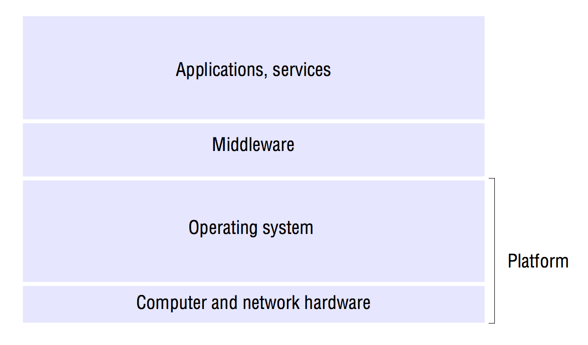
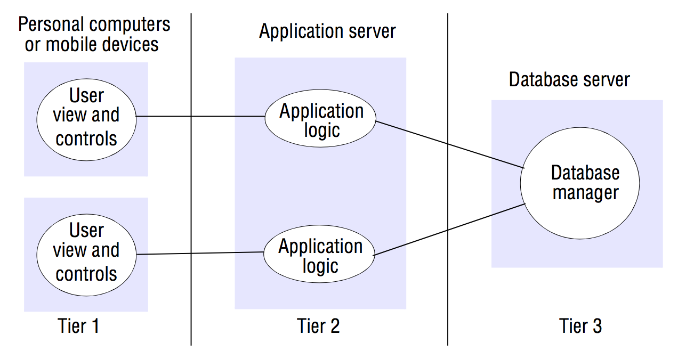

# System models
> Colouris, chapter 2

### Transparency in distributed

Is the concealment from the user and application programmer of the separation of components in a distributed system, so that the system is perceived as a whole rather than as a collection of independent components.

There are eight forms of relevant transparency:

- *Access transparency*: Enables local and remote resources to be accessed using identical operations.

- *Location transparency*: Enables resources to be accessed without knowledge of their physical or network location (for example, which building or IP address).

- *Concurrency transparency*: Enables several processes to operate concurrently using shared resources without interference between them.

- *Replication transparency*: Enables multiple instances of resources to be used to increase reliability and performance without knowledge of the replicas by users or application programmers.

- *Failure transparency*: Enables the concealment of faults, allowing users and application programs to complete their tasks despite the failure of hardware or software components.

- *Mobility transparency*: Allows the movement of resources and clients within a system without affecting the operation of users or programs.

- *Performance transparency*: Allows the system to be reconfigured to improve performance as loads vary.

- *Scaling transparency*: Allows the system and applications to expand in scale without change to the system structure or the application algorithms.

**The two most important ones are access and location transparency**. Their presence or absence most strongly affects the utilization of distributed resources. **They are sometimes referred to together as network transparency**.

### Introduction
The design of distributed systems can be usefully described and discussed through the following kinds of models:
- **Physical models**: Considers the types of computers and devices that constitute a system and their interconnectivity, without details of specific technologies.

Physical models are the most explicit way in which to describe a system. They capture the **hardware composition** of a system in terms of the computers and their interconnecting networks.

- **Architectural models**: Describe a system in terms of the computational and communication tasks performed by its computational elements. Computational elements being individual computers or aggregates of them supported by appropriate network  interconnections. *Client-server* and *peer-to-peer* are two of the most commonly used forms of architectural modals for distributed systems.

- **Fundamental models** take an abstract perspective in order to describe solutions to individual issues faced by most distributed systems.

### Difficulties and threats for distributed systemsSome of the problems that designers of distributed systems face are:

- **Widely varying modes of use**: The component parts of systems are subject to wide variations in workload. For example, some web pages are accessed several million times a day. Some parts of a system may be disconnected or poorly connected some of the time.

- **Wide range of system environments**: A distributed system most accommodate *heterogeneous* hardware, operating systems and networks (hardware, operating systems and networks of different kinds). These may differ widely n performance. For instance, wireless networks operate at a fraction of the speed of local networks.

- **Internal problems**: Non-synchronized clocks, conflicting data updates and many modes of hardware and software failure involving the individual system components.

- **External threats**: Attacks on data integrity and secrecy, denial of service attacks, etc.

## Physical models
A physical model is a representation of the underlying hardware elements of a distributed system that abstracts away from specific details of the computer **and networking technologies employed.**

### Baseline physical model
A distributed system is one in which hardware or software components located at networked computers communicate and coordinate their actions only by passing messages. This leads to a minimal physical model of a distributed system as an extensible set of computer nodes interconnected by a computer network for the required passing of messages.

Beyond this baseline model, we can usefully identify 3 generations of distributed systems.

### Early distributed systems
In the late 1970s and early 1980s, distributed systems arrived in response to the emergence of LAN technology (usually Ethernet).

These systems were typically small (10-100 nodes) interconnected by a network with limited internet connectivity and supported a small range of services such as shared local printers and file servers as well as email and file transfer across the internet.

### Internet-scale distributed systems
Larger scale distributed systems started to emerge in the 90's in response to the dramatic growth of the internet during this time. Here, the underlying physical infrastructure consists of a physical model where an extensible set of nodes are interconnected by a *network of networks*.

### Contemporary distributed systems
In the above systems, nodes were typically desktop computers and relatively static. Today, we have laptops and smartphones. These do (usually) not remain in one physical location for extended periods of time.

Also, instead of discrete nodes, computers today may be embedded in everyday objects such as washing machines or other IoT devices.

Another difference is the fact that cluster architectures has become possible and led to a move from autonomous nodes to pools of nodes that together provide a given service.

### Distributed systems of systems
Can be defined as a complex system consisting of a series of subsystems that are systems in their own right and that come together to perform one or more particular tasks.

## Architectural models
Is a systems in structure in terms of separately specified components and their interrelationships. The goal is to ensure that the structure will meet present and likely future demands on it. Major concerns are to make the system reliable, manageable, adaptable and cost-effective.

(Think of architects designing a building, its kind of the same thing, including picking a style (such as neoclassic, e.g.)).

### Architectural elements
#### Communication entities
*What* is communicating and *how* are those entities communicating. Well, the entities that are communicating in distributed systems are usually *processes*. This is not all-encompassing enough, however. There may be environments where the *process* abstraction is not fitting. They may also be called *objects*, *components* or *web services*.

<table>
	<caption>Kinds of entities</caption>
	<tr>
		<td><strong>System-Oriented entities</strong></td>
		<td><strong>Problem-oriented entities</strong></td>
	</tr>
	<tr>
		<td>Nodes</td>
		<td>Objects</td>
	</tr>
	<tr>
		<td>Processes</td>
		<td>Components</td>
	</tr>
	<tr>
		<td></td>
		<td>Web Services</td>
	</tr>
</table>

#### Communication paradigms

<table>
	<caption>Kinds of entities</caption>
	<tr>
		<td><strong>Interprocess Communication</strong></td>
		<td><strong>Remote Invocation</strong></td>
		<td><strong>Indirect Communication</strong></td>
	</tr>
	<tr>
		<td>Message passing</td>
		<td>Request-Reply</td>
		<td>Group Communication</td>
	</tr>
	<tr>
		<td>Sockets</td>
		<td>Remote Procedure Calls (RPC)</td>
		<td>Publish-Subscribe</td>
	</tr>
	<tr>
		<td>Multicast</td>
		<td>Remote Method Invocation (RMI)</td>
		<td>Message queues</td>
	</tr>
	<tr>
		<td></td>
		<td></td>
		<td>Tuple spaces</td>
	</tr>
	<tr>
		<td></td>
		<td></td>
		<td>Distributed Shared Memory (DSM)</td>
	</tr>
</table>

There are:
- Interprocess Communication
- Remote invocation
- Indirect communication.

##### Interprocess communication
refers to the relatively low-level support for communication between processes in distributed systems, including message-passing primitives, direct access to the API offered by Internet protocols and support for multicast communication.

##### Remote invocation
Represents the most common communication paradigm in distributed systems, covering a range of techniques based on a two-way exchange between communicating entities in a distributed system and resulting in the calling of a remote operation, procedure or method.
Examples of those are:

- Request-reply protocols: Effectively a pattern imposed on an underlying message-passing service to support client-server computing. Such protocols typically involve a pairwise exchange of messages from client to server and them from server back to client. The first message contains an encoding of the operation to be executed at the server and also an array of bytes holding associated arguments and the second message containing any results of the operation, again encoded as an array of bytes. This approach is used in the HTTP protocol.

- Remote procedure calls: Procedures in processes on remote computers can be called as if they are procedures in the local address space. This approach directly and elegantly supports client-server computing.

- Remote method invocation: Strongly resembles Remote procedure calls, but in a world of distributed objects. Here, a calling object can invoke a method in a remote object.

These techniques all have in common that communication represents a two-way relationship between sender and receiver and receivers are also generally aware of the identity of senders and in most cases both parties must exist at the same time.

##### Indirect communication
A number of techniques have emerged whereby communication is indirect, through a third entity, allowing a stronger degree of decoupling between senders and receivers:
- Senders do not need to know who they are sending to (space uncoupling)
- Senders and receivers do not need to exist at the same time (time uncoupling),

Key techniques for indirect communication include:

- **Group communication**: Group communication is concerned with the delivery of messages to a set of recipients and is a multiparty communication paradigm supporting one-to-many communication. A group is represented in the system by a group identifier.  Recipients elect to receive messages sent to a group by joining the group.

- **Publish-Subscribe systems**: Here, a number of publishers distribute events to subscribers. A synonym for this is *Distributed event-based systems*. The crucial feature here is the *broker*, an intermediary service that efficiently ensures information generated by producers is routed to consumers who desire this information.

- **Message queues**: Whereas Publish-Subscribe systems offer a one-to-many style of communication, message queues offer a point-to-point service whereby producers processes can send messages to a specified queue and consumer processes can receive messages from the queue or be notified of the arrival of new messages in the queue. The indirection between producer and consumer processes here is the queue.

- **Tuple spaces**: Here, processes can place arbitrary items of structured data (tuples) in a persistent space and other processes can either read or remove such tuples from the tuple space by specifying patterns of interest. Since the space is persistent, readers and writers do not need to exist at the same time. This is also called *Generative communication* as a paradigm for parallel programming.

- **Distributed shared memory**: Provides an abstraction for sharing data between processes that do not share physical memory.

## Roles and responsibilities
Different processes take on given roles. Roles are fundamental in establishing the overall architecture to be adopted.

Popular examples are:

### Client-Server

The most cited architecture in regards to distributed systems. It remains most widely employed (through the web, for instance).

Here, processes take on the role as being client or server. Client processes interact with individual server processes in potentially separate host computers in order to access resources. Servers themselves may in turn be clients of other servers.

Client-Server doesn't scale well. The centralization of service provision and management implied by placing a service at a single address does not scale well beyond the capacity of the computer that hosts the service and the bandwidth of its network connections.

### Peer-To-Peer

In this architecture, all of the processes involved play similar roles, interacting cooperatively as *peers*. They run the same program and offer the same set of interfaces to each other.

P2P systems scale very well. For each new node entering the system, so does a new service provider (the node itself). It then guarantees, that for any number of service requesters R, there is an equal amount of service providers.

## Architectural patterns
These build on the more primitive architectural elements. They provide composite recurring structures that have been shown to work well in given circumstances.

### Layering
In a layered approach, a complex system is partitioned into a number of layers, with a given layer making use of the services offered by the layer below it.

A given layer therefore offers a software abstraction, with higher layers being unaware of implementation details, or indeed of any other layers beneath them.

Imagine it as a vertical organization of services into service layers.

This also means, that if one layer breaks somewhere, everything breaks.

#### Platform
A platform consists of the lowest-level hardware and software layers. These low-level layers provide services to the layers above them, which are implemented independently in each computer. Intel x86/Linux is one example of a platform.

#### Middleware
Is a layer of software whose purpose is to mask heterogeneity and to provide a convenient programming model to application programmers. It is concerned with providing useful building blocks for the construction of software components that can work with one another in a distributed system.

### Tiered architecture.
Tiered architectures are complementary to layering. Whereas layering deals with the vertical organization of services into layers of abstraction, tiering organizes functionality of a given layer and place this functionality into appropriate servers, and as a secondary consideration, on to physical nodes.

An example of a two-tier solution would be placing all functional decompositions of an application on to two processes: a client and a server. This is most commonly done by splitting the application logic with some residing in the client and the remainder in the server.

An example of a three-tier solution would be the same, except that the database (persistence logic) would reside on a third node.

This approach generalizes to *n-tiered* (or *multi-tier*) solutions where a given application domain is partitioned into *n* logical elements, each mapped to a given server element.

### Thin clients

Covers holding as little complexity as possible in the client and instead putting them up as services on the internet. We see that in the move towards cloud computation for instance.

Also, the thinner the client, the more homogeneous we can be in our assumptions about the client in regards to processing power. There are applications, for instance interactive graphical activities, where the latency would be too visible for a thin client to truly work (though we've <a href="http://lg.io/2015/07/05/revised-and-much-faster-run-your-own-highend-cloud-gaming-service-on-ec2.html">come a long way!</a>)

### Proxy pattern
Designed to particularly support location transparency in RPC or RMI. Here, a proxy is created in the local address space to represent the remote object.

### Brokerage
Consists of the trio of service provider, service requester and service *broker* (A service that matches services provided to those requested).

### Reflection
Standard service interfaces are available at the base level, but a meta-level interface is also available providing access to the components and their parameters involved in the realization of the services. An example is to intercept incoming messages or invocations, to dynamically discover the interface offered by a given object and to discover and adapt the underlying architecture of the system.

## Fundamental models
The purpose of fundamental models are:
- To make explicit all the relevant assumptions about the systems we are modeling.
- To make generalizations concerning what is possible or impossible, given those assumptions. The generalizations may take the form of general-purpose algorithms or desirable properties that are guaranteed. The guarantees are dependent on logical analysis, and, where appropriate, mathematical proof.

It allows us to reason about

- *Interaction*: The interaction model must reflect the fact that communication takes place with delays that are often of considerable duration and that the accuracy with which independent processes can be coordinated is limited by these delays.

- *Failure*: The correct operation of a distributed system is threatened whenever a fault occurs in any of the computers on which it runs or in the network that connects them. Our model defines and classifies the faults.

- *Security*: The modular nature of distributed systems and their openness exposes them to attack by external and internal agents. The security model defines and classifies the forms that such attacks may take, providing a basis for the analysis of threats to a system.

### Interaction model
The interaction between processes can be more or less complex, but it is always a complex thing nevertheless:
- The rate at which each process proceeds and the timing of the transmission of messages between them cannot in general be predicted.
- Each process has its own state, consisting of the set of data it can access and update and the variables in its program.
- Communication performance is often a limiting characteristic.
- It is impossible to maintain a single global notion of time.

#### Performance of communication channels
The performance are dictated by latency, bandwidth and jitter:
- *Latency*: The delay between the start of a message's transmission from one process and the beginning of its receipt by another.
- *Bandwidth*: The total amount of information that *can* be transmitted over it in a given time. When a large number of communication channels are using the same network, they have to share the available bandwidth.
- *Jitter*: The variation in the time taken to deliver a series of messages. Is mostly relevant to multimedia data where you except a fluent stream, and if that is not possible, at least a consistent framerate.

### Synchronous vs Asynchronous distributed systems
It is hard to set limits on the time that can be taken for process execution, message delivery or clock drift. Synchronous distributed systems has strong assumptions of time while asynchronous distributed systems make no assumptions about time.

#### Synchronous

A system in which the following bounds are defined:
- The time to execute each step of a process has known lower and upper bounds.
- Each message transmitted over a channel is received within a known bounded time.
- Each process has a local clock whose drift rate from real time has a known bound.

It is possible to suggest likely upper and lower time bounds, but it is difficult to provide guarantees of the chosen values. If we cannot guarantee those bounds, we cannot arrive at a synchronous distributed system.

One strong benefit of synchronous systems is the ease in which we can detect failures simply by using timeouts.

#### Asynchronous

Asynchronous distributed systems (for instance, the internet) is ones in which there are no bounds on:

- Process execution speeds - One process step may take only a picosecond and another a century. All that can be said is that each step may take arbitrarily long time.
- Message transmission delays - One message from process *A* to *B* may be delivered in negligible time and another may take several years. Again, a message may be received after an arbitrarily long time.
- Clock drift rates - again, the drift rate of a clock is arbitrary.

When we cannot make assumptions about the time intervals involved in any execution, we cannot rely on timeouts for failure detection.

### Event ordering
We are often interested in knowing whether an event at one process occurred before, after or concurrently with another event at another process. We should be able to do this, even in spite of the lack of accurate clocks on the different processes.

### Failure model
#### Omission failures
Refer to cases when a process or communication channel fails to perform actions that it is supposed to.

When a *process* has a failure, it is most likely that it crashed. Crashed meaning that it has halted and will not execute any further steps of its program ever.

A process crash is called *fail-stop* if other processes can detect without a doubt that it has crashed. This can be easily produced in synchronous systems with timeouts.

When a *communication* primitive has a failure, it does not transport a message from one process to another. This is known as *"dropping messages"* and is generally caused by lack of buffer space at the receiver or at an intervening gateway. It could also be the cause of a network transmission error.

Failures are categorized according to their severity.

#### Arbitrary failures (Byzantine failures)

The worst possible failure semantics in which any type of error may occur. A process may set wrong values in its data items or return a wrong value in response to an invocation. The thing is, everything seems fine. Its just that the actual contents aren't right. For instance, message contents may be corrupted along the way from sender to receiver. Real messages might be delivered more than once.

<table>
	<caption>Omission and arbitrary failures</caption>
	<tr>
		<td><strong>Class of failure</strong></td>
		<td><strong>Affects</strong></td>
		<td><strong>Description</strong></td>
	</tr>
	<tr>
		<td>Fail-stop</td>
		<td>Process</td>
		<td>Process halts and remains halted. Other processes may detect this.</td>
	</tr>
	<tr>
		<td>Crash</td>
		<td>Process</td>
		<td>Process halts and remains halted. Other processes may not be able to detect this state.</td>
	</tr>
	<tr>
		<td>Omission</td>
		<td>Channel</td>
		<td>A message inserted in an outgoing message buffer never arrives at the other end's incoming message buffer.</td>
	</tr>
	<tr>
		<td>Send-omission</td>
		<td>Process</td>
		<td>A process completes a send-operation but the message is not put in its outgoing message buffer</td>
	</tr>
	<tr>
		<td>Receive-omission</td>
		<td>Process</td>
		<td>A message is put in a process's incoming message buffer, but that process does not receive it</td>
	</tr>
	<tr>
		<td>Arbitrary (Byzantine)</td>
		<td>Process/Channel</td>
		<td>Process/Channel exhibits arbitrary behavior: It may send/transmit arbitrary messages at arbitrary times or commit omissions; A process may stop or take an incorrect step.</td>
	</tr>
</table>

#### Timing failures

Only relevant in synchronous distributed systems where we can make assumptions about time. Here, as an example, a process may reply later than expected which would be a timing failure.

<table>
	<caption>Timing failures</caption>
	<tr>
		<td><strong>Class of failure</strong></td>
		<td><strong>Affects</strong></td>
		<td><strong>Description</strong></td>
	</tr>
	<tr>
		<td>Clock</td>
		<td>Process</td>
		<td>Process's local clock exceeds the bounds on its rate of drift from real time</td>
	</tr>
	<tr>
		<td>Performance</td>
		<td>Process</td>
		<td>Process exceeds the bounds on the interval between two steps.</td>
	</tr>
	<tr>
		<td>Performance</td>
		<td>Channel</td>
		<td>A message's transmission takes longer than the stated bound</td>
	</tr>
</table>

#### Masking failures
It *is* possible to construct reliable services from components that exhibit failures. Knowing the failure characteristics of a component allows for designing it to mask the failure of the components on which it depends, for instance by grabbing a replica of the resource from another server in case of a failure of one of the servers on which it depends.

### Reliability of one-to-one communication
Reliable communication is defined in terms of **validity** and **integrity**:
- *Validity*: Any message in the outgoing message buffer is eventually delivered to the incoming message buffer.
- *Integrity*: The message received is identical to the one sent, and no messages are delivered twice.

## Security model
The security of a distributed system can be archived by securing the processes and the channels used for their interactions and by protecting the objects that they encapsulate against unauthorized access.

### Protecting objects
Objects are intended to be used in different ways by different users. **Access rights** specify who is allowed to perform which operations on any object (for instance *Read* or *Write* to/from its state).

### Securing processes and their interactions
There are many potential threats and we cannot always make reliable assumptions about all processes in the system.

#### Threats to processes
A process that handles incoming requests may receive a message from any other process in the system. It cannot necessarily determine the identity of the sender.

Even if a server requires the inclusion of the principal's identity, an enemy might generate an invocation with a false identity.

Also, when a client receives the result of an invocation from a server, it cannot necessarily tell whether the source of the result message is from the intended server or from an enemy.

#### Threats to communication channels
An enemy can copy, alter, inject or intercept messages as they travel across the network and its intervening gateways. That is a threat to the privacy and integrity of the information as it travels over the network.

#### Defeating security threats
- Cryptography and shared secrets: If two processes share a secret and no other process in the system knows it, these two processes can communicate using encryption. To decrypt the contents, the secret must be known.

- Authentication: Shared secrets and encryption provides the basis for *authentication*. The basic technique is to include in a message an encrypted portion that contains enough of the contents of the message to guarantee is authenticity. This portion might include a representation of the requesting principal's identity, the identity of the file and a date and time of the request, all encrypted with a secret key shared between the file server and the requesting process.

- Secure channels: Encryption and authentication are used to build secure channels as a service layer on top of existing communication channels. A secure channel is one in which:
	- Each of the processes knows reliably the identity of the principal on whose behalf the other process is executing.
	- It ensures the privacy and integrity of the data transmitted across it.
	- Each message includes a physical or logical timestamp to prevent messages from being replayed or reordered.

#### Other kinds of threats
- Denial of service: A form of attack in which the enemy interferes with the activities of authorized users by making excessive and pointless invocations on services, resulting in overloading the physical resources, be it the network bandwidth or server processing capacity.
