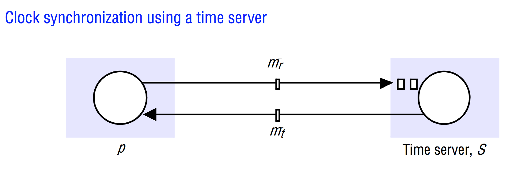
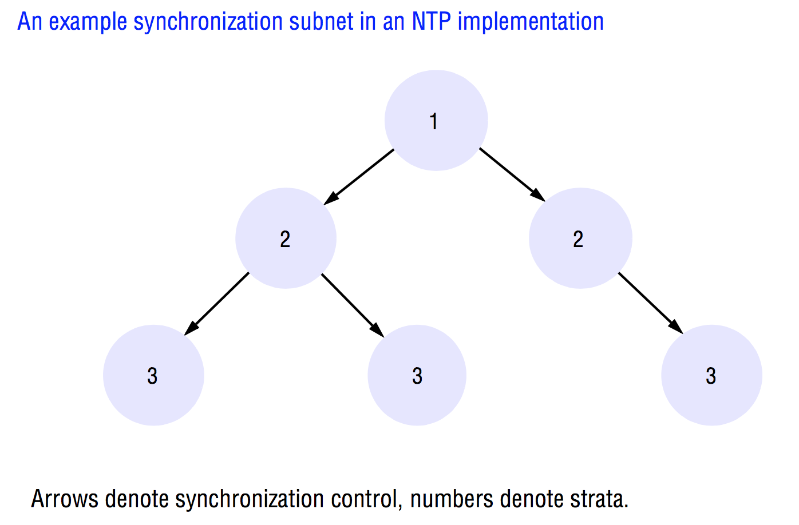
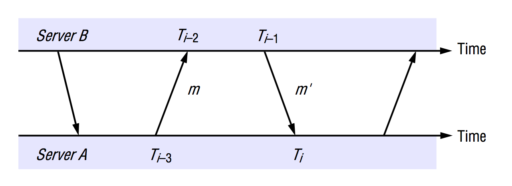

# Time
> Coulouris Chapter 14 - 14.5 (inclusive).

Has to do with topics related to the issue of time in distributed systems.

- Time is a quantity we often want to measure accurately.
- In order to know at what time of day a particular event occurred at a particular computer, it is necessary to synchronize its clock with an authoritative, external source of time.
- Time is also used to check the authenticity of a request sent to a server in some cases.
- Time is used to decide the order in which a series of events occurred.

### Difficulty of measuring time
Due to the existence of multiple frames of reference, measuring time is hard.

#### Einsteins Relativity theory
It was with Einstein and his Special Theory of Relativity based on the observation that the speed of light is constant for all observers, regardless of their relative velocity that he proved, among other things, that two events that are judged to be simultaneous in one frame of reference are not necessarily simultaneous according to observers in other frames of reference that are moving relative to it.

For example, an observer on the Earth and an observer traveling away from Earth in a spaceship will disagree on the time interval between events, the more so as their relative speed increases.

The relative order of two events can even be reversed for two different observers.

**But this cannot happen if one event causes the other to occur**. In that case, the physical effect follows the physical cause for all observers, although the time elapsed between cause and effect can vary.

**There *is* no special physical clock in the universe to which we can appeal when we want to measure intervals of time.**

#### Problems in distributed systems
We are limited in our ability to timestamp events at different nodes sufficiently accurately to know the order in which *any* pair of events occurred, or whether they occurred simultaneously. There is no absolute, global time to which we can appeal.

And yet sometimes we need to observe distributed systems and establish whether certain states of affairs occurred at the same time. For instance, we might need to establish whether references to a particular object no longer exist - whether the object has become garbage.

## Clocks, events and process states
Lets for once assume that we have a collection of processes that do not share memory, each of which operates on a single processor and cannot communicate with each other in any other way than by sending messages through the network.

### Events
We define an event to be the occurrence of a single action that a process carries out as it executes. That could be a communication action or a state-transforming action.

#### Sequence of events (relation ➝<sub>i</sub>)
The sequence of events **within a single process** *p<sub>i</sub>* can be placed in a single, total ordering, which we denote by the relation *➝<sub>i</sub>* between the events: *e ➝<sub>i</sub> e'* if and only if the event *e* occurs before *e'* at *p<sub>i</sub>*.

Now we can define the *history* of process *p<sub>i</sub>* to be the series of events that take place within it, ordered as described by the relation *➝</sub>i</sub>*:

*history(p<sub>i</sub>) = h<sub>i</sub> = <e<sup>0</sup><sub>i</sub>,e<sup>1</sup><sub>i</sub>,e<sup>0</sup><sub>2</sub>, ...>*

But that is just *ordering*. How do we timestamp them?

#### Clocks
Computers each contain their own physical clocks. These are electronic devices that count oscillations occurring in a crystal at a definite frequency. Typically, this count is divided and the result is stored in a counter register.

The operating system reads the node's hardware clock value *H<sub>i</sub>(t)*, scales it and adds an offset so as to produce a software clock *C<sub>i</sub>(t) = ⍺(H<sub>i</sub>(t) + β)* that approximately measures real, physical time *t* for process *p<sub>i</sub>*.

So, when the real time in an absolute frame of reference is *t*, *C<sub>i</sub>(t)* is the reading on the software clock.
That *could* be the 64-bit value of the number of nanoseconds that have elapsed at time *t* since a convenient reference time.

In general, the clock is not completely accurate, so *C<sub>i</sub>(t)* will differ from *t*. But, if *C<sub>i</sub>* behaves sufficiently well, we can use its value to timestamp any event at *p<sub>i</sub>*.

**If the *clock resolution*, the period between updates of the clock value, isn't fast enough, successive events might correspond to the same timestamp!**. The rate depends on such factors as the length of the processor instruction cycle.

### Clock skew and clock drift
Computer clocks, like any others, tend not to be in perfect agreement :-(.

#### Clock skew
The instantaneous difference between the readings of any two clocks is called their *skew*.

#### Clock drift
The crystal-based clocks used in computers are, like any other clocks, subject to *clock drift*. That means that they count time at different rates, and so diverge.

The underlying oscillators are subject to physical variations, with the consequence that their frequencies of oscillation differ.

Also, even the same clock's frequency will vary with temperature.

The difference in the oscillation period between two clocks might be extremely small, **but the difference accumulated over many oscillations lead to an observable difference in the counters registered by two clocks, no matter how accurately they were initialized to the same value**.

**A clock's *drift rate* is the change in the offset (difference in reading) between the clock and a nominal perfect reference clock per unit of time measured by the reference clock.**

This is usually about 10<sup>-6</sup> seconds/second, giving a difference of 1 second every 1,000,000 seconds (or 11,6 days).

#### International Atomic Time
There are things such as 'high-precision' quartz clocks which is about 10<sup>-7</sup> or 10<sup>-8</sup>.

However, the most accurate physical clocks use atomic oscillators, whose drift rate is about one part in 10<sup>13</sup>. The output of these atomic clocks is used as the standard for elapsed "real" time, known as *International Atomic Time*.

### Coordinated Universal Time (UTC)
Computer clocks can be synchronized to external sources of highly accurate time.

*Coordinated Universal Time* or UTC for short is an international standard for timekeeping. It is based on atomic time, but a so-called *leap second* is inserted, or in rare cases deleted, occasionally to keep it in step with astronomical time where the period of the Earth's rotation about its axis gradually getting longer.

UTC signals are synchronized and broadcast regularly from land-based radio stations and satellites covering many parts of the world.

Computers with GPS receivers attached can synchronize their clocks with these timing signals.

## Synchronizing physical clocks

#### External synchronization
If we wish to know at what time of day events occur at the processes in a distributed system, we must synchronize the processes' clocks, *C<sub>i</sub>* with an authoritative, external source of time such as UTC. This is called *external synchronization*.

#### Internal synchronization
If the clocks *C<sub>i</sub>* are synchronized with one another to a known degree of accuracy, then we can measure the interval between two events occurring at different computers by appealing to their local clocks, even though they are not necessarily synchronized to an external source of time. This is called *internal synchronization*.

#### Formal definitions
Over an interval of real time *I*:

- *External synchronization*: For a synchronization bound *D > 0*, and for a source *S* of UTC time, *|S(t) - C<sub>i</sub>(t)| < D* for *i = 1,2, ...N* and for all real times *t* in *I*.
	-	Another way of saying this is that the clocks *C<sub>i</sub>* are *accurate* to within the bound *D*.

- *Internal synchronization*: For a synchronization bound *D > 0*, *|C<sub>i</sub>(t) - C<sub>j</sub>(t)| < D* for *i, j = 1, 2, ...N*, and for all real times *t* in *I*.
	-	Another way of saying this is that the clocks *C<sub>i</sub> agree* within the bound *D*.

Obviously, clocks that are internally synchronized are not necessarily externally synchronized since they may collectively drift from an external source of time even though they agree with one another. Remember, what we we care about is the *ordering* of events.

*However*, if the system is externally synchronized with a bound *D*, then the same is internally synchronized with a bound of *2D*.

### Correctness vs faultiness of clocks
#### Correctness
It is common to define a hardware clock *H* to be correct if its drift rate falls within a known bound *ρ > 0*.

**Note that clocks do not have to be accurate to be correct.** The goal usually is internal rather than external synchronization, so the criteria for correctness are only concerned with the proper functioning of the clock's mechanism, not its absolute setting.

#### Faultiness
A clock that does not keep to whatever correctness conditions apply is defined to be *faulty*.

#### Monotonicity
The condition that a clock *C* only ever advances:
*t' > t ⇒ C(t') > C(t)*.

#### Crash failures
A clock that stops ticking altogether is said to experience a *crash failure*.

#### Arbitrary failures
All other failures than crash failures.

## Synchronization in a synchronous system
In a synchronous system, bounds are known for the drift rate of clocks, the maximum message transmission delay as well as the time required to execute each step of a process.

To synchronizes clocks, here's what can be done in the simplest case:
- One process sends the time *t* on its local clock to the other in a message *m*.
- In principle, the receiving process could set its clock to the time *t + T<sub>trans</sub>*, where *T<sub>trans</sub>* is the time taken to transmit *m* between them.
- The two clocks now agree. None of them cares about whether or not the sending process's clock is accurate.

#### Minimum transmission time (min)
In general, other processes are competing for resources with the processes to be synchronized at their respective nodes, and other messages compete with *m* for network resources. This will obviously affect *T<sub>trans</sub>* which of the same reason will be subject to variation.

**But, there is always a minimum transmission time, *min*, that would be obtained if no other processes executed and no other network traffic existed. *min* can be measured or conservatively estimated.**

#### Maximum transmission time (max)
In a synchronous system, by definition, there is also a maximum transmission time, *max*.

If we define the uncertainty in the message transmission time as *u*, we define it as:

*u = (max - min)*

If the receiver sets it clock to be *t + min*, then the clock skew may be as much as *u*, since the message may in fact have taken time *max* to arrive.

Similarly, if it sets its clock to *t + max*, the skew may again be as large as *u*.

In general for a synchronous system, the optimum bound that can be achieved on clock skew when synchronizing *N* clocks is *u(1 - 1 / N)*.

**Thing is, most distributed systems found in practice are asynchronous where have no clue about the maximum time it takes for a message to arrive. It may take forever. Christian's method for synchronizing clocks is our savior**.

## Christian's method for synchronizing clocks
Uses a time server that is connected to a device that receives signals from a source of UTC, to synchronize computers **externally**.

Upon request, the server process *S* supplies the time according to its clock.



The main observation (and also the requirement) of Christian's method is, that while there is no upper bound on message transmission delays in an asynchronous system, the round-trip times for messages exchanged between pairs of processes are often reasonably short - a small fraction of a second.

In order to achieve synchronization using Christian's method, the round-trip times between client and server must be sufficiently short compared with the required accuracy.

Here's how it works:

1. A process *p* requests the time in a message *m<sub>r</sub>* and receives the time value *t* from the time server *S* in a message *m<sub></sub>*.
	-	*t* is inserted in *m<sub>t</sub>* as the last possible point before transmission from *S* to maximize accuracy.

2. Process *p* records the total round-trip time *T<sub>round</sub>* taken to send the request *m<sub>r</sub>* and receive the reply *m<sub>t</sub>*.
	- **It can measure this time with reasonable accuracy if its rate of clock drift is small!**

3. *p* can now set its clock to *t + T<sub>round</sub> / 2* which assumes that the elapsed time is split equally before and after *S* placed *t* in *m<sub>t</sub>* and is a simple, but reasonably accurate estimate (unless the two messages are transmitted over different networks).

#### Determining accuracy
If the value of the minimum transmission time, *min*, is known or can be conservatively estimated, then we can determine the **accuracy** of this result.

Alright, so the earliest point at which *S* could have placed the time in *m<sub>t</sub>* was *min* after *p* dispatched *m<sub>r</sub>*, right? It took at the very least *min* time for the request from *p* to get to *S*. And, the *latest* point at which it could have done this was *min* time before *m<sub>t</sub>* arrived at *p*.

So, the time by <em>S</em>'s clock when the reply message **arrives at p** is therefore in the range: *[t + min, t + T<sub>round</sub> - min]*, right? It can at the very least be the time value it sent, *t* including the minimum transmission time, and it can at the very most be the time value it sent, *t*, including the observed total round-trip time minus the minimum transmission time.

**This gives is us an accuracy of *±(T<sub>round</sub> / 2 - min)*.**

#### TL;DR of accuracy
If you have *min*, you can compute the accuracy of the result with: *±(T<sub>round</sub> / 2 - min)*.

**The greater accuracy required, the smaller the probability of achieving it, because the most accurate results are those in which both messages are transmitted in a time close to *min* - an unlikely event in a busy network**.

### Problems with Christian's algorithm
Like all other centralized distributed systems, Christian's algorithm suffers the problems of the dependency on a single server which might fail or produce arbitrary failures. For crash failures, that would render synchronization temporarily impossible. But for arbitrary failures, like incorrect time values, that could really wreak havoc in a system.

You could add more time servers into the mix to reduce the risk of this problem, but from a theoretical standpoint, there is still the risk of failure.

The problem of dealing with faulty clocks is partially addressed by the Berkeley algorithm.

## The Berkeley algorithm
Here, a *coordinator* computer is chosen to act as the *master*. All other computers are called *slaves*.

This one periodically polls the other computers whose clocks are to be synchronized. The slaves send back their clock values to it.

The master then estimates their local clock times by observing the round-trip times, and it then averages the values obtained - including its own clock's reading.

**The balance of probabilities is that this average cancels out the individual clock's tendencies to run fast or slow**.

The accuracy of the protocol depends upon a nominal maximum round-trip time between the master and the slaves.

**The master eliminates any occasional readings associated with larger times than this maximum.**

Instead of sending the updated current time back to the other computers, which would introduce further uncertainty due to the message transmission time, the master instead sends the amount by which each individual slave's clock requires adjustment. This can be a positive or negative value.

#### As an algorithm
So, periodically, in a pool of processes where *P* is the master and *p<sub>i</sub>* is any of the slaves:

1. *P* requests all processes *p<sub>i</sub>* for their local clocks.

2. All processes *p<sub>i</sub>* sends back their local clock values.

3. Upon receiving the local clocks, *P* estimates the current local clocks of all processes *p<sub>i</sub>* by observing the round-trip times and calculating averages of the values obtained as well as its own clock's reading.
	-	If a reading is associated with a larger time than a nominal maximum round-trip time, it is eliminated. This is to ensure that faulty clocks cannot have a significant adverse effect on the computed average.

4. The master sends the amount by which each process *p<sub>i</sub>*'s clock requires adjustment. It can be a positive or a negative value.

#### Advantages
It eliminates readings from faulty clocks. Such clocks could have a significant adverse effect if an ordinary average was taken, so instead the master takes a *fault-tolerant average*, - a subset is chosen of clocks that do not differ from one another by more than a specified amount, and the average is taken of readings from only these clocks.

Should the master fail, then another can be *elected* to take over and function exactly as its predecessor.

## The Network Time Protocol (NTP)

Christian's method and the Berkeley algorithm are intended primarily for use within intranets.

The *Network Time Protocol (NTP)* defines an architecture for a time service and a protocol to distribute time information over the internet.

It aims to:

- *Provide a service enabling clients across the internet to be synchronized accurately to UTC*: Even though large and variable message delays are encountered in internet communication, NTP employs statistical techniques for the filtering of timing data and it discriminates between the quality of timing data from different servers.

- *Provide a reliable service that can survive lengthy losses of connectivity*: There are redundant servers and redundant paths between servers. The servers can reconfigure so as to continue to provide the service if one of them becomes unreachable.

- *Enable clients to resynchronize sufficiently frequently to offset the rates of drift found in most computers*: The service is designed to scale to large numbers of clients and servers.

- *Provide protection against interference with the time service, whether malicious or accidental*: Authentication techniques are used to check that timing data originate from the claimed trusted sources. It also validates the return addresses of messages sent to it.

### Primary and secondary servers
NTP is provided by a network of servers located across the Internet:
- *Primary servers*: Connected directly to a time source such as a radio clock receiving UTC.
- *Secondary servers*: Synchronized, ultimately, with primary servers.

Servers are connected in a logical hierarchy called a *synchronization subnet* whose levels are called *strata*.

#### Primary servers
Primary servers occupy stratum 1: they are at the root.

#### Secondary servers
Secondary servers occupy stratum 2 and are directly synchronized with the primary servers.

#### Stratum 3 and up
And then we have stratum 3 servers which are synchronized with stratum 2 servers and so on. The lowest level (leaf) severs execute in user's workstations.

**The clocks belonging to servers with high stratum numbers are liable to be less accurate than those with low stratum numbers because errors are introduced at each level of synchronization**.

NTP takes into account the total message round-trip delays to the root in assessing the quality of timekeeping data held by a particular server.

The synchronization subnet can reconfigure as servers become unreachable or failures occur. So, if a stratum 1 server's UTC source fails, it can become a stratum 2 server. If a stratum 2 server's normal source of synchronization fails or becomes unreachable, then it may synchronize with another server.



### Modes of synchronization in NTP servers
NTP servers can synchronize in one of 3 modes:
- Multicast
- Procedure-call
- Symmetric-mode

#### Multicast mode
Is intended for use on a high-speed LAN. One or more servers periodically multicasts the time to the servers running in other computers connected by the LAN which then set their clocks assuming a small delay.

This mode can achieve only relatively low accuracies, but ones that are nonetheless considered sufficient for many purposes.

#### Procedure-call mode
Similar to Christian's algorithm. Here, one server accepts requests from other computers, which it processes by replying with its own current clock reading.

This mode is suitable where higher accuracies are required than what can be achieved with multicast or where multicast is not hardware-supported.

#### Symmetric mode
Is intended for use by the servers that supply time information in LANs and by the higher levels (lower strata) of the synchronization subnet, **where the highest accuracies are to be achieved**.

A pair of servers operating in symmetric mode exchange messages bearing timing information. Timing data are retained as part of an association between the servers that is maintained in order to improve the accuracy of their synchronization over time.

#### Transportation
In all modes, messages are delivered unreliably using UDP.

In procedure-call mode and symmetric mode, processes exchange pairs of messages, each of which bears timestamps of recent message events:
1. The local times when the previous NTP message between the pair was sent and received.
2. The local time when the current message was transmitted.

That amounts to a total of four times, *T<sub>i - 3</sub>, T<sub>i - 2</sub>, T<sub>i - 1</sub>, T<sub>i</sub>*.



#### Offset
For each pair of messages sent between two servers, the NTP calculates an *offset o<sub>i</sub>*, which is an estimate of the actual offset between the two clocks.

#### Delay
For each pair of messages sent between two servers, the NTP calculates a *delay d<sub>i</sub>*, which is the total transmission time for the two messages.

Given servers *A* and *B*, if the true offset of the clock at *B* relative to that at *A* is *o*, and if the actual transmission times for *m* and *m'* are *t* and *t'* respectively, then we have:

*T<sub>i - 2</sub> = T<sub>i - 3</sub> + t + o and T<sub>i</sub> = T<sub>i - 1</sub> + t' - 0*.

Which leads to the following computation for the delay *d<sub>i</sub>*:

*d<sub>i</sub> = t + t' = T<sub>i - 2</sub> - T<sub>i - 3</sub> + T<sub>i</sub> - T<sub>i - 1</sub>*

And to compute the offset *o*:

*o = o<sub>i</sub> + (t' - t) / 2* where *o<sub>i</sub> = (T<sub>i - 2</sub> - T<sub>i - 3</sub> + T<sub>i - 1</sub> - T<sub>i</sub>) / 2*

So, *o<sub>i</sub>* is an **estimate** of the offset, and *d<sub>i</sub>* is a measure of the accuracy **of this estimate**.

## Logical time and logical clocks


# Lecture notes:

### Events

- An *event* `e` happens at a process and has an action.

- Write `e -->i e'` if `e`, `e'` happens at `i`, `e` before `e'`

- Events at process `i` form a total order.

### Synchronization

How do we synchronize clocks?

- External, bound `D>0`: Given a UTC source `S`, for any `1 <= i <= N`:<br>
*| S(t)-C<sub>i</sub>(t) | < D* <br><br> Accurate within bound `D`.

- Internal bound `D>0`: For any `1<=i, j<= N`:<br>*| C<sub>i</sub>(t) - C<sub>j</sub>(t) | < D* <br><br>
In agreement within bound D

### Synchronizing in a *synchronous* distributed system.

About bounds on clock drift, execution steps, message delivery.
Again, remember that we define explicit minimum and maximum bounds on execution time in synchronous distributed systems.

Say we want to synchronize two processes P<sub>1</sub>, P<sub>2</sub>

- *P<sub>1</sub>* sends local time t in message to *P<sub>2</sub>*
- *P<sub>2</sub>* sets time to `u = t + (max - min) / 2 + min`
- Skew bounded by `(max - min) / 2`

### Synchronizing in a *asynchronous* distributed system

Here, we have no lower or upper bound on *max* and *min*. How do we synchronize time then?

We used whats' called *Christian's method*.
The point is that we calculate the latency from the initial transmission and add it to the overall clock drift.

- Estimate round-trip time: *T<sub>round</sub>*.

- *u = t + T<sub>round</sub> / 2*

- Accuracy estimate with known/estimated minimum transmission time (e.g. latency).

- *±(T<sub>round</sub> / 2 - min)*

## Logical time

Logical time is about the order in which things happened.

They key tool is the **Happened-Before** relation.

### Happened-Before

Three properties:

- If *e --><sub>i</sub>*, then *e --> e'*.

- `send(m) --> receive(m)`

- The transitive closure: e.g. `if e -->e' and e' --> e" then e --> e"`.

Events that cannot be related are called **concurrent**. Processes on different threads produce events. These are concurrent in the sense that they have no relation to each other.

### Logical clocks (Lamport)
Here we add a logical clock L<sub>i</sub> to each process.

- *L<sub>i</sub> := L<sub>i</sub> + 1 just* before each event at *p<sub>i</sub>*

- `send(m)` at P<sub>i</sub> piggy-backs *t = L<sub>i</sub>* in *m*.

- *L<sub>i</sub> := max(L<sub>i</sub>, t) just* after `receive(m)` at *P<sub>i</sub>* before doing step 1

## Global state

The history of a process is the set of events that happened in that process.

e.g. *h<sub>i</sub> = e<sub>0</sub>, e<sub>1</sub>...*

The **global history** is all histories of individual processes.

A **prefix** of a history is a subset of the set of events.

A **state** is an object state from the point of a specific event on a specific process.

A **global state** is thus the state of every process on a specific point in time.

<u>Properties of a global state are:</u>

- Consistent. Defined by a consistent cut.

- Some ordering of all events that respects local causality *--><sub>i</sub>*

- Consistent run (Also called *linearization*): Run that respects *Happened-Before*.

### Cut

A choice of *prefix* for each individual process.

### Consistent/inconsistent cut

A consistent cut is one that has a corresponding `send` event for each `receive` event.

An inconsistent cut is not a reasonable global state.

### Snapshot (Chandy & Lamport)

- The graph of processes and channels is strongly connected; There is a path between any two processes.

- Any process may initiate a global snapshot at any time.

- The processes may continue their execution and send and receive normal messages while the snapshot takes place.

- And more ... (already covered by the above model).

Here's the *receiving* rule for a process P<sub>i</sub>:

```
if (Pi has not yet recorded its state) it
	records its process state now;
	records the state of c as the empty set;
	turns on recording of messages arriving over other incoming channels.
else
	Pi records the state of c as the set of messages it has received over c since it saved its state.
end if
```

Here's the *sending* rule for a process P<sub>i</sub>:

```
Pi records its state.
For each outgoing channel C on which a marker has not been sent, i sends a marker along.
```
