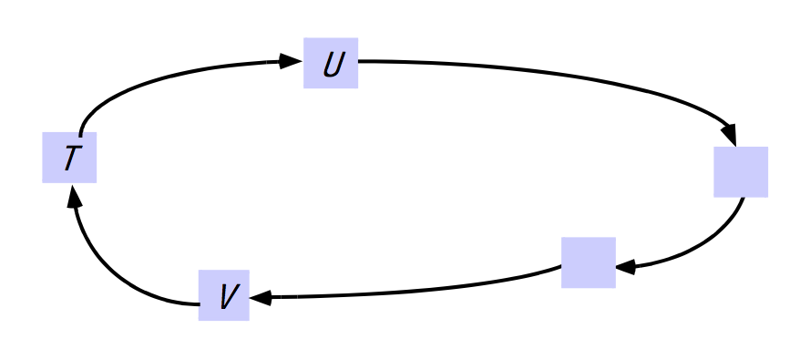

# Transactions & Concurrency control
> Coulouris 16, except 16.6.
> Coulouris 17, excluding 17.3.2.

## Simple synchronization (without transactions)

### Atomic operations
Operations that are free from interference from concurrent operations being performed in other threads.

#### The `synchronized` keyword in Java
If a method signature has the `synchronized` keyword, for instance:
```java
public synchronized void deposit (int amount) {};
```
...Only one thread at a time can access the object containing the method. The other thread(s) that invokes one of its synchronized methods will then be blocked until the lock is released.

**Simple synchronization involves singular atomic operations. That means, single methods that is synchronized, not sets of methods which combined makes up a complex action.**

## Transactions
Sometimes clients require a sequence of separate requests to a server to be atomic.

Here, either all of the operations must be completed successfully or they must have no effect at all in the presence of crashes/errors.

Also, they are free from interference by operations being performed on behalf of other concurrent clients.

A *Transaction* could be the following set of atomic operations:
```java
// Transaction T:
a.withdraw(100);
b.deposit(100);
c.withdraw(200);
b.deposit(200);
```

The principles are:
- All or nothing
	-	A Transaction either completes in which case the effects of all of its operations are recorded in the objects, or in case of a failure or deliberate abort, it has no effect at all.
- Isolation
	-	Each Transaction must be performed without interference from other transactions.

### How to ensure Isolation
One way is for the server to perform transactions serially - one at a time, in some arbitrary order.

This works, but shouldn't always be done. We should strive to maximize concurrency. **Instead, Transactions should be allowed to execute concurrently if this would have the same effect as serial execution.**

That is, if the transactions are *serially equivalent*.

### Implementing transactions.
Imagine the following *Coordinator* interface:
```java
/**
 * Starts a new transaction and delivers a GUID. Will be used
 * in the other transaction-related methods.
 */
public TransactionID openTransaction();
/**
 * Ends a transaction. Returns a boolean indicating whether
 * or not the changes has been committed or aborted.
 */
public boolean closeTransaction(TransactionID trans);
/**
 * Aborts the given transaction.
 */
public void abortTransaction(TransactionID trans);
```

Then imagine adding the following to the `deposit` method signature from previously:
```java
public void deposit (TransactionID trans, int amount) {};
```
This makes it possible to backtrace all transaction actions as well as control whether or not the deposit operation can execute immediately (for instance, if another Transaction is currently "locking" the object).

### ACID Properties
The 'ACID' properties of transactions are:

<strong>A</strong>tomicity: A transaction must be all or nothing.

<strong>C</strong>onsistency: A transaction takes the system from one consistent state to another consistent state.

<strong>I</strong>solation.

<strong>D</strong>urability.

## Concurrency control

### The lost update problem
**TL;DR: The Lost Update problem occurs when two transactions concurrently read the old value of a variable and then use it to calculate the new value**

If two concurrent Transactions read and write to the same object, one Transaction may read the value to, say, 200, and then set the value to that times 2. However, another Transaction may in the meantime also set the value (for instance, because of a deposit). It may even commit the change. However, when the time comes for the Transaction that set the value to 200 * 2 to commit its results, it doesn't know about the deposit that just happened and then "throw away" that update. For instance:
<table>
	<tr>
		<td><strong>Transaction T</strong></td>
		<td><strong>Transaction U</strong></td>
	</tr>
	<tr>
		<td>balance = obj.getBalance(); // $200</td>
		<td>balance = obj.getBalance(); // $200</td>
	</tr>
	<tr>
		<td>obj.setBalance(balance * 2) // $400</td>
		<td></td>
	</tr>
	<tr>
		<td><strong>COMMIT</strong></td>
		<td>obj.setBalance(balance * 1.1 // $220)</td>
	</tr>
	<tr>
		<td></td>
		<td><strong>COMMIT</strong></td>
	</tr>
</table>

The value would then be $220. However, Transaction U should really have made the `balance * 1.1` operation on the new amount, $400, but didn't since it called `getBalance()` before Transaction T had committed.

### Serial equivalence
If each of several Transactions is known to have the correct effect when done on its own, we can infer that if these Transactions are done one at a time *in some order*, the combined effect will also be correct.

**What having the same effect means is that the *read* operations return the same values and that the instance variables of the objects have the same values at the end.**

An interleaving of the same operations of transactions in which the combined effect is the same as if the transactions had been performed one at a time in some order is a **serially equivalent interleaving**.

Using serial equivalence prevents occurrence of lost updates and inconsistent retrievals.

**For two Transactions T and U that writes to objects *i* and *j* to be serially equivalent, one of the following must be true:**

1. *T* accesses *i* before *U* and *T* accesses *j* before *U*

OR

2. *U* accesses *i* before *T* and *U* accesses *j* before *T*.

### Conflicting operations
When a pair of operations *conflicts*, we mean that their combined effect depends on the order in which they are executed.

#### *Read* and *Write* conflict rules
<table>
	<tr>
		<td><strong>Operations of different transactions</strong></td>
		<td><strong>Conflict</strong></td>
		<td><strong>Reason</strong></td>
	</tr>
	<tr>
		<td><em>Read</em>&#09;<em>Read</em></td>
		<td>No</td>
		<td>The effect of a pair of <em>Read</em> operations does not depend on the order in which they are executed.</td>
	</tr>
	<tr>
		<td><em>Read</em>&#09;<em>Write</em></td>
		<td>Yes</td>
		<td>The effect of a <em>Read</em> and <em>Write</em> operation depends on the order of their execution.</td>
	</tr>
	<tr>
		<td><em>Write</em>&#09;<em>Write</em></td>
		<td>Yes</td>
		<td>The effect of a pair of <em>Write</em> operations depends on the order in which they are executed.</td>
	</tr>
</table>

### Declaring Transactions
You can declare a Transaction like this:
`T: x = read(i); write(i, 10); write(j, 20);`

It translates to the following table:
<table>
	<tr>
		<td><strong>Transaction T</strong></td>
	</tr>
	<tr>
		<td><code>x = read(i);</code></td>
	</tr>
	<tr>
		<td><code>write(i, 10);</code></td>
	</tr>
	<tr>
		<td><code>write(j, 20);</code></td>
	</tr>
</table>

### Recoverability from aborts
Servers must record all the effects of committed transactions and none of the effects of aborted transactions.

A Transaction should be abortable without affecting other concurrent Transactions.

Two things can/will cause problems for this rule:
- Dirty reads
- Premature writes

### Dirty reads
The **Isolation property** of Transactions requires that transactions do not see the uncommitted state of other transactions. Dirty reads happens when a Transaction reads from an object that is currently being written to in another Transaction. This breaks the Isolation property.

Imagine if Transaction *T* writes to *i* and Transaction *U* then reads from *i* and use that value for something. *T* then aborts the Transaction. However, *U* still use the value it read previously. If *U* ends up committing the changes, it cannot be undone.

### Recoverability of Transactions
If a Transaction *U* has committed after it has seen the effects of a transaction *T* that subsequently aborted, **the situation is *not* recoverable**.

For recoverability, we can then delay committing *U* until *T* has committed. If *T* aborts/fails, so must *U*.

### Cascading aborts
Like stated before, if *U* delays committing until after *T* commits. If *T* then aborts, so must *U*. If *any* other Transactions have seen the effects due to *U*, they too must be aborted. The aborting of these latter transactions may cause still further transactions to be aborted. That's called **cascading aborts**.

If you want to avoid using cascading aborts, transactions are only allowed to read objects that were written by committed transactions.

### Premature writes
*Write* operations must be delayed until earlier Transactions that updated the same objects have either committed or aborted to avoid premature writes.

### Strict Transactions.
Generally, it is required that transactions delay both their *Read* and *Write* operations so as to avoid both dirty reads and premature writes. If Transactions does this, they are **strict**.

## Nested Transactions
Nested transactions allows or Transactions to be composed by other Transactions.

The *Top-level* Transaction is the outermost one.
All other Transactions is then called *subtransactions*.

*Subtransactions* then becomes the *top-level* Transaction of their own *"tree"* of *subtransactions*.


### Advantages
Subtransactions at one level may run concurrently with other subtransactions at the same level in the hierarchy. This means additional concurrency.

Subtransactions can commit or abort independently. With a flat transaction (an atomic one, you might say), one transaction failure would cause the whole transaction to be restarted.

The rules are:
- A transaction may commit or abort only after its child transactions have completed.
- When a subtransaction completes, it makes an independent decision either to commit provisionally or to abort. Its decision to abort is final.
- When a parent aborts, all of its subtransactions are aborted.
- When a subtransaction aborts, the parent *can* decide whether to abort or not.
- If the top-level transaction commits, then all of the subtransactions that have provisionally committed can commit too, **provided that none of their ancestors has aborted**.

## Locks
One way to archive a serializing mechanism is through the use of **exclusive locks**.

### Exclusive Locks
With a exclusive lock, the server attempts to lock any object that is about to be used by any operation of a client's transaction.

If a client requests access to an object that is locked, the request is suspended and the client must wait until the object is unlocked.

Locks are lazy in the sense that they aren't activated when the Transaction starts, but immediately before reading/writing from/to the object.


### Two-phase locking
**To ensure that all pairs of conflicting operations of two transactions should be executed in the same order, a transaction is NOT allowed any new locks after it has released a lock.**

There are two phases:

- The growing phase
	-	The first phase of each transaction during which new locks are acquired.
- The shrinking phase
	-	The second (and final) phase of each transaction where locks are released.

This is called *two-phase locking*.

### Strict Two-phase locking
Like stated, strict transactions delay both their *Read* and *Write* operations until other transactions have committed or aborted. In Strict two-phase locking, **any locks applied during the progress of a transaction are held until the transaction commits or aborts.**

### Many readers/single writer scheme
There are different kinds of locking schemes. In this one, instead of having only exclusive locks, we have *Read locks* and *Write locks*. This means more concurrency as a *Read* operation doesn't conflict with another *Read* operation on the same object. So why block it?

In this scheme, an attempt to place a *Read* lock on an object will always be successful. All Transactions reading the object share its read lock. For this reason, read locks are sometimes called **shared locks**.

**The request for a *Write* lock on an object is delayed by the presence of a *Read* lock belonging to another Transaction.**

**The request for a *Read* lock *OR* a *Write* lock on an object is delayed by the presence of a *Write* lock belonging to another Transaction.**

### Lock compatibility table
<table>
	<tr>
		<td><strong>Existing lock</strong></td>
		<td><strong>Read-lock request</strong></td>
		<td><strong>Write-lock request</strong></td>
	</tr>
	<tr>
		<td>none</td>
		<td>OK</td>
		<td>OK</td>
	</tr>
	<tr>
		<td>Read</td>
		<td>OK</td>
		<td>wait</td>
	</tr>
	<tr>
		<td>Write</td>
		<td>wait</td>
		<td>wait</td>
	</tr>
</table>

### Lock promotion
When a lock is converted to a stronger lock, it is "promoted" to a lock that is more exclusive.

A *Write* lock is more exclusive than a *Read* lock (and thus it is called an *Exclusive lock*.)

### Use of locks in Strict 2PL
Here's what should happen:

1. When an operation accesses an object within a transaction:
	1. If the object is not already locked, lock it and proceed.
	2. If the object has a conflicting lock set by another Transaction, wait until it is unlocked.
	3. If the object has a non-conflicting lock (a *Shared/Read* lock) set by another Transaction, The lock is shared and proceed with the operation.
	4. If the object has already been locked in the same Transaction, promote the lock if necessary and proceed (if there is a conflicting lock, wait until it is unlocked.)
2. When a transaction is committed or aborted, the server unlocks all objects it locked for the transaction.

### Implementing Locks
Lets call the granter of locks for `LockManager`.
- It holds a set of `Lock` objects in a hash table
- a `Lock` has:
	-	The ID of the locked object.
	- The TransactionID(s) of the Transaction(s) that currently hold the lock (for instance, *Shared* locks can have several holders.)
	- The type of lock (`"shared"|"exclusive"`)

There is a reference implementation in Java in the book on pages 697-698.

### Deadlocks
Using locks can lead to deadlocks. They happen if two transactions are waiting and each is dependent on the other to release a lock so it can resume.

The definition of a Deadlock is a state in which each member of a group of Transactions is waiting for some other member to release a lock.

A *wait-for* graph can be used to represent the waiting relationships between current Transactions.

### Wait-for graphs
In a *wait-for* graph, the nodes represent transactions and the edges represent *wait-for* relationships between Transactions.

For instance, given Transactions *T* and *U*, there will be an edge from node *T* to node *U* if Transaction *T* is waiting for Transaction *U* to release a lock.

As you can imagine, if there is an edge from *T* to *U* *AND* from *U* to *T*, we are in a Deadlock situation.

This is also called **a cycle**.
It can be indirect, however. Imagine that *T* waits for *U* and *U* waits for *V* and *V* waits for *T*.



This is a cycle too. Every Transaction is blocked and waiting for locks. If a transaction in a cycle is aborted, the locks are released and that cycle is broken.

### Preventing Deadlocks.
One simple but not good way is to lock all of the objects used by a Transaction when it starts.

Such a Transaction cannot run into deadlocks with other Transactions, but it unnecessarily restricts access to shared resources.

Also, sometimes you don't know at the start of a Transaction which objects that will be used.

#### *Upgrade* locks
There is a third type of lock called an *Upgrade* lock. It is intended to avoid deadlocks. Deadlocks often happen by first having a *Read/Shared* lock and then later upgrading it to a *Write/Exclusive* lock.

An *Upgrade* lock is permitted to read an object, but it is *NOT* shared, meaning that no other Transaction can read an object simultaneously (e.g. have an *Upgrade* long simultaneously.). It cannot be set implicitly but must be requested by the client.

#### Deadlock detection
Imagine implementing a representation of a *wait-for* graph in the `LockManager`. It could then check for cycles from time to time, maybe even each time an edge is added. It could then abort a Transaction to escape the Deadlock.

Choosing the right Transaction to abort depends on the specific case.

#### Timeouts
You could also give a lock a limited lifetime.
After this time, the lock is released **if and only if** another Transaction waits for the lock to be released (otherwise, just keep it there, but do check from time to time to see if that changes.)

This is also called **vulnerable locks**.
When a lock is force-released, it is **aborted**.

### Increasing concurrency in locking schemes.

#### Two-version locking
Allows one Transaction to write tentative versions of objects while other transactions read from the committed versions of the same objects. *Read* operations only wait if another transaction is currently committing the same object.

Transactions cannot commit their *Write* operations immediately if other uncompleted transaction have read the same object(s). Thus, such a Transaction must wait until the reading have completed.

This means:
- It allows for added *Read* concurrency.
- Writing may take longer time.
- Due to the fact that a write operation must wait for a *Read* operation to be committed, a write may need to be aborted if a deadlock situation happens.

It uses a fourth kind of lock: A *Commit* lock.

#### *Commit* locks
If an object has a *Commit* lock, no *Read* or *Write* lock can be set on it.

When a Transaction is *committed*, it attempts to convert all *Write* locks to *Commit* locks.

#### Hierarchic locks (Multi-/Mixed- Granularity locks)
To reduce locking overhead, one can use hierarchic locks (also called multi-/Mixed- Granularity locks).

At each level, the setting of a parent lock has the same effect as setting all the equivalent child locks.
Imagine the following structure:

<table>
<tr>
	<td></td>
	<td></td>
	<td></td>
	<td>Week</td>
	<td></td>
	<td></td>
	<td></td>
</tr>
<tr>
	<td>Monday</td>
	<td>Tuesday</td>
	<td>Wednesday</td>
	<td>Thursday</td>
	<td>Friday</td>
	<td>Saturday</td>
	<td>Sunday</td>
</tr>
</table>
Say you wanted to lock all weekdays.
You could lock *all* weekdays which would cost you 7 operations. You could then instead simply lock the parent, *the week*, in one operation.

When attempting to read or write one of the weekdays, you would then check recursively if any of your parents had a blocking lock.

This is accomplished using *Intention* locks.

#### *Intention* locks
Before a child node is granted a *Read*/*Write* lock an *Intention* to *Read*/*Write* lock is set on the parent node and its ancestors (if any).

An *Intention* lock is compatible with other *Intention* locks but conflicts with *Read* and *Write* locks according to the usual rules.

Setting a *Read* lock on a parent, for instance on a *Week* in the above example with the table would prevent writing to any of the substructures.

### *Intention* Lock compatibility table
<table>
	<tr>
		<td><strong>Existing lock</strong></td>
		<td><strong>Read-lock request</strong></td>
		<td><strong>Write-lock request</strong></td>
		<td><strong>Intention-Read-lock request</strong></td>
		<td><strong>Intention-Write-lock request</strong></td>
	</tr>
	<tr>
		<td>none</td>
		<td>OK</td>
		<td>OK</td>
		<td>OK</td>
		<td>OK</td>
	</tr>
	<tr>
		<td>Read</td>
		<td>OK</td>
		<td>wait</td>
		<td>OK</td>
		<td>wait</td>
	</tr>
	<tr>
		<td>Write</td>
		<td>wait</td>
		<td>wait</td>
		<td>wait</td>
		<td>wait</td>
	</tr>
	<tr>
		<td>I-Read</td>
		<td>OK</td>
		<td>wait</td>
		<td>OK</td>
		<td>OK</td>
	</tr>
	<tr>
		<td>I-Write</td>
		<td>wait</td>
		<td>wait</td>
		<td>OK</td>
		<td>OK</td>
	</tr>
</table>

## Disadvantages of locking
-	Lock maintenance represents an overhead. Locking is only really needed for a minority of Transactions in most cases.
- Using locks can result in Deadlock. Deadlock prevention reduces concurrency severely.
- To avoid cascading aborts, locks cannot be released until the end of a Transaction which may reduce the potential for concurrency.

There is an alternative way of doing concurrency control:

## Optimistic Concurrency control

It is based on the observation that, in most applications, the likelihood of two Transactions accessing the same object is low. Transactions are allowed to proceed as though there were no possibility of conflict with other Transactions until the client completes its task and issues a `closeTransaction` request.

*When* a conflict arises, some Transaction is generally aborted.

In Optimistic Concurrency control, a Transaction goes through the following phases:

1. *Working phase*:
	-	During the working phase, each Transaction has a tentative version of each of the objects that it updates (a copy of the most recently committed version of the object). That allows for a transaction to abort without effects.
	- *Read* operations are performed immediately if a tentative version for that Transaction already exists. Otherwise, it accesses the most recently committed value of the object.
	- *Write* operations record the new values of the objects as tentative values (which are invisible to other transactions effectively eliminating the possibility of dirty reads). So, if there are concurrent Transactions, multiple tentative versions of the same object may exist at the same time.

2. *Validation phase*:
	-	When `closeTransaction()` is called, the Transaction is validated. Here, it is established whether or not its operations on objects conflict with operations of other transactions on the same objects.
	- If validation is successful, the transaction can commit.
	If the validation fails, then conflict resolution must be used. That is domain and case-specific.

3. *Update phase*:
	-	If a transaction is validated, all changes recorded in its tentative version are made permanent.
	- *Read* transactions can commit immediately after passing validation.
	- *Write* transactions can commit once the tentative version of the objects have been recorded in permanent storage.

### Validating Transactions
Here, it is ensured that the scheduling of a Transaction is serially equivalent with respect to all other *overlapping* Transactions (meaning any Transactions that has not yet committed).

Each Transaction is given a Transaction number when it enters the Validation phase. If it validates successfully, it retains this number. Otherwise, if it is aborted or if it is *Read* only, the number is released for reassignment.

Transaction numbers are assigned in ascending sequence. The lower the number, the earlier a Transaction occurred in time.

### Backward Validation
In Backward Validation, the *read* set of the Transaction being validated is compared with the *Write* sets of other Transactions that have already committed.

The only way to resolve conflicts is then to abort the Transaction that is undergoing validation.

Transactions that have no *Read* operations (only *Write* operations) need not be checked.

Optimistic Concurrency control with Backward Validation requires that the *Write* sets of old committed version of objects corresponding to recently committed transactions are retained until there are no unvalidated overlapping Transactions with which they might conflict.

### Forward Validation
In forward validation, the *Write* set of *T<sub>v/<sub>* is compared with the *Read* sets of all overlapping active Transactions (those that are still in their working phase).

### Forward vs Backward validation
Forward Validation allows flexibility in the resolution of conflicts whereas backward validation allows only one choice - to abort the Transaction being validated.

Generally, the *Read* sets of Transactions are much larger than *Write* sets. Therefore, Backward validation compares a possibly large *Read* set against old write sets, whereas Forward validation checks a small write set against the *Read* sets of active Transactions.

### Starvation
When a Transaction is aborted, it will normally be restarted by the client. But in schemes that rely on aborting and restarting Transactions, there is no guarantee that a particular Transaction will ever pass validation checks (for it may come into conflict with other Transactions for the use of objects each time it is restarted).

The prevention of a Transaction ever being able to commit is called **starvation**.

Those are rare, but if using Optimistic Concurrency control, you must ensure that no client have its Transaction(s) aborted repeatedly.

## Comparison of methods for Concurrency control
TL;DR: Timestamp ordering is best for Transactions with predominantly *Read* operations. Locking is best for Transactions with predominantly *Write* operations.

In Optimistic Concurrency control, all transactions are allowed to proceed, but some are aborted when they attempt to commit.

With Forward Validation, Transactions are aborted earlier.

So, you might say that Optimistic Concurrency control has the least space and performance overhead in the average case but has the greatest overhead in the worst case (Transactions may have to be restarted *several* times).

**The predominant method of concurrency control of access to data in distributed systems is locking**.

**Popular apps such as Google Docs and Dropbox use Optimistic Concurrency control with conflict resolution.**
