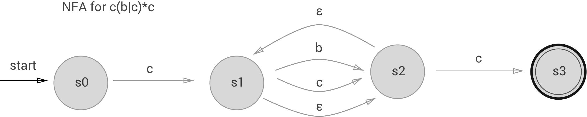

# Exam

## Question 1

Regex: `c(b|c)*c`

### Question 1.1

First a few examples:

- cc
- cbc
- ccccccccc
- ccbc

The languages describes strings starting with `c` and ending with `c`, with 0 or more `b`'s or `c`'s in-between.

### Question 1.2

### Question 1.3

### Question 1.4

`aa*|b(bb)*`