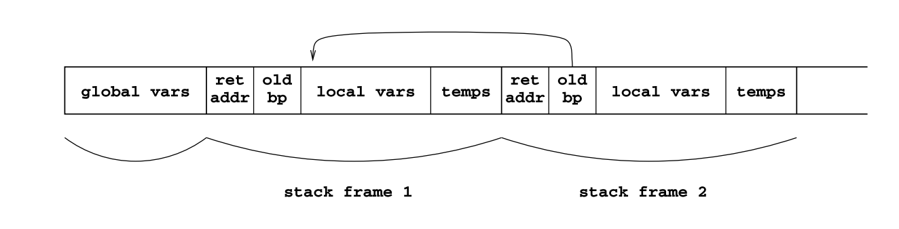

# Lecture 7

> Programming Language Concepts, Chapter 8

This chapter starts with defining a stack-based abstract machine for execution of simple imperative programs with micro-C

## The State of the Abstract Machine

The abstract machine has the following components:

- A program `p`. This is just an array of instructions. Each instruction is represented by a number `0, 1, ...`, possibly with an operand in the next program location.
- A program counter `pc`, indicating the next instruction in `p` to be executed.
- A stack `s` of integers, indexed by the numbers `0, 1, ...`.
- A stack pointer `sp`, pointing at the stack top in `s`; the next available stack position is `s[sp+1]`.

This is close to the state components found in contemporary processors such as those based on Intel's x86 architecture. These has the *registers* `ESP` for the stack pointer and `EBP` for the base pointer.

Such an abstract machine might be implemented directly in hardware (as digital electronics), in firmware (as field-programmable gate arrays) or in software (as interpreters written on some programming language).

### Example of bytecode and symbolic bytecode

Again, an Abstract Machine works with bytecode.

If we were to write a program thatloops 20 million times:

`0 20000000 16 7 0 1 2 9 18 4 25`

This translates into the following *symbolig bytecode*:

`20000000; GOTO 7; 1; SUB; DUP; IFNZRO 4; STOP`

### The Abstract Machine Instruction Set

- `CSTI i`: This is the *"push constant"* instruction which pushes the integer *i* on the stack top.
- `ADD`: This instruction takes two integers *i1 and *i2* off the stack top, computes their sum *i1 + i2*, and pushes *that* on the stack.
- `DUP`: Takes the *v* on the stack top, and pushes one more copy on the stack top.
- `LDI`: This is the *"load indirect* instruction. It takes an integer *i* off the stack top, uses it as an index *into* the stack (where the bottom item has index 0!) **and** pushes the value `s[i]` onto the stack top.
- `STI`: This is the *"store indirect"* instruction. It stores the value on the stack top at the given store address.
- `INCSP m`: This is the *"stack pointer increment"* instruction which increases the stack pointer `sp` by *m*, thus decreasing it if *m < 0*. This also means that `INCSP -1` will **drop** a value from the stack (by moving the stack pointer down one place).
- `GOTO a`: This one has no effect on the stack, but it jumps to adress *a* by changing the program counter `pc` to `a`!
- `IFZERO a`: This is an *"conditional jump"* instruction. It takes the value from the stack top (`v`) and jumps to ("GOTO") `a` **if `v` is zero**. Otherwise, it simply continues at the next instruction.
- `CALL m a`: This one is used to invoke a micro-C function at address *a* that takes *m* parameters. This instruction effectively removes the *m* parameter values from the stack, pushes the return address *r* (which is the current program counter `pc`), pushes the current base pointer `bp`, and puts the `m` removed parameter values back. As a result, the stack now contains a new stack frame for the function being called! Then it jumps to address `a` which holds the first instruction of the function.
- `RET m`: This one is used to return from a function that has `m` parameters. It ends a function invocation that was initated by a `CALL`. The instruction expects the return value `v` computed by the function to be on the stack top, with a stack frame *r, b, v1, ..., vm* below it. It discards this stack frame and pushes the return value `v`, sets the base pointer `bp` back to `b` and jumps to the return address `r`.

So, for example, given the following instruction:

`if (e) stmt1 else stmt2`

The generated machine code will first evaluate `e` **and leave its value on the stack top**. Then the instruction `IFZERO` will jump to label `lab1` if that value is zero (which represents false). In that case, the compiled code for `stmt2` will be executed. Otherwise, the compiled code for `stmt1` will be executed. Specifically, the `GOTO` instruction will jump to `stmt1` or `stmt2` depending on which to go to. This also means that it avoids executing one of the statements entirely. Which I what we want - we want it to be lazy.

## The Structure of the Stack at Run-Time

Function arguments and local variables (integers, pointers and arrays) are all allocated on the stack, and are accessed relative to the topmost stack frame, using the base pointer register `bp`.

Global variables are allocated at the bottom of the stack (low addresses), and are accessed using absolute addresses into the stack.

The stack contains:

- A block of global variables, including global arrays.
- A sequence of stack frames for active function calls.

### Stack frame

A *stack frame* or *activation record* for a function invocation has the following contents:

- Return address
- The *old* base pointer (the callees base pointer)
- The values of the function's parameters
- Local variables and intermediate results of expressions (temporary values)

### Frame Stack

The stack of frames - everything above the global variables (which is placed lowest on the stack) is often called *the frame stack*. So, the frame stack is a stack of stack frames :-D

As seen in the illustration, the global variables are lowest (left-most), followed by two stack frames.

## Examples of compilation of expressions

- A variable access `x` or a pointer dereferencing `*p` or array indexing such as `a[i]` is compiled by generating code to compute an address in the store and leave that address on the stack top.
- An assignment `x = e` is compiled by first generating code for the access expression `x`, then generating code for the right-hand side `e`, and appending an `STI` instruction that stores `e`'s value at the store address computed from `x`.
- Constants such as `null` or integers are compiled to code that pushes that constant onto the stack.
- A unary primitive operation such as negation: `!e` is compiled to code that first evalutes `e` and then executes the `NOT` instruction to negate that value on the stack top.
- A binary expression such as `e1 * e2` is compiled to code that first evaluates `e1`, then `e2` and then executes instruction `MUL` to multiply the two values of the stack top, leaving the product on the stack top.

## Compilation to Real Machine Code

Where *stack machine code* semantically represents what the CPU will do when it looks at an instruction, it is not proper machinecode (rather, its symbolic bytecode). Machine code, on the other hand, has all kinds of complexities. For example, *register allocation* is needed when compiling to real machine code. 