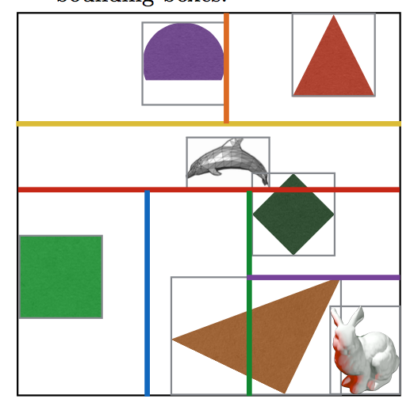

# Acceleration Structures

> Notes on Acceleration structures

We use them to speed of the ray tracing computation **in a pre-processing step before the ray tracing process**.

We're gonna call the hit functions millions of times, so we want to do as much work outside of those as possible (and reduce the amount of times they are called).

## (Axis aligned) bounding boxes

Bounding boxes are (very) rough approximations of a shape with a computationally inexpensive hit function.

We construct a box that encloses the shape entirely - and tightly - and then check for ray intersection with that box before checking for an intersection with the actual shape (if the box were hit).

### Construction of bounding boxes

A Bounding Box is fully determined by its low point *L* and high point *H*.

The rule is: No point on the enclosed shape(s) has an *x, y* or *z* value that is smaller than the *x, y* or *z* value of *L*, and no point has an *x, y* or *z* value larger than the *x, y* or *z* value of *H*.

### The hit function for bounding boxes

**For a ray to pass through a bounding box, it has to enter through one edge and exit through another edge**. Or, it might start from within the box in which case it only exits the box through one edge.

We *know* that the ray passes through the box if it first enters, and then exits.

**So, we NEED to check whether the enter distance *max(tx, ty)* is SMALLER than the exit distance**.

If a ray does *not* pass through a box, we do nothing.

## KD trees

KD trees store (bounding box) objectsin a way that makes it possible to only consider bounding boxes that come close enough to have a chance of being actually hit by the ray.

Also: It allows us to check for ray intersection with bounding boxes that are closest to the origin of the ray first - so we don't waste effort checking for a hit with an object that is behind another object.

### Constructing KD Trees

A KD Tree is a binary tree structure that divides a volume into hierarchically nested compartments (nested bounding boxes).

- The root node represents the whole volume (a bounding box containing all other bounding boxes).
- The root has two child nodes. Those represent the two bounding boxes one gets by cutting the bounding box of the root node in half.

This structure continues recursively, with each node dividing the bounding box so that each child node gets one of the halves. **The split doesn't necessarily have to be in the middle**.

**Each inner node splits the volume along *some* axis and at a particular location along that axis, for example y = 5**.

## Heuristics

*How* we do the splits (and where) is really important for both rendering with a KD-Tree as well as construction time of it.

### The simple way

The simple way to split along alternating axes - first along x, then y, then z - and then going from x again - and always splitting the bounding box exactly in half.

### Heuristics for doing a better job

1. Divide along the largest dimension.
	- Instead of alternating between axes, we choose the axis along which the nodes bounding box is the largest.
2. Avoid dividing along an axis which causes many overlaps (i.e. with many shapes on both sides).
3. Don't divide any further if 60% of shapes on one side are also on the other side.
4. Divide such that both sides have roughly the same number of shapes.
5. Cut along bounding boxes.
6. **The most important one**: Cut off empty space as soon as possible.
	- Instead of splitting a box into two pieces, we split the bounding box such that all objects are on one side and one are on the other.

### Traversal of a KD-Tree

Starting at the root node:

1. Check whether it is a leaf node. If it is , check for the closest hit with the objects stored in the leaf node (by iterating over them). Otherwise, check whether the ray goes first through the left or right child node (or if it only goes through one of them), and go that way. Continue recursively from that node.