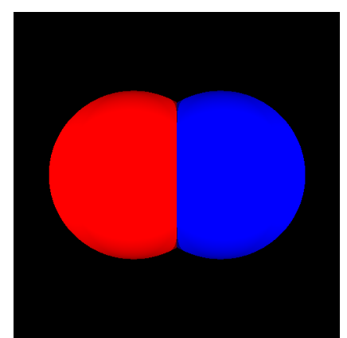
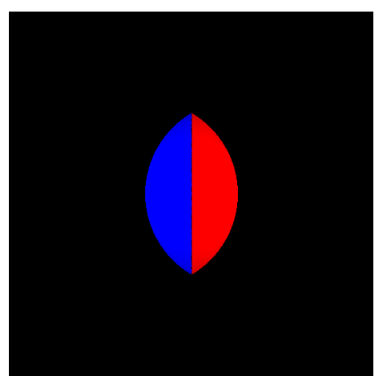
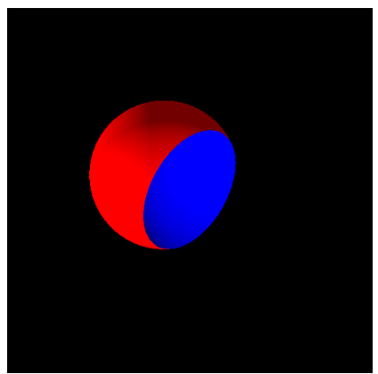

# Constructive Solid Geometry (CSG)

> Notes on Constructive Solid Geometry (CSG)

We use Constructive Solid Geometry (CSG) to create complex shapes out of simple existing ones.

**We do this using a very simple language**:

```math
∪ (union) -> Shape -> Shape -> Shape
∩ (intersection) -> Shape -> Shape -> Shape
− (subtraction) -> Shape -> Shape -> Shape
```

## Union

Union, or *∪*, produces the *union* of shapes *s1* and *s2*, which means that points that exist in either of the shapes.



### Steps

When you fire a ray at a composite shape, you need to make sure that you hit the outermost surface. So, if you fire a ray and hit a shape *s1* **that is inside the shape *s2*,** then you must keep going and **refire the ray in the same direction, but slightly outside the surface that you just hit** and repeat this procedure recursvely until you hit a surface of a shape that is *not* inside the other shape.

#### Computing the bounding box for union shapes

The bounding box is a merger of the two bounding boxes. It will encapsulate both shapes.

PROBLEM: If the two shapes are very far away, then their joint bounding box will contain a *lot* of empty space.

#### Implementing `isInside` for union shapes

For Union, we are inside *s1 ∪ s2* if we are inside either *s1* or *s2*.

## Intersection

Intersection, or *∩*, produces the *intersection* of shapes *s1* and *s2*, which means the points that exist in both shapes (what they have in common).



Here, we **fire at both shapes and take the closest hit point that is inside the other shape**.

Important: Do this recursively BECAUSE it is possible to have a shape where the intersection is being blocked by parts of both shapes that are *not* part of the intersection.

### Computing the bounding box for intersection shapes

This is an intersection of the two bounding boxes.

### Implementing `isInside` for intersection shapes

We are inside *s1 ∩ s2* if we are inside *s1* AND we are inside *s2*.

## Subtraction

Subtraction, or *-*, subtracts the shape *s2* from *s1* so that we get all the points that exists in *s1* but doesn't exist in *s2*.



It allows to "*carve*" partial shapes out of other ones.

If you are subtracting a shape *s2* from *s1* you need to check if the closest hit on *s1* is inside *s2*.

If it is, then you need to refire the ray slightly after the surface of *s1*. Two things can then happen:

1. Either the next hit on *s2* is inside *s1*, in which case you have hit the end of *s2*. A hit point is required.
2. Or, the next hit on *s2* is outside *s1*, in which case you have punched a hole through *s1*. In that case, the ray misses that part of the shape! BUT: It *is* possible for parts of the shape to reappear behind the hole. Be aware of that.

### Computing the bounding box for a subtraction shape

This is just the bounding box for *s1*.

### Implementing `isInside` for subtraction shapes

We are inside *s1 - s2* if we are inside *s1* but *not* inside *s2*.

## Four questions

1. What does it mean to be *inside* a shape?
	- Answer: See the next section.
2. When we subtract one shape from another or take the intersection of two shapes, what texture should any new surfaces have?
3. What do we do about any internal edges that may appear as a result of a union?
	- Ensure that, whenever we take the union of two shapes, any internal edges are removed! In practice, this means that the hit function **must** discard any internal edges it hits and only returns the outermost hit. This would typically only happen if we fire a ray from the inside of a shape.
4. When parts of two shapes exactly overlap each other, which shape should be considered the outermost shape?

To support these, we have to create new shapes with new hit functions, inside functions and new bounding boxes.

### CSG-related extensions to the `Shape` interface

To figure out if we are inside of a `Shape`, we add an `isInside` function to the shape interface that takes a point and returns true if the given point is inside of the shape, and false otherwise.