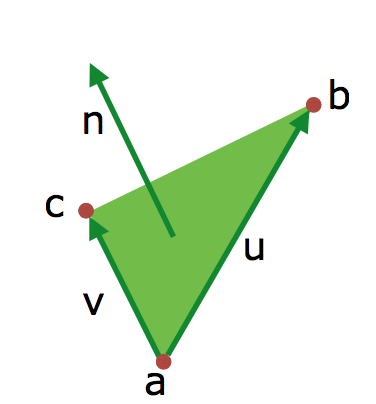
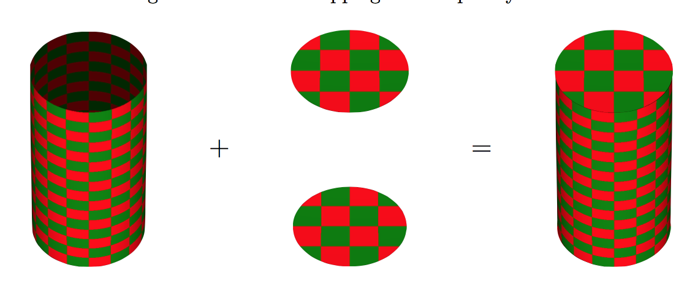
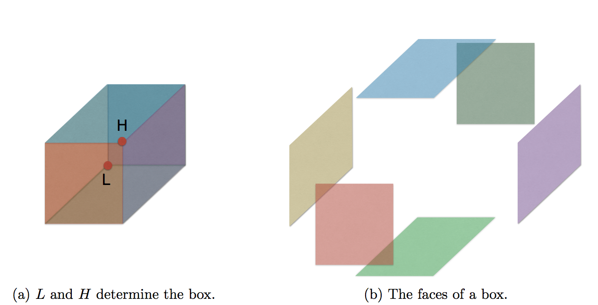

# Shape

> Notes on Shapes

We differentiate between basic shapes and advanced shapes.

- Basic shapes are simple things like Spheres, Cylinders and Rectangles.
- Advanced shapes are implicit surfaces, triangle meshes and ones constructed by CSG.

**All shapes has their origin in [0,0,0] since we use affine transformations to position all shapes through translation, rotation, etc**.

## Hit function

**What we need to render a shape is just its hit function**.

Remember, a hit function is just a function that takes a ray, figures out if it hits it and returns valueable information about that hit, if it did hit it. This information is:

- *t*: The distance of the hit from the origin of the ray.
- *v*: The normal vector of the hit point (we need it for shading and reflections)
- *m*: The *material* of the shape at the hit point. This includes the reflectivity.

### Computing the hit point (The hitpoint equation)

Whether a ray intersects a shape or not is smply formulated in math:

`p = o + (t * d) where t > 0`.

Remember, *o* is the origin point of the ray. *t* is the closest distance from the shape to the origin of the ray and *d* is the normalised direction vector.

The hit point equation is actually 3 dimensions - one for each dimension:

```math
px = ox + (t * dx)
py = oy + (t * dy)
pz = oz + (t * dz)
```

These can then be put into the equation that describes the shape.
For example, the equation for a sphere of radius *r* is:

*p<sup>2</sup><sub>x</sub> + p<sup>2</sup><sub>y</sub> + p<sup>2</sup><sub>z</sub> = r<sup>2</sup>*

This is what we use for implicit surfaces!

### The purpose of the hit function

The hit function has primary purpose of deciding whether or not a shape was hit.
It must look for a *t* value such that plugging that one into the *p* equation above returns a point that lies on the shape.

**But we want to find the smallest possible *t* that we can put into that equation. We want to find the point on the shape at which the distance to the origin of the ray is smallest possible - because that will, of course, be the one that the ray hits first - and thus the right hitpoint**.

So - Finding the smallest *t* will give us the closest hit.

## Basic Shapes

### Rectangles

A rectangle, in terms of this project where we use affine transformations, has:

- A lower left corner point.
- A lower right corner point.
- A upper left corner point.
- A width
- A height

### Hit function for rectangles

1. Check if the ray intersects the plane that the rectangle resides in: `az = oz + (t * dz)`
2. Use that to solve *t*: `t = (az - oz) / dz`.
3. If *dz* = 0, the ray is parallel to the xy-plane and **there is no hit point**.
4. If *t <= 0*, there is no hit (then the distance is equal to the origin of the ray, e.g. the camera. That wouldn't make sense).
5. The *z* value is equal to *az* which we already computed. We need only *x* and *y*:
	- Plug *t* into the ray equations:
	```math
	px = ox + (t * dx)
	py = oy + (t * dy)
	```
6. Next, we check if the hit point lies within the boundaries of the rectangle by asserting that these inequalities hold:
	- ```math
		ax z= px <= ax + width
		ay <= py <= ay + height
	  ```

## Triangles

These are especially important since these can be used as not only stand-alone shapes but also as part of a triangle mesh.

A triangle is given by three points, *a*, *b* and *c*.

The normal vector is calculated by first calculating two vectors *u* and *v* that correspond to two of the triangle's edges.



### Hit function for Triangles

We combine the triangle equation with the ray equation:

`o + t * d = a + β * (b - a) + γ * (c-a)`.

Dividing this up into a vector equation for each coordinate leaves us with three equations, all of which has three unknowns.

To solve them, we use **Cramer's rule**.

## Cramer's rule

Cramer's rule is used when we want to decide if a ray hits a triangle, and where. We use to solve the 3 vector equations that results from combining the triangle equation with the ray equation.

## Hit functions for spheres

A Sphere is a special case of an implicit surface.

It can be described by a polynomial:

*p<sup>2</sup><sub>x</sub> + p<sup>2</sup><sub>y</sub> + p<sup>2</sup><sub>z</sub> = r<sup>2</sup>*

By plugging the equation for the ray into this equation, we obtain this quadratic equation (2. gradsligning):

*a * t<sup>2</sup> + b * t + c = 0*

We can then solve it:
`t = (-b ± squareRoot(b<sup>2</sup> - 4 * a * c) / 2 * a)`

**If there are two solutions, we choose the closest one (the one with the lowest value of t)**.

## Open vs Closed Cylinder

A *closed* cylinder is an Open Cylinder with a disk in the top and bottom of it:



The two disks of radius *r* are parallel to the xy-plane. One with the center point *[0, -(h/2), 0]* and one with center point *[0, h/2, 0]*.

## Box

A box is a shape consisting of six rectangles.
And again, since everything is axis-aligned, a box can be rendered with 6 rectangles positioned with affine transformations.



## Infinite Planes

These are formed by the x and y axes and are described by the simple equation `pz = 0`.

If we plug this into the equation for the ray, we obtain that the ray hits the plane at distance `t = (oz/dz)`.

## Implicit Surfaces

An Implicit Surface is a **generalization** of the concept of generating hit functions, bounding boxes and normal vectors for basic shapes.

It does it by descibing shapes using equations in 3D space.

### The equation for an implicit surface

It has the form: `I x y z = 0` where *I* is a function that takes coordinates for *x*, *y* and *z* and **produces and infinitely thin surface in 3D space at those coordinates where the equation equals zero**.

An example is the equation of a Sphere which is *x<sup>2</sup> + y<sup>2</sup> + z<sup>2</sup> - r<sup>2</sup> = 0* where *x, y, z* is the center and *r* is the radius.

### Hit functions for implicit surfaces

**In order to render an implicit surface, we must transform the equation used to model the surface into a hit function**.

We do this by substituting the *x, y, z* values in the equation for the implicit surface by the corresponding coordinate values in the ray:

*I(o<sub>x</sub> + td<sub>x</sub>) (o<sub>y</sub> + td<sub>y</sub>) (o<sub>y</sub> + td<sub>y</sub>) = 0*.

Then, the only unknown becomes the distance, *t*.

Since this would be a "simple" 2nd degree equation, we just need to isolate *t*.

#### Step-by-step instruction in generating hit functions for Implicit Surfaces

**Preprocessing**:

1. Substitute the *x, y, z* coordinates in the formula for the implicit surface for the corresponding coordinates in the ray equation.
2. Simplify the equation as far as it will go to obtain a polynomial with *t* as the only unknown.
3. Generate a funtion *h<sub>f</sub>* that given a ray solves the polynomial by substituting the elements of the ray equation and return the smallest positive root, if any, as the distance to the hit point.
4. Generate a function *n<sub>f</sub>* that given a hit point *p<sub>x</sub>, p<sub>y</sub>, p<sub>z</sub>* constructs the normal of that hit point by deriving the implicit equation with respect to *x, y, z* and substitutes *x, y, z* in the resulting derivatives for *p<sub>x</sub>, p<sub>y</sub>, p<sub>z</sub>* respectively.

**Postprocessing**:

1. Check if the ray hits the implicit surface by calling *h<sub>f</sub> r*.
2. If it hits, obtain the hit point *p* by plugging the concrete distance to the hit point into the ray equation.
3. Obtain the hit point normal by calling *n<sub>f</sub> p*.

#### Where Implicit Surfaces gets hard

When we arrive at polynomials of degrees > 4, things get harder. In math, it gets much harder to solve roots when the degree exeeds that.

### Normal Vectors for Implicit Surfaces

We can obtain the normal vector by **deviring *I* with respect to *x, y, z* and placing the result in the corresponding vector component**.

### Simplifying Implicit Surfaces

We want to simplify the expressions until we have the term:

```math
A / B = 0
```

Where *A* and *B* have the form: *f<sub>1</sub>E<sub>1</sub> ... E<sub>n</sub> + ... + f<sub>m</sub>E<sub>1</sub> ... E<sub>o</sub>*

### Derivatives in Implicit Surfaces

We use derivatives for finding the normal vector of hit points on implicit surfaces **and solving polynomials of degrees higher than four**.

We can use the *chain-rule*  to create a derivative for *any* product, exponent, root or quotient. In other words, for any expression generated by our grammar.

## Solving High-degree polynomials

In our case, we use it for degrees > 2.

### Newton Raphson

Newton Raphson is an **iterative method** that given a **good** initial guess **uses the derivative of a polynomial to quadratically converge on a root**!

So, we use it to approximate a root.

#### Caveats of Newton Raphson

- It is **not** guaranteed to converge.
- It is not immediately clear what it means for an initial guess to be good.
- **It may converge on the wrong root**.

#### Newton Raphson in steps

1. Give it an initial guess, *a*.
2. Recursively approximate the root with the following:
	```math
	a1 = a - (f(a) / (f'(a) * a))
	an+1 = an - (f(an) / (f'(a) * an))
	```
3. At some point, we terminate if we converge on a "good enough" root or fail to terminate.

#### Deciding the level of precision

Usually three significant digits suffices.

#### Be aware of wrong roots in Newton Raphson

Newton Raphson might converge on a root, **but it is not necessarily the smallest root or even possible at all**!

We use Sturm Sequences to set up our initial guess. The effectiveness of Newton Raphson depends on the precision of our first initial guess.

## Sturm Sequences

Sturm sequences are used **to determine how many real roots there are to a polynomial in a given interval**.

It's all about narrowing down that interval.

### The interval

It is at least between 0 and some initial guess *x*.

We are satisfied with the interval when we know that only a single root *r* exists such that *a <= r <= b*.

When we are certain of that, we pass this on to Newton Raphson to find that root. As long as the method converges to a root within the expected range, we kNOW that it is the smallest (positive) root.

### The form of a sturm sequence

```math
p0(x) = f(x)
p1(x) = (f'(x)) * x
p2(x) = -(p0 mod p1)
...
pn(x) = -(pn-2 mod pn-1)
```

`p mod q` is the remainder of the polynomial long division of *p* and *q*.

### Determining the amount of roots

We calculate how many sign changes (values going from positive to negative or vice versa) there are in a sequence in the sequence of *p0(a) ... pn(a)* and *p0(b) ... pn(b)* and subtract the second from the first to find the number of roots in the interval.

We keep recursing and splitting that interval until we have only one root in the interval.

A good initial guess would be in the middle of that interval.

## Polynomial Long Division

It's like standard long division if you replace *x* woth 10.

What we use it for is to get the remainder of the division which we need in sturm sequences (pn-2 mod pn-1).

## All steps for high degree polynomials

1. Obtain the sturm sequence for a function *f*.
2. Find the interval between *a* and *b* where the smallest positive real root lies.
3. Pick a starting guess within that interval and use Newton Raphson's method to converge on that root.

## Be aware of these in Newton Raphson

- Make sure that the root you converge on is within your desired interval! Newton Raphson *can* converge on a root outside the interval. *If* that happens, start over on narrowing down the interval. If you don't converge on a root, give up.