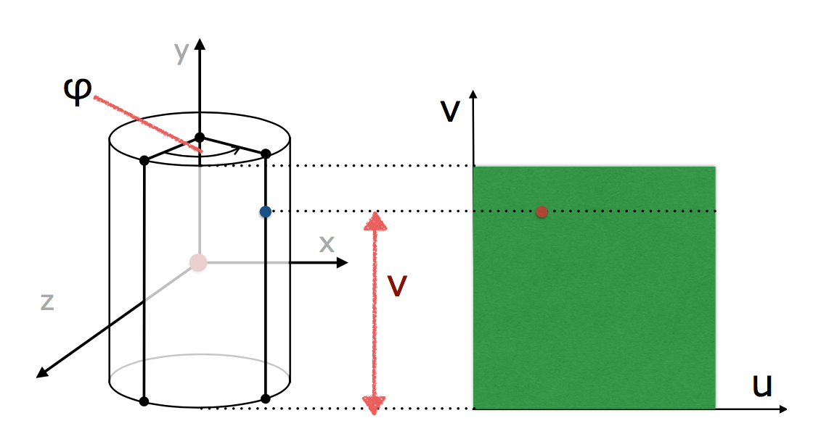

# Texture

> Notes on Textures

Texture is a function that takes two texture coordinates, typically called *u* and *w* and returns a *Material*.

There are two kinds of textures - one where the same material is returned for any coordinates (using the `mkMatTexture` function of the API), and one where the material depends on the *u* and *w* values given for a hit, typically converted into integer x and y coordinates in a bitmap. Here, the purpose is to go from 3D coordinates to 2D coordinates.

## *u* and *w* values

We always assume that the texture function receives texture coordinates that are normalised to the interval *[0, 1]*.

This would mean that the lower left corner (of the bitmap) would have the coordinates *u = 0, v = 0* and the upper right corner would have the coordinates *u = 1, v = 1*.

### Exception for Infinite Plane

Koordinaterne forventes til at være normaliseret til intervallet [0, 1] for alle shapes undtagen Infinite Shape.
Normaliseret betyder at lower left hjørnet has koordinaterne u = 0, v = 0 og upper right corner har koordinaterne u = 1, v = 1.

Hvordan vi beregner disse koordinater er forskelligt fra shape til shape. Vi er jo blot interesserede i at vide hvilken farve der skal tegnes for hvert hitpoint.

(u,v) = (u(w −1),v(h −1))

TODO: Læs op på hvordan texture koordinater udregnes for alle shapes.

Farven bestemmes ud fra teksturens pixel farve + shading, altså shadow og reflections.

#### Texturing for rectangles

Subtract the coordinate from the corner point *a* and **normalise the result** by dividing by the width or the height, respectively:

```math
u = (px - ax) / width
v = (py - ay) / height
```

#### Texturing for disks

The texture coordinates are calculated as follows:

```math
u = (px + r) / (2 * r)
v = (py + r) / (2 * r)
```

#### Texturing for Spheres

We can calculate *u* and *v* as follows:

```math
u = φ / (2 * π)
v = 1 - (θ / π)
```

- φ ranges between 0 and 2 * π (corresponding to the geographical longitude which ranges from -180 degrees celsius to +180 degrees celsius)
- θ ranges between 0 (the north pole) and π (the south pole)

#### Texturing for Open Cylinders

This is similar to texture mapping for Spheres:

1. We calculate φ which ranges from 0 to 2 * π.
2. We calculate the *u* coordinate by normalising φ. This is done by dividing it by 2 * π.
3. The *v* coordinate is the distance of the hit point from the bottom edge of the cylinder, - but normalised by dividing the angle φ by the height.

All in all:

```math
u = φ / (2 * π)
v = (py / h) + (1 / 2)
```



#### Texturing for Boxes

When we know which of the six faces (Rectangles) of the box is hit, we can use the distance from the origin of the ray do determine the hit point. The hit point will be our texture coordinates.

Be aware that each face of the box may have a different texture. So we need to make sure to use the right texture.

#### Texturing for Infinite Planes

Infinite Planes are the exception to the rule that *u* and *v* coordinates must always be normalised to be between 0 and 1.

Here, *u* and *v* are arbitrary numbers and are simply *x* and *y* coordinates of the hit point:

```math
u = px
v = py
```

Easy!
The reason being that an inifite plane is just that - infinite.

#### Texturing for triangle meshes

This relies on the same interpolation principle as smooth shading.

**It requires that the texture coordinates *u* and *v* are given for each vertex in the PLY file**.

By interpolating the *u* and *v* coordinates of the triangle's vertices like we do with smooth shading,  we can get the texture coordinates.