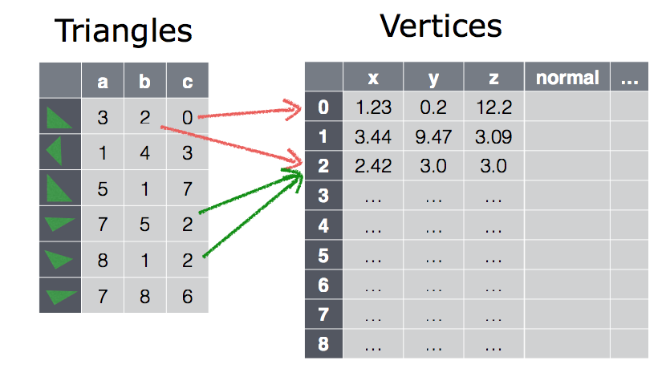

# Triangle Meshes

> Notes on Triangle Meshes

Triangle meshes provide a practical means to **aproximate** shapes that are complex and are not readily described by a suitable equation.

Instead of a smooth surface, described by an equation (such as implicit surfaces, a triangle mesh is put together **by a set of triangles** that are connected by their common edges. The more and smaller triangles we use, the higher level of detail and thus realism we can obtain.

**Here, we deal with triangle meshes of up to 1 million triangles**.

## Hit functions for triangle meshes

We can execute the hit function for each triangle one by one and then return the closest hit. This approach is only feasible for very small triangle meshes of not more than a thousand triangles.

In order to render triangle meshes practically, we need to pre-process them into appropriate acceleration structures.

### Structure of triangle meshes

The triangles st so tighly together that they share common edges and vertices. The same vertex might be part of six triangles!

**Thus, it is more efficient to store each vertex only once and represent each triangle as three pointers to three of those vertices**.

## Smooth shading

This becomes nice if the triangles of a triangle mesh are too big. Then, the triangles will become clearly visible. Or, more precisely, the transition from one triangle to a neighboring one is abrupt and plainly visible. But, we can reduce this visual artifact significantly by using smooth shading.

With smooth shading, **instead of using the normals of the triangle, we assume that the vertices of the triangle mesh have normals**. These vertex normals are either given as part of the PLY file or can be computed from the triangle normals. We then compute the normal of a hit point on the triangle as an interpolation of the three vertex normals of the triangle. The closer the hit point is to one of the vertices of the triangle, the closer the hit point's normal is to the normal of that vertex.