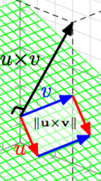

# Vectors

> Notes on Vectors

Vectors represent **length** and **direction** in 3D space.

They are **often drawn as arrows from the origin of a coordinate system to a point**. They are **modelled as 3 floating point numbers representing the x-, the y- and the z-coordinate of that point respectively**.

`vector: {x: float, y: float, z: float}`.

## Vector magnitude

**The length of a vector is called its magnitude**.

It is written= *|v|*.

## Scaling the Vector magnitude

Use a scaling function `c*v` of type `float -> Vector -> Vector` that **keeps the direction** but **scales the magnitude of a vector v by c**.

## Inverting the direction of a vector

Scaling a vector by a negative constant will invert the direction of the vector.

## Normalizing functions

The normalization function is written *v^* (v with a hat on top).
It is a function of type `vector -> vector`.

It **returns a vector with the same direction as *v* but that has length 1**.

## When do you need a normalised vector

- When we need to know the distance between points, **don't** normalise.
- When we only care about the direction, **always** normalize.

A bit more words on it:

Vectors can represent the distance between two points in which case **the length is important**.

Here we would *not* normalise the Vector - We need that length.

Often, however, **we are only interested in the direction of a vector in order to calculate new positions from a point**. Here, it is **vital** that the vector is normalised - or every step we take will be longer or shorter than anticipated and we will end up walking either too far or too short!

## Adding/Subtracting Vectors (Vector sums)

Vectors can be added or subtracted from one another using functions of type `Vector -> Vector -> Vector`.

To do this, you simply **Add the individual x, y and z components of both vectors together like this**:

*(ax, ay, az) + (bx, by, bz) <=> (ax + bx, ay + by, az + bz)*

*(ax, ay, az) - (bx, by, bz) <=> (ax - bx, ay - by, az - bz)*

### Dot products

The *dot product* is written *u • v*. It is a function of type `Vector -> Vector -> float`.

**It calculates the cosine of the angle between *u* and *v* scaled by their magnitudes**.

Pro tip: When *u* and *v* are normalised, their dot product is exactly the angle between them!

**The dot-product only says something about the angle between two vectors when both vectors have non-zero magnitudes**.

Here's how to compute it:

*(ax, ay, az) • (bx, by, bz) <=> axbx + ayby + azbz*

### Cross products

The *cross product* is written *u × v*. It is a function of type `Vector -> Vector -> Vector`. It calculates a vector that is orthogonal (at a right angle to) both *u* and *v* in a right-handed coordinate system.

If the vectors have the same or opposite directions, the cross product is zero!

Here's how to compute it:

*(ax, ay, az) × (bx, by, bz) <=> aybz - azby, azbx - axbz, axby - aybx*

### Translating any vector to world coordinates

Any vector *vc* in a coordinate space can be translated into world coordinates *vw* using the equation:

*vw <=> (vcx, vcy, vcz)*

### Normalized Vector notation

Written *u^* (u with a hat on top of it.)

## Takeaways

- Adding/Subtracting vectors works by adding all of their individual x, y and z components together.
- Cross products of Vectors *u* and *v* will be orthogonal to both vectors.
- Cross products can produce empty vectors, and you need to be aware of that.